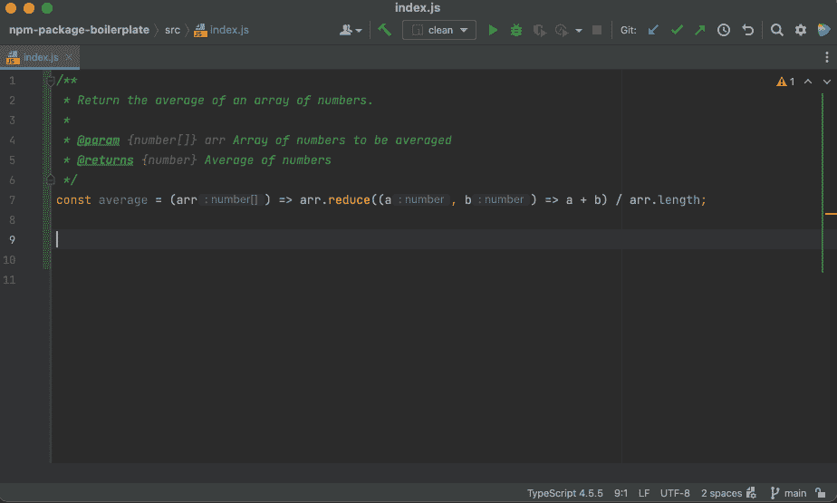
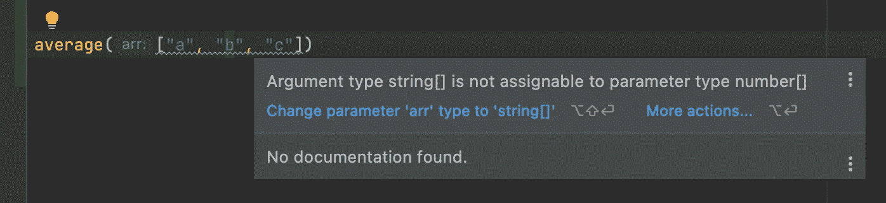
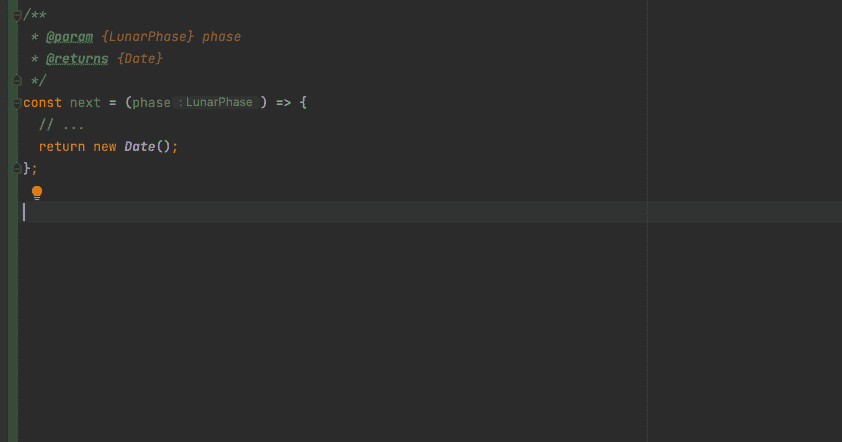
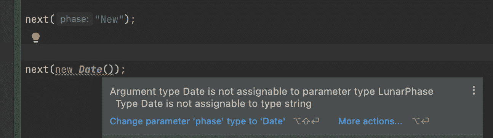
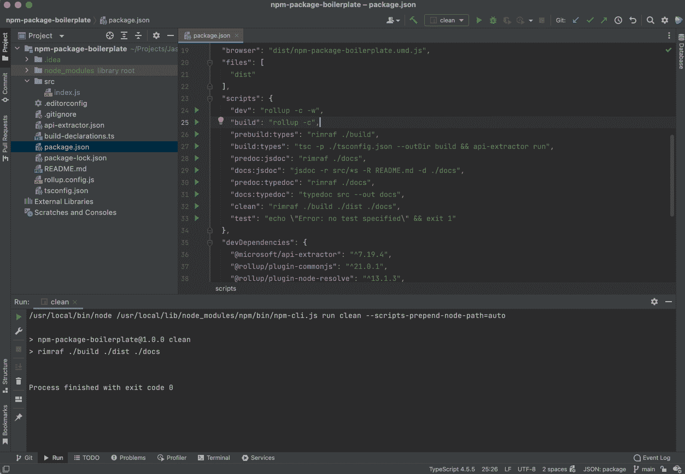
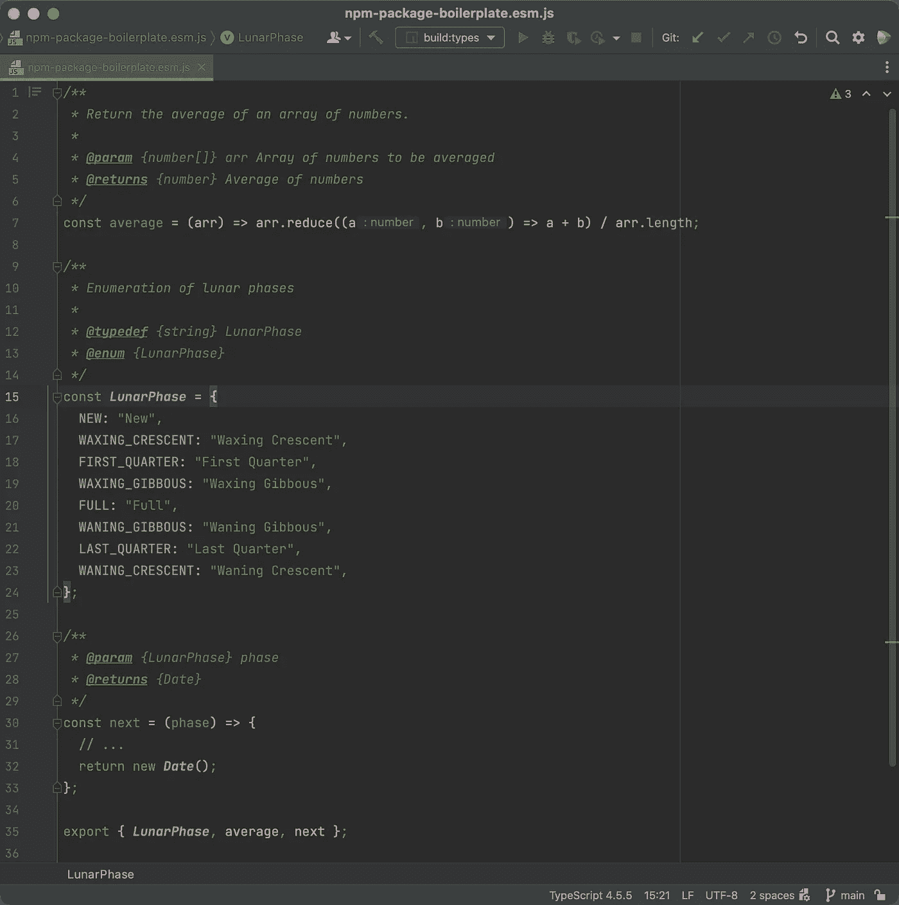
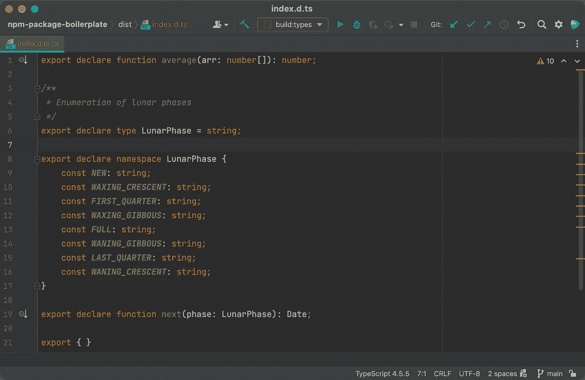
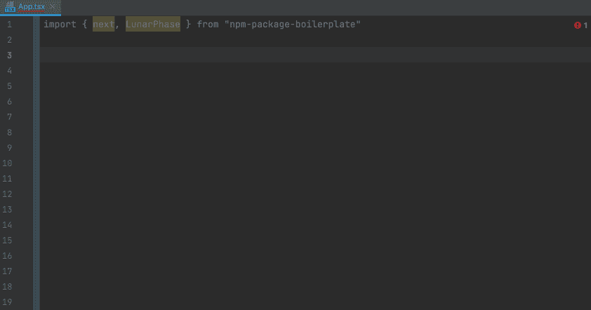
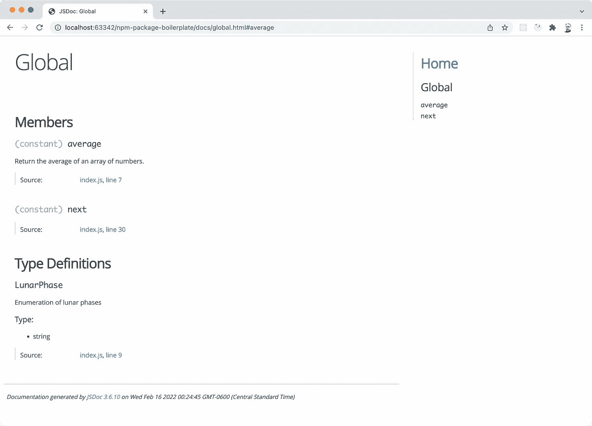
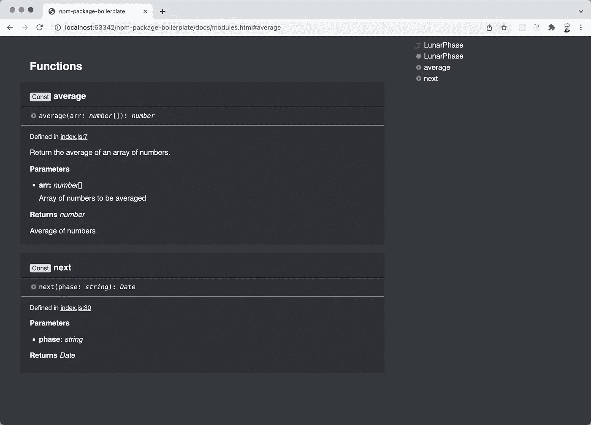

# 将 JavaScript 转换成兼容 TypeScript 的包

> 原文：<https://betterprogramming.pub/turn-javascript-into-typescript-compatible-packages-cb81820838ed>

## 从纯 JavaScript 项目中生成兼容 TypeScript 的 NPM 包


照片由[伊恩·泰勒](https://unsplash.com/@carrier_lost?utm_source=medium&utm_medium=referral)在 [Unsplash](https://unsplash.com?utm_source=medium&utm_medium=referral) 上拍摄

也许作为一名 JavaScript 开发人员，您已经担心将您的 NPM 包转换成[类型脚本](https://www.typescriptlang.org/)。或者，也许您有不值得花时间移植的遗留代码库。

但是，您希望您的 JavaScript 包包含在 TypeScript 社区中，能够在他们的项目中利用您的 NPM 包。

# 带有 JSDoc 的 JavaScript

在我的 JavaScript 项目中，我总是在我的项目中利用 JSDoc 注释的能力，这是我的 IDE 能够理解的。



在上面的 JavaScript 示例中，JSDoc 定义了参数和返回类型:

```
*/**
 * Return the average of an array of numbers.
 *
 * @param**{****number[]****} arr Array of numbers to be averaged
 * @returns**{****number****} Average of numbers
 */* const average = (arr) => arr.reduce((a, b) => a + b) / arr.length;
```

这使我的 IDE 能够提供指示签名(`arr: number[]`)和返回值(`number`)类型的代码完成/智能感知。


如果我输入无效的值，它会突出显示错误。例如，如果我在我的`average()`函数中输入`string`值而不是`number`:



而且，我可以从我的*问题*窗口查看错误的完整汇编。

即使对于更复杂的 typedefs 和 enums，JSDoc 也提供了很多功能。例如，我有一个字符串值的月相枚举:

```
*/**
 * Enumeration of lunar phases
 *
 ** ***@typedef {string}*** *LunarPhase
 ** ***@enum {LunarPhase}*** **/* export const LunarPhase= {
  NEW: "New",
  WAXING_CRESCENT: "Waxing Crescent",
  FIRST_QUARTER: "First Quarter",
  WAXING_GIBBOUS: "Waxing Gibbous",
  FULL: "Full",
  WANING_GIBBOUS: "Waning Gibbous",
  LAST_QUARTER: "Last Quarter",
  WANING_CRESCENT: "Waning Crescent",
};
```

假设我有一个返回下一阶段日期的函数:

```
*/**
 ** ***@param {LunarPhase}*** *phase
 ** ***@returns {Date}*** **/* const next = (phase) => {
  // ...
  return new ***Date***();
};
```

我的 IDE 能够解析这些类型:



再次警告错误:



当然，JSDoc 并没有提供 TypeScript 的所有功能，比如接口或通用模板编程。但是，它确实满足类型。

# 问题:在 TypeScript 中使用您的包

现在，您已经编写了出色的 JavaScript 模块并将其发布给了 NPM，您希望在 TypeScript 项目中利用它。

将模块添加到 package.json 后，您会得到错误:

> TS7016:找不到模块“T16”的声明文件。

因为您的项目不是 TypeScript，所以它没有构建一个`d.ts`声明文件，所以您的所有类型都是隐式的`any`。

有不同的方法来处理这个问题，从发布`@types`包到修改 TypeScript 的严格性，但是如果你已经利用了我上面描述的 JSDoc，有一种方法可以生成你需要的东西。

# 解决方案:从 JSDoc 构建一个声明文件

为了构建声明文件，我们需要向我们的开发依赖项、配置和一些脚本中添加一些包。

## 属国

在您的 *package.json* 中，添加以下开发依赖项:

*   以打字打的文件
*   @microsoft/api-extractor

如果您从 [Rollup](https://rollupjs.org/) 开始构建，您的开发依赖项可能看起来像这样:

```
"devDependencies": {
  "@microsoft/api-extractor": "^7.19.4",
  "@rollup/plugin-commonjs": "^21.0.1",
  "@rollup/plugin-node-resolve": "^13.1.3",
  "eslint": "^8.9.0",
  "jsdoc": "^3.6.10",
  "prettier": "^2.5.1",
  "rimraf": "^3.0.2",
  "rollup": "^2.67.2",
  "typedoc": "^0.22.11",
  "typescript": "^4.5.5"
}
```

## 类型脚本配置

对于 TypeScript 支持，我们需要添加一个 *tsconfig.json* 文件。这将配置 TypeScript 来扫描我们的 *JavaScript* 源以构建声明:

将 *tsconfig.json* 添加到项目的根目录:

```
{
  "include": ["./src/**/*"],
  "compilerOptions": {
    "lib": [
      "dom",
      "dom.iterable",
      "esnext"
    ],
    "allowJs": true,
    "declaration": true,
    "declarationMap": true,
    "emitDeclarationOnly": true,
    "esModuleInterop": true,
    "module": "esnext",
    "moduleResolution": "node",
    "outDir": "dist",
    "strict": true,
    "target": "es6"
  }
}
```

## Microsoft API 提取器配置

为了编译声明文件，[微软 API 提取器](https://api-extractor.com/)需要被配置为将所有`d.ts`文件合并到一个`index.d.ts`文件中，用于我们的包分发。

将 *api-extractor.json* 添加到项目的根目录:

```
{
  "projectFolder": ".",
  "mainEntryPointFilePath": "<projectFolder>/build/index.d.ts",
  "bundledPackages": [],
  "compiler": {
    "tsconfigFilePath": "<projectFolder>/tsconfig.json",
    "overrideTsconfig": {
      "compilerOptions": {
        "outDir": "build"
      }
    }
  },
  "dtsRollup": {
    "enabled": true,
    "untrimmedFilePath": "<projectFolder>/dist/index.d.ts"
  },
  "apiReport": {
    "enabled": false
  },
  "docModel": {
    "enabled": false
  },
  "tsdocMetadata": {
    "enabled": false
  },
  "messages": {
    "compilerMessageReporting": {
      "default": {
        "logLevel": "none"
      }
    },
    "extractorMessageReporting": {
      "default": {
        "logLevel": "none"
      }
    },
    "tsdocMessageReporting": {
      "default": {
        "logLevel": "none"
      }
    }
  }
}
```

## 包脚本

有了依赖项和配置，我们只需要向 *package.json* 添加一个脚本来运行 TypeScript 编译器，并使用 Microsoft API Extractor 构建声明文件。

添加以下脚本:

```
"scripts": {
  "prebuild:types": "rimraf ./build",
  "build:types": "tsc -p ./tsconfig.json --outDir build && api-extractor run",
},
```

在构建之前，它会清理 *build/* 文件夹。这是可选的，但是一个好主意。你需要`rimraf`或同等的软件包来删除。

然后，`build:types`脚本将执行 TypeScript 并通过 Microsoft API 提取器构建声明。

# 警告-至少需要一个类型脚本文件

如果在此过程中收到错误，可能是因为 Microsoft API 提取器需要至少一个 TypeScript 文件。

您可能会看到:

> api 提取器 7 . 19 . 4—[https://api-extractor.com/](https://api-extractor.com/)
> 
> 使用中的配置。/api-extractor.json
> 
> 错误:分析 tsconfig.json 内容时出错:在配置文件“tsconfig.json”中找不到任何输入。指定的“包含”路径为“[* */*]”，而“排除”路径为“["build"]”。

真的很讨厌…仍然在努力找出一个更好的解决方案，但基本上我们只需要在解决方案的根中有一个 TypeScript 文件。

我创建一个*build-declarations . ts*文件，内容如下:

```
*/**
 * This file is required for Microsoft API Extractor 
 * to build declaration files.
 * 
 * It is intentionally left blank.
 */*
```

# 结果呢

除了构建包之外，我们现在可以通过执行您的`build`脚本和`build:types`脚本来构建类型脚本声明:



您的 JavaScript 构建可分发版本将和以前一样:



但是现在有了一个 d.ts 声明文件:



# 在 TypeScript 应用程序中使用它

现在，您出色的 NPM 包可以加载到 TypeScript 项目中，如下面的 React TypeScript App.tsx 所示:



# 额外奖励:文档

这样做的另一个副作用是我们可以利用 [TypeDoc](https://typedoc.org/) 进行文档记录。

如果您将`typedoc` npm 模块添加到您的开发依赖项中，您可以运行以下任一脚本:

```
"scripts": {
  "predoc:jsdoc": "rimraf ./docs",
  "docs:jsdoc": "jsdoc -r src/*s -R README.md -d ./docs",

  "predoc:typedoc": "rimraf ./docs",
  "docs:typedoc": "typedoc src --out docs",
},
```

我们可以通过运行`docs:jsdoc`生成 JSDoc，和以前一样



或者，通过运行`docs:typedoc`来代替 TypeDoc



# 示例存储库

本文的一个例子可以在 GitHub 上从我的 NPM 包样板库中找到:

[](https://github.com/jasonsturges/npm-package-boilerplate) [## GitHub-jasonsturges/npm-package-boilerplate:JavaScript 库 NPM 包样板

### 使用这个模板搭建 JavaScript npm 包来引导你的下一个库。对于 TypeScript 版本，请参见…

github.com](https://github.com/jasonsturges/npm-package-boilerplate) 

# 摘要

TypeScript 非常棒，但并不适合所有人。

对于 NPM 软件包来说，TypeScript 非常灵活，因为它的输出可以在 JavaScript 和 TypeScript 项目中使用。

当使用 JavaScript 时，没有类型声明，这意味着您的 NPM 包与 TypeScript 生态系统不相关。

当然，在 NPM 有一个巨大的纯 JavaScript 包生态系统。TypeScript 开发人员必须处理这些情况。除此之外，如果您利用 JSDoc 并依赖它的类型值，这种混合解决方案可能会满足两个世界。