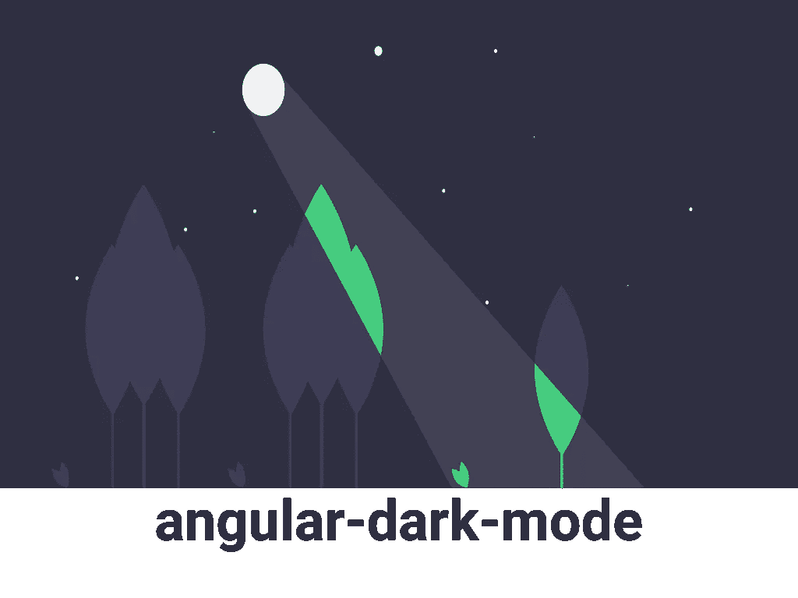
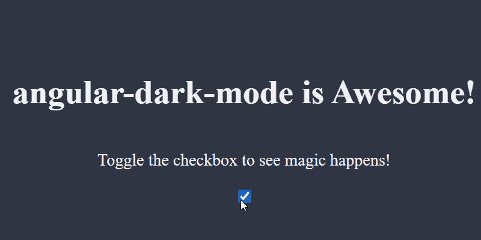

# 使用角度黑暗模式关闭灯光

> 原文：<https://betterprogramming.pub/turn-off-the-lights-with-angular-dark-mode-194241f491ae>

## 轻松将黑暗模式集成到您的应用程序中



作者照片。

最近，我推出了我的[最小投资组合](https://talohana.com/)。虽然很小，但我想加入黑暗和光明模式，因为这是我从未做过的事情。

使用 React 和 Gatsby，我有大量的选项可以选择，但是我偶然发现了一个最小但功能强大的库，叫做 [use-dark-mode](https://github.com/donavon/use-dark-mode) 。十分钟后，我已经将黑暗模式集成到我的文件夹中了！


作为一名 Angular 开发者，我认为在我们的生态系统中也有这样一个库会很好，所以我创建了 [angular-dark-mode](https://github.com/talohana/angular-dark-mode) ！

*注:最终代码和演示可在* [*本栈*](https://stackblitz.com/edit/angular-dark-mode-blog-example?file=src%2Fapp%2Fapp.component.ts) *获得。*

# 设置

首先，让我们快速创建一个 angular 项目，我们可以通过运行:

```
npx @angular/cli new dark-mode-playground --minimal
```

接下来，添加角度暗模式:

```
npm i angular-dark-mode 
```

或者，如果你喜欢纱线:

```
yarn add angular-dark-mode
```

最后，将`angular-dark-mode.js`文件添加到`angular.json`脚本部分:

更多关于`angular-dark-mode.js`的信息，请看下文。

# 给我看看代码

angular-dark-mode 附带一些可配置选项:

给定默认选项，让我们添加一些样式来反映我们的黑暗和光明模式:

我们希望根据上面的默认配置来设置样式，所以我们设置了暗模式和亮模式 CSS 类的样式。

此外，我们希望模式之间有一个良好的转换，但希望跳过初始转换，所以我们在预加载阶段后设置它。

移动到`app.component.ts`，注入`DarkModeService`，添加一些文本和一个切换按钮:

一切就绪！运行应用程序，根据您的操作系统主题，它会以暗模式或亮模式打开:



# angular-黑暗模式. js

该文件有几个用途:

1.  持续——角度黑暗模式在`localStorage`中保存您的偏好。当应用程序加载时，它会从`localStorage`中检索最新的值，或者回到操作系统的偏好。
2.  预加载——正如我们看到的，当我们想要跳过初始转换时,`preloadingClass`选项会非常方便，所以我们在这个文件中设置了`preloadingClass`,并在初始化后将其删除。

*注意:库附带的* `*angular-dark-mode.js*` *文件假定您使用的是默认选项。如果您覆盖它们，请确保在本地复制* `*angular-dark-mode.js*` *，进行必要的更改，并在* `*angular.json*` *中加载本地文件，而不是库文件。*

感谢阅读！