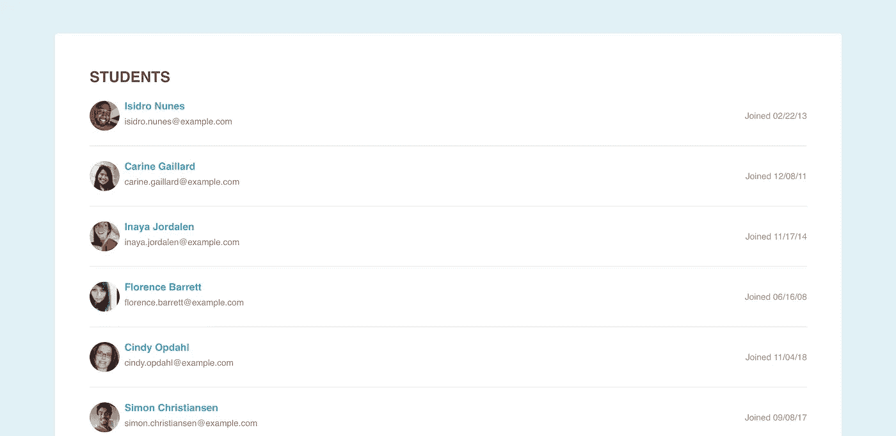

# 用 JavaScript 构造器模式将原始数据转换成对象

> 原文：<https://betterprogramming.pub/turn-raw-data-into-objects-with-the-javascript-constructor-pattern-dbb84fef2049>

## 用 JavaScript 实现你的第一个设计模式——构造器模式

Elena Mozhvilo 在 [Unsplash](https://unsplash.com?utm_source=medium&utm_medium=referral) 上的照片

2021 年，我为一家名为 OpenClassrooms 的法国网校写了几门课程。其中，一个致力于用 JavaScript 设计模式。

在写它的时候，我得到了很多乐趣。这是一个非常有趣的话题，尽管你可以在网上和书中找到和阅读很多资料，但大多数时候，这些资源要么已经过时，要么没有给出具体的例子和问题解决方案。

例如，*学习 JavaScript 设计模式:JavaScript 和 jQuery 开发人员指南*是一本非常有趣的书，可以帮助学习不同种类的设计模式。然而，这似乎有点过时了:它谈到了 jQuery，你只会看到 ES5 的 JavaScript 代码。我仍然认为你应该读这本书，如果你想的话，但是我不认为这是一本你应该买的书。

为什么我不让你去上我写的课程？首先，因为它是法语的，目前没有翻译计划。我还想更进一步，介绍一下我在课程中没有介绍的设计模式。

开始之前还有最后一件事:您应该对 JavaScript 和面向对象编程有所了解。我会尽可能的完整，但是我不会回到 JavaScript 的基础。也就是说，也许有一天，我会写一些关于基础的文章，特别是关于 JavaScript 中原型是如何工作的。现在，我们可以开始了！

# 你曾经开发过不断发展的 API 吗？

我曾经为一家初创公司工作，该公司为当地企业(如餐馆或食品卡车)创建收银机。我的任务之一是创建一个移动应用程序，我们可以在其中显示活动信息。想想每天、每周和每月的客户数量，当前的营业额以及它们与去年的不同之处，等等..

当我开始开发这个应用程序时，我将要处理的数据还不可用:API 还没有准备好。所以我做了一些非常平常的事情:我将数据模拟成一个普通的 JSON 文件，并伪造 HTTP 调用。这样我就可以继续在应用程序上工作，一旦数据准备好了，我只需要修改我的 HTTP 调用，一切就都正常了。

在这个计划中，它是完美的，如果让我再做一次，我肯定会做同样的事情。然而，有一件事我没有考虑到:数据格式。当我收到来自 API 的数据的第一个版本时，我大吃一惊:它与我在原始 JSON 文件中编写的数据完全不同。所以，我重写了所有使用这些数据的代码部分，这花了我将近一周的时间。然后，数据格式又一次改变了。为什么？因为 API 仍然处于 alpha 开发模式，后端工程师正在做一些突破性的改变。

现在是时候看看一个项目的具体例子并开始编码了！

# 从 API 获取用户数据，然后格式化并显示它

首先，[转到这个 GitHub 库](https://github.com/tdimnet/the-javascript-constructor-pattern)并克隆它。它包含一个小的 React 应用程序，显示 10 名雇员的列表。每个员工都有名字、姓氏、电子邮件、照片和注册日期。当您启动 React 应用程序时，它获取 JSON 文件中的雇员数据。此文件位于公共文件夹:`public/users.json`。

该项目显示 10 名员工的列表

这个 React 应用程序的基础设施非常标准。有三个主要文件夹:

*   `components`文件夹包含传统组件，例如日期和电子邮件组件，以及布局组件，例如标题和主包装器。
*   `pages`文件夹包含了 Home 组件。在一个更大的项目中，我们将有许多页面组件。
*   `services`文件夹向 JSON 模拟文件和`randomuser` API 发出 HTTP 请求。
*   `App.js`文件使用了`pages/Home`组件和 React 查询设置。

React-query 用于该项目的数据同步部分。这个库的灵感来自于`react-apollo`库(我们在 GraphQL APIs 中使用它们),它允许你以声明的方式创建 HTTP 请求。我不认为文档总是清晰的，但它确实是方便的和可读的。

要使它工作，您必须用`QueryClientProvider`组件包装整个 React 应用程序:

然后，您可以使用`useQuery`挂钩，就像这里的`pages/Home`组件:

一旦承诺得到解决，数据就会显示在`UserCard`组件中。该组件代表自己使用其他几个组件。例如，它用`Image`组件显示用户照片，用`Name`组件显示用户名(名字和姓氏),用`Email`组件显示用户电子邮件地址。我们使用钻孔道具将数据从顶部传递到底部组件

目前，我们的应用程序使用 public 文件夹中包含的 JSON 文件，它工作得很好。但是现在是时候让事情变得复杂一点了:我们将使用[随机用户生成器 API](https://randomuser.me/) 来代替 JSON 文件。将`services/Api/index.js`文件中 get 函数内的`getMockData`更改为`getApiData`并刷新应用程序。

应用程序现在坏了，如果你想让它工作，你需要改变所有的道具。在一页的应用程序中，这可能是可以接受的，你可以这样做，但是想象一下你需要在十页或二十页的应用程序中这样做:这一点都不好玩。你将什么也学不到，而且你可能会添加一些错误。这就是构造器模式派上用场的地方。

# 用构造器模式为我们的用户数据创建一个模型

构造器模式通常是我向初级开发人员介绍的第一个设计模式。它可以直接应用，并且不太依赖抽象:这是对设计模式的一个很好的介绍。很好理解，前端就可以做，也很好用。

我第一次听说它是在我学习 Java 的时候，然后是 Php。如果您也熟悉这些语言，您可能也已经了解了这个概念。波乔或 POPO 这个名字对你有什么意义吗？POJO 指的是普通老式 Java 对象和 POPO 普通老式 Php 对象。我们有时也称它们为实体。大多数时候，我们可以用它们来封装和存储数据。

以下是 POPO 的一个示例，其中界面对于创建对象的平面图非常有用:

在 JavaScript 中，事情有时与其他编程语言不同。这是因为 JavaScript 是一种原型面向对象语言，而不是基于类的语言，也因为 JavaScript 不是一种完全面向对象的语言。例如，枚举和接口在 JavaScript 中并不存在。我们可以通过使用`Object.freeze`来模拟枚举，但是这与使用`enum`关键字是不同的。

回到构造器模式本身:创建一个有两种选择:用函数或者用类/原型。关键字 class 和 prototype 可以互换使用，因为当您使用 class 关键字时，在后面，您会创建一个原型。

这是一个类:

这是一个函数:

大多数时候，我更喜欢使用 class 关键字:我认为它更容易阅读和理解。仔细观察，我们已经知道了类的 getters 和 setters 是什么。您可以随意使用它们中的任何一个，但是在本文的其余部分，我将使用类版本。

我最喜欢构造器模式的一点是它能够存储原始数据和解析数据。例如，假设您从一个 API 收到一个时间戳日期，您需要以两种版本显示它:“YYYY-MM-DD”和“DD-MM-YYYY”。下面是如何使用构造器模式的方法。

顺便说一句，构造器模式并不局限于格式化对象:您可以将它用于您可能必须做的所有对象创建。例如，许多 jQuery 效果使用构造函数模式。

在我们开始实现解决方案之前，要知道这种模式的主要缺点:它可能会消耗内存。尽管我们现在的电脑和手机有大量的内存，但记住我们的软件和应用程序需要优化是很重要的。我建议你只在需要的时候创建构造器模式。

# 从模拟数据转换到 API 数据，没有任何麻烦

您现在可以将当前分支更改为`with-constructor-pattern`分支。这个分支包含两个构造器模式:`src/models/MockedUser.js`和`src/models/ApiUser.js`。第一个使用硬编码的 JSON 数据，第二个使用来自[随机用户生成器 API](https://randomuser.me/) 的数据。显示的数据目前来自 JSON 文件。

下面是`MockedUser`物体的样子:

这是一个简单的 JavaScript 类，包含用户所需的所有属性:我们有一封电子邮件、一张照片和一个注册日期。现在，我们不再使用原始的 JSON 数据，而是在代码中处处使用这个模板。它给了我们唯一的真理来源。如果我们想要添加一个新的属性，或者如果数据发生变化，例如，上次登录，我们可以在这里添加或更改它。

尽管有这两个新对象，代码中唯一的变化是在`src/pages/Home/index.js`中:

我们现在使用存储在`MockedUser`对象中的数据，而不是使用原始的 JSON 数据。现在假设我们想要使用来自`RandomUser` Api 的数据。我们只需要做两个改变。首先，改变`src/services/Api/index.js`中的 get 函数。我们现在将使用真实数据。

然后用`ApiUser`构造函数替换`MockedUser`构造函数，并重新加载浏览器:

只做了两处修改，现在您使用 API 数据而不是 JSON 数据，项目仍然在运行！此外，您还知道用户数据需要什么属性，并且可以非常容易地添加新属性或修改现有属性！

我希望你喜欢这篇关于 JavaScript 设计模式的第一篇文章。如果这是你第一次读它，我很高兴成为你的向导。下次我们来看看工厂的模式！

如果你有任何问题，请随意提问。下次见！