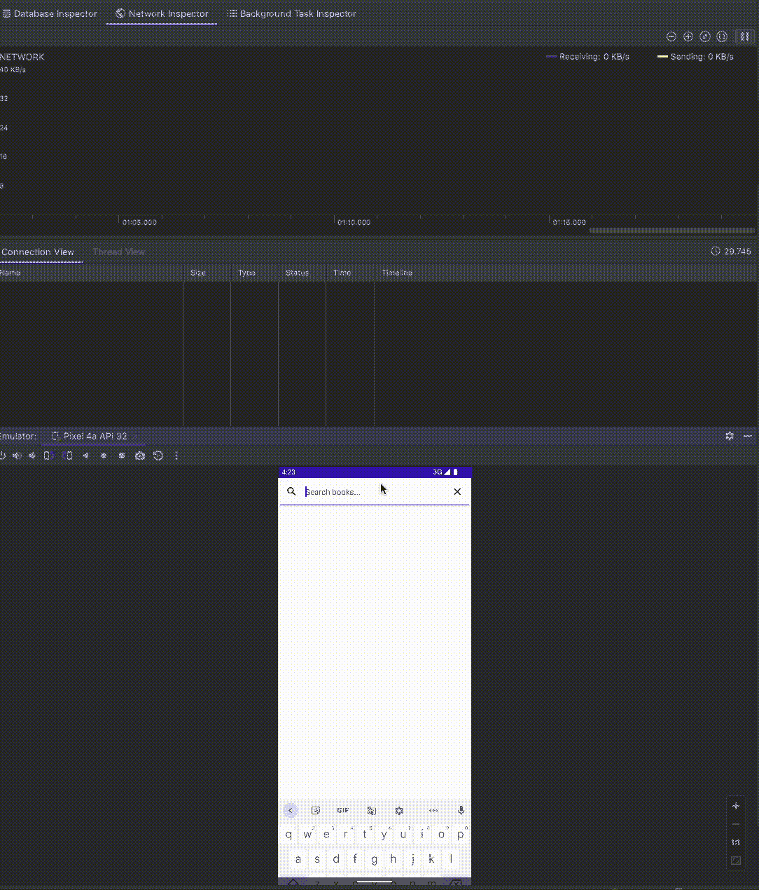

# 如何通过 Jetpack Compose 使用 Android Paging3 库

> 原文：<https://betterprogramming.pub/turn-the-page-overview-of-android-paging3-library-integration-with-jetpack-compose-3a7881ed75b4>

## 在你的应用程序中打开谷歌图书页面


作者图片

本文将根据 Android 开发的最新趋势，重点解释如何在 Android 中实现分页。我们将使用 Android 中最新版本的分页——paging 3，并将探索如何将其与 Jetpack Compose 集成。

剧透提醒:比你想象的简单！

# 寻呼还是不寻呼——这是个问题

什么时候应该实现分页？如果需要获取的数据相对较少，并且您知道需要在 UI 上显示所有这些数据，那么就没有必要对响应进行分页。

当您加载大量数据时，分页是有意义的，您可能需要，也可能不需要，这取决于用户交互。或者，当数据量不可预测时——在您实际发出呼叫之前，您不知道响应会有多大。在这种情况下，明智的做法是使用分页，在用户滚动页面时逐渐获取数据并呈现给用户。这被称为无限滚动，在本文中，我们将看看如何使用 Google 最新的分页库和 Jetpack Compose 来实现它。

# 1.基础知识

首先，我们需要一个支持分页的 API。为此，我们将使用[谷歌的图书 API](https://developers.google.com/books/docs/v1/using) 。很方便，我知道。

我们将制作一个使用这个 API 的单屏幕应用程序，并允许用户搜索一本书。我们将利用分页来编写，使书籍的加载更快、更有效。每次请求我们只加载 10 本书，当用户滚动时，我们会加载更多。这样，我们只取我们需要的书，使网络请求更快，用户体验更好。

我们将使用最新版本的依赖项:

```
implementation "androidx.paging:paging-runtime:3.1.1"
implementation "androidx.paging:paging-compose:1.0.0-alpha16"
```

请确保您始终使用兼容版本的标准分页库和用于撰写的分页。不兼容的版本可能会导致崩溃。

*注意:为了简单起见，在这个例子中我将省略使用 Koin 或其他依赖注入框架。*

# 2.数据层

数据层与任何其他层相同，由一个存储库和一个使用 API 的服务组成，在这种情况下，通过改进来实现:

唯一的区别是分页源，它是分页库的一个特定部分。这就是奇迹发生的地方:

*`query`**参数仅用于搜索功能，与分页没有直接关系。***

**如您所见，该类需要从 PagingSource 抽象类继承并实现两个方法。让我们来实现它们:**

**在`load()`方法中，我们调用 API。当然，这里我们需要`limit`和`startIndex`参数。这些都是分页库给我们提供的。limit 参数指示在一次调用中应该获取多少项。它是由`LoadParams`的`loadSize`属性定义的。**

**另一方面，`startIndex`参数表示我们要开始获取的第一个元素的索引(这可能因 API 而异，有些使用页码代替)。由`LoadParams`的 key 属性提供。**

**我们用这两个属性调用端点，并将结果包装在一个`Page`实例中。这里我们还需要提供上一个和下一个密钥。这对于正确获取数据至关重要。这里的逻辑是，`prevKey`应该表示前一页，`nextKey`应该指示下一页应该加载哪一页(下次调用`key`时，它将被传递给该方法)。**

**如果我们到达最后一页，我们通过`**null**`，以指示全部数据已经被加载。**

```
**override fun getRefreshKey(state: PagingState<Int, Book>): Int =
    ((state.anchorPosition ?: 0) - state.config.initialLoadSize / 2)
        .*coerceAtLeast*(0)**
```

**`getRefreshKey()` 方法向库提供了在数据无效的情况下加载哪个页面的信息。**

**不正确地实现此方法会导致每当执行刷新时重新加载数据，而不是更新当前列表并保持列表中的位置。**

# **3.视图模型**

**ViewModel 表示视图和数据层之间的链接。当谈到分页时，这是非常简单的。你只需要几条线就可以把所有东西连接起来。**

**就这么简单。我们创建了一个带有`PagingConfig`的`Pager`，并为寻呼机提供了一个`PagingSource`。然后，我们将所有这些打包成一个流，使其易于被 UI 使用。就是这样！**

# ****4。视图****

**我假设您对 Compose 有基本的了解，并且知道如何创建一个可组合的屏幕并在活动中呈现它。如果没有，您可以在本文末尾找到完整的代码，看看所有的东西是如何连接在一起的。**

**还记得我说过将页面包装在流中对以后会有用吗？下面是在 UI 中使用流是多么方便——一行代码:**

```
**mainViewModel.bookPager.*collectAsLazyPagingItems*()**
```

**这条线是做什么的？基本上，正如它的名字所说——它收集流的数据作为惰性项。这正是我们所需要的。Compose 知道如何处理这个对象，并在用户到达列表末尾时请求更多的条目。因此，我们将这个对象传递给可组合屏幕。**

**可以将`LazyPagingItems`传递给 Compose 提供的懒惰布局之一:`LazyColumn`、`LazyRow`、`LazyHorizontalGrid`或`LazyVerticalGrid`。更多信息请点击这里[。](https://developer.android.com/jetpack/compose/lists#lazy)**

**这里需要注意的另一件重要事情是处理加载状态。`LazyPagingItems`包含`LoadState`的信息。在这个例子中，我们只对`*refresh*`事件作出反应(初始加载或使数据源无效)，但是您也可以处理`*append*`、`*prepend*`、*、*和更多事件，并向用户显示适当的 UI。**

# **5.分析**

***请注意，本文中的摘录就是摘录，并且(可能)是不可编译的，因为我故意省略了部分代码，以使其清晰易读。您可以在文章末尾找到完整代码的链接。***

**现在，让我们看看一切是如何一起工作的。**

**我已经在项目中添加了数字，并在应用程序中附加了网络检查器，向您展示分页在后台是如何工作的。**

****

**分页在幕后是如何工作的？**

**正如您在代码中看到的，我们已经将负载大小设置为 10。但是在初始加载时，`maxResults`参数是 30。为什么？**

**缺省情况下，分页库使用预加载—它加载请求的`load size * 3`。这是为了让用户在最初加载数据时有足够的内容可以查看。所有后续加载实际上是每个请求取 10 个项目。您可以通过定义`PagingConfig`的`initialLoadSize`属性来改变这种行为。**

**最初，我们装载了 30 件物品。但是当我们进行到第 20 项时，一个新的请求产生了。这是分页库的另一个特性，称为`prefetchDistance`。它默认为您在`PagingConfig`中定义的`pageSize`，但是如果您愿意，您可以在定义`PagingConfig`时覆盖它。**

# **6.收场白**

**Paging3 提供了方便的方法来延迟加载项目并呈现给用户，而不会在 UI 中出现明显的延迟。虽然您可以在旧的 XML 定义的视图中使用它，但是与 Compose 的集成确实是无缝的。每当您想要加载大量数据而不是一次提取全部数据时，请使用分页。**

**完整代码可以在 GitHub 上找到:**

**[](https://github.com/DimovskiD/turn-the-page) [## GitHub-DimovskiD/翻页:展示 Paging3 与 Jetpack compose 的集成

### 此时您不能执行该操作。您已使用另一个标签页或窗口登录。您已在另一个选项卡中注销，或者…

github.com](https://github.com/DimovskiD/turn-the-page) 

我已经发表了一篇后续文章，对这个代码库进行了扩展。如果你对 Jetpack Compose 的副作用很好奇，看看 Jetpack Compose 的闪屏:[Compose 的副作用&如何使用它们](https://dimovski-d.medium.com/splash-screen-with-jetpack-compose-side-effects-in-compose-how-to-use-them-2a90eb6e1d34)**