# 25 VS 代码扩展，为 JavaScript 创建一流的 IDE

> 原文：<https://betterprogramming.pub/turn-visual-studio-code-into-a-top-notch-javascript-ide-with-these-25-extensions-a809d4db3eb5>

## 从代码片段、git 版本到格式化、重构 REST APIs、数据库——我们在一个扩展中得到所有这些

阿尔瓦罗·雷耶斯在 [Unsplash](https://unsplash.com?utm_source=medium&utm_medium=referral) 上拍摄的照片

[Visual Studio Code](https://code.visualstudio.com/) 是一个很棒的代码编辑器，自带 JavaScript 和 TypeScript 特性，比如开箱即用的基本重构。然而，它真正的优势是出色的扩展市场。

几乎所有你想在 IDE(集成开发环境)中做的事情都有扩展，它们可以让 VS 代码好很多倍。

不幸的是，找到正确的扩展并配置 VS 代码是非常耗时的。许多开发人员更喜欢像 [Webstorm](https://www.jetbrains.com/webstorm/) 这样的 ide 提供的开箱即用的体验。

这篇博文展示了 Visual Studio 代码扩展如何帮助您增强 JavaScript 的 IDE 体验。它包括:

*   代码完成和代码片段
*   林挺、拼写检查和提示
*   格式化、代码操作和重构
*   对其他文件类型的编辑器支持
*   整理注释、待办事项和书签
*   测试
*   排除故障
*   版本控制
*   数据库、REST API 和 Docker 客户端

您可以使用 [JavaScript IDE 扩展包](https://marketplace.visualstudio.com/items?itemName=p42ai.vscode-javascript-ide-extension-pack&ssr=false)方便地安装 25 个扩展，将 Visual Studio 代码转换为完整的 JavaScript IDE。

[图标或颜色主题](https://marketplace.visualstudio.com/search?target=VSCode&category=Themes&sortBy=Installs)和[键盘快捷键映射](https://marketplace.visualstudio.com/search?target=VSCode&category=Keymaps&sortBy=Installs)不在此处介绍，也不包含在扩展包中，因为它们比大多数扩展更依赖于个人偏好。

让我们深入研究不同的特性，看看在 VS 代码中，只需要几个扩展就可以实现什么。

# 代码完成和代码片段

代码完成(IntelliSense)功能可以使编写代码更快更容易。默认情况下，Visual Studio 代码为 JavaScript 和 TypeScript 提供了[智能感知](https://code.visualstudio.com/docs/editor/intellisense)，并包含强大的 [Emmet 支持](https://code.visualstudio.com/docs/editor/emmet)来扩展代码片段。

代码补全的一个最新趋势是 AI 助手。然而，到目前为止，我对人工智能代码完成助手如 [GitHub Copilot](https://marketplace.visualstudio.com/items?itemName=GitHub.copilot) 和 [Tabnine](https://marketplace.visualstudio.com/items?itemName=TabNine.tabnine-vscode) 的体验是混杂的，因此我没有将它们包括在扩展包中，但它们可能对你很有用。

这里有几个代码片段扩展，可以提高您的工作效率。

## 1.ES7 片段

ES7 片段扩展提供了许多可扩展的日常片段。比如定义导入和导出，创建方法和循环，返回承诺。

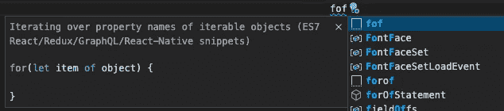

来自扩展文档的屏幕截图

该扩展还包含许多 React、Redux 和 GraphQL 的代码片段。

## 2.埃米特现场直播

使用 [Emmet Live 扩展](https://marketplace.visualstudio.com/items?itemName=ysemeniuk.emmet-live)，您可以在制作 Emmet 缩写时预览您的 [Emmet](https://emmet.io/) 输出。您可以用`Emmet Live`命令启动它。

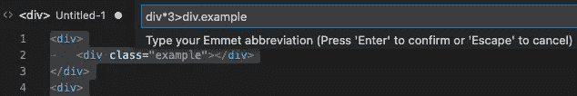

## 3.vs code-随机

当编写测试或创建模型时，经常需要时间来得出好的假数据。您可以使用 [vscode-random 扩展](https://marketplace.visualstudio.com/items?itemName=jrebocho.vscode-random)来生成多种随机数据，如号码、位置、电子邮件、IP、姓名和`datetime`值。

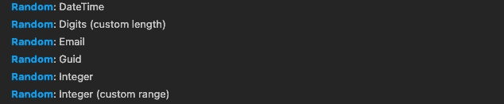

# 林挺、拼写检查和提示

获得代码反馈的最佳时机是在编辑的时候，也就是说，当你可以快速修改代码并边修改边学习的时候。通过将林挺、拼写检查和其他建议集成到您的编辑过程中，您可以避免一些更长的提交前检查和拉请求往返。

## 4.代码拼写检查器

输入错误和小的拼写错误很容易出现在变量和函数名、字符串、注释等中。

代码拼写检查器扩展突出了这些错误，并且通常可以提供正确的拼写作为修复。

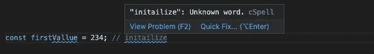

## 5.埃斯林特

[ESLint](https://eslint.org/) 是最常用的 JavaScript linter。它帮助您“发现并修复 JavaScript 代码中的问题”

ESLint 具有很强的可扩展性和可配置性，许多团队都有自己的项目定制规则。

[ESLint 扩展](https://marketplace.visualstudio.com/items?itemName=dbaeumer.vscode-eslint)直接在编辑器中显示错误和警告，并让您轻松快速修复它们。您还可以将其配置为在保存时自动修复任何问题。

## 6.误差透镜

[错误镜头扩展](https://marketplace.visualstudio.com/items?itemName=usernamehw.errorlens)直接在编辑器中高亮显示错误、警告和信息消息。

有了它，你不需要采取额外的步骤来找出弯弯曲曲的下划线是什么意思——它就在你面前。如果信息太多，您可以使用`Error Lens: Toggle...`命令针对不同的消息类型轻松地打开和关闭它。

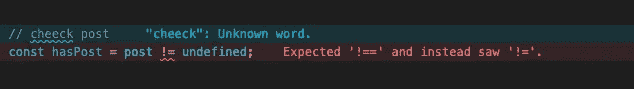

# 格式化、代码操作和重构

Visual Studio 代码带有[基本重构和快速修复](https://code.visualstudio.com/docs/editor/refactoring)，比如`Rename`、`Extract Method`和`Extract Variable`。可以通过扩展进一步增强编辑体验:

## 7.较美丽

手动格式化代码非常耗时并且容易出错。有了 JavaScript 世界事实上的标准代码格式化器[appellister](https://prettier.io/)，你可以自动格式化你的代码。

你甚至可以配置[beautiful VS 代码扩展](https://marketplace.visualstudio.com/items?itemName=esbenp.prettier-vscode)在保存源代码时格式化它。

## 8.更改大小写

[改变大小写扩展](https://marketplace.visualstudio.com/items?itemName=wmaurer.change-case)增加了一系列命令来改变所选文本的大小写，例如改变为骆驼大小写、蛇大小写、帕斯卡大小写等。这些命令都有`Change Case`前缀。

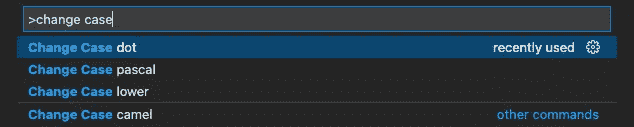

## 9.P42 JavaScript 助手

这是我开发的一个 [JavaScript 助手](https://marketplace.visualstudio.com/items?itemName=p42ai.refactor)。它给 VS 代码添加了 [60 多种重构、快速修复和代码动作](https://p42.ai/blog/2021-12-21/level-up-your-javascript-with-these-60-quick-fixes-for-vs-code)。

它包含 React 重构、ECMAScript 现代化、语法和语言元素转换、逻辑表达式和控制流的操作以及代码清理。

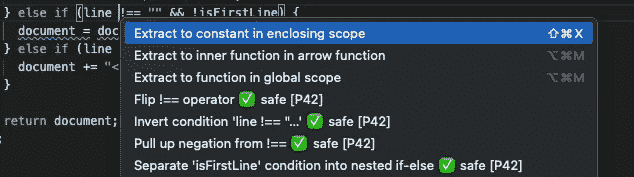

# 对其他文件类型的编辑器支持

当您使用 JavaScript 和 TypeScript 时，还有许多其他相关的文件类型。Visual Studio 代码已经有了对 [JSON](https://code.visualstudio.com/docs/languages/json) 、 [HTML](https://code.visualstudio.com/docs/languages/html) 、 [CSS](https://code.visualstudio.com/docs/languages/css) 和 [Markdown](https://code.visualstudio.com/docs/languages/markdown) 的编辑支持。以下扩展增加了更多增强的编辑器支持:

## 10.npm

[npm 扩展](https://marketplace.visualstudio.com/items?itemName=eg2.vscode-npm-script)验证在`package.json`文件中定义的已安装的 Node.js 模块。

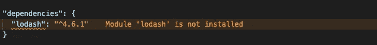

## 11.SVG 预览

SVG 预览扩展就是这样做的:显示`.svg`文件的预览。

您可以在预览中平移和缩放图像，当您编辑 SVG 源时，图像会自动更新。

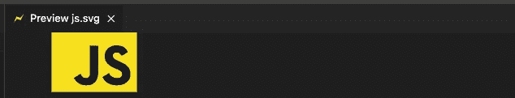

## 12.更好的汤姆

[TOML](https://github.com/toml-lang/toml) 是一种简单易读的配置文件格式。更好的 TOML 扩展增加了完整的编辑器支持，包括语法高亮、折叠、导航和格式化。

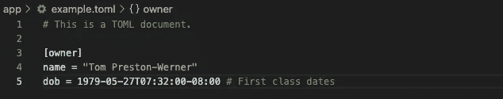

# 整理注释、待办事项和书签

在持续多年并涉及许多开发人员的大型开发项目中，围绕注释和待办事项保持有序变得越来越重要。以下扩展对此有所帮助:

## 13.更好的评论

[更好的评论扩展](https://marketplace.visualstudio.com/items?itemName=aaron-bond.better-comments)用不同的颜色显示不同种类的评论。支持`!`、`?`、`TODO`等前缀。

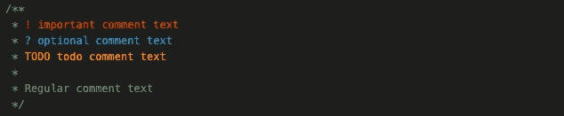

## 14.待办事项树

TODOs 和 FIXMEs 很容易被遗忘和丢失。
[Todo 树扩展](https://marketplace.visualstudio.com/items?itemName=gruntfuggly.todo-tree)扫描工作区中的文件，查找 Todo 和 FIXME 注释，并在侧边栏视图中组织它们。

您可以轻松地按文件夹浏览它们，并重新访问引起您注意的重要项目。

## 15.书签

使用[书签扩展](https://marketplace.visualstudio.com/items?itemName=alefragnani.bookmarks)，你可以保存和标记重要的源代码位置，并在侧边栏面板中组织它们。当您在探索复杂的代码库时，或者当您有经常返回的位置时，这可能会很有帮助。

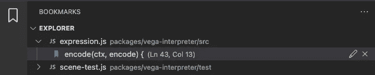

# 测试

编写和运行测试是至关重要的开发活动。
特别是，在 IDE 中运行的单元测试有助于获得即时反馈。以下扩展为 VS 代码添加了测试运行器支持:

## 16 号和 17 号。测试浏览器

测试资源管理器是一组将测试无缝集成到 VS 代码中的扩展。它的[测试浏览器 UI 扩展](https://marketplace.visualstudio.com/items?itemName=hbenl.vscode-test-explorer)添加了一个侧面板，用于运行测试和查看结果，而[测试浏览器状态栏](https://marketplace.visualstudio.com/items?itemName=connorshea.vscode-test-explorer-status-bar)将测试数量添加到状态栏。

UI 组件显示测试适配器产生的信息。测试所需的适配器取决于您的测试框架。对于 JavaScript，可以使用以下测试框架的测试适配器扩展:

*   [摩卡](https://marketplace.visualstudio.com/items?itemName=hbenl.vscode-mocha-test-adapter) *(包含在扩展包中)*
*   [Jest](https://marketplace.visualstudio.com/items?itemName=kavod-io.vscode-jest-test-adapter) *(包含在扩展包中)*
*   [茉莉](https://marketplace.visualstudio.com/items?itemName=hbenl.vscode-jasmine-test-adapter)
*   [棱角分明/因果报应](https://marketplace.visualstudio.com/items?itemName=raagh.angular-karma-test-explorer)
*   [AVA](https://marketplace.visualstudio.com/items?itemName=gwenio.vscode-ava-test-adapter)
*   [TestyTs](https://marketplace.visualstudio.com/items?itemName=Testy.vscode-testyts-test-adapter)
*   [React-scripts](https://marketplace.visualstudio.com/items?itemName=smarschollek.vscode-react-scripts-test-adapter)

Visual Studio 代码在 1.59 版中增加了本机测试功能。

您可以通过在 [VS 代码设置](https://code.visualstudio.com/docs/getstarted/settings)中将`testExplorer.useNativeTesting`设置为`true`来启用它们。

# 排除故障

Visual Studio 代码自带一个优秀的 [JavaScript 调试器](https://code.visualstudio.com/docs/editor/debugging)。它可以连接 Node.js、 [Edge 和 Chrome](https://code.visualstudio.com/docs/editor/debugging#_trigger-debugging-via-edge-or-chrome) ，所以在大多数情况下，JavaScript 调试时不需要额外的扩展。

# 版本控制

[Git](https://git-scm.com/) 是最常用的版本控制系统(VCS)，对 VS 代码有很大的扩展。你也可以在 VS 代码市场上找到其他 VCS 的扩展，比如 [Subversion](https://marketplace.visualstudio.com/items?itemName=johnstoncode.svn-scm) 。

## 20.吉特朗斯

GitLens 扩展向源代码控制侧边栏添加了几个面板，并用信息叠加增强了编辑器。

侧边栏面板帮助您管理分支、隐藏、提交、文件历史、远程，编辑器扩展包括责备视图、更改指示、作者身份代码镜头等等。

GitLens 是一个重要的扩展，它使得在 VS 代码中使用 Git 更加容易。

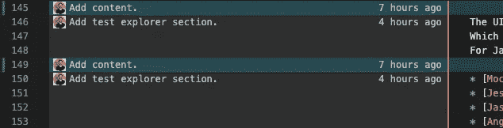

## 21.Git 图

[Git 图形扩展](https://marketplace.visualstudio.com/items?itemName=mhutchie.git-graph)在编辑器面板中直观地显示了 Git 历史。你可以用“查看 Git 图”命令打开它。在图形视图中，您可以探索单个提交并执行许多日常 Git 操作。例如，您可以检查分支和提交、创建分支、精选提交、执行合并等。

# 数据库、REST API 和 Docker 客户端

开发全栈 JavaScript 通常意味着与数据库、REST APIs 和 Docker 等外部系统合作。以下扩展将客户端添加到 VS 代码中:

## 22.数据库客户端

[数据库客户端扩展](https://marketplace.visualstudio.com/items?itemName=cweijan.vscode-database-client2)让您可以连接到 MySQL/MariaDB、PostgreSQL、SQLite、Redis 和 ElasticSearch。

您可以在其侧边栏面板中浏览数据库，将数据库表作为编辑器面板打开，并运行自定义 SQL 查询。数据库表格内容是可编辑的。您所做的任何更改都会立即存储在数据库中。

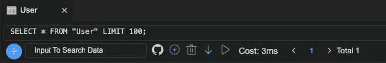

## 23.迅雷客户端

Thunder 客户端扩展将 REST APIs 的客户端集成到 VS 代码中。是[邮差](https://www.postman.com/)的轻量级替代。您可以发送任何类型的`http(s)`请求，查看响应数据，并在集合中组织您的请求。

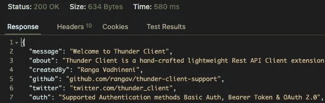

## 24.码头工人

对于许多软件工程师来说，使用容器已经成为日常开发的重要部分。使用 [Docker 扩展](https://marketplace.visualstudio.com/items?itemName=ms-azuretools.vscode-docker)，您可以探索您正在运行的 Docker 容器，获得 Docker 文件的编辑器支持，等等。

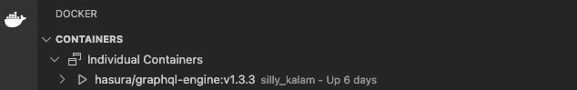

# 奖金

这里有一个我觉得非常有用的小扩展:

## 25.代码快照

有了 [CodeSnap 扩展](https://marketplace.visualstudio.com/items?itemName=adpyke.codesnap)，你可以很快获得漂亮的代码截图。从`CodeSnap`命令开始，选择想要截图的代码，点击 lense 按钮。

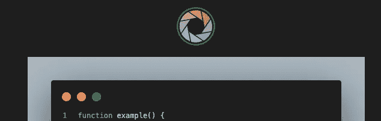

# 结论

我希望这篇文章给了你一些扩展的想法，可以改善你的 VS 代码体验。使用 [JavaScript IDE 扩展包](https://marketplace.visualstudio.com/items?itemName=p42ai.vscode-javascript-ide-extension-pack&ssr=false)，你可以安装所有的扩展包，然后禁用或卸载不符合你需求的扩展包。