# 将网站数据转化为数据集:Python 网络抓取初学者指南

> 原文：<https://betterprogramming.pub/turn-website-data-into-datasets-a-beginners-guide-to-python-web-scraping-ac1ce99d73a1>

## 以高度自动化的方式快速从网站中提取信息

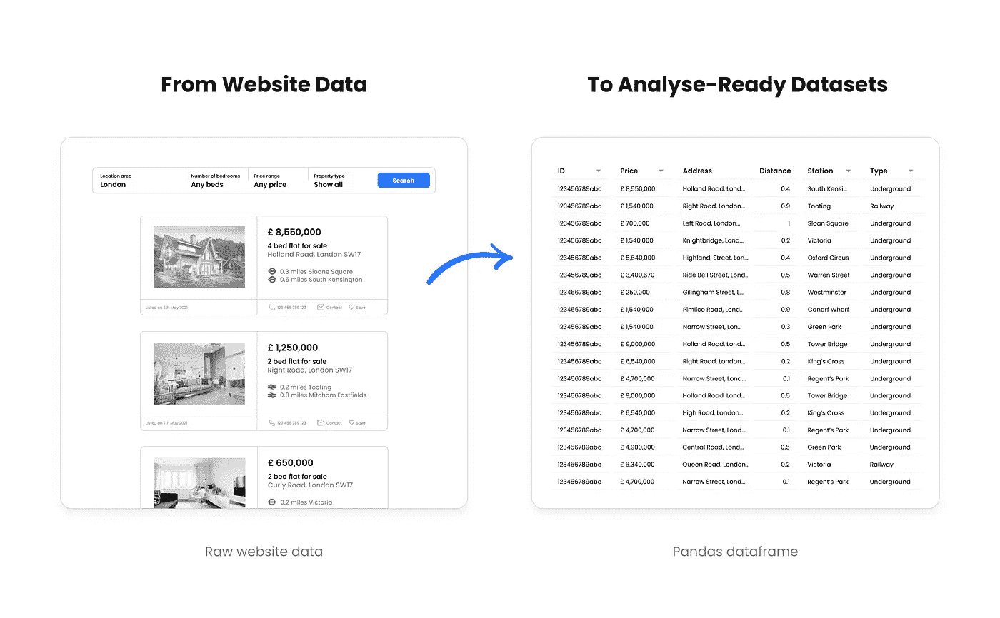

作者插图( [Unsplash](https://unsplash.com/) 图片用于虚构的列表图片)

# 概观

## 这篇文章的内容

*   网络搜集的技术和法律考虑
*   使用基于 HTML 的方法和 Python 漂亮的 Soup 库抓取基于搜索的平台的例子
*   抓取时处理数据异常和不一致的常用技术
*   如何将讨论的例子转化为数据管道，使用亚马逊的云计算平台、 [AWS](https://aws.amazon.com/) 和 [Apache Airflow](http://airflow.apache.org/) 定期收集数据

## **什么是网页抓取？**

网络爬虫访问网站的底层代码并收集大量数据，这些数据随后被保存在本地文件或数据库中。它已经成为数据科学和商业中的一个既定学科:公司收集竞争对手的趋势，进行市场研究，并进行深入分析，所有这些都是基于可以公开访问的数据。

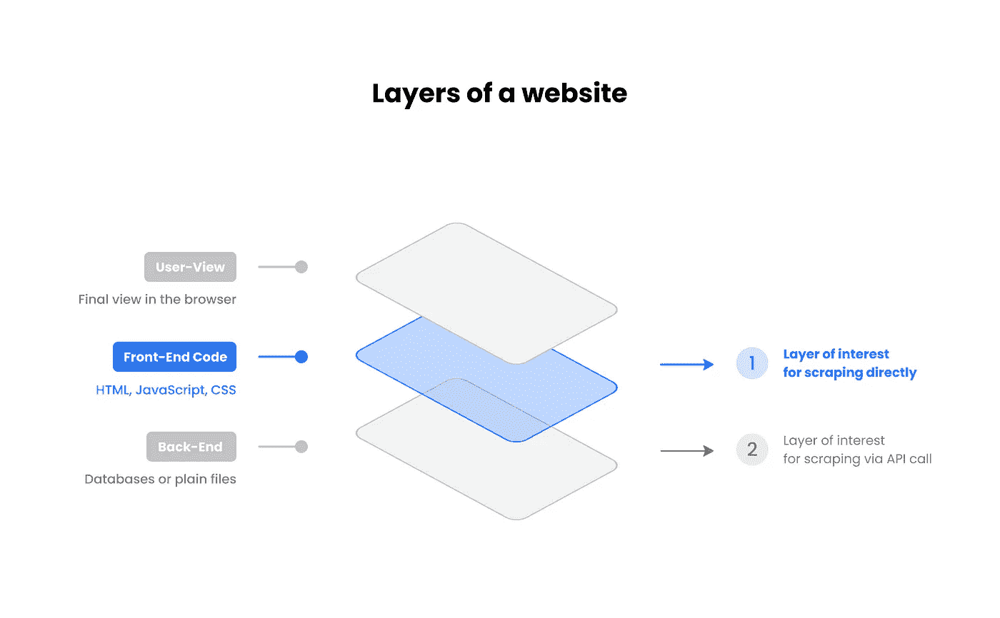

网站的三层(作者插图)

## **web 刮刀一般是如何工作的？**

有不同的方法来抓取网页。本文主要关注 HTML 刮刀，并在最后一节简要概述了其他方法。顾名思义，这些类型的抓取器使用网站的底层 HTML 代码来检索所需的信息。这种方法非正式地访问网站，这就是为什么需要使用带有定制逻辑的代码来解密所需数据。

## **与 API 调用相比的差异**

获取网站数据的另一种方法是利用称为 *API 调用*的进程。API(应用程序编程接口)由网站所有者正式提供，允许请求特定信息，其中数据直接从数据库(或普通文件)访问。这通常需要网站所有者的许可，并且是高度安全的(例如，API 密钥和令牌)。然而，API 并不总是可用的，这就是为什么抓取具有很高的吸引力，但它也提出了合法性的问题。

## **法律考虑**

网络抓取可能会违反版权规范或网站所有者的服务条款，尤其是当它被用于竞争优势、意外收入或一般滥用目的(例如，在很短的时间间隔内发送请求)时。然而，收集公开可用的数据并用于 1)私人消费、2)学术目的或 3)其他无商业意图的情况，通常可以被认为是合法无害的。

如果数据 1)受到登录或付费墙的保护，2)明确禁止网站所有者抓取，3)包含机密信息，或 4)危及个人隐私，则必须避免任何类型的抓取活动。因此，请谨记始终以负责任的态度行事，并首先遵循合规原则。

# 漂亮的 Python 汤设置

[美汤](https://www.crummy.com/software/BeautifulSoup/bs4/doc/#)是一个 Python 库，通过访问底层 HTML 代码从网站收集数据。

在您的终端中安装最新版本的 Beautiful Soup:

```
$ pip install beautifulsoup4
```

安装`requests` 能够调用网站(库发送 HTTP 请求):

```
$ pip install requests
```

在 Python 或 Jupyter 笔记本文件中，导入这些库:

```
from bs4 import BeautifulSoup
import requests
```

以及一些用于数据处理和转换步骤的标准库:

```
import re
from re import sub
from decimal import Decimal
import io
from datetime import datetime
import pandas as pd
```

# 0.介绍

假设我们想要抓取一个平台，其中包含公共可用的属性广告。我们希望获得以下信息:1)房产的价格，2)其地址，以及 3)距离，4)车站名称，以及 5)到最近的公共交通站的交通类型，以找出房产价格在特定城市的公共交通站中是如何分布的。

例如，如果我们考虑离公交车站最近的 50 处房产，那么该车站的平均房价是多少？

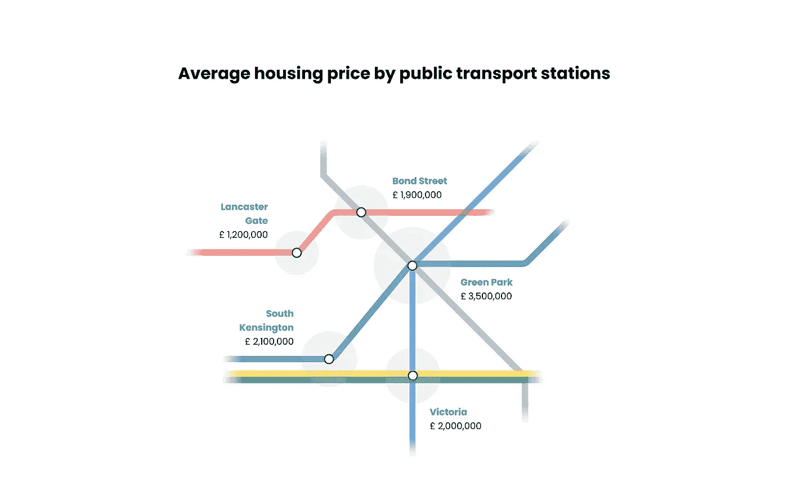

分析思路(作者举例)

**重要提示:**我们明确避免使用特定的网站，因为我们不想在同一个网站推广跑步。这就是为什么本文中的代码是**一般化的**并且使用了一个带有**虚拟 HTML 代码**的**虚拟网站**。然而，示例代码与现实生活中的网站高度一致。

假设对属性的搜索请求将导致如下所示的结果页面:

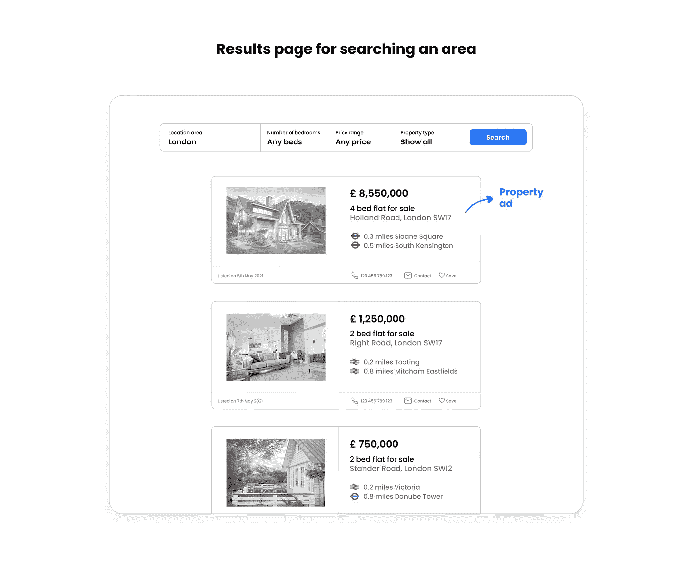

虚构的结果页面(作者使用 [Unsplash](https://unsplash.com/) 图片对虚构的列表进行说明)

一旦我们知道广告以何种布局和结构显示，我们需要提出一个抓取逻辑，允许我们从结果页面上的每个广告中获取所有需要的功能(例如，价格、地址、公共交通信息功能)。

每当我遇到这类棘手的任务时，我会采取以下步骤:

1.  **如何为一个特征获取一个数据点？** (例如，从第一个广告中获取价格标签。)
2.  **如何从整个页面中获取一个特征的所有数据点？** (例如，获取页面上所有广告的价格标签。)
3.  **如何在所有结果页面中获得一个特性的所有数据点？** (例如，获取针对特定搜索请求显示的每个广告的价格标签。)
4.  **如果感兴趣的数据点在广告中并不总是适用，如何解决不一致的问题？** (例如，有些广告的价格栏显示“应用价格”我们最终会得到一个由数字和字符串值组成的列，这在我们的例子中不允许进行现成的分析。当然，我们可以在进行分析时简单地排除字符串值。这一步只是为了演示如何从一开始就预期一个更干净的数据集，这在其他情况下可能更有价值。)
5.  **如何更好地提取复杂信息？** (例如，假设每个广告都包含公共交通信息，如“距离地铁站 XY 0.5 英里。”逻辑需要看起来像什么，以便我们可以以正确的格式直接存储这种混合信息:distance = [0.5]，transport_type = ["underground"]，station = ["name XY"])

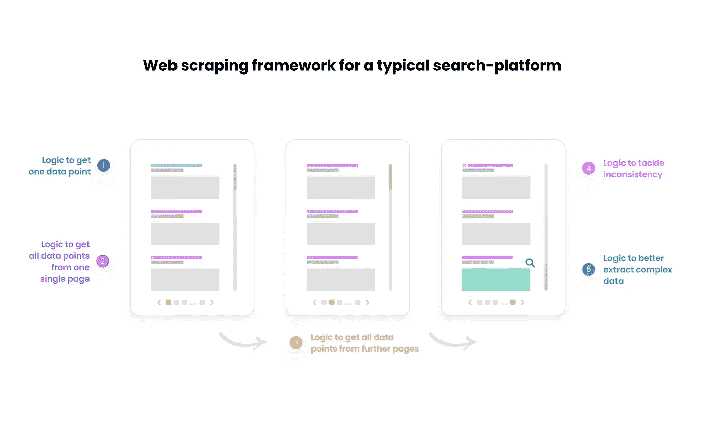

网页抓取框架(作者插图)

# 1.获取一个数据点的逻辑

**重要提示:**下面讨论的所有代码片段也可以在 GitHub 上我的[库](https://github.com/christopherkindl/web-scraper-template)中的一个完整的 Jupyter 笔记本文件中找到。

## **呼叫网站**

首先，我们在 Python 脚本中复制我们在浏览器中完成的搜索请求:

```
# search area of interest
url = 'https://www.website.com/london/page_size=25&q=london&pn=1'

# make request with url provided and get html text
html_text = requests.get(url).text

# employ lxml as a parser to extract html code
soup = BeautifulSoup(html_text, 'lxml')
```

变量`soup` 现在包含了结果页面的整个 HTML 源代码。

## 搜索特定于功能的 HTML 标签

现在的技巧是找到可区分的 HTML 标签，或者是类，或者是 id，它们指向感兴趣的特定信息点(例如，价格，见下图)。

对于这一步，我们需要浏览器的帮助。一些流行的浏览器提供了一种直接获取特定元素的 HTML 信息的便捷方式。在 Google Chrome 中，您 1)标记特定的功能字段，然后 2)右键单击以获得检查元素的选项(或者简单地应用键盘快捷键 Cmd + Shift + C)。然后在浏览器视图旁边打开源代码，您可以直接看到 HTML 信息。

在价格的例子中，使用 HTML 类`css-aaabbbccc`将返回信息`£550,000`，如浏览器视图所示。

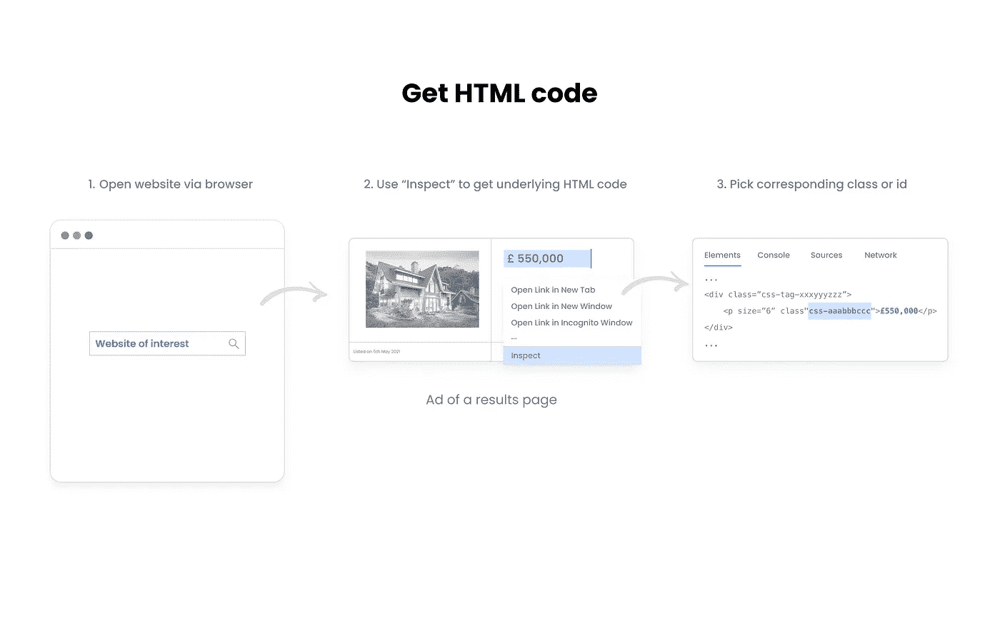

获取基于 HTML 类的数据点(虚构代码)(作者使用 [Unsplash](https://unsplash.com/) 图片进行说明)

## 理解 HTML 类和 id 属性

CSS 有时 JavaScript 使用 HTML 类和 id 来执行某些任务。这些属性主要用于引用 CSS 样式表中的类，以便以一致的方式显示数据(例如，以此格式在此位置显示价格标签)。

class 和 id 的唯一区别是，id 在一个页面中是唯一的，并且最多只能应用于一个元素，而 class 可以应用于多个元素。

在上面的例子中，用于从一个广告中检索价格信息的 HTML 类也适用于从其他广告中检索价格(这符合类的主要目的)。请注意，HTML 类也可以引用广告部分之外的价格标签(例如，与搜索请求无关但仍显示在结果页面上的特价商品)。然而，出于本文的目的，我们只关注房地产广告中的价格。

这就是为什么我们首先定位广告，并且仅在特定于广告的源代码中搜索 HTML 类:


可变价格的输出(图片由作者提供)

在方法`find()`的末尾使用`.text`允许我们只返回浏览器中显示的纯文本。如果没有`.text`，它将返回该类引用的 HTML 行的完整源代码:

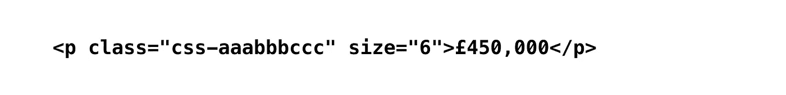

不使用的可变价格输出。文本(图片由作者提供)

**重要提示:**我们总是需要提供 HTML 元素，在本例中是`p`。另外，注意不要忘记属性名`class_`末尾的下划线。

## 获得具有相同逻辑的其他功能

1.  检查感兴趣的特征
2.  识别相应的 HTML 类或 id
3.  使用`find(...).text`解码源代码

例如，获取地址，HTML 类可能如下所示:

```
(...)# find address in ad
address = ad.find('p', class_ = **'css-address-123456'**).text# show address
address
```


变量地址的输出(图片由作者提供)

# 2.从一个页面获取所有数据点的逻辑

为了检索所有广告的价格标签，我们应用方法`find.all()` 而不是`find()` 来捕捉广告:

```
# get all ads within one page
ads = ad.**find_all**('p', class_ = 'css-ad-wrapper-123456')
```

变量`ads`现在包含了第一个结果页面中每个适用广告的 HTML 代码，作为一个列表列表。这种存储格式非常有用，因为它允许通过`index`访问广告专用源代码:

```
# identify how many ads we have fetched
len(ads)# show source code of second ad
print(ads[0])
```

对于最终代码，为了获得所有价格标签，我们使用一个`dictionary` 来收集数据，并通过应用一个`for-loop`来迭代广告:

**重要提示:**加入`id`可以识别`dictionary`中的广告:

```
# show first ad
map[1]
```

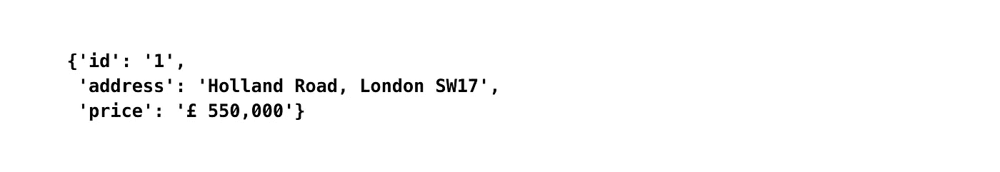

地图[1]的输出(图片由作者提供)

# 3.从所有可用的结果页面获取数据点

典型的基于搜索的平台有分页(点击按钮跳转到下一个结果页面)或无限滚动(滚动到底部以加载新的结果)来浏览所有可用的结果页面。

## 案例一。网站有分页

搜索请求产生的 URL 通常包含关于当前页码的信息。

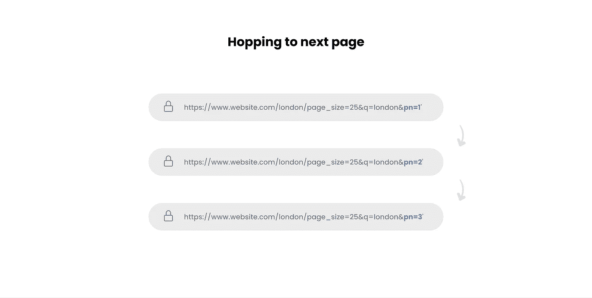

通过 URL 跳转到下一页(作者插图)

从上图可以看出，URL 的结尾是指结果的页码。

**重要提示:**URL 中的页码通常从第二页开始可见。使用带有附加片段`&pn=1`的基本 URL 来调用第一页仍然有效(在大多数情况下)。

在另一个之上应用另一个`for-loop`允许我们迭代结果页面:

## 识别最后一个结果页面

您可能想知道如何识别最后一个结果页面。在大多数情况下，在到达最后一页后，任何比最后一页的实际数字大的请求都会把我们带回第一页。因此，使用非常大的数字来等待脚本完成是行不通的。过一会儿，它将开始收集重复的值。

为了解决这个问题，我们可以加入一个逻辑来检查分页按钮中的链接是否适用:

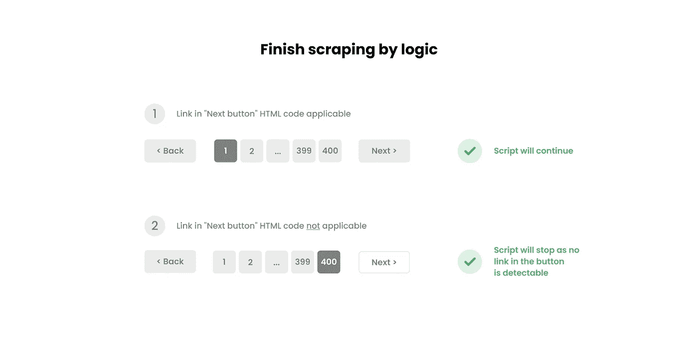

按逻辑停刮(作者插画)

## **案例二。网站有无限滚动**

如果网站遵循无限滚动的方法，HTML scraper 可能没有帮助，因为它需要到达页面底部来加载新的结果。这是 HTML 抓取器无法模拟的，需要更复杂的方法(例如， [Selenium](https://stackoverflow.com/questions/21006940/how-to-load-all-entries-in-an-infinite-scroll-at-once-to-parse-the-html-in-pytho) —参见本文后面的替代抓取方法)。

# 4.解决信息不一致问题

数据从来都不是正确的形式，尤其是在被收集的情况下。正如本文开头提到的，一种可能的情况是，我们看到的价格标签不代表数值。

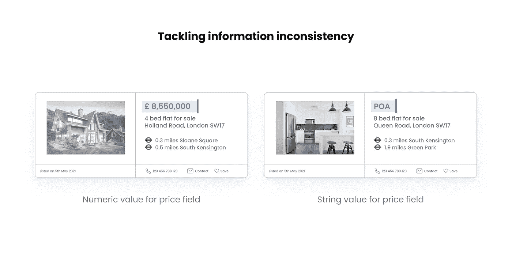

解决信息不一致的问题(作者使用 [Unsplash](https://unsplash.com/) 图片进行说明)

如果我们想从一开始就避免噪声数据，我们可以采用以下解决方法:

1.  **定义检测异常的功能**

**2。在数据采集循环中应用功能**

**3。可选:动态数据清理**

您可能已经注意到，由于货币符号和逗号分隔符的存在，价格格式`£ XX,XXX,XXX`仍然表示一个字符串值。高效行动，边刮边清洁:

定义功能:

将功能并入数据采集`for-loop`:

# **5。提取嵌套信息**

公共交通部分的特征混合在一起。对于分析，最好分别存储距离、车站名称和运输类型的值。

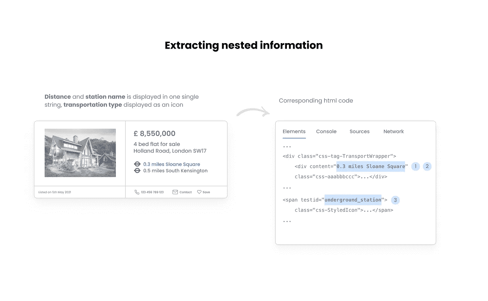

作者插图( [Unsplash](https://unsplash.com/) 图片用于虚构的列表图片)

**1。根据规则提取信息**

如上所示，关于公共交通的每条信息都以这种格式表示:“[数值]英里[站名]。”看看“miles”在这里是如何作为分隔符的，我们可以用它按照这个术语来拆分字符串。

总是试图找出一个规则来提取信息，而不是通过最佳猜测来决定。我们可以将逻辑定义如下:

最初，变量`transport`在一个列表中存储两个列表，因为有两个公共交通信息字符串(例如，“0.3 英里斯隆广场”，“0.5 英里南肯辛顿”)。我们使用`transport`的`len`作为索引值来遍历这些列表，并将每个字符串分成两个变量`distance`和`station`。

**2。搜索附加 HTML 属性以解码视觉信息**

如果我们深入研究 HTML 代码，我们会发现一个 HTML 属性`testid`，它揭示了用于显示运输类型的图标的名称(例如，“underground _ station”——见上图)。这些信息作为元数据，不会显示在浏览器视图中。我们使用相应的 HTML 类`css-StyledIcon`来获取这一部分的完整源代码，并添加`testid`来提取信息:

这个例子显示了深入挖掘源代码并注意那些可以揭示对优化 web scraper 有意义的信息的元数据是多么有用。

# 6.转换为数据帧并导出为 CSV 格式

当抓取任务完成时，所有提取的数据都可以在字典的字典中访问。

为了更好地演示最终的转换步骤，我们先考虑一个广告。

字典中第一个广告的输出:

```
# show data of first ad
map[0]
```

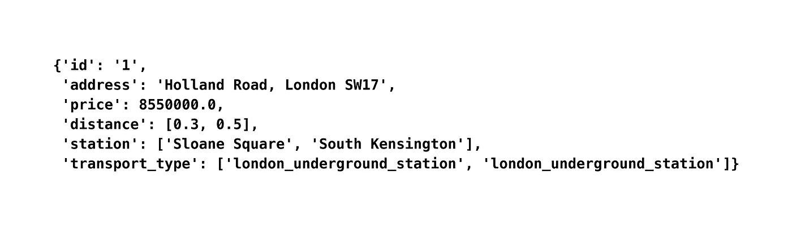

地图[1]的输出(图片由作者提供)

**1。将字典转换为列表列表以去除嵌套信息**

我们将字典转换成列表的列表，这样每个类别只保存一个值。

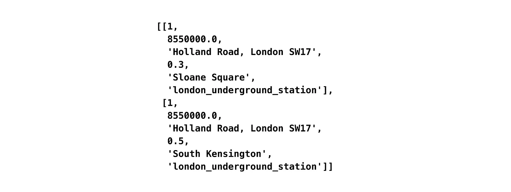

作为创建数据框的预处理步骤的列表列表(图片由作者提供)

看看我们是如何去掉公共交通部分中的多个值，并为第二个公共交通数据点创建一个额外的条目的。这两个条目仍然可以通过我们继承的 id `1`来识别。

**2。使用列表列表作为输入创建数据框**

```
df = pd.DataFrame(**result**, columns = ["ad_id", "price", "address",  
                     "distance", "station", "transport_type"])
```

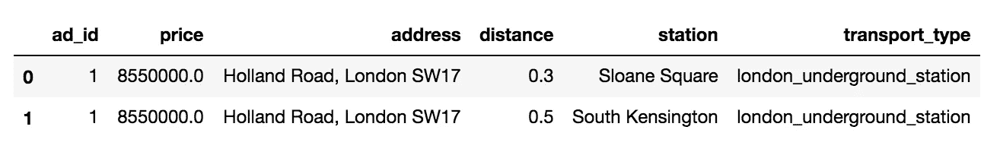

使用一个广告的最终格式(图片由作者提供)

数据框可以导出为 CSV 格式，如下所示:

```
# incorporate timestamp into filename and export as csv
filename = 'test.csv'
df.to_csv(filename)
```

## **将所有广告转换成数据帧的转换**

我们成功了！这是最后一步。您已经制造了第一台铲运机，可以进行测试了！

# 7.HTML 抓取的局限性和替代方法

这个例子显示了 HTML 抓取对于标准情况是多么简单。对图书馆文献的广泛研究并不是真正必要的。相反，它需要创造性思维，而不是复杂的 web 开发经验。

然而，HTML 刮刀也有 downsides⁴:

*   只能访问在调用 URL 时直接加载的 HTML 代码中的信息。需要 JavaScript 和 Ajax 加载内容的网站将无法工作。
*   由于网站更新(例如，新功能、网站重新设计)，HTML 类或 id 可能会发生变化。
*   无法将用户内容传输到网站，如搜索词或登录信息(除了可以合并到 URL 中的搜索请求，如示例所示)。
*   如果请求对网站来说是异常的(例如，在短时间间隔内有非常多的请求)，则很容易被检测到。这是通过定义速率限制(例如，在特定时间内仅允许执行有限数量的动作)或其他指示符(例如，屏幕大小或浏览器类型)来防止的，以便识别真实用户。

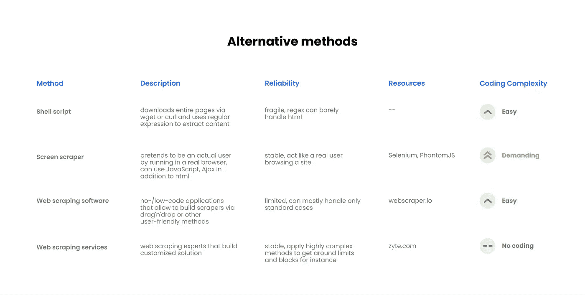

替代刮擦 methods⁴概述(作者插图)

# **了解如何将一个简单的网页抓取脚本转换成基于云的数据管道**

下一步，我们可以将这个脚本变成一个数据管道，自动触发抓取任务并将结果传输到数据库——一切都以基于云的方式进行。

第一步是为一个广告创建或标识一个完全唯一的 id。例如，这将允许取回的广告被重新收集和匹配以运行历史价格分析。

如何实现这一点，以及在云环境中部署数据管道需要哪些技术步骤，将在下一篇文章中讨论。

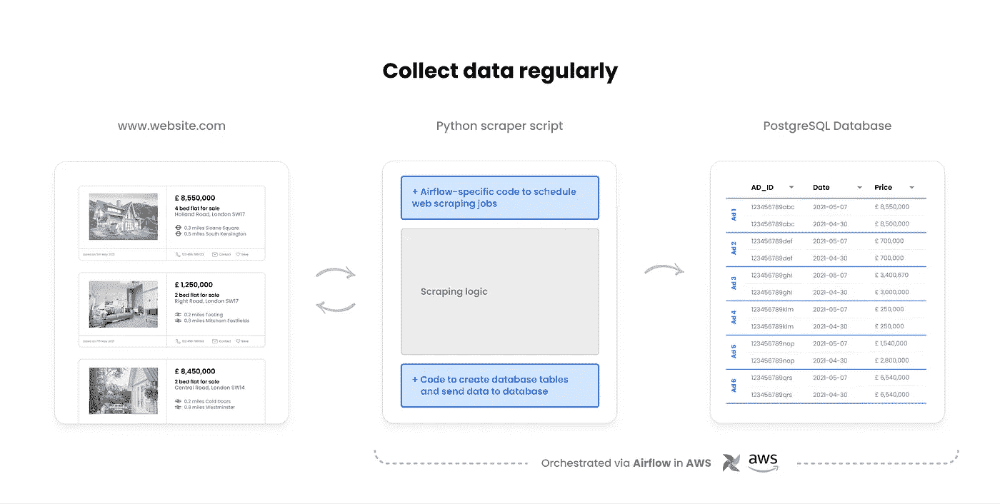

使用 AWS 和 Airflow 构建数据管道(作者使用 [Unsplash](https://unsplash.com/) 图片进行说明)

# GitHub 知识库

[https://github.com/christopherkindl/web-scraper-template](https://github.com/christopherkindl/web-scraper-template)

# 参考

[1]:托尼·保罗。(2020).网络抓取合法吗？2021 年指南[https://www . LinkedIn . com/pulse/we B- scraping-legal-guide-2021-Tony-Paul/？trk = read _ related _ article-card _ title](https://www.linkedin.com/pulse/web-scraping-legal-guide-2021-tony-paul/?trk=read_related_article-card_title)。检索于 2021 年 5 月 10 日。

[2]:W3schools.com。(2021).https://www.w3schools.com/html/html_classes.asp 的 HTML 类属性。检索于 2021 年 5 月 10 日。

[3]:GeeksforGeeks.org。(2021).HTML 中 id 和 class 的区别？[https://www . geeks forgeeks . org/Difference-between-an-id-and-class-in-html/#:~:text = Difference % 20 between % 20id % 20 and % 20 class，can % 20 apply % 20 to % 20 multiple % 20 elements](https://www.geeksforgeeks.org/difference-between-an-id-and-class-in-html/#:~:text=Difference%20between%20id%20and%20class,can%20apply%20to%20multiple%20elements)。检索于 2021 年 5 月 10 日。

[4]: JonasCz。(2021).如何防止刮网[https://www.w3schools.com/html/html_classes.asp](https://github.com/JonasCz/How-To-Prevent-Scraping)。检索于 2021 年 5 月 10 日。

[5]:爱德华·罗伯茨。(2018).网页抓取是否违法？要看这个词是什么意思[https://www.w3schools.com/html/html_classes.asp](https://github.com/JonasCz/How-To-Prevent-Scraping)。检索于 2021 年 5 月 10 日。