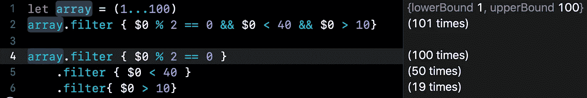

# 把你的代码变成诗歌

> 原文：<https://betterprogramming.pub/turn-your-code-into-poetry-64b38f1d29a0>

## 用函数式编程提高代码的可读性


# 介绍

他们说好的代码就像一本书:它可以像英语一样被阅读。那么，你对下面的代码片段有什么看法？

```
let array = Array(1...100)
array.filter { $0 % 2 == 0}
```

这段代码过滤偶数。我确信你以前必须处理过滤一个元素数组。上面的片段是可以理解的，但是如果我们想要扩展它并添加更多的条件呢？

```
let array = Array(1...100)
array.filter { $0 % 2 == 0 && $0 < 40 && $0 > 10}
```

现在事情开始变得有点混乱。我们总是可以这样做:

```
let array = Array(1...100)
array.filter { $0 % 2 == 0 }
    .filter { $0 < 40 }
    .filter{ $0 > 10}
```

这个看起来好一点。尽管如此，如果我们看一下*操场*中的迭代次数，您可以看到一些元素被迭代了三次:



在 Xcode 操场上运行代码

这是因为数组中的元素在第一个`filter`中迭代一次。对于第二个`filter`，匹配条件的那些被第二次迭代，以此类推。在这个例子中，这可能看起来不相关，但是在一些场景中，我们可能会迭代数千个元素。在这种情况下，我们可能会危及代码性能。有没有一种方法可以在不影响性能的情况下提高代码的可读性？

在接下来的几节中，我们将展示一个案例研究，看看如何实现一个易于阅读和使用的通用解决方案。

*目标是达到这样的详细程度，即代码可以作为纯英语阅读。也就是说，即使一个没有编码知识的人也能阅读和理解正在发生的事情。*

# 个案研究

想象我们正在构建一个人分类器。我们可以用一个*结构* `Person`来建模我们的个体，就像这样:

```
enum EyeColor {
    case dark, blue, green, brown
}enum HairColor {
    case brunette, blonde, ginger, dark
}struct Person {
    var name: String
    var eyesColor: EyeColor
    var hairColor: HairColor
}
```

这是一个人的简单定义，但它提供了许多不同的分类方法。假设我们想过滤绿眼睛金发的人和蓝眼睛姜黄色头发的人。我们最终会做这样的事情:

```
let people = [ ... ] 
let subset = people.filter { ($0.eyesColor == .green && $0.hairColor == .blonde) || ($0.eyesColor == .blue && $0.hairColor == .ginger) }
```

这似乎难以辨认和维护，你不觉得吗？我们的目标是重构这个片段。我们能修理它吗？

# 过滤器

让我们从将条件块包装到一个对象中开始:

```
struct Filter<Element> {
    typealias Condition = (Element) -> Bool
    var condition: Condition
}
```

就这么简单。一个`Filter`是一个*结构*，它保存了一个通用元素的条件。您可能想知道，将块包装成数据结构比使用`typealias`有什么好处？我们将在下一节看一看，但是包装器将允许我们操作条件。此外，`typealias`不让我们使用泛型类型。

现在我们可以扩展`Array`来利用`Filter`:

```
extension Array {
    func filtering(_ filter: Filter<Element>) -> Array {
        self.filter(filter.condition)
    }
}
```

这已经足够好了。尽管如此，同时拥有匹配和非匹配元素还是很有意思的。让我们定义一个返回两个输出的`Filter.Result`:

```
extension Filter {

    struct Result {
        private var matchingBlock: () -> Array<Element>
        private var restBlock: () -> Array<Element>

        var matching: Array<Element> { matchingBlock() }
        var rest: Array<Element> { restBlock() }

        init(matching: @escaping @autoclosure () -> Array<Element>,
             rest: @escaping @autoclosure () -> Array<Element>) {
            self.matchingBlock = matching
            self.restBlock = rest
        }
    }

}
```

我们将元素包装在一个闭包中，这样直到需要时才触发实际的过滤(也就是直到我们调用`matching`或`rest`)。继续修改`Array`扩展，改为使用`Filter.Result`:

```
extension Array {
    func filtering(_ filter: Filter<Element>) -> Filter<Element>.Result {
        Filter.Result(matching: self.filter(filter.condition),
                     rest: self.filter((!filter).condition))
    }
}
```

现在我们可以重写这个:

```
let subset = people.filter { $0.eyesColor == .blue }
```

变成这样:

```
let hasBlueEyes = Filter<Person> { $0.eyesColor == .blue }
let subset = people.filtering(hasBlueEyes).matching
```

太好了！我们写了一段更易读的代码。如果我们现在想添加一个新的条件呢？

```
let hasBlondeHair = Filter<Person> { $0.hairColor == .blonde }
let hasBlueEyes = Filter<Person> { $0.eyesColor == .blue }let subset = people.filtering(hasBlueEyes).mathing
    .filter(hasBlondeHair).matching
```

我们在性能问题上又落后了。目前，我们没有办法和`Filter`合作。我们将在下一节中解决这个问题。

# 添加详细程度

上一节我们得出了`Filter`缺乏赘言的结论。目前我们无法合并过滤器，让我们来解决这个问题。

扩展`Filter`增加一些基本操作:

```
var inverted: Self {
    .init { !self.condition($0) }
}func and(_ filter: Self) -> Self {
    .init { filter.condition($0) && self.condition($0) }
}func or(_ filter: Self) -> Self {
    .init { filter.condition($0) || self.condition($0) }
}
```

干得好！通过这样做，我们可以重写最后一段代码:

```
let subset = people.filter(hasBlueEyes.and(hasBlondeHair).matching
```

哇！这看起来是一个巨大的进步。我们不仅提高了可读性，而且提高了性能，因为元素只迭代一次。干得好！

为了增加更多的冗长性，让它看起来像我们简单地用布尔运算，让我们添加一些自定义操作符`&`、`|`和`!`以及帮助函数和变量，让我们组合一组过滤器:

```
struct Filter<Element> {
    typealias Condition = (Element) -> Bool
    var condition: Condition
}

extension Filter {

    static var all: Self {
        .init { _ in true }
    }

    static var none: Self {
        .init { _ in false }
    }

    var inverted: Self {
        .init { !self.condition($0) }
    }

    func and(_ filter: Self) -> Self {
        .init { filter.condition($0) && self.condition($0) }
    }

    func or(_ filter: Self) -> Self {
        .init { filter.condition($0) || self.condition($0) }
    }

    static prefix func ! (_ filter: Self) -> Self {
        filter.inverted
    }

    static func & (_ lhs: Self, _ rhs: Self) -> Self {
        lhs.and(rhs)
    }

    static func | (_ lhs: Self, _ rhs: Self) -> Self {
        lhs.or(rhs)
    }

    static func any(of filters: Self...) -> Self {
        Self.any(of: filters)
    }

    static func any(of filters: [Self]) -> Self {
        filters.reduce(.none, |)
    }

    static func not(_ filters: Self...) -> Self {
        Self.combine(filters.map { !$0 })
    }

    static func combine(_ filters: [Self]) -> Self {
        filters.reduce(.all, &)
    }

    static func combine(_ filters: Self...) -> Self {
        Self.combine(filters)
    }

}
```

这些最后的变化将有助于我们轻松地组合过滤器。让我们试一试:

```
let hasBlondeHair = Filter<Person> { $0.hairColor == .blonde }
let hasBlueEyes = Filter<Person> { $0.eyesColor == .blue }let result1 = people.filtering(!hasBlueEyes)
let result2 = people.filtering(hasBlueEyes & hasBlondeHair)
let result3 = people.filtering(hasBlueEyes | !hasBlondeHair)
```

这简单多了，而且只有一次迭代，我们还能要求更多吗？

# 决赛成绩

在这一点上，你有了所有你需要的工具，把那些不可维护的无意义的代码变成诗歌。想看看怎么样吗？让我们回到我们的案例研究。

这些是我们可能想要在`Person`中重用的一些过滤器。我们可以扩展`Filter`并添加一些最常见的:

```
extension Filter where Element == Person {
    static let brownEyes = Filter { $0.eyesColor == .brown }
    static let blueEyes = Filter { $0.eyesColor == .blue }
    static let darkEyes = Filter { $0.eyesColor == .dark }
    static let greenEyes = Filter { $0.eyesColor == .green }

    static let brunette = Filter { $0.hairColor == .brunette }
    static let blonde = Filter { $0.hairColor == .blonde }
    static let ginger = Filter { $0.hairColor == .ginger }
    static let darkHair = Filter { $0.hairColor == .dark }

    static func name(startingWith letter: String) -> Filter {
        Filter { $0.name.starts(with: letter) }
    }
}
```

现在，在本文的开始，我们的目标是重构这段代码:

```
let subset = people.filter { ($0.eyesColor == .green && $0.hairColor == .blonde) || ($0.eyesColor == .blue && $0.hairColor == .ginger) }
```

通过使用`Filter`，我们可以将前面的代码片段重写为:

```
let subset = people.filtering(Filter.greenEyes.and(.blonde)
    .or(Filter.ginger.and(.blueEyes))).matching
```


哇！有那么一瞬间，我以为我在读莎士比亚，而不是代码！更清晰了，不是吗？

尝试编写一些复杂的人员过滤器:

```
let people = [
    Person(name: "Eliott", eyesColor: .brown, hairColor: .blonde),
    Person(name: "Eoin", eyesColor: .brown, hairColor: .brunette),
    Person(name: "Michelle", eyesColor: .brown, hairColor: .brunette),
    Person(name: "Kevin", eyesColor: .blue, hairColor: .brunette),
    Person(name: "Jessica", eyesColor: .green, hairColor: .brunette),
    Person(name: "Thomas", eyesColor: .dark, hairColor: .dark),
    Person(name: "Oliver", eyesColor: .dark, hairColor: .blonde),
    Person(name: "Jane", eyesColor: .blue, hairColor: .ginger),
    Person(name: "Justine", eyesColor: .brown, hairColor: .dark),
    Person(name: "Joseph", eyesColor: .brown, hairColor: .brunette),
    Person(name: "Michael", eyesColor: .blue, hairColor: .dark)
]

people.filtering(.combine(.name(startingWith: "E"), .brownEyes, .blonde)).matching      // Eliott
people.filtering(.any(of: .ginger, .blonde, .greenEyes)).matching       // Eliott, Jessica, Oliver, Jane
people.filtering(Filter.not(.name(startingWith: "J"), .brownEyes).and(.brunette)).matching      // Kevin
people.filtering(Filter.greenEyes.and(.blonde).or(Filter.ginger.and(.blueEyes))).matching       // Jane
```

或者甚至重用`Filter`过滤……狗？

```
enum DogBreed {
    case pug
    case husky
    case boxer
    case bulldog
    case chowChow
}

struct Dog {
    var name: String
    var breed: DogBreed
}

let dog = [
    Dog(name: "Rudolph", breed: .husky),
    Dog(name: "Hugo", breed: .boxer),
    Dog(name: "Trinity", breed: .pug),
    Dog(name: "Neo", breed: .pug),
    Dog(name: "Sammuel", breed: .chowChow),
    Dog(name: "Princess", breed: .bulldog)
]

extension Filter where Element == Dog {
    static let pug = Filter { $0.breed == .pug }
    static let husky = Filter { $0.breed == .husky }
    static let boxer = Filter { $0.breed == .boxer }
    static let bulldog = Filter { $0.breed == .bulldog }
    static let chowChow = Filter { $0.breed == .chowChow }
}

dog.filtering(.boxer).matching                          // Hugo
dog.filtering(.not(.husky, .chowChow)).rest             // Rudolph, Sammuel
dog.filtering(Filter.boxer.or(.chowChow)).matching      // Hugo, Sammuel
```

# 结论

在开发代码时，尽量使它可读、可维护、易于扩展。你的代码应该读起来像一个普通的英语句子——这就是坏代码、好代码和更好代码之间的区别。

总而言之，我们从一段难以理解且不太可扩展的代码开始。我们利用*泛型*和无状态*结构* `Filter`来提高易读性，而不牺牲性能。我们给`Filter`增加了冗长性，以获得更好的可读性。最后，我们将一些常见的过滤器提取到一个扩展中，并使它们可重用。