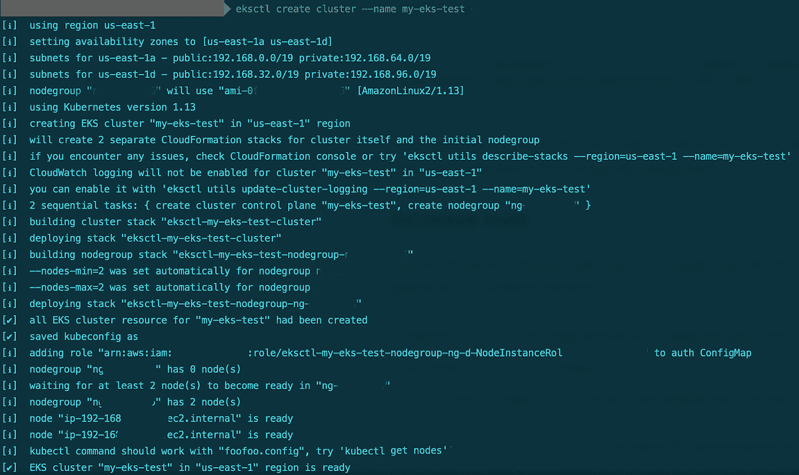
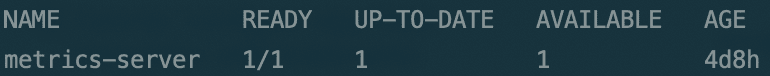
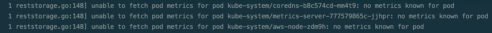
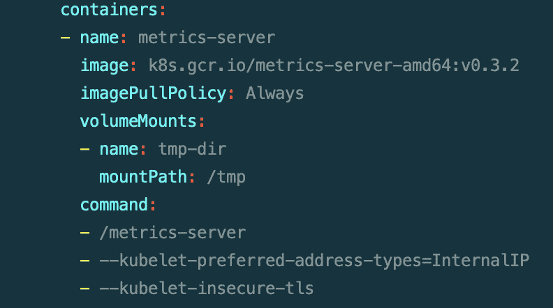
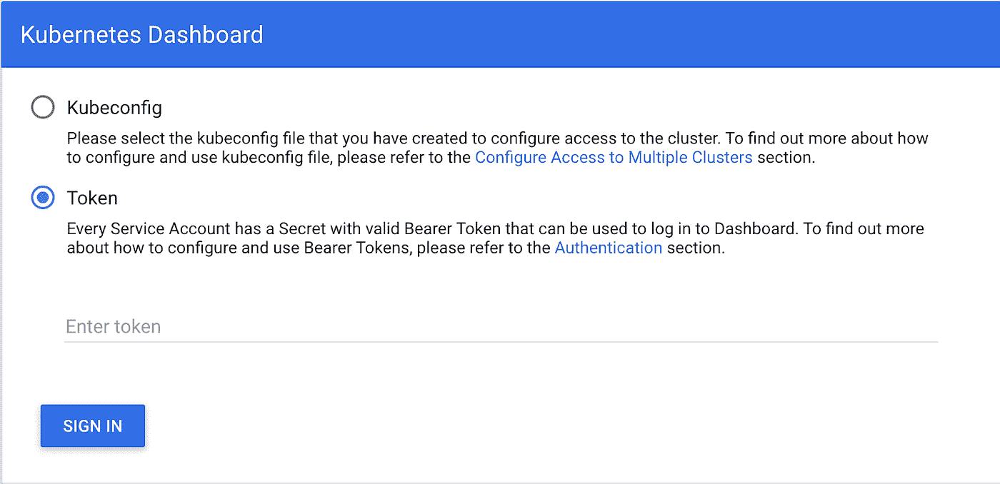
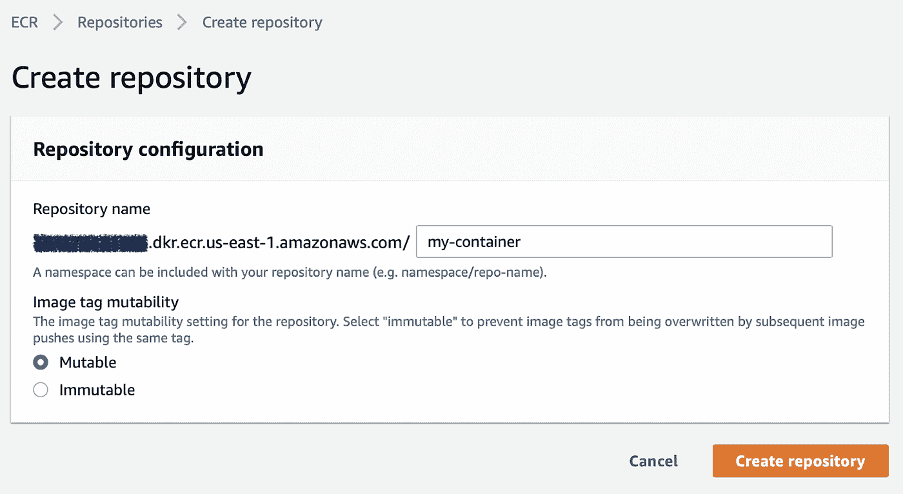
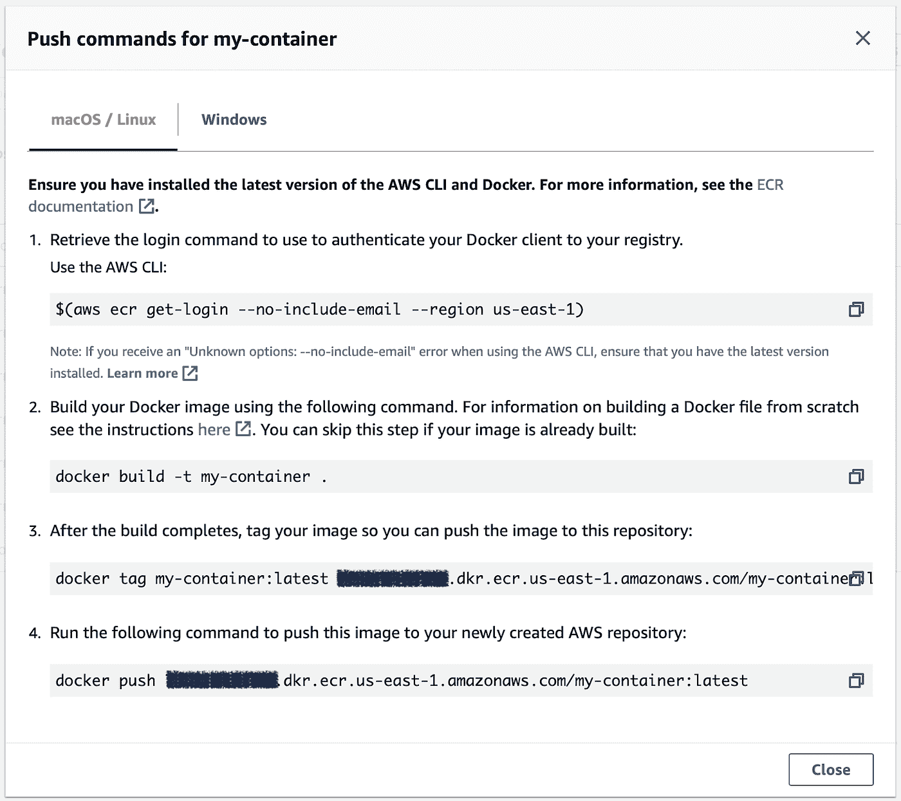
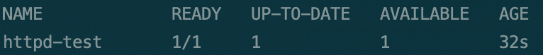
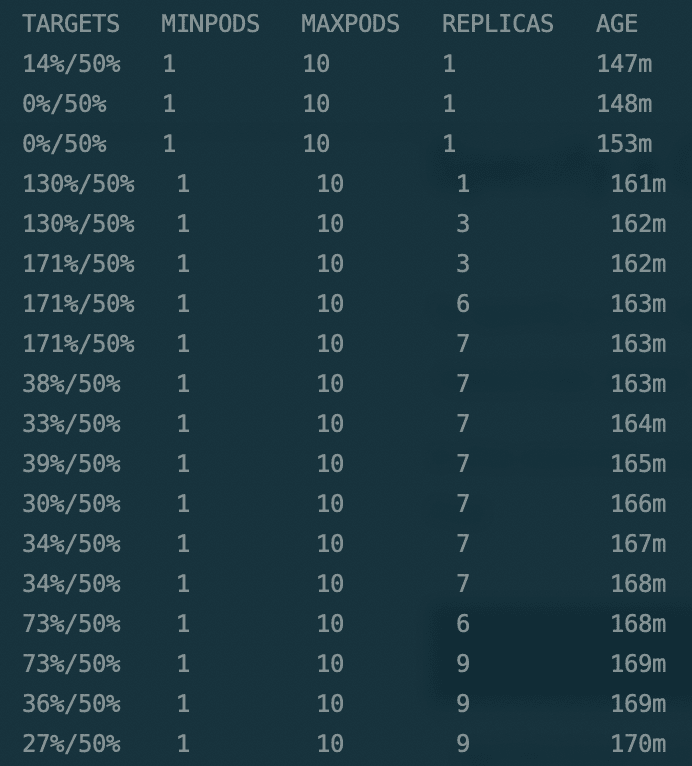
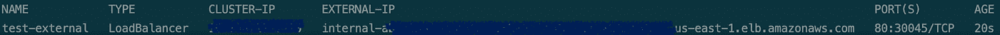

# 使用亚马逊 EKS 将您的 Docker 映像转变为自动扩展的 Kubernetes 部署

> 原文：<https://betterprogramming.pub/turn-your-own-docker-image-into-an-auto-scaling-kubernetes-deployment-using-amazon-eks-bd2ab8ef56cc>

## 让你的 k8 更上一层楼


托拜厄斯·菲舍尔在 [Unsplash](https://unsplash.com/s/photos/data?utm_source=unsplash&utm_medium=referral&utm_content=creditCopyText) 上的照片

# 目录

[**简介**](#016e)
[**要求**](#3307)
[**安装先决条件**](#604c)
[安装 eksctl](#824b)
[安装 kubectl](#3730)
[**设置 EKS 集群**](#1956)
[创建 EKS 集群](#a629)
[**设置 Kubernetes 环境**](#f24f)**[](#f24f)**
[创建 Docker 映像](#c4fc)
[将您的映像上传到 ECR](#e14b)
[使用上传的映像创建 Kubernetes 部署](#890b)
[测试部署](#e702)
[**自动缩放部署**](#ff9f)
[**公开端点**](#009e)

# 介绍

作为一个成长中的组织，我们必须管理越来越多的客户，每个客户都希望在完全隔离的云环境中运行，并且有自己独特的需求。最重要的是，我们有一个不断增长的产品测试环境，由多个组件、微服务和第三方集成组成。

在寻找处理所有这些需求的解决方案时，集装箱化是第一个想到的想法，Kubernetes 是管理它的自然选择。

使用 EKS 是您的云环境及其所有计算能力、存储和安全特性与您的基于 Kubernetes 的容器化环境及其微服务和自动伸缩能力之间的联系。

然而，从我的经验来看，让事情正常工作并按正确的顺序进行并不是微不足道的，我希望我能帮助让事情变得更清楚。

# 要求

本文假设您将 AWS 作为云提供商，并且您可以访问 EKS 和 ECR 管理控制台，以及 AWS CLI。

我试图对以前的知识做最少的假设，并尽我所能解释，但我确实假设对 Kubernetes 和 Docker 的概念有些熟悉。

# 安装先决条件

我们需要做的第一件事是安装两个命令行实用程序，我们将在本指南中使用它们: **eksctl** (管理您的 EKS 集群)和 **kubectl** (管理您的 Kubernetes 部署)。

## 安装 eksctl

eksctl 是用于创建和管理 EKS 集群的 CLI 工具。

要使用 Homebrew 在 Mac OSX 上安装它，请键入以下内容:

```
brew tap weaveworks/tap
brew install weaveworks/tap/eksctl
```

其他操作系统的详细信息和安装说明可以在这里找到:【https://eksctl.io/introduction/installation/ 

## 安装 kubectl

kubectl 是一个管理 Kubernetes 部署的 CLI 工具，不管您是否使用 EKS，所以很有可能您已经安装了它。

要使用 Homebrew 在 Mac OSX 上安装它，请键入以下内容:

```
brew install kubernetes-cli
```

其他操作系统的详细信息和安装说明可在此处找到:

[https://kubernetes.io/docs/tasks/tools/install-kubectl/](https://kubernetes.io/docs/tasks/tools/install-kubectl/)

# 设置 EKS 集群

一旦我们具备了所有的先决条件，我们就可以开始安装和配置我们的 EKS 集群了。

## 创建 EKS 集群

为了创建 EKS 集群，我们将使用 eksctl *create cluster* 命令。该命令可以按原样执行(在这种情况下，它将使用一组默认选项)，但是也可以使用命令行参数或配置文件来执行，以便定义集群区域、其大小、实例类型等等。

以下页面涵盖了所有可用的命令行参数:[https://github.com/weaveworks/eksctl/blob/master/README.md](https://github.com/weaveworks/eksctl/blob/master/README.md)

默认情况下，集群将在您的 AWS 部署中创建一个完全隔离的环境，包括它自己的 VPC、子网和网络配置。可以将群集配置为使用现有环境(现有的 VPC、子网等)。)使用命令行参数或配置文件。



以下代码片段是一个配置文件，可用于在现有 VPC 中设置 EKS 集群:

```
apiVersion: eksctl.io/v1alpha5
kind: ClusterConfigmetadata:
  name: my-test-eks
  region: us-east-1vpc:
  subnets:
    private:
      us-east-1a:
        id: “YOUR_SUBNET_1_ID” us-east-1b:
        id: “YOUR_SUBNET_2_ID”nodeGroups:
  - name: ng-1
    instanceType: m5.xlarge
    desiredCapacity: 3
    privateNetworking: true
```

为了使用配置文件创建新的群集，请运行以下命令:

```
eksctl create cluster -f FILE_NAME
```

你可以在这里找到额外的示例配置文件:[https://github.com/weaveworks/eksctl/tree/master/examples](https://github.com/weaveworks/eksctl/tree/master/examples)

# 设置 Kubernetes 环境

一旦我们启动并运行了 EKS 集群，我们需要安装几个组件来设置 Kubernetes 环境:仪表板、包管理器和度量服务器。

注意，作为 *create cluster* 命令的一部分，eksctl 将在默认路径(通常是`~/.kube/config`)或由`--kubeconfig`参数指定的路径中创建一个 Kubernetes 配置文件(包含 kubectl 连接到您的集群所需的信息)。

我们将假设您从现在开始使用这个默认配置，但是您可以在任何 kubectl 命令中添加`--kubeconfig`参数来指定不同的配置文件路径。

## 安装 Kubernetes 度量服务器

Kubernetes metrics 服务器收集集群和部署的资源使用信息。例如，这些资源包括 CPU 使用情况，这些资源可用于为您的部署定义自动扩展行为。

以下指南将指导您在 EKS 集群上安装 Kubernetes metrics server:

[https://docs . AWS . Amazon . com/eks/latest/user guide/metrics-server . html](https://docs.aws.amazon.com/eks/latest/userguide/metrics-server.html)

稍等片刻，然后通过运行以下命令确认您的 metrics server 安装:

```
kubectl get deployment metrics-server -n kube-system
```

确保在返回的状态行中看到 READY 1/1。



如果您没有看到 1/1，请检查 metrics 服务器日志以查看问题。

运行以下命令以查找您的 metrics server pod 的名称:

```
kubectl get --all-namespaces pods
```

获得度量服务器 pod 名称后，在以下命令中键入并运行:

```
kubectl logs metrics-server-xxxxxxxxx-yyyy -n kube-system
```

您将获得最新的度量服务器日志，并了解它不启动的原因。

EKS 上一个常见的度量服务器问题与 DNS 解析有关。默认情况下，度量服务器将尝试使用它们的 DNS 名称连接到您的节点。但是，您的 DNS 名称可能无法解析，例如，如果您使用内部 VPC。在这种情况下，您将在 metrics 服务器日志中看到与此类似的内容:



为了解决这个问题，我们需要更新 metrics server 部署配置，以便更喜欢使用 IP 地址而不是 DNS 连接到节点。

为此，转到您下载的 metrics server 文件夹，并导航到`deploy/1.8+/` 文件夹。编辑`metrics-server-deploymet.yaml`文件，并在最底部添加以下几行:

```
command:
- /metrics-server
- --kubelet-preferred-address-types=InternalIP\
- --kubelet-insecure-tls
```

文件的结尾应该是这样的:



然后，再次运行 *kubectl apply* 命令，用配置更改更新集群，然后再次检查部署状态:

```
kubectl apply -f metrics-server-x.x.x/deploy/1.8+/
kubectl get deployment metrics-server -n kube-system
```

## 安装 Kubernetes 仪表板

Kubernetes dashboard 是主要的 Kubernetes UI，它提供对节点、部署、服务等的详细信息和配置管理的访问。

以下指南将引导您在 EKS 集群中部署 Kubernetes 仪表板:

[https://docs . AWS . Amazon . com/eks/latest/user guide/dashboard-tutorial . html](https://docs.aws.amazon.com/eks/latest/userguide/dashboard-tutorial.html)

请注意，第一步是安装度量服务器(我们刚刚完成了)，因此您可以跳过它。

一旦完成，您应该能够使用 *kubectl proxy* 命令访问您的仪表板 UI。运行以下命令启动代理:

```
kubectl proxy
```

然后，在你的浏览器中打开以下网址:
[http://localhost:8001/API/v1/namespaces/kubernetes-dashboard/services/https:kubernetes-dashboard:/proxy/#！/登录](http://localhost:8001/api/v1/namespaces/kubernetes-dashboard/services/https:kubernetes-dashboard:/proxy/#!/login)。

您将看到以下登录屏幕:



选择令牌选项，并运行以下命令获取令牌:

```
kubectl -n kube-system describe secret $(kubectl -n kube-system get secret | grep eks-admin | awk ‘{print $1}’)
```

*kubectl describe secret* 命令用于显示存储在您的 Kubernetes 集群上的敏感信息。在这种情况下，我们希望显示 eks-admin 服务帐户的身份验证令牌，该帐户是在仪表板安装期间为仪表板访问而创建的。

从输出中复制令牌部分，将其粘贴到登录屏幕中，然后单击 SIGN IN。

## 安装舵组件管理器

Helm 是 Kubernetes 包管理器，可用于在您的 Kubernetes 集群上安装应用程序。

这对于我们的用例并不重要，因为我们将使用一个定制的 Docker 映像，而不是一个应用程序包。但是，它是一个常用的组件，在许多 Kubernetes 集群中都很有用。可以按照以下说明进行安装:

[https://docs.aws.amazon.com/eks/latest/userguide/helm.html](https://docs.aws.amazon.com/eks/latest/userguide/helm.html)

# 创建部署

既然我们的 EKS 集群已经具备了所有的先决条件，我们就可以创建我们的 Kubernetes 部署了，在我们的例子中是从 Docker 映像创建的。

你可以一直使用预建的 Docker 图像，比如来自 [Docker Hub](https://hub.docker.com/) 的官方图像。一个简单的例子是 [Apache HTTP 服务器](https://hub.docker.com/_/httpd)，它可以用简单的图像 URL httpd 进行全局寻址。

如果您想使用自己的图像，请遵循以下步骤。

## 创建 Docker 图像

假设您有一个 Docker 容器源，转到`Dockerfile` 所在的文件夹，运行以下命令创建一个映像:

```
docker build -t “YOUR_IMAGE_NAME”
```

完成后，运行以下命令查看您的映像:

```
docker images
```

如果您在输出中看到您的图像名称，就可以了。

## 将您的图像上传到 ECR

Amazon ECR 是一个私有的容器注册表，可以存储我们的 Docker 图像，并为它们提供一个 URL，以便在 Kubernetes 部署中使用。

首先，我们需要创建一个存储库来存储我们的图像。

打开 AWS 管理控制台，从服务菜单中选择 ECR。

单击*创建存储库*按钮，在下一个屏幕中为您的存储库键入一个名称，然后单击*创建存储库*。



一旦创建了您的存储库，我们需要了解如何将我们的映像添加到其中。

在存储库列表中选择您的存储库，并点击顶部菜单的*查看推送命令*按钮。您将获得一个将映像上传到存储库所需执行的步骤列表:



按照说明从 AWS CLI 应用程序登录 ECR，标记您的映像，并将标记的映像推送到存储库。请注意，我们已经执行了实际创建图像本身的第二步。

## 使用上传的映像创建 Kubernetes 部署

上传完成后，您的图像将出现在您的 AWS 环境中，并可在 EKS 使用。

您的图像 URL 将是您的 ECR 存储库 URL 和 Docker 标签的组合，应该是这样的:
`YOUR_AWS_ACCOUNT_ID.dkr.ecr.us-east-1.amazonaws.com/my-container:latest`

(这实际上是我们在上面的 *docker push* 命令中使用的确切 URL)。

一旦有了图像 URL，就可以通过运行以下命令来创建 Kubernetes 部署:

```
kubectl run YOUR_DEPLOYMENT_NAME --image=YOUR_IMAGE_URL --requests=cpu=500m --expose --port=YOUR_SERVICE_PORT
```

请注意，该命令有几个与部署服务相关的额外参数:

*   `*--*requests=cpu=500m` 参数说明了执行时您的部署单元需要多少个 CPU 单元。在这种情况下，每个 pod 请求使用 500 个毫 CPU(所以 0.5 个 CPU)。度量服务器稍后将使用它来自动缩放您的部署。
*   `--expose`参数声明部署应该对外部调用公开。
*   `--port`参数声明部署应该打开该端口，并期待通过该端口的请求。

命令完成后，您可以运行以下命令来获取部署列表:

```
kubectl get deployments
```

如果您在部署名称附近看到以下输出，这意味着它已成功部署:



## 测试部署

为了测试部署，您可以使用 *kubectl proxy* 命令来访问您的服务，而无需公开它。

运行以下命令启动代理:

```
kubectl proxy
```

然后，在浏览器中打开以下 URL:

[http://localhost:8001/API/v1/namespaces/default/services/YOUR _ DEPLOYMENT _ NAME:YOUR _ SERVICE _ PORT/proxy/](http://localhost:8001/api/v1/namespaces/default/services/YOUR_DEPLOYMENT_NAME:YOUR_SERVICE_PORT/proxy/)

# 自动扩展部署

既然我们已经启动并运行了部署，我们就可以将其配置为自动伸缩了。

在上一步中，我们将部署服务配置为每次调用请求 500 个毫 CPU。这意味着每个 pod 在执行时需要 500 毫个 CPU 核心(或 0.5 个 CPU 核心)。

该 CPU 使用信息由指标服务器收集，可由自动扩展功能用来确定何时需要扩展/缩减部署。

在您的终端中，运行以下命令:

```
kubectl autoscale deployment YOUR_DEPLOYMENT_NAME --cpu-percent=50 --min=1 --max=10
```

运行该命令后，您的部署将在 1 到 10 个 pod 之间自动扩展(根据度量服务器收集的数据)。

该命令规定，当当前部署单元的平均 CPU 使用率达到 50%时(每个单元需要 0.5 个 CPU 核心，因此 50%的平均 CPU 使用率将是 0.25 个 CPU 核心的平均使用率)，您的部署应该向上扩展到最多 10 个单元，当当前部署单元的平均 CPU 使用率低于 50%时，部署应该向下扩展(但是将始终至少有一个活动单元)。

为了测试自动缩放，请运行以下命令:

```
kubectl get hpa -w
```

一旦您向部署中添加了一些负载，您将会注意到部署会向上扩展，而一旦负载清除，您将会注意到它会向下扩展。



# 公开端点

我们的最后一步是公开我们的 Kubernetes 部署，这样它就有了一个外部端点，无需 kubectl 代理就可以访问。

请注意，外部端点将只在其配置的环境中公开服务，而不会在已经为您的环境配置的访问点之上创建任何外部访问点。如果您的节点在 VPC 内部运行，并且不接受来自互联网的传入流量，则只能在 VPC 内部访问外部端点。

在您的终端中，运行以下命令:

```
kubectl expose deployment YOUR_DEPLOYMENT_NAME --type=LoadBalancer --name=YOUR_EXTERNAL_ENDPOINT_NAME
```

稍等片刻，然后运行以下命令来检查公开的端点服务状态:

```
kubectl get services YOUR_EXTERNAL_ENDPOINT_NAME
```



检查 EXTERNAL-IP 列，并确保它显示服务外部端点的 DNS 名称或 IP 地址。

如果您看到另一种状态，如*<>*，请运行以下命令，以获取有关您的服务的详细信息并解决问题:

```
kubectl describe services YOUR_EXTERNAL_ENDPOINT_NAME
```

检查此输出末尾的事件日志，以解决问题。

您可能面临的最常见问题是，如果您的所有节点都位于 VPC 内部的专用子网中，您将在服务事件日志中看到以下错误消息:

```
Error creating load balancer (will retry): failed to ensure load balancer for service YOUR_EXTERNAL_ENDPOINT_NAME: could not find any suitable subnets for creating the ELB
```

要解决该问题，请运行以下命令:

```
kubectl annotate services YOUR_EXTERNAL_ENDPOINT_NAME service.beta.kubernetes.io/aws-load-balancer-internal=”0.0.0.0/0"
```

您将得到一个带有*服务注释的*响应，如果您稍等片刻并再次检查您公开的端点服务的状态，您将注意到它已经被分配了一个用于外部访问的 DNS 名称。

尝试通过您暴露端口访问 DNS，您应该看到您的服务响应。

# 摘要

管理一个集装箱化的环境，尤其是在考虑安全性和资源的有效利用时，可能是一项不可能完成的任务。使用 Kubernetes 可以帮助实现这一任务，使用由云提供商管理的 Kubernetes 环境可以使与所有云提供商服务的集成更加容易。

这篇文章介绍了如何建立这样一个由亚马逊 EKS 管理的环境，并创建一个基于定制 Docker 映像的自动扩展部署。

这个基本用例展示了这种环境的功能。我相信这是创建完全托管的基于云的容器化环境的伟大的第一步，与基于机器和服务的标准部署的环境相比，这种环境将更加强大且更易于维护。

要了解更多关于 EKS 及其功能的信息，请访问 https://docs.aws.amazon.com/eks/index.html 的 EKS AWS 文档[。](https://docs.aws.amazon.com/eks/index.html)

你还应该参考亚马逊提供的这个 EKS 在线研讨会，它也可以帮助你入门，并向你介绍 https://eksworkshop.com/的所有 EKS 功能。