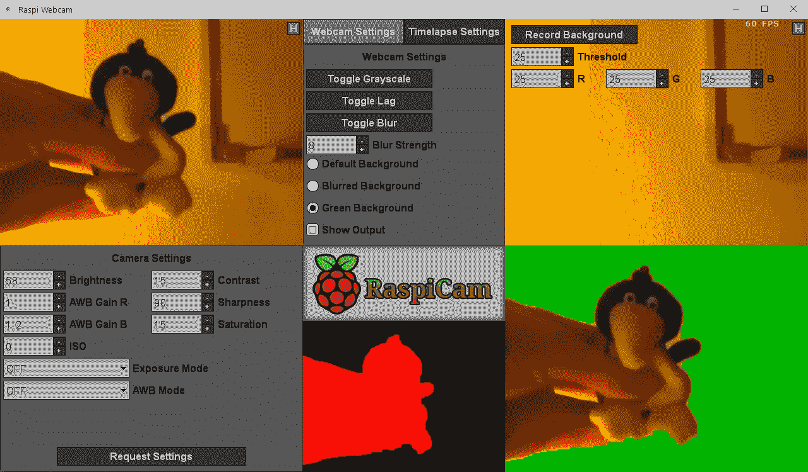
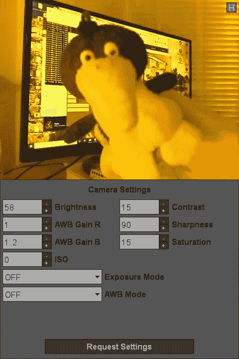
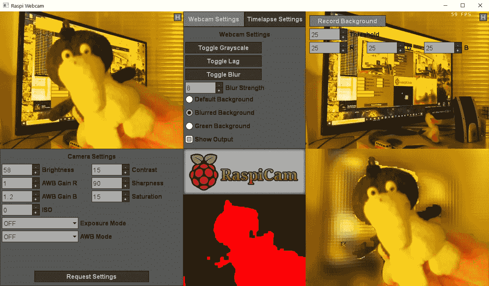
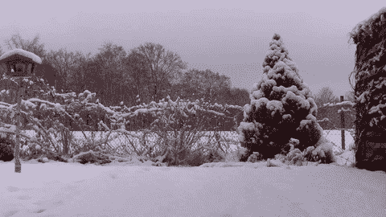

# 将树莓派变成可控制的网络摄像头，并去除背景

> 原文：<https://betterprogramming.pub/turning-a-raspberry-pi-into-a-controllable-webcam-with-background-removal-54e06a194d6a>

## 带有摄像头模块的 Raspberry Pi、Python MJPG 流服务器和用于预览和控制网络摄像头的 OpenGL/C++客户端

我的 Raspberry Pi 网络摄像头项目的客户端窗口，具有可调设置和背景移除功能。图片由作者提供。

自疫情开始以来，视频会议已经成为我们许多人的日常习惯，网络摄像头的销量因此增长了 309% 。然而，您不必总是为视频通话购买新的网络摄像头。有时候，一个随机的 Raspberry Pi 相机模块也可以做到这一点。

你可以在几分钟内使用免费且容易获得的软件[将树莓皮变成网络摄像头](https://medium.com/geekculture/how-to-turn-your-raspberry-pi-into-a-webcam-a8bf775edfb6)。它在大多数情况下都工作得很好，但是我不喜欢缺乏控制和缺少功能。因此，我创建了自己的软件来控制摄像头模块，通过网络传输视频，预览视频，去除背景，最终将其变成虚拟网络摄像头。

# 视频流

第一个挑战是将 Raspberry Pi 摄像头的视频信号传输到我的台式电脑上。在之前的项目中，比如我的[“智能”监控摄像机](https://pingpoli.de/raspberry-pi-camera)，我就使用了 [mjpg-streamer](https://github.com/jacksonliam/mjpg-streamer) 来做这个。然而，当使用 mjpg-streamer 时，在程序运行时没有办法改变相机的设置。这使 mjpg-streamer 软件失去了资格，但 [MJPG 协议](https://en.wikipedia.org/wiki/Motion_JPEG)仍然是通过局域网传输视频信号的一个好选择。MJPG 是一种简单的基于 HTTP 的协议，其中视频帧作为由边界和小报头分隔的独立 JPG 图像发送。

与 Raspberry Pi 相机接口的最佳库是 Python 中的 [picamera](https://picamera.readthedocs.io/en/release-1.13/) 模块。所以尽管我不是 Python 开发者，也不太喜欢 Python，我还是用它实现了一个 MJPG 流服务器。幸运的是，大多数套接字函数与其他语言的函数非常相似，所以让它工作起来并不太困难。使用 MJPG 作为协议有一个很大的优势:来自 Python 程序的流仍然可以用其他兼容程序查看，比如 VLC 媒体播放器。

Python 中的 mjpg 流循环。它从摄像机获取一帧，并将帧头及其数据写入套接字。下面是完整的源代码。

# 视频显示器

有了一个工作的 MJPG 流服务器，是时候实现一个客户端来查看和控制流了。在之前的项目中，我已经用 C++编写了一个 MJPG 客户端，所以我可以在这个项目中再次使用它。

对于用户界面，我正在使用我的 OpenGL/C++游戏引擎的菜单库。还有其他的方法也可以，但是我最喜欢自己的代码，我知道它是如何工作的，所以这是我创建 UI 最快的方法。

当客户端接收到一个新的帧时，它会执行一些图像处理步骤，然后更新一个 OpenGL 纹理。使用 OpenGL 显示视频还有一个额外的好处，那就是可以使用显卡来实现一些后期处理效果。

# 相机设置

我想创建自己的网络摄像头软件的主要原因之一是能够在摄像头运行时改变其设置，这在 mjpg-streamer 解决方案中是不可能的。

使用 picamera 模块，可以随时更改相机设置。然而，我不确定通过 MJPG 流连接发送其他消息是否是个好主意。因为它是多线程的，我需要添加关键部分和安全措施来避免在视频帧中间随机设置数据包。因此，我最终创建了第二个套接字连接来处理所有设置控制消息和其他各种通信，而不会阻塞视频流。

因为我想使用普通的 C++网络消息，所以我也必须用 Python 实现它们，这比我想象的要复杂，因为 Python 和 C++在数据类型的大小和对齐上不一定一致。

最后，设置控件变得非常好。在客户端窗口中，有一个来自相机的 raw 流的预览，它下面是设置的控制。当您更改一个选项时，会向服务器发送一条消息，将该消息应用到相机模块，预览流会自动即时显示更改。这样，就可以很容易很快地根据自己的喜好调整设置。

来自摄像机的原始视频流及其下方的设置控制。图片由作者提供。

# 虚拟网络摄像头

此时，Raspberry Pi 的视频流正在流向我的 OpenGL 查看器。然而，像 Zoom 或 Teams 这样的视频会议程序还不会将其识别为网络摄像头。幸运的是，使用 [OBS(开放广播软件)](https://obsproject.com/) [VirtualCam](https://obsproject.com/forum/resources/obs-virtualcam.539/) 插件，很容易将任何东西变成虚拟网络摄像头。使用它，您可以创建一个新的窗口捕获，并将其限制为只捕获窗口的输出区域。一旦打开 VirtualCam 插件，其他程序会将 OBS 输出识别为常规网络摄像头。

# 背景去除

背景去除是我想创建自己的网络摄像头解决方案的另一个原因。你可能知道，许多视频会议工具都有一个去除背景的选项，通常效果很好。然而，我更喜欢使用大多数工具的浏览器版本。不幸的是，他们没有这个选择。此外，我很好奇是否可以从头开始实现我自己的背景去除算法。

使用实时视频和图像处理很困难。信号很嘈杂，受光线变化的影响，计算机很难区分图像的哪一部分是人，哪一部分是背景。我的主要想法是闪出画面几秒钟，在此期间只记录背景，并保存一张普通的背景图像。然后，我可以移回到帧中，计算当前图像和背景图像之间的差异。

那个天真的想法有点效果，但并不太好。结果非常嘈杂，我身上的许多斑点被移除，而背景中的一些区域没有被移除。然而，它们中的大多数都很小，所以我想知道是否有可能用图像处理来清理它们。我依稀记得在大学图像处理课上学到的一些东西，随着更多的研究，我发现了看起来很有前途的[形态滤波器](https://scikit-image.org/docs/dev/auto_examples/applications/plot_morphology.html)。

形态学滤波器可以用来去除图像中的小伪像。它们适用于灰度图像，但对二进制图像更有用。二进制图像是只有两种颜色(黑白)的图像，幸运的是，这正是我在这里需要的:前景是白色，背景是黑色的遮罩。我在我的图像库中添加了一个新的二进制图像类，并实现了变形过滤器。通过结合一个开始和一个结束过滤器，结果看起来更好。

我也尝试了其他方法，但带有变形滤镜的图像似乎产生了迄今为止最好的结果。然而，我的背景去除算法远非完美。在某些情况下，它工作得很好，但它仍然受到光线变化或碰撞网络摄像头或桌子的影响，因此背景图像和框架不再对齐。小的照明变化不是问题，因为我可以改变阈值或相机设置来解决它们，但是大的和突然的变化(例如，太阳在乌云后面移动)至少会部分破坏背景去除。还有很多需要改进的地方，我已经有了一些想法，我会在未来尝试。

背景模糊的背景去除算法实例。它并不完美，但在良好的条件下是可以接受的。图片由作者提供。

# 模糊背景

使用 OpenGL 进行视频显示的优势之一是能够使用着色器来实现一些处理效果。不是把背景换成纯色，而是模糊的时候看起来好很多。高斯模糊可以在着色器中有效地实现。这样，图形卡可以完成一些工作，我们不会浪费其他图像处理任务所需的宝贵的 CPU 时间。

## 其他着色器效果

除了模糊图像，着色器还可以用于其他后期处理效果。目前，作为概念验证，我只有一个将图像转换为灰度的选项，但我计划添加其他颜色校正功能来进一步调整输出。因为我的[相机模块没有红外滤镜](https://www.raspberrypi.org/products/pi-noir-camera-v2/)，所以有些颜色看起来不真实，我也许可以在帖子中纠正一些。

# 延时模式

我喜欢用我的树莓皮相机来记录时间流逝。与其他靠电池运行且只能拍摄两小时延时的相机不同，插入式 Raspberry Pi 可以记录更长时间。所以当我在做这个项目的时候，我决定也加入一个延时模式。

以前拍摄延时照片时，我将相机的大部分设置为自动，这不是最佳设置。当光线变化时，自动曝光模式会改变图像的亮度，产生的延时视频会闪烁。通过新程序中的实时预览和设置控件，我可以微调设置，并将曝光模式设置为关闭，这样可以产生更平滑的结果。

实现延时模式最棘手的部分是断开和重新连接实时预览。相机模块可以拍摄高帧率和低质量的视频帧或高质量的图像。因此，当开始延时拍摄时，我必须关闭 MJPG 流媒体服务器，并为延时拍摄启动新的图像捕捉循环。停止计时后，将启动一个新的流媒体服务器，客户端可以重新连接到该服务器，以便再次预览。

用我的树莓派拍摄的一个非常短的延时例子。图片由作者提供。

# 结论

在 Raspberry Pi 网络摄像头程序上工作非常有趣，我学到了很多东西。这绝对是普通网络摄像头的有效替代品。能够独立于其他程序移除背景是一个非常好的好处，所以我可以使用基于浏览器的视频会议工具，并且仍然可以从模糊的背景中获得额外的隐私。如果我感到非常偏执，我可以在自己的程序上使用其他程序的模糊背景功能，以进行双重保护。

# 资源

*   Python 代码: [main.py](https://gist.github.com/pingpoli/0ee3ef912cdf78085b16c75b702e64e0) ， [RaspiCamServer.py](https://gist.github.com/pingpoli/185870b652b59a59f71536f16be3f097) ， [RaspiCam.py](https://gist.github.com/pingpoli/d1a76cd4ad4666a8108b5b09e92d3aa9)
*   [Picamera Python 模块](https://picamera.readthedocs.io/en/release-1.13/)
*   [mjpg-流光](https://github.com/jacksonliam/mjpg-streamer)