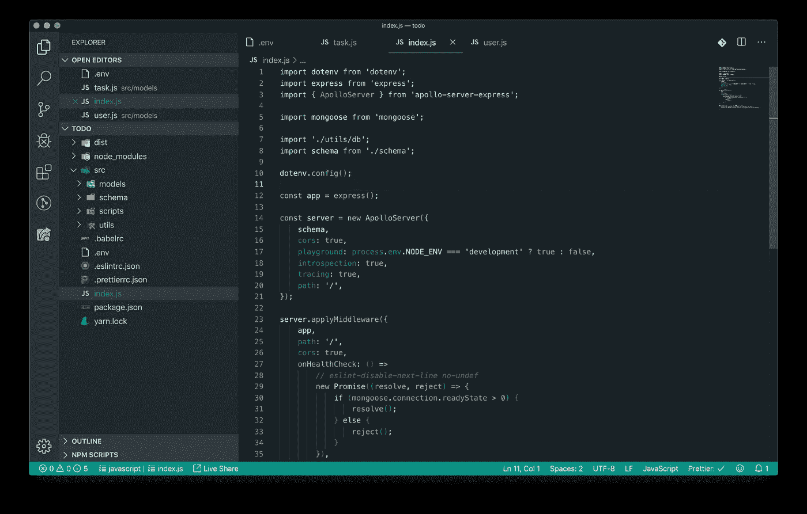
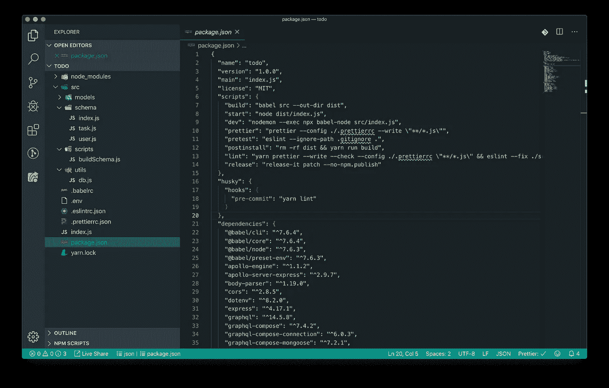
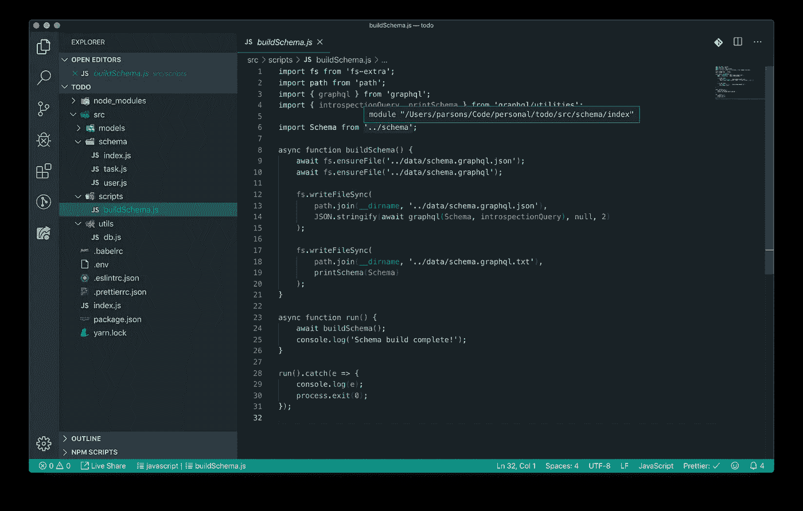
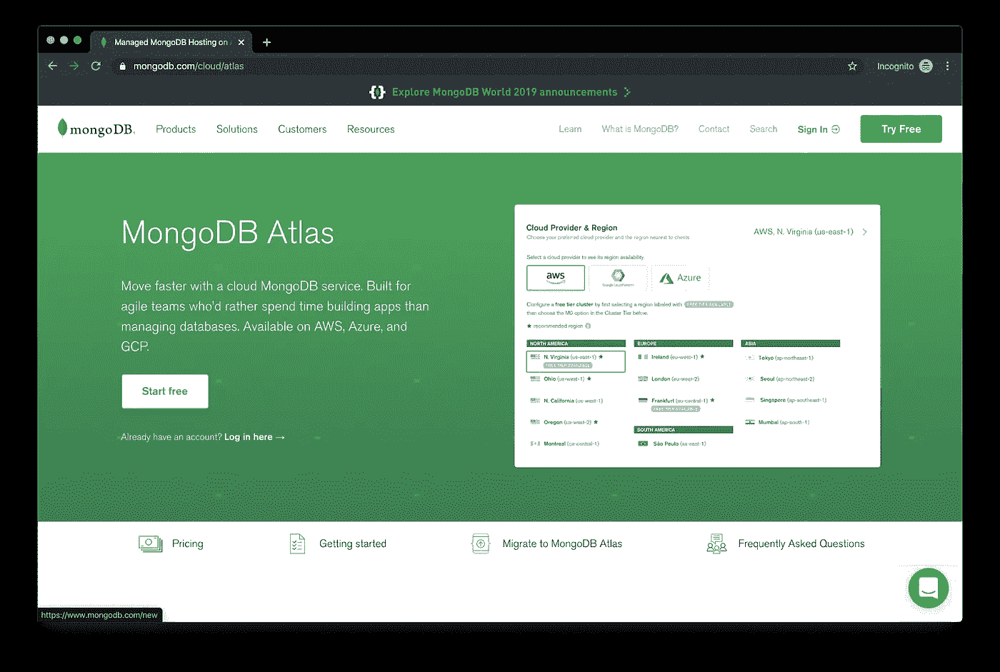
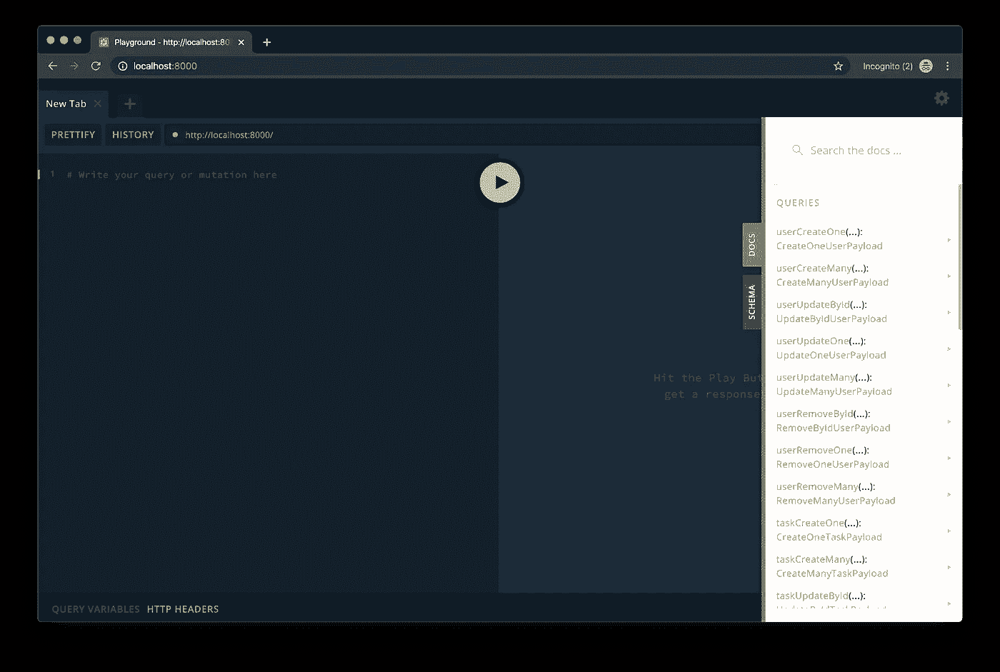

# 用 Node.js、Mongoose 和 Express 创建一个 GraphQL API

> 原文：<https://betterprogramming.pub/tutorial-create-a-graphql-api-with-node-mongoose-and-express-67d0b29f9634>

## 开始使用 GraphQL，并构建您的第一个 API。

[Franki Chamaki](https://unsplash.com/@franki) 在 [Unsplash](https://unsplash.com/photos/1K6IQsQbizI) 上拍摄的照片

GraphQL 是一种帮助开发人员更快构建健壮软件的技术。在一个请求中请求您需要的所有信息的能力是游戏规则的改变者。

它简化了通常依赖 RESTful APIs 的移动和 web 应用程序使用的 API 的后端开发。一个普通的 RESTful API 对于不同的实体(例如用户、提交等)可能有几个端点。);有了 GraphQL，您可以使用 GraphQL 的查询语言(也称为 GQL)一次性获得所有这些信息。

在本教程中，我将带你了解如何用[graph QL-compose-mongose](https://github.com/graphql-compose/graphql-compose-mongoose)以及其他一些工具构建一个 GraphQL API。当然，使用 Node.js，一切都将符合 ES6 规范。

# 入门指南

开始之前，我们需要仔细检查您是否具备一些先决条件，以确保您理解该技术，并且能够完整地完成本教程。

## 先决条件

*   Node.js(最新 13.x 或以上版本)
*   纱线(macOS 上的`brew install yarn`)
*   理解 JavaScript 和 ES6 规范
*   运行 MongoDB Atlas 或 MongoDB 本地实例的帐户

# 目录结构

首先，创建一个新目录。

您可以随意命名您的目录；对于本教程，我们将创建一个待办事项应用程序，所以我将我的应用程序命名为`todo`。

接下来，让我们继续使用 Yarn 生成我们的`package.json`文件。随着我们继续前进，我们将根据需要添加模块。

**注**:根据提示回答问题。这里没有什么是必须的——只是你想设置为默认值的东西。

因为我们使用的是 ES6，所以我们需要将所有代码从 ES6 转换成普通的 JavaScript。为此，让我们继续创建一个`src`目录。注意，我们还需要在`src`中建立所需的结构。下面的脚本将完成以下任务:

*   制作一个`src`目录
*   进入`src`目录
*   生成`schema`、`models`、`scripts`和`utils`目录

最后，我们将创建一个`index.js`文件，这将允许我们导入相关的文件和目录:

在`index.js`中，放置以下内容，并保存:

# 包文件

现在我们已经有了基础文件，让我们继续使用 Yarn 将所需的生产包添加到我们的`package.json`文件中，就像这样:

对于开发包，添加以下内容:

现在我们已经安装了必要的包，我们可以修改我们的`package.json`文件以允许更多的功能。

我们来修改一下，增加脚本和钩子；一旦我们完成了，你的`package.json`文件应该看起来像这样:

# 剧本

下面将允许我们通过 Yarn 运行脚本(例如`yarn <INSERT SCRIPT HERE>`)。例如，我们可以使用`yarn lint`lint 我们的代码，它将对我们的文件执行 ESLint 和更漂亮的操作。

与上面类似，我们将添加一个 Husky 脚本，它将在预提交事件时触发，在提交代码之前为我们有效地运行`yarn lint`。

这是保持高质量、干净代码的一个很好的实践:

剧本到此为止。让我们继续。

# 配置 Babel、Prettier 和 ESLint

我们已经采取了必要的步骤来安装正确的软件包。

现在，是时候将配置文件添加到项目的根目录中了。移动根目录，并添加以下文件:

## **。babelrc**

## **prettierrc.json**

## **.eslintrc.json**

完美！我们正在取得进展。

进入下一部分。

# 创建我们的模型

我喜欢使用 graphql-compose-mongose 的原因是，它允许我使用 mongose 模型，而不是手动编写 graph QL 模型(顺便说一下，这在大型应用程序中会变得非常麻烦)。

转到`src/models`，创建一个名为`user.js`的新文件。在这个文件中，我们将定义构成用户的所有必需特征。这将是一个小文件，但是如果您愿意，可以随意向用户记录添加额外的信息(例如，使用[mongose-bcrypt](https://www.npmjs.com/package/mongoose-bcrypt)的密码)。

接下来，让我们创建一个`task.js`文件(毕竟这是一个待办事项 GraphQL API):

我们现在有两个模型/模式:`UserSchema`和`TaskSchema`。

用户是一个独立的实体，任务总是属于一个用户。由此，我们最终将能够在一次 GraphQL 调用中为用户提取所有任务。很酷，对吧？

# 创建我们的模式

模式是这个实现中有趣的一部分。本质上，它们允许我们定义哪些调用*可以*和*不可以*给服务器。

模式由查询和变异组成，其中查询允许您获取数据，而变异允许您修改数据。让我们为用户和任务模型创建模式。

在`schema`目录中，创建一个名为`user.js`的文件。然后，将以下内容放入文件中:

接下来，让我们创建一个叫做`task.js`的:

为了将事情联系在一起，我们将在目录(`src/schema`)的根目录下生成一个`index.js`文件，并导入我们的模式:

现在我们已经拥有了 GraphQL 的全部 CRUD 功能，让我们添加最后的实用程序。

# 构建脚本

构建脚本允许您将 Mongoose 风格的模式转换成纯 GraphQL 模式。很别致，是吧？

在`src/scripts`中创建一个名为`buildSchema.js`的文件，并放入以下代码:

这个文件将用`yarn build`命令调用，并将原始的 GraphQL 查询输出到`data`目录中。

# 数据库连接

没有数据库的 API 是什么？这就是为什么我们需要创建一个从 Mongoose 到 MongoDB 的连接。

如果您还没有在根目录下创建一个`.env`文件，现在是时候这样做了。您需要确保它具有以下环境变量:

一旦您的`.env`文件就位，让我们继续在`src/utils`中创建另一个文件。将文件命名为`db.js`，并添加以下内容:

**注意**:如果您没有在本地运行 MongoDB，MongoDB Atlas 是一个很好的选择。它不仅是免费的，而且它在免费层上提供了足够的能力来运行开发应用程序，不会出现任何问题。在这里看看吧。

# 操场

您的 GraphQL 现在已经完成。运行命令`yarn dev`，您将能够加速 GraphQL 的运行，它允许您添加、修改、删除和查询用户和任务——所有这些都在一个调用中完成。

它看起来有点像这样:

# 结论

这个快速而简单的教程只是使用 GraphQL 使您的开发更强大、更干净和更高效的所有乐趣的开始。

尝试在您刚刚构建的基础上进行扩展，为模型添加额外的功能，或者自己尝试改进一个现有的应用程序，甚至开发一个新的应用程序；我很想知道更多关于你决定要做的事情。

在此之前，感谢您跟随我阅读本教程，并关注未来的更新。编码快乐！