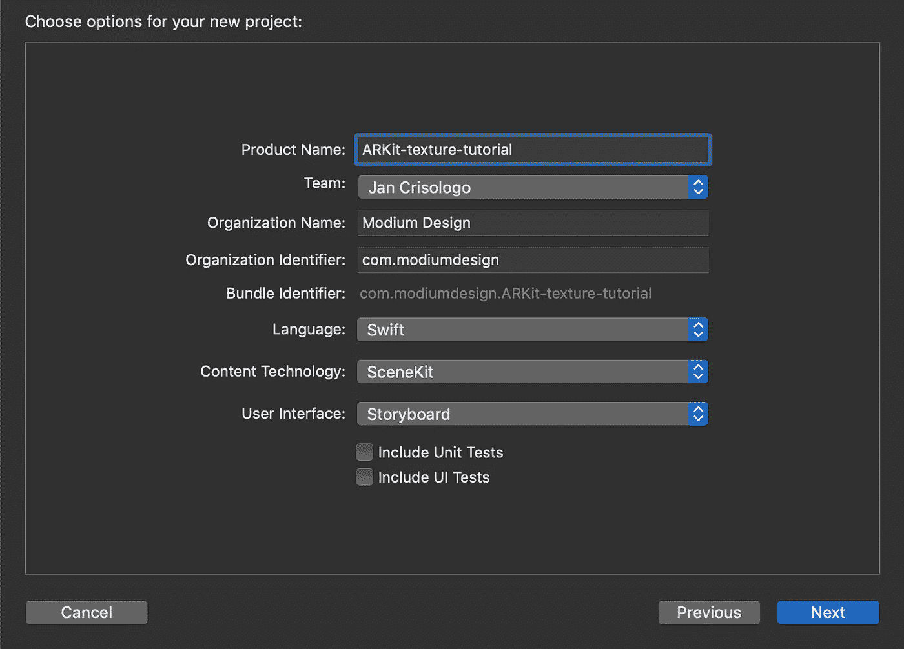
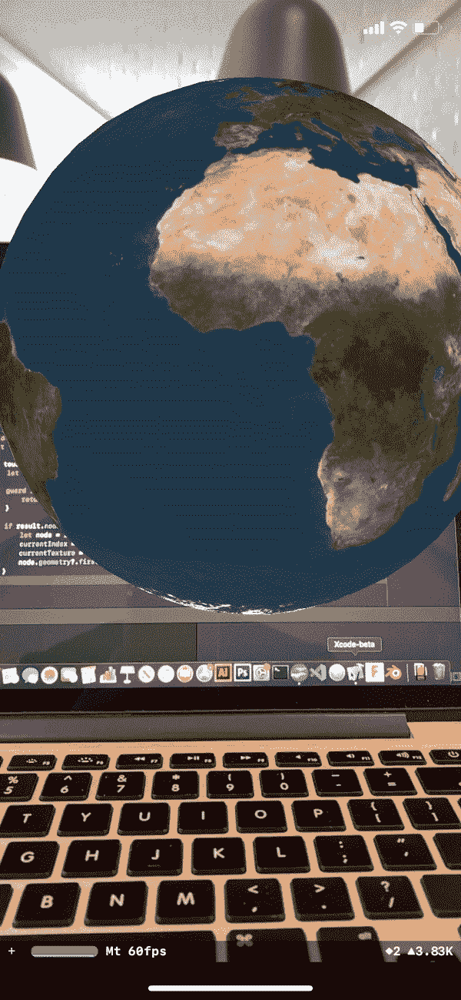

# 如何用触摸手势改变 ARKit 中节点的纹理

> 原文：<https://betterprogramming.pub/tutorial-how-to-change-textures-on-a-node-in-arkit-with-touch-gestures-72dba54aa6b1>

## 给你的新现实一个新的面貌


由[paweczerwi324ski](https://unsplash.com/@pawel_czerwinski?utm_source=medium&utm_medium=referral)在 [Unsplash](https://unsplash.com?utm_source=medium&utm_medium=referral) 拍摄的照片

您会问自己，为什么要更改节点上的纹理(节点是 SceneKit 场景中的任何对象)？

有多种原因。最简单的是你想要一个你已经与一个节点交互的指示。也许你有一个 AR 游戏，你想给玩家反馈游戏状态的变化。也许静态纹理时不时会变得很无聊。

不管是什么原因，我在这里提供一个简单的教程，介绍如何通过触摸手势改变正在运行的 ARKit 应用程序上的纹理。

# 入门指南

首先创建一个新项目。与其从头开始实现`ARSCNView`和样板文件，不如选择增强现实应用作为模板，并确保 SceneKit 是所选的内容技术。



在您开始任何代码之前，我们需要为我们的项目添加一些图像。对于这个特定的应用程序，我选择了一个太阳系主题，并收集了地球、月亮和太阳的纹理。

没错——我们将使用我们的应用程序创建行星体。确保分别命名为`earth`、`moon`和`sun`，并将它们直接放入`Assets.xcassets`文件夹。

在`ViewController.swift`中，通过在`viewDidLoad()`方法上方声明以下变量开始:

```
let textures = ["earth", "moon", "sun"]
var currentIndex = 0
var currentTexture = ""
```

确保纹理数组中的字符串与资源文件夹中的纹理具有完全相同的名称。在`viewDidLoad()`方法中，将`SCNScene(named: “art.scnassets/ship.scn”)!`替换为`SCNScene()`。在该行下面，使用`currentTexture = textures[currentIndex]`用`textures`中的第一个项目初始化`currentTexture`。

在`viewWillDisappear()`方法之后，创建以下函数:

```
func createSphere() -> SCNNode {
  let sphere = SCNSphere(radius: 1)     
  sphere.firstMaterial?.diffuse.contents = UIImage(named:    
  currentTexture)
  let sphereNode = SCNNode(geometry: sphere)
  sphereNode.name = "sphere"
  sphereNode.position = SCNVector3(0, 0, -3)
  return sphereNode
}
```

不用说，这个函数在我们的 3D 空间中创建了一个球体。我们给球体一个`1`米的`radius`(根据 ARKit 的默认测量单位)并赋予它`currentTexture`的纹理，应该是`earth`。

然后我们创建一个`SCNNode()`并指定它的球体的几何形状——同时给它命名为`sphere`,这在我们改变纹理时很重要。当应用程序启动并返回`sphereNode`时，我们将它放在离摄像机三米远的地方。

在`viewDidLoad()`中，在我们指定`currentTexture`的地方添加以下内容:

```
sceneView.scene.rootNode.addChildNode(createSphere())
```

在你的手机上测试这个应用程序，如果一切顺利，你应该会在你的眼前看到一个增强现实地球。

# 强硬的姿态

现在我们开始用触摸手势改变纹理。在`createSphere()`方法下面，实现`touchesBegan(_:with:)` *。*请注意，还有其他实现触摸手势的方法，这只是其中一种。在`touchesBegan`中添加以下代码:

```
let touch = touches.first!if touch.view == self.sceneView {
  let viewTouchLocation:CGPoint = touch.location(in: sceneView)

  guard let result = sceneView.hitTest(viewTouchLocation, options: nil).first else {
    return
  } if result.node.name == "sphere" {
    let node = result.node
    currentIndex = currentIndex == 0 ? 1 : currentIndex == 1 ? 2 : 0
    currentTexture = textures[currentIndex]
    node.geometry?.firstMaterial?.diffuse.contents = currentTexture
  }
}
```

让我们检查一下这个代码块。

首先，我们第一次检测到触摸。

然后，我们要确保触摸在`sceneView`内(如果你一直跟着做，默认情况下`sceneView`应该覆盖你手机的整个屏幕，因为它自动在每一边都有零边距)。

然后，我们得到触摸点相对于屏幕的`CGPoint`坐标。

接下来，我们确保通过将`sceneView`的`hitTest`分配给`result`来触发它；否则，我们`return`。

此时，代码可以自由地检查我们是否接触了节点。如果我们触摸的节点的名称是`sphere`(我们之前用过)，那么我们需要改变球体的纹理。因为我只有三个纹理，所以我使用一个三元运算符从 0 ➡ 1 ➡ 2 开始循环`currentIndex`，然后回到 0。然后我重新分配了`currentTexture`。最后，我给我们的节点设计了一个新的材质。

咻！运行您的代码，当您触摸球体时，应该会得到以下结果:



结果呢

仅此而已！我希望这能给你一个在 ARKit 中改变纹理的起点。在这里你可以随意查看完整的源代码[。](https://github.com/modium/ARKit-texture-tutorial)

这是我用同样的工作流程创建的