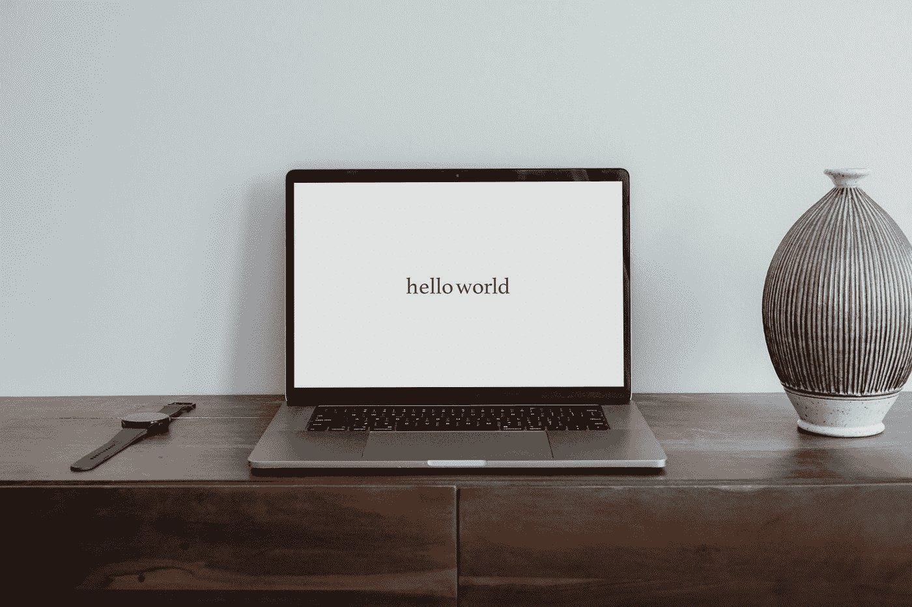
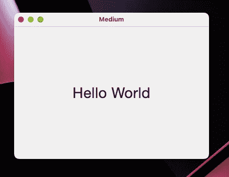

# 如何让 Jetpack 编写桌面应用程序

> 原文：<https://betterprogramming.pub/tutorial-jetpack-compose-how-to-create-a-desktop-app-6e6e9392ac90>

## Jetpack 撰写

## 实践教程



由[粘土堤](https://unsplash.com/@claybanks?utm_source=medium&utm_medium=referral)在 [Unsplash](https://unsplash.com?utm_source=medium&utm_medium=referral) 上拍摄

在本教程中，您将学习在 Kotlin 中使用 Jetpack Compose for Desktop 创建桌面 HelloWorld 应用程序的最低要求。

*   **级别:**适合初学者在为桌面排版
*   **需求:** Java 安装
*   **最终样品:** [github](https://github.com/Mercandj/jetpack-compose-desktop-hello-world) 。
*   **最终界面**:



# 1.设置项目

首先，为了建立这个项目，你需要一个 Gradle 项目框架，它有一个根`build.gradle`、`settings.gradle`和`app/build.gradle`。
让我们使用`kts`文件只使用一种语言:科特林❤️

`**build.gradle.kts**` 用下面的代码在项目的根位置创建`build.gradle.kts`，用 compose maven 定义`gradle`项目。

`**settings.gradle.kts**` 在项目根添加`settings.gradle.kts`来定义项目和`gradle`模块`app`的名称。

```
*rootProject*.*buildFileName* = "build.gradle.kts"
*rootProject*.*name* = "medium-proto"
include(":app")
```

`**app/build.gradle.kts**`
添加到`app/build.gradle.kts`的插件进行撰写:

```
plugins **{** *kotlin*("jvm")
 *//* [*https://github.com/JetBrains/compose-jb/releases*](https://github.com/JetBrains/compose-jb/releases)
    id("org.jetbrains.compose") *version* "1.2.0-alpha01-dev686"
**}**
```

然后添加依赖项:

```
dependencies **{** *implementation*(*compose*.desktop.currentOs)
**}**
```

最后，定义应用程序入口点:

```
*compose*.*desktop*.application.mainClass = "com.medium.MainKt"
```

## **最后的润色**

然后，为了编译应用程序，在项目的根目录下添加一个`gradlew`文件和`gradle`文件夹。[下面是](https://docs.gradle.org/current/userguide/gradle_wrapper.html#sec:adding_wrapper)获取文件的方法。在 MacOS 上，您可以在您的根项目上使用这个命令:`brew install gradle && gradle wrapper`。

# 2.创建主视图

创建一个 kotlin 文件`app/src/main/kotlin/com/medium/Main.kt`,包含

该文件包含应用程序定义，其窗口包含

*   `onCloseRequest`:点击窗口关闭按钮时关闭应用的行为
*   `state`:以 dp 为单位的窗口大小，公制度量。
*   `title`:窗口顶栏的标题。

在 Window 方法的 lambda 中，你可以编写类似 Android 应用程序的 JetPack Compose 代码。此处添加了最大宽度和最大高度中的`Box`,以使文本在窗口中居中。`Box`是一个允许`Text`进行`Center`对齐的容器。

# 3.构建并启动应用程序

通过命令`chmod 755 ./gradlew` 获得运行脚本的许可，然后运行`./gradlew run`和 tada:


感谢 JetBrains 团队和 JetPack Compose 以及 [JetPack Compose Desktop](https://github.com/JetBrains/compose-jb) 的贡献者。

## **更进一步**

*   如何创建 MacOS 安装文件 pkg 以避免使用 jar:使用 [jpackage](https://docs.oracle.com/en/java/javase/14/docs/specs/man/jpackage.html)
*   如何在本项目中添加一个 app 图标:cf samples
*   如何发布一个本地应用来避免 jvm: cf [这个相同的存储库](https://github.com/JetBrains/compose-jb/blob/master/tutorials/Native_distributions_and_local_execution/README.md) y