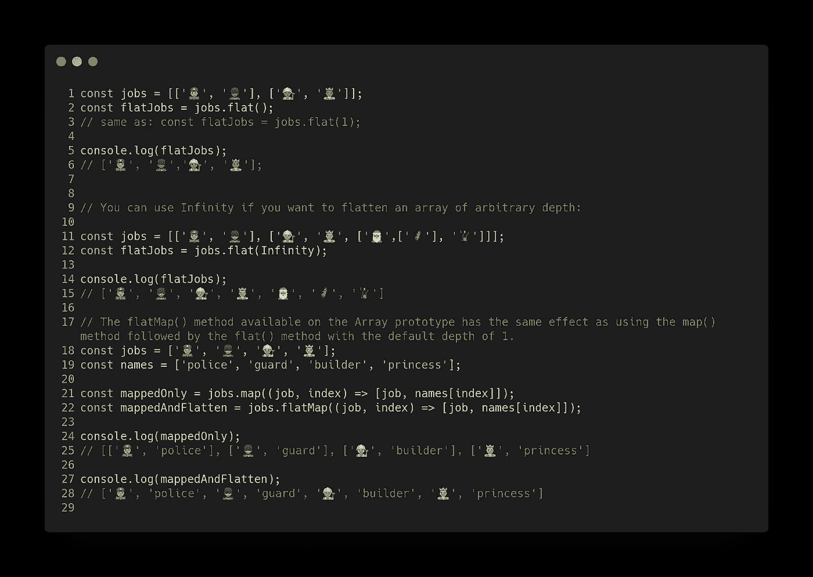
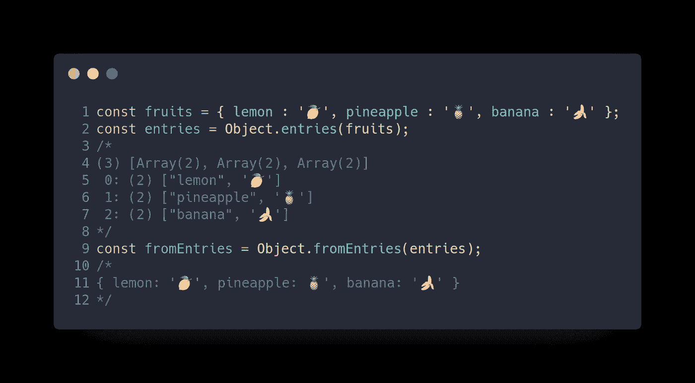
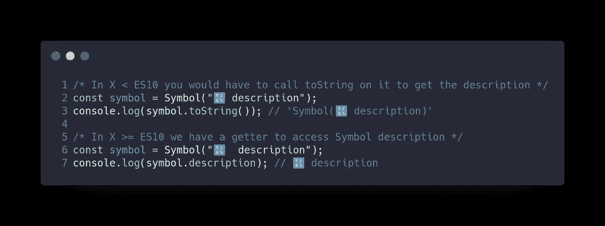
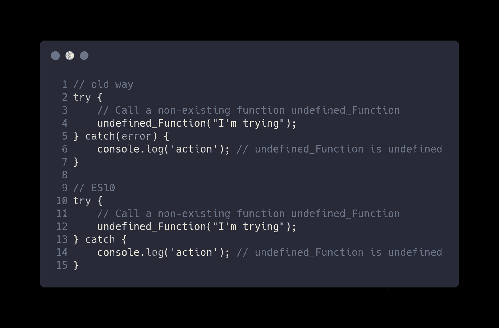
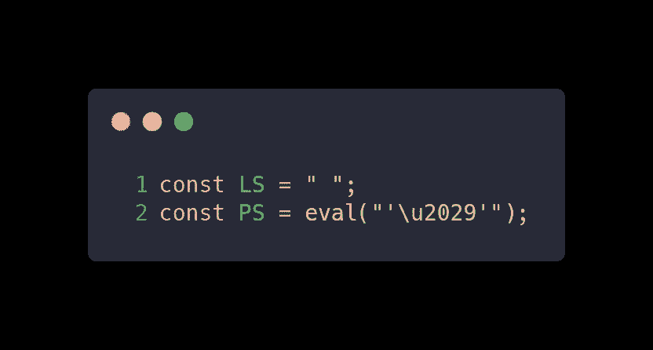
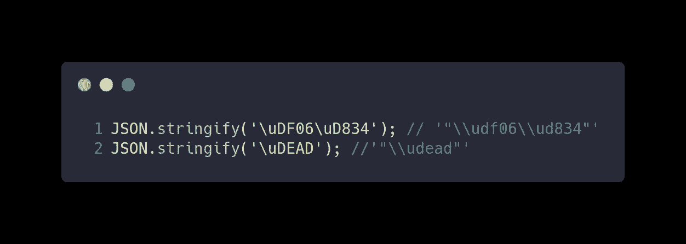
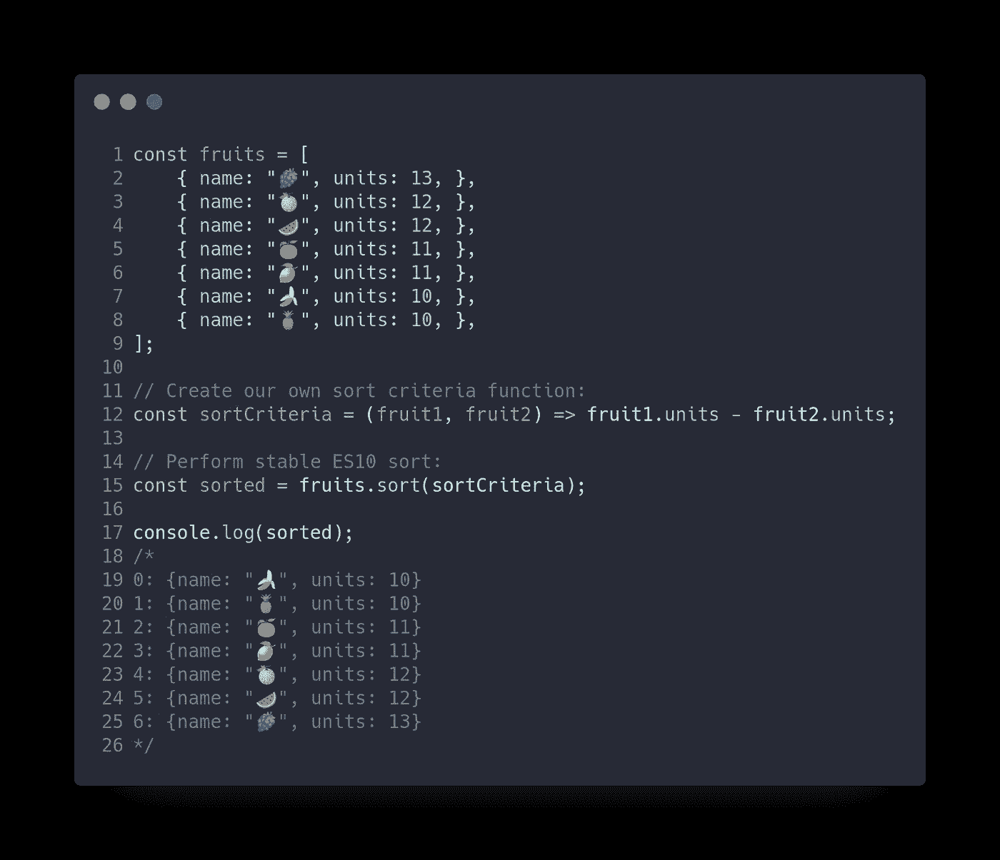

# 12 个简单示例中的 12 项 ES10 功能

> 原文：<https://betterprogramming.pub/twelve-es10-features-in-twelve-simple-examples-6e8cc109f3d3>

## 新 ES10 具有分步功能

今天，我们将了解 2015 年的 ECMAScript 特性:

*   ES2015 又名 ES6
*   [ES2016 又名 ES7](https://medium.com/better-programming/javascript-es2016-features-with-examples-a41b7aead589)
*   [ES2017 又名 ES8](https://medium.com/better-programming/javascript-es2017-features-with-examples-877f8406e770)
*   [ES2018 又名 ES9](https://medium.com/better-programming/javascript-es2018-features-with-examples-30fda8ac50fa)
*   [ES2019 又名 ES10](https://medium.com/better-programming/twelve-es10-features-in-twelve-simple-examples-6e8cc109f3d3)
*   [ES2020 又名 ES11](https://medium.com/better-programming/javascript-es2020-features-with-simple-examples-d301dbef2c37)

[ES10](https://www.ecma-international.org/ecma-262/10.0/index.html#Title) 是 [ECMAScript](https://www.ecma-international.org/publications/standards/Ecma-262.htm) 对应 2019 年的版本。这个版本不像 [ES6](http://es6-features.org/#Constants) 版本(2015)包含那么多新功能。但是，已经加入了一些有用的功能。

本文通过简单的代码示例介绍了 ES10 提供的特性。这样不需要复杂的解释就能快速理解新特性。

当然要有 JavaScript 的基础知识才能完全理解介绍的最好的。

ES2019 中新增的 JavaScript 特性有:

*   `Array#{flat,flatMap}`
*   `Object.fromEntries`
*   `String#{trimStart,trimEnd}`
*   `Symbol#description`
*   `try { } catch {}//` 随意装订
*   JSON**t31】⊂**t33】ecmascript****
*   格式良好的`JSON.stringify`
*   稳定`Array#sort`
*   修订后的`Function#toString`
*   `BigInt`原始型(第三阶段)
*   动态导入(第 3 阶段)
*   标准化`globalThis`对象(阶段 3)

# Array.flat()和 Array.flatMap()

有两个新的`Array`方法:

*   `Array.flat()`方法创建一个新数组，所有子数组元素递归地连接到该数组中，直到指定的深度。
*   `Array.flatMap()`方法首先使用映射函数映射每个元素，然后将结果展平到一个新的数组中。它与深度为 1 的`flat()`后跟`map()`是一样的，但是`flatMap()`通常非常有用，因为将两者合并成一个方法会稍微高效一些。

# Object.fromEntries()

将键和值对的列表转换为一个对象。

# String.protype.matchAll

`matchAll()`方法返回所有匹配正则表达式字符串的结果的迭代器，包括捕获组。

# String.trimStart()和 String.trimEnd()

有两个新的`String`方法来删除字符串中的空白:

*   方法从一个字符串的开头删除空白。
*   `trimEnd()`方法删除字符串末尾的空白。

# 符号。描述

有一个新的`Symbol`描述访问器。当你创建一个`Symbol`时，你现在可以提供一个字符串作为描述；在 ES10 中，该属性有一个访问器。

# 可选 Catch 绑定

过去，`try/catch`语句中的`catch`子句需要一个变量。现在开发人员可以使用`try/catch`而不用创建一个未使用的绑定。

# JSON ⊂ ECMAScript

在 ES10 之前的时代，不可转义的行分隔符`U+2028`和段落分隔符`U+2029`不被接受。

*   `U+2028`是段落分隔符。
*   `U+2029`是行分隔符。

# 格式良好的 JSON.stringify()

`JSON.stringify()`可能返回介于`U+D800`和`U+DFFF`之间的字符，作为没有等效 UTF-8 字符的值。然而，JSON 格式需要 UTF-8 编码。建议的解决方案是将不成对的代理代码点表示为 JSON 转义序列，而不是将它们作为单个 UTF-16 代码单元返回。

# Stable Array.prototype.sort()

V8 以前的实现对包含 10 个以上项目的数组使用不稳定的快速排序算法。

一个*稳定排序算法*是当两个具有相同键的对象在排序后的输出中出现的顺序与它们在未排序的输入中出现的顺序相同。

# New Function.toString()

`toString()`方法返回一个表示函数源代码的字符串。在 ES6 中，当在一个函数上调用`toString`时，它将返回该函数的字符串表示，这取决于 ECMAScript 引擎。如果可能，它将返回源代码，否则它将返回一个标准化的占位符。

# BigInt —任意精度的整数

`BigInt`是第 7 种原始类型:任意精度的整数。变量现在可以表示 253 个数字，而不仅仅是在`9007199254740992`达到最大值。

# 动态导入

动态`import()`返回对所请求模块的模块名称空间对象的承诺。因此，现在可以使用`async/await`将导入赋值给一个变量。

# 标准化的`globalThis`对象

`globalThis`对象在 ES10 之前没有标准化。在生产代码中，您可以通过编写这个庞然大物来跨多个平台“标准化”它:

如果你喜欢这篇文章，并想阅读类似的文章，别忘了鼓掌。

点按并拖移以不止一次鼓掌。50 是极限。

# 结论

JavaScript 是一种活的语言，对于 web 开发来说非常健康。自从 ES6 在 2015 年出现以来，我们已经看到了该语言的蓬勃发展。在这篇文章中，我们回顾了 ES10 (2019)中出现的功能，并介绍了一些将在 ES11 (2020)中保持稳定的功能，因为它们处于状态 3，可能会在下一版本中标准化。

尽管这些特性中的许多对于 web 应用程序的开发来说可能并不重要，但它们提供了以前不使用技巧或大量冗长就无法实现的功能。