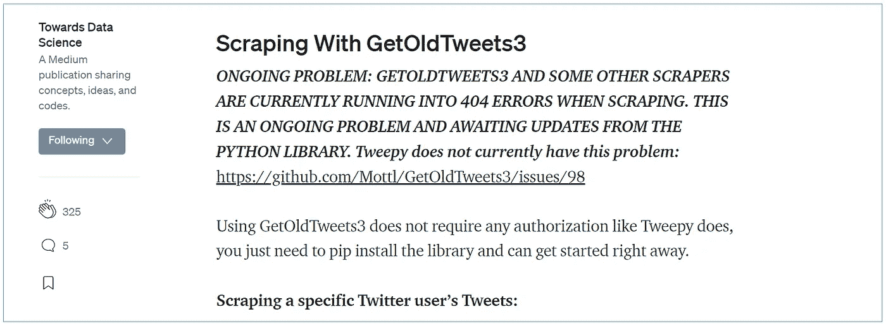

# 推特刮刀都坏了。我们做什么呢

> 原文：<https://betterprogramming.pub/twitter-scrapers-are-all-broken-what-should-we-do-62a7349bfca6>

## Twitter 更新前端时该怎么办


图片来自 Pexels 上的 Ivan Samkov

**编辑 2021 年 4 月 9 日:**

嘿！在这里更新。在这一点上，我看不到像 [Taspinar 的 Twitterscraper](https://github.com/taspinar) repo 这样的图书馆的前进道路，由于 Twitter 在 2020 年的变化，这些图书馆可以快速收集大量的推文。

本文向读者介绍了 Selenium 以及如何用 Twitter 实现它。也就是说，如果你试图尽快获得一些数据，并且不需要了解 Selenium atm，@ [Altimis](https://github.com/Altimis) 有一个 repo，可以很好地为 Twitter 包装 Selenium。这是回购的链接。[链接此处](https://github.com/Altimis/Scweet)

每当 Twitter 更新其前端，刮刀就会断裂，数据科学家会抱怨，需要临时修复。在本文中，让我们快速浏览一下为什么个人会抓取数据而不是使用官方 API 的原因。我们还将讨论通过无头浏览器的临时补救措施，以及为什么这种(低效的)补救措施充其量应该是临时的。



来自driver = webdriver.Chrome(executable_path=browser_path)# create master df to append to
master_df = pd.DataFrame()

此外，创建一个函数，在继续脚本之前等待一定的秒数。这是用 Selenium 进行刮擦的一个非常重要的部分，这样你的刮擦器看起来就像一个真正的用户，不会因为你的刮擦器的动作而使网站负担过重。

```
from time import sleep
import randomdef sleep_for(opt1, opt2):
    time_for = random.uniform(opt1, opt2)
    time_for_int = int(round(time_for))
    sleep(abs(time_for_int - time_for))
    for i in range(time_for_int, 0, -1):
        sleep(1)
```

接下来，遍历您创建的 Twitter 高级搜索 URL(将您在这里搜索的 URL 从[复制并粘贴到 URL](https://twitter.com/search-advanced?lang=en)变量中)，向下滚动页面指定的次数，创建包含每条 tweet 的列表，并将这个列表转换的数据帧附加到主数据帧。注意，在将这些数据转换成 pandas 数据帧之前，有更有效的方法来附加这些数据，但是对于我们当前的速度需求，这就足够了。

还有一个要定义的变量叫做`post_element_xpath`。这是每个 tweet 的元素；我们将使用该元素在向下滚动网页后检索每条 tweet。*请注意，下面的代码附加到 pandas dataframe 上——这是非常低效的，但在概念上很容易理解，特别是如果你更多地来自人文+ Excel 背景，而不是计算机科学背景。

```
from progressbar import ProgressBar
pbar = ProgressBar()urls = ['[https://twitter.com/search?q=simpsons%20(predicted%20OR%20covid)&src=typed_query']](https://twitter.com/search?q=simpsons%20(predicted%20OR%20covid)&src=typed_query'])# how many times should the browser scroll down
scroll_down_num = 5 # the element we are obtaining from the webpage
post_element_xpath = '//div/div/article/div/div'# loop through your list of urls
for url in pbar(urls):
    driver.get(url)
    sleep_for(10, 15)  # sleep a while # scroll x number of times
    for i in range(0, scroll_down_num):
        # scroll down
        driver.find_element_by_xpath('//body').send_keys(Keys.END)
        sleep_for(4, 7) # get a list of tweets
    post_list = driver.find_elements_by_xpath(post_element_xpath) # get the text only from each element
    post_text = [x.text for x in post_list] # create temporary dataset of each tweet
    temp_df = pd.DataFrame(post_text, columns={'all_text'}) # append the temporary dataset to the dataset we will save
    master_df = master_df.append(temp_df) 
```

无论个人是否登录，Twitter 都限制向下滚动的次数，这意味着如果你对访问更多的推文感兴趣，我建议通过编辑你通过`driver.get()`传递的 URL 字符串，生成一个开始和结束日期的列表进行查询。

我们收集的推文将包含用户句柄、推文、点赞数、回复等。作为每个字符串中的单独行。因此，为了解析结果数据，使用`.splitlines()`创建一个元素列表，从抓取中返回的每一行一个元素。

这是我们收集的推文的一个例子。

```
Jeremy Gothem
[@jeremyg](http://twitter.com/jeremygutsche)othem
·
Jun 4
Hotel Pivots - Hotels are repurposing their rooms during COVID-19
1
```

由于元素根据 tweet 和配置文件的类型而变化(一条 tweet 可能包含 6 个元素，另一条可能包含 8 个元素)，所以为解析增加了一些灵活性，允许脚本在有限的列表索引范围内搜索适当的元素。

运行解析函数，将其应用于数据帧的文本列。然后导出数据集。

```
def parse_text(text): # split by new line
    text_list = str.splitlines(text)    # get the username (always the first list element)
    username = text_list[0]      # within the first few elements, find the element
    # with the @ symbol, this will be the user handle
    handle = ''.join(x for x in text_list[1:3] if '@' in x) # get the date, using the single dot to identify its 
    # index location
    dot_position = text_list[1:4].index('·')  
    date = text_list[dot_position + 2]  # date comes after dot # check if its a reply to someone else
    if text_list[4] == "Replying to ":
        reply_to = True
        reply_to_handle = text_list[5]
        text = text_list[6]
    else:
        reply_to = False
        reply_to_handle = ''
        # find the longest string within list index 4:6
        # this will be the tweet text
        text = max(text_list[4:6], key=len) # return the variables we have parse from the text
    return pd.Series([username, handle,
                      date, reply_to, reply_to_handle, text])# run the parse function via pandas apply
df[['username', 'handle', 'date', 'reply_to', 'reply_to_handle', 'atext']
   ] = df['text'].apply(parse_text)# export csv
df.to_csv('output.csv')
```

# 前进

如果你正在学习数据挖掘、自然语言处理或网络分析，Twitter 是一个很好的起点。虽然 Twitter API 是非常好的入门工具(你可以使用像 [Tweepy](https://www.tweepy.org/) 这样的库来轻松使用它)，但遗憾的是，使用该 API 进行纵向分析是行不通的，如果 Twitter 抓取器不起作用，我希望这段代码可以作为权宜之计。

同样，我建议增加关于开始和结束日期的额外自动化，以使用这个刮刀查询额外的数据——从 7 月到 10 月，我能够为一个非常合适的主题收集大约 3000 条推文。

# Scweet 回购脚本(从 4 月编辑开始)

1.  在里面放一个文件夹和光盘
2.  饭桶克隆[https://github.com/Altimis/Scweet.git](https://github.com/Altimis/Scweet.git)
3.  运行下面的脚本

```
import pandas as pdimport os
from os import chdir, getcwd# sets the path to the current folder you're cd'ed into
folder_loc = os.path.dirname(os.path.realpath("__file__"))
os.chdir(folder_loc)# make sure you git cloned the repo into your working directory 
# folder
from Scweet.Scweet.scweet import scrap # set parameters
list_handles = ['theo_goe','handle2','etc']
output_file_name = 'output_file.csv'start_date = "2020-11-01"
max_date = "2020-12-15"
# interval of how many days to search in between
interval_in = 30# make an empty dataframe to fill
tweets_df = pd.DataFrame()for handle in list_handles:
    # [https://github.com/Altimis/Scweet](https://github.com/Altimis/Scweet)
    data = scrap(start_date=start_date, max_date=max_date, from_account = handle, interval=interval_in, 
          headless=True, display_type="Top", save_images=False, 
                 resume=False, filter_replies=True, proximity=True)
    tweets_df = tweets_df.append(data)tweets_df.to_csv(output_file_name)
```