# 如何在 Twitter 账户上进行情感分析

> 原文：<https://betterprogramming.pub/twitter-sentiment-analysis-15d8892c0082>

## 提前想好这是不是你想追随的人

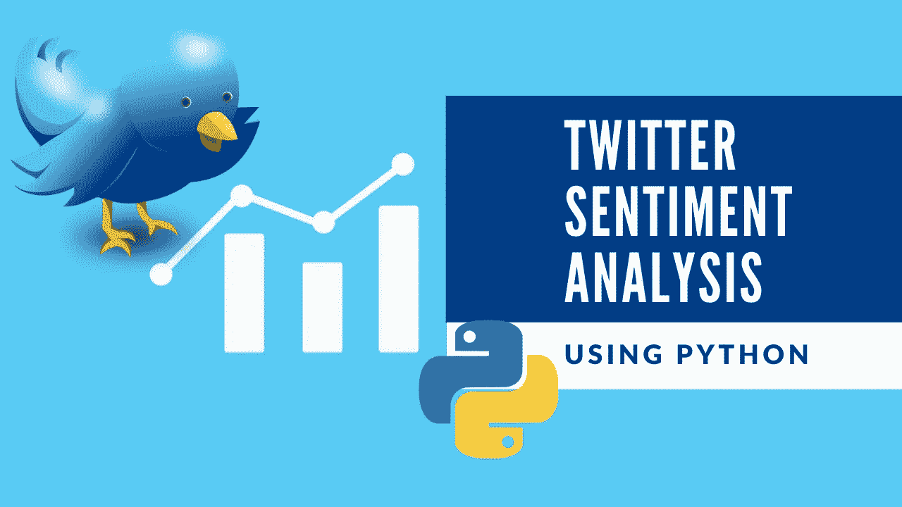

在本文中，我将向您展示如何使用情感分析从 Twitter 用户那里获取和分析推文的情感。

> 「情绪分析是中性、消极、积极语言的衡量。它是一种评估口语或书面语的方法，以确定表达是有利的(积极的)，不利的(消极的)，还是中性的，以及到什么程度。”— [克拉布里奇](https://www.clarabridge.com/customer-experience-dictionary/sentiment-analysis/)
> 
> **“情感分析**:对一段文字中表达的观点进行计算识别和分类的过程，尤其是为了确定作者对某个特定话题、产品等的态度。是积极的，消极的，还是中性的。”——牛津英语词典

有许多方法和算法来实现情感分析系统，这些方法和算法可以分类为:

*   **基于规则的**系统，根据一组手工制作的规则执行情感分析
*   **依靠机器学习技术从数据中学习的自动**系统
*   **混合**系统，结合了基于规则和自动化的方法

在你开始分析推文并从 Twitter 获取他们的观点之前，你首先需要一个自己的 Twitter 账户。您需要创建一个 [Twitter 应用程序](https://developer.twitter.com/en/apps)来获取您的密钥。

我将要分析的推特用户不是别人，正是微软联合创始人比尔·盖茨。我选择比尔·盖茨是因为他试图对世界产生积极的影响，所以我怀疑他的推文也大多是积极的。

如果你不想读这篇文章，想要一段视频，你可以看看下面的视频。它详细介绍了本文中的所有内容，并且将有助于您轻松地开始开发自己的程序——或者您可以将这两者用作学习的辅助材料。

# 开始编程

我将从陈述我想要这个程序做什么开始。这个程序将分析一个推特账户的情绪。更具体地说，它将分析微软创始人之一比尔·盖茨的推文/帖子。

```
*# Description : This is a sentiment analysis program that parses the tweets fetched from Twitter using Python*
```

# 导入库和包

接下来，导入一些将在这个程序中使用的库。

```
**# Import the libraries**
import tweepy
from textblob import TextBlob
from wordcloud import WordCloud
import pandas as pd
import numpy as np
import re
import matplotlib.pyplot as plt
plt.style.use('fivethirtyeight')
```

# 加载数据并向 Twitter 认证

我使用谷歌的[网站](https://colab.research.google.com/notebooks/intro.ipynb)来编写这个程序，所以我将使用谷歌的库来上传包含我的 Twitter 应用程序密钥的 CSV 文件。如果你愿意，你可以直接把你的键输入到变量中。

```
**# Load the data**
from google.colab import files
uploaded = files.upload()**# Get the data**
log = pd.read_csv("Login.csv")
```

接下来，我将把 Twitter 密钥/API 凭证存储在变量中。

```
**# Twitter Api Credentials**
consumerKey = log["key"][0]
consumerSecret = log["key"][1]
accessToken = log["key"][2]
accessTokenSecret = log["key"][3]
```

现在，是时候创建身份验证对象了。设置访问令牌和访问令牌密码，并向 Twitter 认证。

```
***# Create the authentication object***
authenticate = tweepy.OAuthHandler(consumerKey, consumerSecret) 

***# Set the access token and access token secret***
authenticate.set_access_token(accessToken, accessTokenSecret) 

***# Creating the API object while passing in auth information***
api = tweepy.API(authenticate, wait_on_rate_limit = **True**)
```

# 提取和分析数据

是时候提取一个 Twitter 用户的推文了。首先，我将获取 Twitter 用户 Bill Gates 最近的 100 篇帖子，并只显示最近的五条推文。

```
***# Extract 100 tweets from the twitter user***
posts = api.user_timeline(screen_name="BillGates", count = 100, lang ="en", tweet_mode="extended")

***#  Print the last 5 tweets***
print("Show the 5 recent tweets:**\n**")
i=1
**for** tweet **in** posts[:5]:
    print(str(i) +') '+ tweet.full_text + '**\n**')
    i= i+1
```

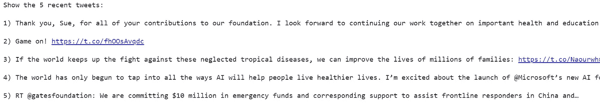

最近的五条推特

创建一个包含名为`Tweets`的列的`DataFrame`，该列将包含来自 Twitter 用户的帖子，然后显示前五行。

```
***# Create a dataframe with a column called Tweets***
df = pd.DataFrame([tweet.full_text **for** tweet **in** posts], columns=['Tweets'])
***# Show the first 5 rows of data***
df.head()
```

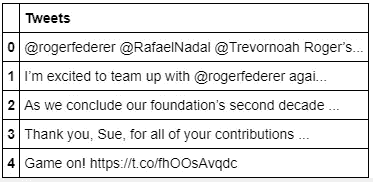

数据有点脏，因为它包含@符号、超链接、RTs，还可能包含散列标签，所以我将通过创建一个函数来清除 tweets 中的这些符号。然后，我将把这个函数应用到 tweets 并显示结果。

```
***# Create a function to clean the tweets***
**def** cleanTxt(text):
 text = re.sub('@[A-Za-z0–9]+', '', text) *#Removing @mentions*
 text = re.sub('#', '', text) *# Removing '#' hash tag*
 text = re.sub('RT[\s]+', '', text) *# Removing RT*
 text = re.sub('https?:\/\/\S+', '', text) *# Removing hyperlink*

 **return** text

***# Clean the tweets***
df['Tweets'] = df['Tweets'].apply(cleanTxt)

***# Show the cleaned tweets***
df
```

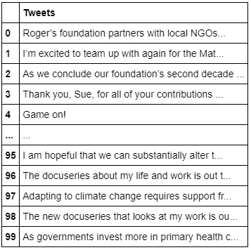

我想在`DataFrame`中加入推文的主观性和极性。为了做到这一点，我将创建两个函数:一个用于获取名为`Subjectivity`的 tweets(文本有多主观或有多固执——0 分是事实，1 分是观点),另一个用于获取名为`Polarity` 的 tweets(文本有多积极或消极，—1 分是最高的消极得分，+1 分是最高的积极得分)。

接下来，我将结果存储到两列中——一列称为`Subjectivity`,另一列称为`Polarity` ——并显示结果。

```
***# Create a function to get the subjectivity***
**def** getSubjectivity(text):
   **return** TextBlob(text).sentiment.subjectivity

***# Create a function to get the polarity***
**def** getPolarity(text):
   **return**  TextBlob(text).sentiment.polarity

***# Create two new columns 'Subjectivity' & 'Polarity'***
df['Subjectivity'] = df['Tweets'].apply(getSubjectivity)
df['Polarity'] = df['Tweets'].apply(getPolarity)

***# Show the new dataframe with columns 'Subjectivity' & 'Polarity'***
df
```

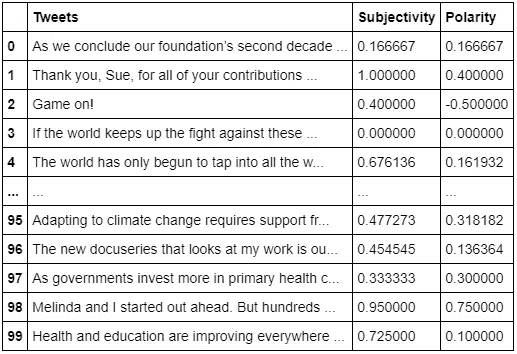

让我们看看情绪是如何分布的。完成这项任务的一个好方法是通过绘制单词云来理解常用单词。

单词云(也称为*文本云*或*标签云*)是一种可视化，特定单词在文本中出现得越多，它在单词云中出现得就越大、越粗。

让我们使用词云图来可视化数据中的所有词。看起来“健康”这个词在比尔·盖茨过去的 100 条推文中出现了很多。

```
**# word cloud visualization**
allWords = ' '.join([twts **for** twts **in** df['Tweets']])
wordCloud = WordCloud(width=500, height=300, random_state=21, max_font_size=110).generate(allWords)

plt.imshow(wordCloud, interpolation="bilinear")
plt.axis('off')
plt.show()
```

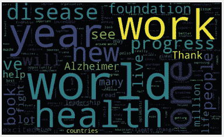

创建一个函数来计算阴性(-1)、中性(0)和阳性(+1)分析，并将信息添加到名为`Analysis`的新列中。然后，展示结果。

```
**# Create a function to compute negative (-1), neutral (0) and positive (+1) analysis**
def getAnalysis(score):if score < 0:
  return 'Negative'
elif score == 0:
  return 'Neutral'
else:
  return 'Positive'df['Analysis'] = df['Polarity'].apply(getAnalysis)**# Show the dataframe**
df
```


按升序打印正面推文。最积极的推文是排名第一的推文。

```
***# Printing positive tweets*** 
print('Printing positive tweets:**\n**')
j=1
sortedDF = df.sort_values(by=['Polarity']) *#Sort the tweets*
**for** i **in** range(0, sortedDF.shape[0] ):
  **if**( sortedDF['Analysis'][i] == 'Positive'):
    print(str(j) + ') '+ sortedDF['Tweets'][i])
    print()
    j= j+1
```

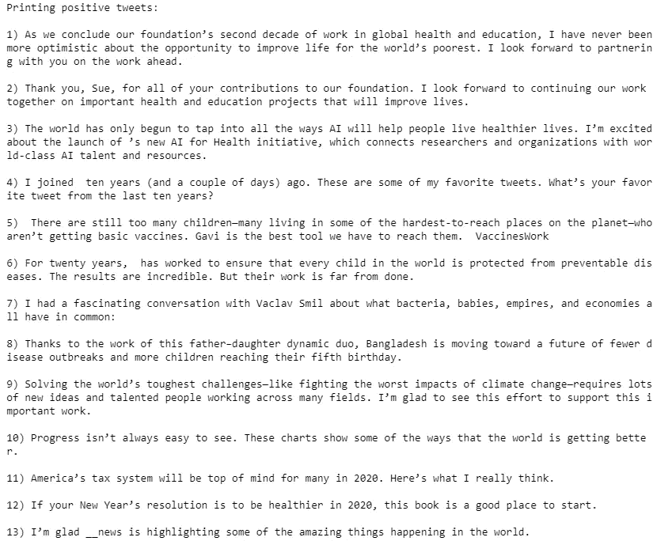

按降序打印负面推文。最负面的推文是#1 推文。

```
***# Printing negative tweets* **
print('Printing negative tweets:**\n**')
j=1
sortedDF = df.sort_values(by=['Polarity'],ascending=**False**) *#Sort the tweets*
**for** i **in** range(0, sortedDF.shape[0] ):
  **if**( sortedDF['Analysis'][i] == 'Negative'):
    print(str(j) + ') '+sortedDF['Tweets'][i])
    print()
    j=j+1
```

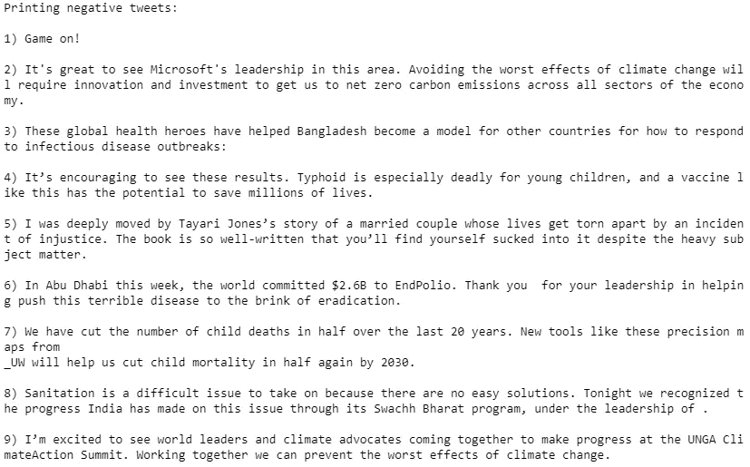

绘制极性和主观性散点图。看起来大多数推文都是正面的，因为许多点都在极性的右侧，值为 0.00。

```
***# Plotting*** 
plt.figure(figsize=(8,6)) 
**for** i **in** range(0, df.shape[0]):
  plt.scatter(df["Polarity"][i], df["Subjectivity"][i], color='Blue') ***# plt.scatter(x,y,color)*** 
plt.title('Sentiment Analysis') 
plt.xlabel('Polarity') 
plt.ylabel('Subjectivity') 
plt.show()
```

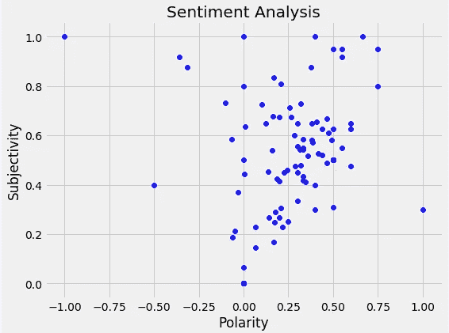

打印正面推文的百分比。大约 81/100 的推文被认为是正面推文。

```
***# Print the percentage of positive tweets***
ptweets = df[df.Analysis == 'Positive']
ptweets = ptweets['Tweets']
ptweets

round( (ptweets.shape[0] / df.shape[0]) * 100 , 1)
```

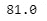

打印负面推文的百分比。大约 9/100 的推文被认为是负面推文。

```
***# Print the percentage of negative tweets***
ntweets = df[df.Analysis == 'Negative']
ntweets = ntweets['Tweets']
ntweets

round( (ntweets.shape[0] / df.shape[0]) * 100, 1)
```


显示数值计数。现在我们可以看到 81 条推文是正面的，10 条是中性的，9 条是负面的。

```
***# Show the value counts***
df['Analysis'].value_counts()
```


直观地显示数值。

```
***# Plotting and visualizing the counts***
plt.title('Sentiment Analysis')
plt.xlabel('Sentiment')
plt.ylabel('Counts')
df['Analysis'].value_counts().plot(kind = 'bar')
plt.show()
```

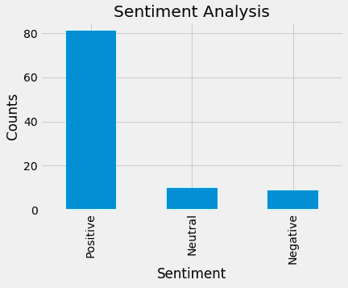

# 结论

那都是乡亲们！

如果您也有兴趣阅读更多关于机器学习的内容，以便立即开始处理问题和示例，那么我强烈建议您查看"[使用 Scikit-Learn 和 TensorFlow 进行机器学习实践:构建智能系统的概念、工具和技术](https://www.amazon.com/gp/product/1491962291?ie=UTF8&tag=medium074-20&camp=1789&linkCode=xm2&creativeASIN=1491962291)"

这是一本帮助初学者学习如何编写机器学习程序和理解机器学习概念的好书。

感谢阅读这篇文章，我希望它对你们所有人都是有趣的！如果你喜欢这篇文章，并发现它很有帮助，请留下一些掌声，以示感谢。如果你还不是 Medium 的[会员，那么考虑成为会员吧，如果不是为了我的文章，那么也是为了这个网站上所有其他了不起的文章&作者。使用这里的](https://randerson112358.medium.com/membership)[链接](https://randerson112358.medium.com/membership)，你可以轻松成为灵媒的一员。继续学习，如果你喜欢金融、计算机科学或编程，请访问并订阅我的 [YouTube](https://www.youtube.com/channel/UCaV_0qp2NZd319K4_K8Z5SQ) 频道([randers 112358](https://www.youtube.com/channel/UCaV_0qp2NZd319K4_K8Z5SQ)&[计算机科学](https://www.youtube.com/channel/UCbmb5IoBtHZTpYZCDBOC1CA))。