# 基于朴素贝叶斯和 N-Gram 的 Twitter 情感分析

> 原文：<https://betterprogramming.pub/twitter-sentiment-analysis-using-naive-bayes-and-n-gram-5df42ae4bfc6>

## 分析推文的积极程度


[莫兰](https://unsplash.com/@ymoran?utm_source=unsplash&utm_medium=referral&utm_content=creditCopyText)在 [Unsplash](https://unsplash.com/s/photos/twitter?utm_source=unsplash&utm_medium=referral&utm_content=creditCopyText) 上的照片

在本文中，我们将向您展示如何使用两种著名的机器学习算法:朴素贝叶斯和 N-Gram，将一条推文分类为正面或负面。

一、什么是情感分析？

*情感分析是分析文本数据并将其分类为积极、消极或中性情感的自动化过程。使用情感分析工具来分析 Twitter 数据中的观点，可以帮助公司了解人们如何谈论他们的品牌。*

现在你知道什么是情感分析了，让我们开始编码吧。

我们将整个计划分为三个部分:

*   导入数据集
*   数据集的预处理
*   应用机器学习算法

*注意:我们已经使用了 Jupyter Notebook，但是您也可以使用自己选择的编辑器。*

# 步骤 1:导入数据集

显示数据集的前十列:

```
data.head(10)
```

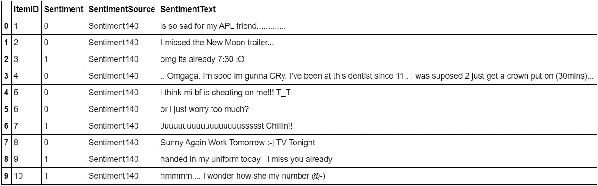

从上面的数据集，我们可以清楚地看到以下内容的使用(没有一个在确定推文的情绪方面有任何用处):

*   首字母缩略词
*   重复字符序列
*   情感符(= Smiley)
*   拼写错误
*   名词

让我们看看我们的数据集是否围绕标签类情感平衡:

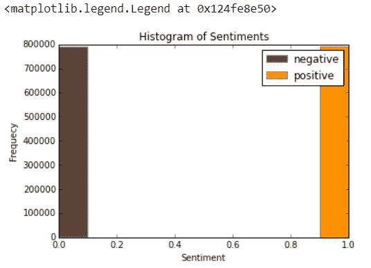

该数据集似乎在消极情绪和积极情绪之间非常平衡。

现在，我们需要导入其他有助于我们进行预处理的数据集，例如:

*   一个表情词典将西方最常用的 132 个表情符号和它们的情绪(积极或消极)重新组合在一起:

```
emoticons = pd.read_csv('data/smileys.csv')
positive_emoticons = emoticons[emoticons.Sentiment == 1]
negative_emoticons = emoticons[emoticons.Sentiment == 0]
emoticons.head(5)
```

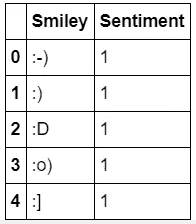

*   5465 个首字母缩略词及其翻译的首字母缩略词词典:

```
acronyms = pd.read_csv('data/acronyms.csv')
acronyms.tail(5)
```

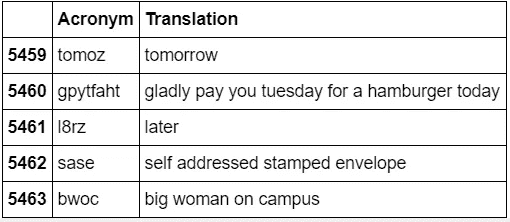

*   一个停用词词典，对应于在处理自然语言数据之前或之后被过滤掉的词，因为它们在我们的例子中没有用。

```
stops = pd.read_csv('data/stopwords.csv')
stops.columns = ['Word']
stops.head(5)
```

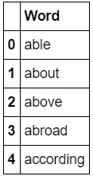

*   正面和负面词汇词典:

```
positive_words = pd.read_csv('data/positive-words.csv', sep='**\t**')
positive_words.columns = ['Word', 'Sentiment']
negative_words = pd.read_csv('data/negative-words.csv', sep='**\t**')
negative_words.columns = ['Word', 'Sentiment']
positive_words.head(5)
```

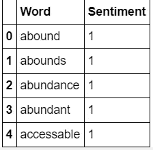

```
negative_words.head(5)
```

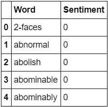

# 第二步:**数据集预处理**

## **什么是数据预处理？**

*数据预处理是一种用于将原始数据转换成干净数据集的技术。换句话说，无论何时从不同来源收集数据，都是以原始格式收集的，这对于分析是不可行的。*

现在，让我们从预处理部分开始。

为此，我们将通过各种步骤传递数据:

*   使用表情词典将所有表情替换为情绪极性`||pos||` / `||neg||`:

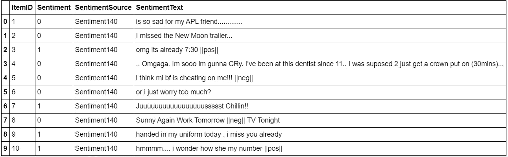

*   用标签替换所有网址`||url||`:

```
pattern_url = re.compile(ur'(?i)\b((?:https?://|www\d{0,3}[.]|[a-z0-9.\-]+[.][a-z]{2,4}/)(?:[^\s()<>]+|\(([^\s()<>]+|(\([^\s()<>]+\)))*\))+(?:\(([^\s()<>]+|(\([^\s()<>]+\)))*\)|[^\s`!()\[\]**{}**;:**\'**".,<>?\xab\xbb\u201c\u201d\u2018\u2019]))')

url_found = find_with_pattern(pattern_url)data.SentimentText = find_with_pattern(pattern_url, **True**, '||url||') data[50:60]
```

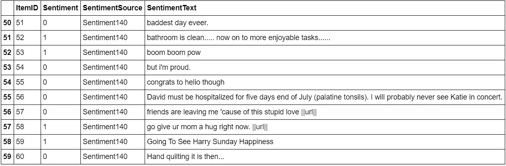

*   删除 unicode 字符:

```
def remove_unicode(string):
    try:
        string = string.decode('unicode_escape').encode('ascii','ignore')
    except UnicodeDecodeError:
        pass
    return string

data.SentimentText = data.SentimentText.apply(lambda tweet: remove_unicode(tweet))data[1578592:1578602]
```

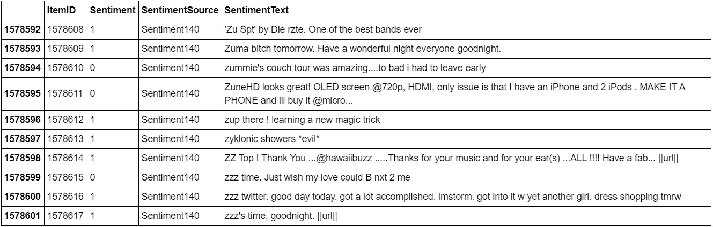

*   解码 HTML 实体:

```
data.SentimentText[599982]
```

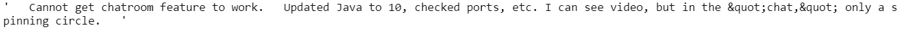

```
import HTMLParser  
html_parser = HTMLParser.HTMLParser() data.SentimentText = data.SentimentText.apply(lambda tweet: html_parser.unescape(tweet)) data.SentimentText[599982]
```

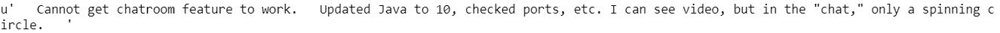

*   将所有字母缩减为小写:

```
data.SentimentText = data.SentimentText.str.lower() data.head(10)
```

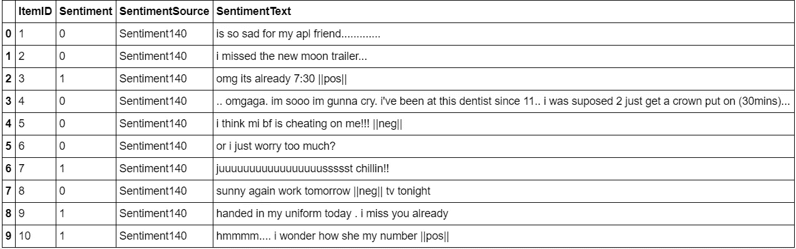

*   用`||target||`替换所有用户名/目标`@`:

```
pattern_usernames = "@\w{1,}"usernames_found = find_with_pattern(pattern_usernames)data.SentimentText = find_with_pattern(pattern_usernames, **True**, '||target||')data[45:55]
```

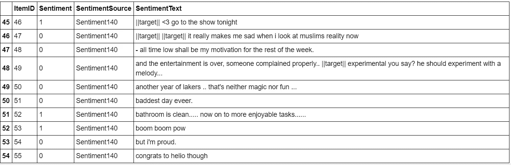

*   将所有缩写替换为其翻译:

[https://gist . github . com/better programming/fdcccacf 21 fa 02 A8 a 4d 697 da 24 A8 CD 54 . js](https://gist.github.com/BetterProgramming/fdcccacf21fa02a8a4d697da24a8cd54.js)


```
for i, (acronym, value) in enumerate(top20acronyms):
    print str(i + 1) + ") " + acronym + " => " + acronym_dictionary[acronym] + " : " + str(value)
```

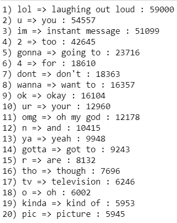

```
plt.close()
top20acronym_keys = [x[0] for x in top20acronyms]
top20acronym_values = [x[1] for x in top20acronyms]
indexes = np.arange(len(top20acronym_keys))
width = 0.7
plt.bar(indexes, top20acronym_values, width)
plt.xticks(indexes + width * 0.5, top20acronym_keys, rotation="vertical")
```


*   用标签`||not||`替换所有的否定(例如:不，不，从不)。

```
negation_dictionary = dict(zip(negation_words.Negation, negation_words.Tag)) def replace_negation(tweet):
     return [negation_dictionary[word] if negation_dictionary.has_key(word) else word for word in tweet] data.SentimentText = data.SentimentText.apply(lambda tweet: replace_negation(tweet)) print data.SentimentText[29]
```

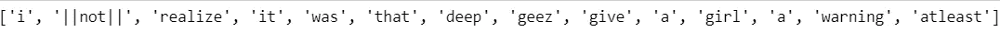

*   用两个字符替换一系列重复的字符(例如:“helloooo”=“helloo”)，以保持单词的强调用法。

```
data[1578604:]
```

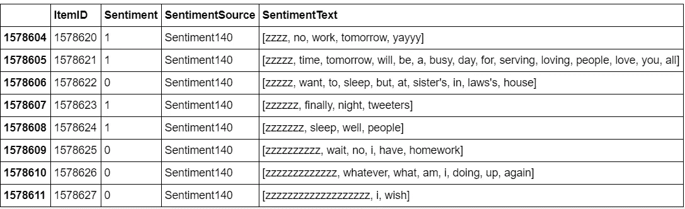

```
pattern = re.compile(r'(.)\1*') def reduce_sequence_word(word):
     return ''.join([match.group()[:2] if len(match.group()) > 2 else match.group() for match in pattern.finditer(word)]) def reduce_sequence_tweet(tweet):
     return [reduce_sequence_word(word) for word in tweet] data.SentimentText = data.SentimentText.apply(lambda tweet: reduce_sequence_tweet(tweet)) data[1578604:]
```

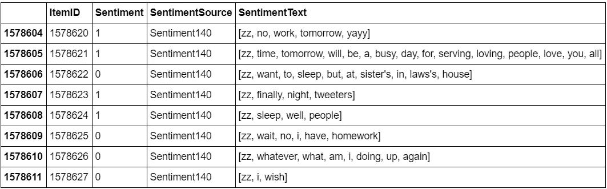

我们已经完成了 Twitter 情感分析项目中最重要和最棘手的部分，现在我们可以将我们的机器学习算法应用于处理过的数据集。

# 步骤 3: **应用机器学习算法**

## **什么是机器学习？**

机器学习是人工智能(AI)的一种应用，它为系统提供了自动学习和根据经验改进的能力，而无需显式编程。机器学习专注于开发可以访问数据并使用数据进行自我学习的计算机程序。

有三种主要的方法用于将句子分类到给定的类别中，在我们的例子中，是肯定的(1)还是否定的(0): SVM、朴素贝叶斯和 N-Gram。

我们只使用了朴素贝叶斯和 N-Gram，它们是确定推文情感最常用的方法。

让我们从朴素贝叶斯开始。

# **朴素贝叶斯**

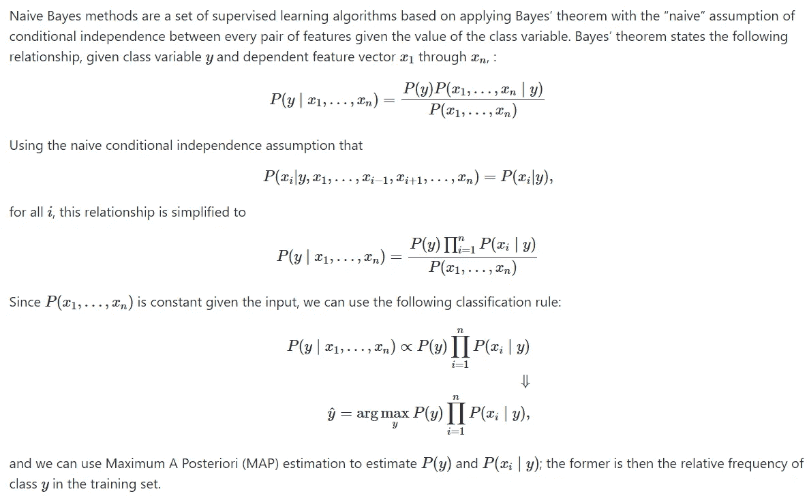

坦克

有不同类型的朴素贝叶斯分类器，但我们将使用多项式朴素贝叶斯。

## **基线**

我们使用多项式朴素贝叶斯作为学习算法，拉普拉斯平滑表示进行文本分类的经典方式。因为我们需要从我们的 tweets 数据集中提取特征，所以我们使用单词袋模型来表示它。

单词包模型是文档的简化表示，它表示为一个单词包，不考虑语法或词序。在文本分类中，每个词的频率被用作训练分类器的特征。

为简单起见，我们使用库 sci-kit-learn。

让我们首先将数据集分为训练集和测试集:

*   训练集的大小:1183958
*   测试集的大小:394654

一旦创建了训练集和测试集，我们需要第三组数据，称为验证集。这真的很有用，因为它将用于根据看不见的数据验证我们的模型，并调整学习算法的可能参数，以避免欠拟合和过拟合，例如。

我们需要这个验证集，因为我们的测试集应该只用于验证模型的泛化能力。如果我们使用测试集而不是验证集，我们的模型可能会过于乐观，扭曲我们的结果。

要创建验证集，有两个主要选项:

*   将定型集拆分为两部分(60%/20%)，比例为 2:8，其中每个部分包含相等分布的示例类型。我们用最大的部分训练分类器，用较小的部分进行预测，以验证模型。这种技术工作得很好，但缺点是我们的分类器没有在数据集中的所有例子上得到训练和验证(没有计算测试集)。
*   K 倍交叉验证。我们将数据集分成 k 个部分，保留一部分，合并其他部分并对其进行训练，然后根据保留的部分进行验证。我们重复这个过程 k 次(每次折叠)，每次拿出不同的部分。然后，我们对每个折叠测量的分数进行平均，以获得对我们的模型性能的更准确的估计。

我们将训练数据分成十份，并使用 scikit-learn 交叉验证它们:

分类推文总数:1183958

分数:0.77653600187

混淆矩阵:[[465021 126305][136321 456311]]

使用我们的基线，我们得到大约 0.77。

# n 元语法(语言模型)

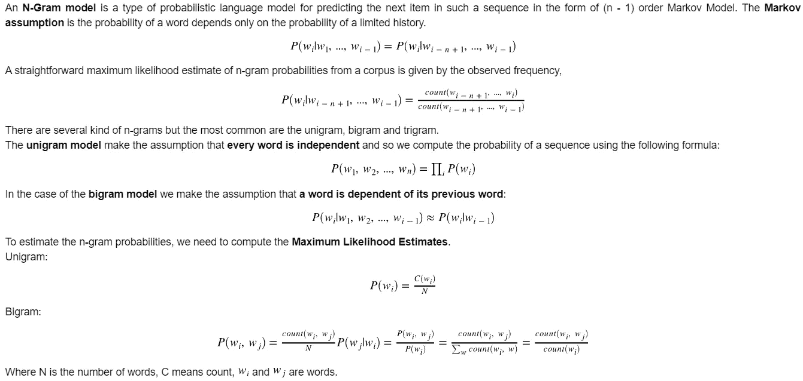

***注意*** *:一个重要的注意事项是，n-gram 分类器实际上是朴素贝叶斯的推广。具有拉普拉斯平滑的单字分类器完全对应于传统的朴素贝叶斯分类器。*

既然我们使用单词袋模型，意思是我们把这个句子:“我不喜欢巧克力”翻译成“我”、“不喜欢”、“喜欢”、“巧克力”，我们可以试着使用二元模型来处理这个例子中“不喜欢”的否定。我们仍然要使用拉普拉斯平滑，但是我们使用 CountVectorizer 中的参数 ngram_range 来添加二元模型特性。

```
score, confusion = classify(training_tweets, test_tweets, (2, 2))print 'Total tweets classified: ' + str(len(training_tweets)) 
print 'Score: ' +  str(score) 
print 'Confusion matrix:' print(confusion)
```

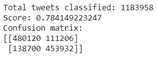

仅使用二元模型特征，我们略微提高了大约 0.01 的准确度分数。在此基础上，我们可以认为，增加一元和二元应该增加更多的准确性得分。

```
score, confusion = classify(training_tweets, test_tweets, (1, 2))print 'Total tweets classified: ' + str(len(training_tweets))
print 'Score: ' +  str(score)
print 'Confusion matrix:'
print(confusion)
```

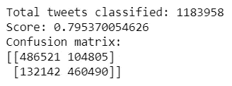

事实上，与基线相比，大约 0.02 的准确度分数已经有所提高。

# 结论

在这个项目中，我们试图展示一种使用朴素贝叶斯作为基线将推文分为正面或负面类别的基本方法。我们还试图展示语言模型如何与朴素贝叶斯相关，并能产生更好的结果。

这是我们小组的最后一年项目。我们在挖掘细节和为任务选择正确的算法时面临很多挑战。希望你们不用经历同样的过程！

既然你已经走了这么远，我就和你们分享[代码链接](https://github.com/Sid22031998/Twitter-Sentiment-Analysis)(如果你觉得有帮助的话，给这个库打个星吧)。这是一个帮助有需要的人的公开倡议。

感谢阅读这篇文章。希望对大家有帮助！