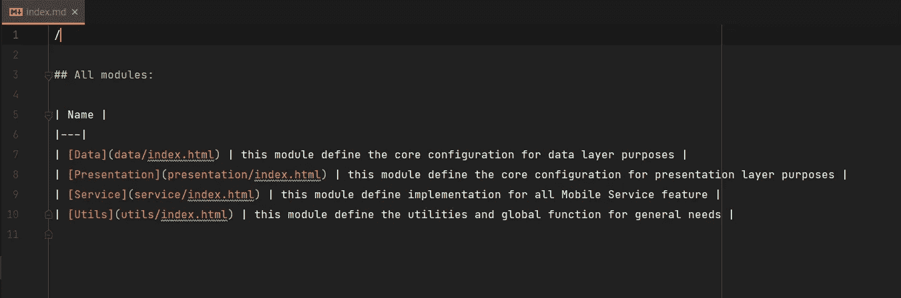
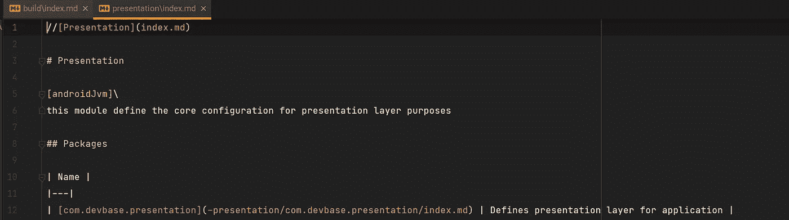
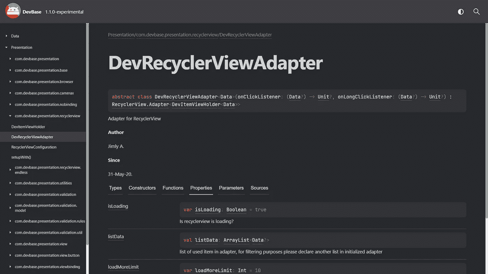

# 用于记录 Android 代码库的两个开发工具

> 原文：<https://betterprogramming.pub/two-developer-tools-for-documenting-android-codebases-3482bad3fb4c>

## 记录一个 Android 项目很容易，是吗？

照片由[西格蒙德](https://unsplash.com/@sigmund?utm_source=medium&utm_medium=referral)在 [Unsplash](https://unsplash.com?utm_source=medium&utm_medium=referral) 上拍摄

# 为什么？

所以我维护我公司的代码库，这很有趣，但也很困难。这很难，因为在开始时，代码很小，你可以在短时间内学会它。后来，代码库变得如此庞大*(仍然是整体的，还不是模块化的)*并且跟踪所有这些代码并不容易。

当然，我们开始模块化代码库，但这使得公司的新开发人员更难贡献和改进代码库，因为代码被分成模块，没有人知道这部分代码在哪里，当然除非模块化它的人。

由此，我一直认为记录一个项目是很重要的。为什么？因为它给我们之后的开发者留下了遗产。它邀请其他开发人员向它学习，当你试图参考你的旧代码时，它会有很大帮助。

> “好的代码文档本身”

开发人员在谈论文档时会引用这句话。但我仍然认为，即使有了深思熟虑的命名约定，也有很多事情不能单独放在命名中，比如上下文或推理为什么代码是这样的。所以不要羞于记录你的代码，相信我！它工作了。

# KDoc

如果你紧跟潮流，你可能会使用 Kotlin 来开发 Android 应用程序。就像 Java 一样，也有一种记录 Kotlin 代码的语言，它叫做 [KDoc](https://kotlinlang.org/docs/kotlin-doc.html) 。

下面是使用 KDoc 实现这一点的一个片段:

使用 KDoc 的示例

TL；DR，在注释中使用注释标签来解释你的部分代码。如果你已经熟悉 [Javadoc](https://www.oracle.com/technical-resources/articles/java/javadoc-tool.html) ，编写 KDoc 是非常容易的……几乎没有什么不方便。

你可能想做的另一件事是通过创建一个 markdown 文件*(通常在你的模块的根目录下)*来记录包。看起来会像这样:

使用 KDoc 记录包

# 多卡

在用 KDoc 记录了所有代码之后，您可能就到此为止了，但是您还可以做更多的事情。那么什么是 [Dokka](https://kotlin.github.io/dokka/1.6.10/) ？它基本上是一个文档引擎，可以将你的 KDoc 评论转换成可共享的格式，如网站或 markdown 文件。

下面是 Dokka 的输出格式:

*   一个你可以在任何地方部署的静态网站
*   `gfm`，Github 风味降价
*   `jekyll`、杰基尔兼容降价
*   `javadoc`，看起来像 Javadoc，把你的 Kotlin 代码转换成 Java

Dokka 有一个 Gradle 插件，你可以把它添加到你的 Android 项目中，更多信息请点击这里。

我已经尝试了所有的输出，但是我可以说`html`是目前唯一值得使用的。最初，我很想使用`gfm`，因为我的代码库文档使用 [Mkdocs](https://www.mkdocs.org/) 将 Markdown 文件转换为静态网站并部署它。

比如初始配置、基础设施，以及代码文档之外的所有东西。通过在 markdown 中编写它，会更容易，因为这样我们就可以使用 Dokka 将格式化的 KDoc 作为 Markdown 嵌入到 Mkdocs 目录中。

之后，Mkdocs 将把所有的 markdown 文件转换成一个网站，代码文档将具有相同的行为，看起来像文档的其余部分。

但是`gfm`和`jekyll`格式有 bug 我可以说不值得用。例如，下面是从 Dokka 生成的降价:

模块文档

你看到问题了吗？让我们来看看:

*   该表没有名为 Summary 的第二列
*   每个模块的链接指的是 HTML 文件，而不是 MD 文件

你可能会说，嗯，只有两个，对吧？对吗？？嗯，还有一个:

演示模块文档

同样的错误仍然出现在其他文件中，重新格式化所有文件是如此麻烦，需要大量的工作来自动化。

此外，还有一些 Dokka 特性在`gfm`格式中不支持，比如:

*   **Source link** ，它可以将您的文档链接到存储库中的文件。仅支持`html`格式。
*   **代码高亮**，在`gfm`格式中没有 Kotlin 高亮。但是它支持`html`格式。

有一些开发者说[为更好的`gfm`格式贡献了](https://github.com/Kotlin/dokka/pull/1967)，但是我猜他们现在主要关注的是`html`格式。

不要误解我，他们生成的 HTML 文件实际上很好，这就是为什么我用它作为我的代码库。最后，代码文档看起来像这样:

代码库文档中的示例类

# 技巧

如果你对使用 Dokka 感兴趣，我给你一些建议:

## `DokkaTaskPartial`和`DokkaMultiModuleTask`

如果您的项目是多模块项目，在配置您的任务时，尝试使用`DokkaTaskPartial`和`DokkaMultiModuleTask`。像这样:

Dokka 任务的配置

它帮助你不用为每种输出格式定义配置，因为它自动为所有格式工作。

## 覆盖版权和图标

当使用`html`格式时，你可能会改变网站底部的版权和图标。首先，将`dokka-base`插件添加到您的 Android 项目中，并在您的`build.gradle.kts`模块中配置`pluginConfiguration`，如下所示:

覆盖 Dokka 中的配置

> 确保使用与 Dokka 自动生成的资产文件相同的名称命名`customAssets`文件。