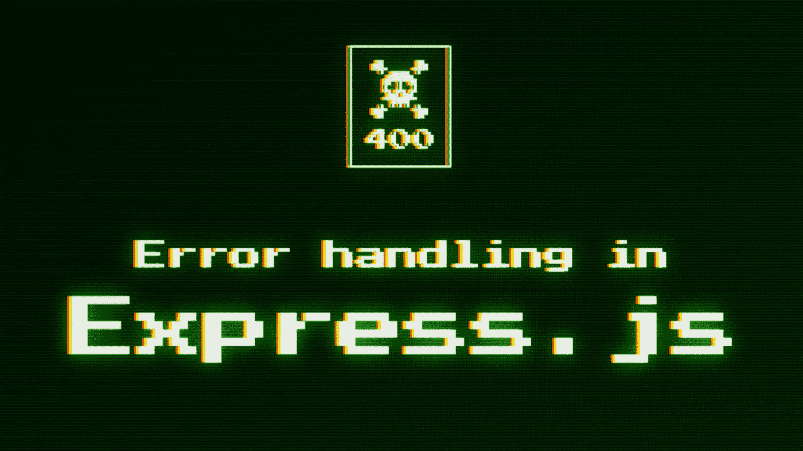
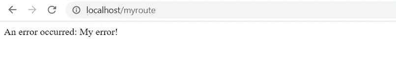

# Express.js 中异步代码的错误处理方法

> 原文：<https://betterprogramming.pub/two-error-handling-methods-for-asynchronous-code-in-express-js-72feb82d4f2>

## 从一开始就培养这项重要的技能

错误处理是软件开发中最重要的部分之一，然而它经常得不到应有的重视，尤其是对于新开发人员来说。因此，在使用 Express.js 时，我们将看到两种不同的错误处理方法，这是最流行的 JavaScript 服务器端框架。

因为 Express.js 默认负责同步代码的错误处理，所以我们将只讨论异步代码，例如，如果我们调用这个使用同步处理函数的路由。

Express 的默认内置错误处理程序会处理错误，我们的应用程序会继续运行。

但是，如果我们使用 async/await 处理函数运行相同的路由，我们会得到以下结果:

我们的应用程序崩溃并退出。

所以，让我们开始吧。

# 使用中间件功能的错误处理

Express.js 中的中间件函数是在服务器收到请求之后、响应发送到客户机之前执行的函数。它们是从上到下顺序触发的，通过用 `next()`函数相互调用，它们按照这个顺序移动。

因此，如果我们在路由的底部创建一个中间件，它可以作为我们处理所有错误的点，只要一有错误发生就调用它。

现在，让我们创建这个中间件，并把它放在我们路线的底部。

让我们将最后一个例子改为包含一个 try/catch 块，然后在出现错误时调用该中间件。

我们的应用程序现在看起来像这样:

现在，如果我们运行这条路线，我们会收到错误处理程序中间件发送的消息，我们的应用程序会继续运行。

您还可以定制发送到错误处理程序的错误对象，方法是在使用`next()`函数发送之前修改它。例如，如果我们想要生成状态代码，我们可以根据错误的来源做出相应的更改。我们可以先截取错误，如下所示:

# 使用包装函数的错误处理

当使用前面的方法来处理我们的错误时，有一个不便之处，那就是必须在我们所有的路由上使用 try/catch 块。因此，在这个方法中，我们可以通过创建一个包含 try/catch 块的包装函数来避免这种情况，并在其中调用我们赋予它的处理函数。然后，我们将所有的路由处理程序封装在这个函数中，这样我们只需尝试/捕捉一次，就有了一个集中的地方来处理我们的错误。

所以，让我们创建我们的包装函数，并命名为`handleCall`。代码如下:

如您所见，包装器函数返回将被传递给路由的处理程序，在它内部，我们调用包含我们的逻辑的实际处理程序。

所以现在我们的应用程序看起来像这样:

正如你所看到的，我们将处理函数包装在`handleCall`中，我们不需要使用任何 try/catch 块。我们还像前面的例子一样发送了一个定制的错误对象。现在，如果我们调用该路由，我们将收到与之前方法相同的响应，我们的应用程序也将继续运行。

就是这样。我们探索了两种方法，可以用异步代码处理 Express.js 上的错误，您可以选择自己更喜欢的方法。

我希望这篇文章对你有帮助。如果你有任何进一步的问题，请在评论区留下，我会尽力回答。