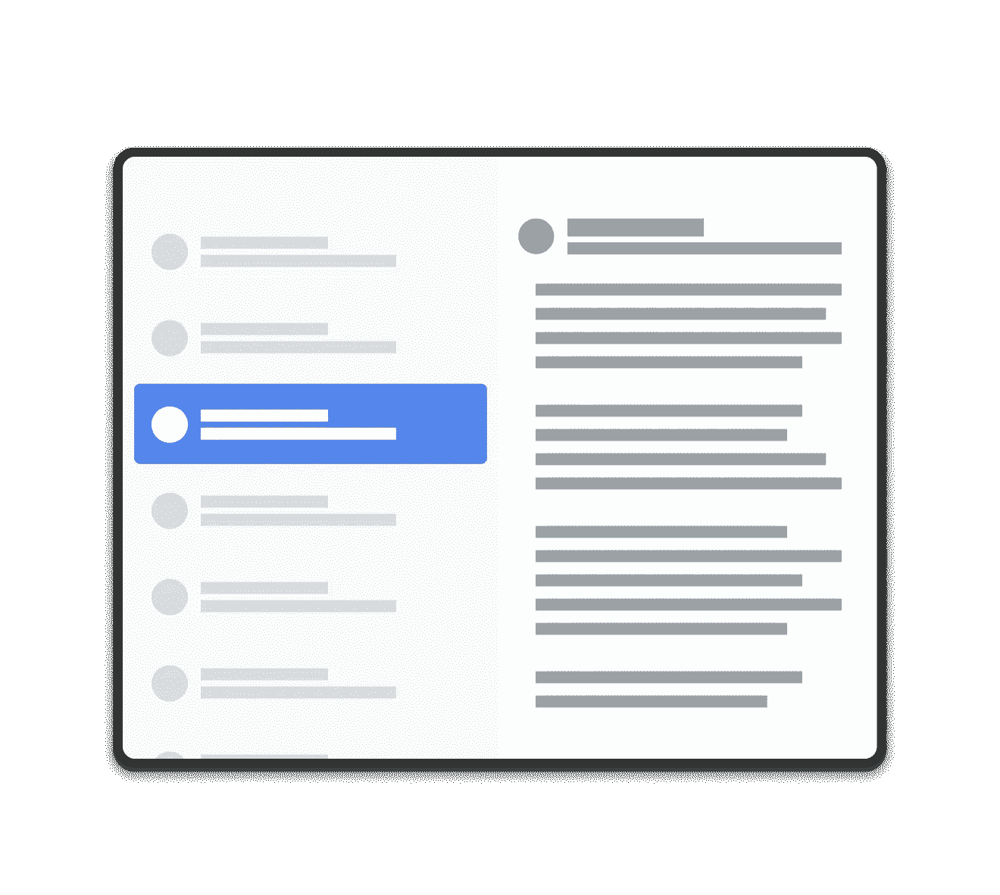

# 适用于大型设备的双盘布局

> 原文：<https://betterprogramming.pub/two-pan-layout-for-larger-devices-d84cd5c5340e>

## 为定制尺寸创建的更简单方法


照片由[和](https://unsplash.com/@andriklangfield?utm_source=medium&utm_medium=referral)在 [Unsplash](https://unsplash.com?utm_source=medium&utm_medium=referral) 拍摄

# 介绍

在当今时代，构建一个响应屏幕尺寸和美观的移动应用程序至关重要。移动设备和平板电脑的相同设计将不再适用。像 Google-Nest，Byjus 学习设备等新设备。，正在推出不同屏幕尺寸的定制 Android 版本。我们比以往任何时候都更需要开发能够适应不同屏幕尺寸的应用。

说到移动设备，大多数时候单个平面布局就足以获得更好的 UX 体验。但是对于大型设备，我们必须利用屏幕空间来获得更好的用户界面和 UX 体验。你会发现 Android 上的 Gmail 应用程序也有类似的方法。在移动和平板设备上尝试一下。

例如，考虑移动设备上的聊天应用程序。如果我们在第一个屏幕上显示以前的聊天列表，在另一个屏幕上显示实际的聊天，效果会更好。但当涉及到更大的设备时，如果我们将它们并排显示，这将使用户体验更上一层楼，这就是所谓的双面板布局设计。先前的聊天列表将位于左侧面板，聊天详细信息将位于右侧面板。



双锅布局设计。来源:Android 开发者网站

# 技术方面

理论上，双锅布局增加了用户体验的价值，但当涉及到技术部分时，这是一个棘手的事情。我们不应该违反关注点分离的原则——这意味着我们必须根据逻辑和 UI 分别维护列表和细节屏幕。尽管如此，他们应该能够在一个屏幕上工作。

下一个复杂性是在同一布局中使用两个片段。为此，我们必须使用`SlidingPaneLayout`。`SlidingPaneLayout`将是列表片段的根。`SlidingPaneLayout`下面应该有两个孩子:

1.  第一个孩子将充当左平移视图。在我们的例子中，它是一个显示项目列表的`recyclerview`。
2.  第二个孩子将充当右平移视图。在我们的例子中，它是一个细节片段。

`SlidingPaneLayout`的优点是它使用两个窗格的宽度来决定是并排显示窗格还是重叠显示。假设，如果左、右全景的最小尺寸分别为`250dp`和`400dp`，那么只有当总屏幕尺寸等于或大于`650dp`时，并排视图才会出现。

理论说够了。让我们开始吧。

# `SlidingPaneLayout`配置

让我们从父片段 XML 配置开始，它包含一个带有两个子片段的`SlidingPaneLayout`根布局:

1.  `Recyclerview`代表物品清单。
2.  `FragmentContainerView`放大你选择的细节片段或导航图。

看一下代码:

我们可以在根或列表片段中扩展这个 XML，您可以从数据源获取列表并通过`recyclerview`发布它。

# 右平移功能

一旦通过`recyclerview`发布了列表数据，下一个工作就是每当用户点击任何列表项时，只更新右边的 pan 细节`contrainerview`。

当涉及到正确的 pan 时，有两种场景，要么开发人员可以膨胀单个片段，要么他们可以膨胀复杂实时用例的导航图。首先，让我们从一个简单的用例开始，膨胀一个单独的片段，每当用户点击列表项时更新它。

## 单一片段用例

让我们首先创建一个名为`openDetails`的函数，它只接受一个参数，即被单击项的数据类。看一下代码:

在这里，我们维护片段事务，而不使用任何导航组件，这很好，因为我们正在处理一个更简单的用例。请记住，我们使用`replace`片段事务，而不使用任何`[addToBackStack()](https://developer.android.com/reference/androidx/fragment/app/FragmentTransaction#addToBackStack(java.lang.String))`功能来避免有意构建`backstack`。

## 导航图用例

有些情况下，开发人员想要集成一个流，这意味着一组片段，而不是单个片段。在这种情况下，我们可以创建一个导航图，并将其附加到 details 容器视图。所有的导航都可以发生在图形中。

XML 更改:

```
<androidx.fragment.app.FragmentContainerView
        android:id="@+id/two_pane_container"
        android:layout_width="match_parent"
        android:layout_height="match_parent"
        <!-- The navigation graph for your detail pane.-->
        app:navGraph="@navigation/details_nav_graph" />
```

现在，每当用户点击列表项时，我们通过`setPopUpTo`弹出图中所有嵌套的导航，并导航回起始目的地。看一看:

# 用`SlidingPaneLayout`配置系统返回点击

当涉及到移动设备时，`SlidingPaneLayout`将列表与细节片段重叠，因为屏幕尺寸将小于所需的最小宽度。在这种情况下，当用户单击系统 back 按钮时，期望是关闭 details 面板并移回列表。

处理向后导航是开发人员的责任。我们可以通过将`[OnBackPressedCallback](https://developer.android.com/reference/androidx/activity/OnBackPressedCallback)`与面板的当前状态联系起来来做到这一点。让我们从创建一个客户`[OnBackPressedCallback](https://developer.android.com/reference/androidx/activity/OnBackPressedCallback)`开始。看一下代码:

现在我们需要使用`[addCallback()](https://developer.android.com/reference/androidx/activity/OnBackPressedDispatcher#addCallback(androidx.lifecycle.LifecycleOwner,%20androidx.activity.OnBackPressedCallback))`将我们的自定义回压回调添加到`[OnBackPressedDispatcher](https://developer.android.com/reference/androidx/activity/OnBackPressedDispatcher)`中。看一下代码:

还有一件事，我们需要注意的是移动设备上的滑动平移是锁定滑动行为，因为这是一个不同的移动 UX 屏幕。这完全基于您的用例。

```
binding.slidingPaneLayout.lockMode = SlidingPaneLayout.LOCK_MODE_LOCKED
```

# 奖金

[](/8-common-mistakes-in-android-development-2edcf5179ec0) [## Android 开发中的 8 个常见错误

### 构建优秀应用程序的陷阱

better 编程. pub](/8-common-mistakes-in-android-development-2edcf5179ec0) 

目前就这些。希望你学到了有用的东西。感谢阅读！