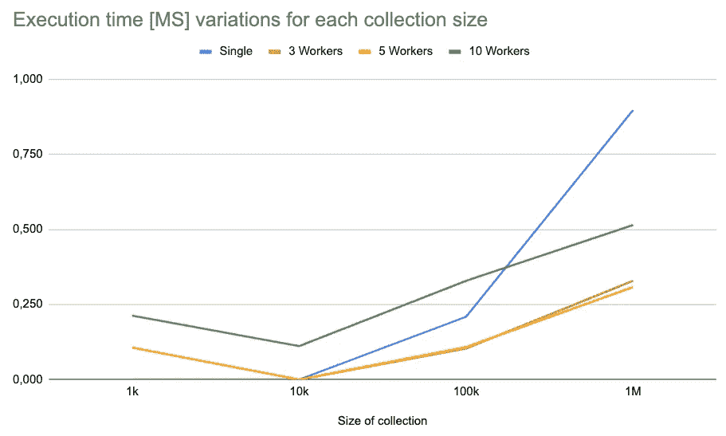
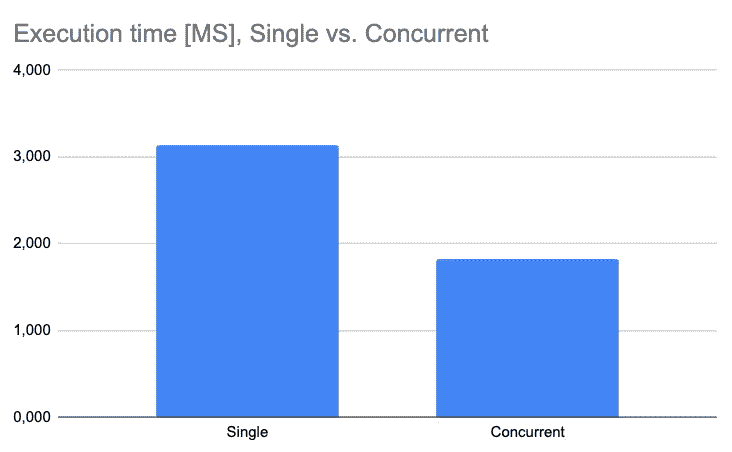

# 两个简单的例子展示了在 Go 中何时使用并发

> 原文：<https://betterprogramming.pub/two-quick-examples-that-show-when-to-use-concurrency-in-go-38920a9aa0e5>

## 并发编程快速回顾

照片由[阿金·卡金纳](https://unsplash.com/@akin?utm_source=medium&utm_medium=referral)在 [Unsplash](https://unsplash.com?utm_source=medium&utm_medium=referral) 上拍摄

并发性是编程中最常见和最重要的概念之一，目前已经变得越来越流行。这是一些编程语言自然支持的另一种资源(例如 NodeJS、Go ),使其易于使用。并发性允许定义一组独立执行的任务(至少直到某个时刻)，这样它们就不会阻塞任何其他任务。

通过实现并发行为，程序可能会在性能、执行时间和资源利用方面表现出巨大的改进。

然而，情况可能并不总是这样，正如我经常提到的，有些情况下，特定的技术并没有被设计来支持。我举了几个例子来说明并发性如何提高或降低程序的性能。这些例子是用 Go 编程语言构建的，Go 编程语言本身支持并发性，但是希望它们易于理解，也适用于任何其他编程语言。

# 示例#1:总和计算

首先，让我向您介绍一个非常基本和简单的任务:将一个整数集合中的所有数字相加，计算出总数。这是一个很常见的任务，肯定可以用特定的数组库或类似的工具来解决。让我们首先使用无并发方法在 Go 中对其进行编码。这是我的版本:

无并发的整数总和计算

现在，对于它的并发版本，我使用一个工人池来容纳每个工人。一个 worker 代表一个将被并发运行的任务。这个程序期望的输入之一是`workersNum`，它定义了将负责对原始集合的一个块求和的任务的数量。

所以，如果`workersNum=5`并且集合有十个整数，那么每个 worker 将对两个整数求和。还有一个额外的工作人员收集彼此的结果，并将它们相加得到总数。这种方法的代码如下:

使用并发进行整数总和计算

我为`workersNum`尝试了不同的集合大小和不同的值。在收集了多个结果后，这些是我得到的平均值:

不同收集规模和工作人员数量的平均结果

# 例 2:执行四个独立的任务

对于这个例子，让我们假设我们有一个程序运行 4 个相互独立的任务。为了简单起见，假设任务是:将所有的数字相加，找到最大的数字，找到最小的数字并计算一组数字的平均值。使用无并发方法，我们将依次运行这些任务，一个接一个。这看起来是这样的:

无并发情况下解决 4 个独立任务的代码

现在，假设这些任务相互独立，我们可以利用并发性同时运行它们:

我们可以同时运行这 4 个任务，假设它们之间互不依赖

因为这里我总是使用相同数量的工作线程，所以我只重复执行两个版本来收集足够的关于执行时间的数据。这些是我从每种方法的十次执行中得到的平均结果:

每个版本 10 次执行的平均执行结果

# 结论

从这些非常基本的实验中，我们可以得出一些关于并发使用的结论:

## 从实施例#1 中

对于小型集合，单线程(无并发性)方法似乎比其他方法更快。这是因为每个工作者必须由编程语言来设置，这通常包括调用操作系统进程、分配内存以及同步它们中的每一个。

这个设置过程也消耗 CPU 时钟，由于要做的工作量很小，我们可以说它在设置上浪费的时间比运行任务本身要多。当集合的大小很大时，整个情况会发生变化，因为现在这样的集合是值得分块处理的。

然而，我们可以看到`3`和`5`似乎是`numWorkers`更合理的值，因为使用它们，设置工作比使用`10`花费的时间更少。

## 从实施例#2 中

没什么好说的。假设所有的任务都是独立的，那么最好的方法就是同时运行它们。结果图不言自明:并发方法比单线程方法花费的时间少了将近 50%。

尝试明智地使用并发。它作为一种非常现代和奇特的资源吸引了程序员的注意，但它可能并不适合您面临的所有情况。注意那些由许多可以独立运行的任务组成的任务，这些任务需要做大量的工作。对于依赖任务，您将会体验到使用并发性的局限性，而对于快速任务(比如对集合中的 1000 个数字求和)，使用并发性是没有意义的。

希望这篇文章对回顾一些并发概念以及何时使用这个强大的资源有足够的帮助！感谢您的阅读，并保持联系以获取更多信息！