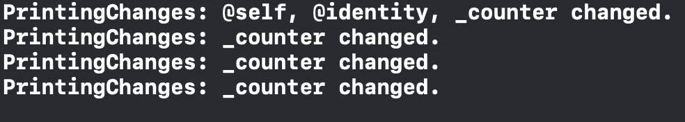

# 两个 SwiftUI 调试助手，您可以立即开始使用

> 原文：<https://betterprogramming.pub/two-swiftui-debugging-helpers-you-can-start-using-right-away-26d25630c0cf>

## 打印更改和自定义调试修饰符

Nubelson Fernandes 在 [Unsplash](https://unsplash.com/photos/gTs2w7bu3Qo) 上拍摄的图片

# SwiftUI 内部 API 方法——“Self。_printChanges()"

SwiftUI 提供了一个非凡的、仅用于调试的方法，我们可以用它来区分是什么更改使视图重新加载了自己。这个策略显然是为了调查。当你看到一个视图正在重新激活它的身体属性，但你不知道为什么的时候，这是非常有用的。

打印更改

从上面的代码中可以注意到一些事情:

*   因为`_printChanges()`是一个静态方法，所以需要`Self`。
*   `Self._printChanges()` —应该叫体内属性。这意味着您必须在普通视图代码中添加一个显式的 return 关键字。
*   默认情况下，所有视图都有`_printChanges()`
*   以下划线(`_`)开头的函数和属性是私有 API 的一部分，因此您不会看到任何相关文档。

从上面的例子中，当你开始点击按钮时，你会在控制台中看到一些东西。这意味着某个特定的属性发生了变化。这意味着 SwiftUI 正在呈现视图，因为属性更改与 UI 有关。

控制台输出

当你在一个应用上工作时，你将使用不同的属性包装器，这将导致视图多次渲染，如果你使用`Self._printChanges()`你将看到多个视图被打印出来，但不要担心，按照苹果的说法，它们相当轻，这会影响你的应用性能。

## 重要的

当属性发生变化时，如果几何体需要重新评估，SwiftUI 将只呈现您的视图。
如果您在视图中使用的任何状态变量未用于您的 UI，您将不会察觉到为该视图打印的任何更改，SwiftUI 也不会呈现该属性。

当使用`print()`打印一个`State` 属性时，SwiftUI 将重新呈现您的视图，因此避免使用`print`而开始使用`_printChanges()`

*请记住，你的应用必须在 iOS 15 上才能使用这个 API。*

# 使用彩色背景

当你在一个屏幕上处理不同的 UI 组件时，有时会非常混乱，你不知道每个组件在堆栈中占了多少空间。

确定这一点的一种方法是选择元素，您可以看到该元素在评论中有所体现，但这并不总是那么容易，我们无法经常查看它。

我通过在我的视图上使用“只调试背景色”修改器解决了这个问题，这样我就可以看到视图上的颜色并适当地改变它们。

仅调试背景色

你这样使用它:

我希望这能帮助你解决一些问题。如果你在这里有什么调试的想法，请告诉我。此外，如果您对学习 SwiftUI 中的技巧和诀窍感兴趣，请查看这篇[文章](/swiftui-tips-and-tricks-57b3d2f027d2)。谢谢你，祝你好运。