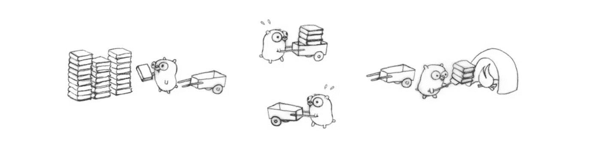
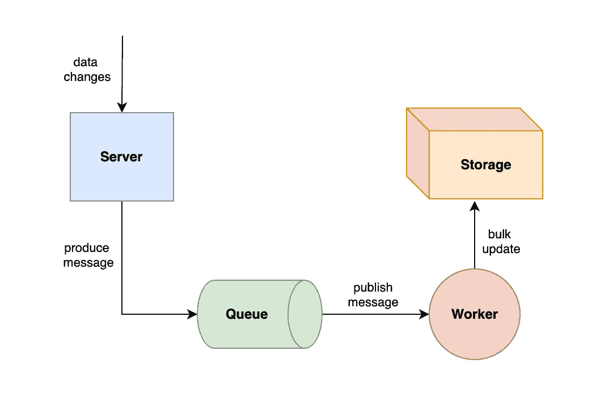
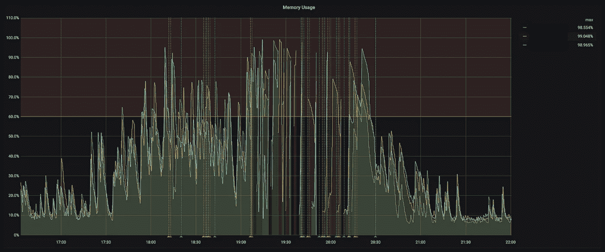
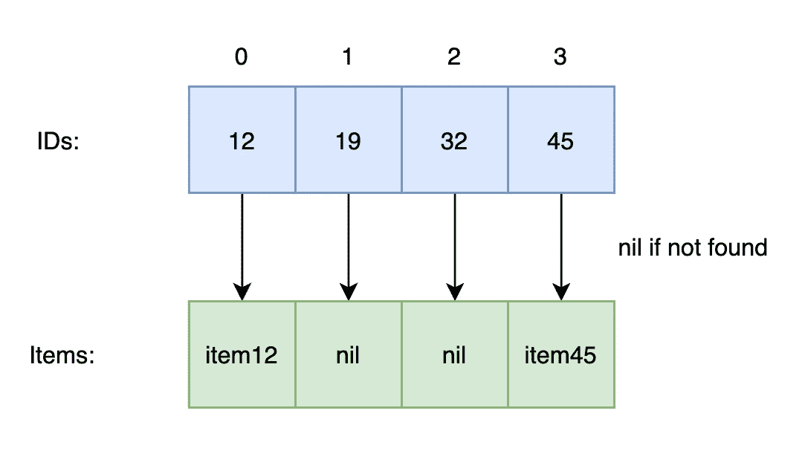
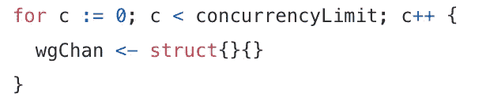

# 更好地处理 Go 并发的两个技巧

> 原文：<https://betterprogramming.pub/two-tips-to-better-handle-go-concurrency-d369b86a32f4>

## 以下是我在 goroutines 上犯的两个错误，以及如何避免它们。


[斯蒂夫·约翰森](https://unsplash.com/@steve_j?utm_source=unsplash&utm_medium=referral&utm_content=creditCopyText)在 [Unsplash](https://unsplash.com/s/photos/parallel?utm_source=unsplash&utm_medium=referral&utm_content=creditCopyText) 上拍照

大多数 Go 开发者可能会同意，Go 使得实现并发变得**毫不费力**。通过 goroutines 和 channels，我们可以轻松地一起运行独立的功能，安排后台任务，等等。

当我在 Go 中处理大型系统时，拥有 Go 优雅而丰富的并发支持是一件幸事。它帮助我加快了数据处理速度，最大限度地利用了硬件资源。



来源: [Go Talks](https://talks.golang.org/2012/waza.slide#1)

但是，正如本·帕克曾经说过的，

> 强大的🕸 ️伴随着巨大的责任…

没有比这更真实的话了。尽管它们功能强大，但很容易被滥用。我目睹并犯了几个错误。他们中的一些人已经造成了生活，生产问题！

在本文中，我将与您分享两个有用的技巧，它们可以帮助您更智能地使用 goroutines。这些建议来自实际事件，所以系好安全带，让我们开始吧！🏃

# 使用并发限制

并发的一个用例是在后台执行昂贵的任务，而不阻塞主逻辑流。这样，我们的代码可以(几乎)一起处理许多这样的任务，而不是让它们等待轮到自己。

高开销任务的一个例子是在数据存储中批量插入或更新数据。

让我们看一个简单的系统。每当有数据更改时，服务器都会向队列发送消息。然后，工作人员将使用这些消息，将它们分组，并将其发送到存储器进行更新。



异步更新的经典例子

工人的代码可能如下所示。这是非常简单的，但它的要点是存在的。

```
type Message struct {
  // Contain data updates
}

type Worker struct {
  msgChan          chan *Message // channel to receive messages from queue
  batch            []*Message    // a batch of messages
  maxBatchSize     uint32        // the maximum size of the batch
}

func newWorker() *Worker {
  return &Worker {
    msgChan:      make(chan *Message, 10000), // an internal queue size of 10000
    maxBatchSize: 5000,
  }
}

// Start the worker
func (w *Worker) start() {
  go w.consume()   // a goroutine to consume
  go w.process()   // a goroutine to process

  // Do something else...
}

// Runs in a loop to consume from queue
func (w *Worker) consume() {
  for {
    // blocks until there is a message
    msg := consumeFromQueue()
    w.msgChan <- msg 
  }
}

// Runs in a loop to process messages
func (w *Worker) process() {
  var batch []*Message

  for {
    // blocks until there is a message
    msg := <- w.msgChan

    batch = w.batch
    if batch == nil {
      batch = make([]*Message, 0, w.maxBatchSize)
    }
    batch = append(batch, msg)

    // only commit when batch is full
    if len(batch) < w.maxBatchSize {
      continue
    }

    // batch update
    go func(batch *[]Message) {
      updateDataByBatch(batch)
    }(batch)

    w.batch = nil // start new batch
  }
}
```

注意每批数据是如何在其 goroutine 中处理的。通过这种设计，大量涌入的消息将不会被阻塞，工作人员可以以非常快的速度处理它们。

你能看出这个设计中的缺陷吗？

每批消息都会占用 worker 中的内存。只有在 goroutine 完成其批次后，即`updateDataByBatch`返回后，内存才会被释放。

如果在大量消息涌入期间`updateDataByBatch`有延迟，那么 goroutines 将开始堆积。由于它们每个都保存一批数据，这可能会导致内存消耗溢出。

下面是我为我的员工设置的内存监控。在高延迟事件中，您可以看到内存使用的持续峰值。它甚至接近 100%的使用率，导致内存不足和服务器崩溃。



三个工作实例内存溢出

这是一个经典的性能 bug，解决方法非常简单。我们只需要应用并发限制。

并发限制限制了一个程序在执行任务时可以拥有的线程数。在上面的例子中，我们需要限制调用`updateDataByBatch`时可以存在的 goroutines 的数量。

这种限制可以通过使用空结构`struct{}`类型的通道来实现。

```
const concurrencyLimit = 300

type Worker struct {
  // ...
  wgChan chan struct{} // a channel to limit concurrency
}

func newWorker() *Worker {
  return &Worker{
    // ...
    wgChan: make(chan struct{}, concurrencyLimit), // a max of 300 goroutines
  }
}

func (w *Worker) process() {
  var batch []*Message

  for {
    // ...

    // blocks unless there is space to start a new goroutine
    w.wgChan <- struct{}{}

    go func(batch *[]Message) {
      defer func() {
        <- w.wgChan // goroutine is done!
      }()

      updateDataByBatch(batch)
    }(batch)

    // ...
  }
}
```

在上面的改进版本中，`wg`代表**等待组**。`w.wgChan <- struct{}{}`要开创一个新的辉煌，就必须成功。如果它阻塞，这意味着 goroutines 的数量已经达到极限。

当一个 goroutine 完成时，它通过一个延迟函数清空`wgChan`通道中的一个空间。这允许其他被阻塞的 goroutines 继续执行它们的任务。

通过限制 goroutines 的数量，我们还可以限制 worker 中可以存在的挂起数据批的数量。这样就不太可能发生内存溢出。

# 优雅地终止 Goroutines

除了批量更新数据之外，过滤大量数据也是一项昂贵的任务。

特别是，给定一部分惟一的 id，我想检查它们是否都存在于数据存储中。如果是，我想检索它们对应的值，并将它们放在一个新的片上，与它们的 id 在同一索引处。



将结果存储在与 id 相同的索引中

最简单的方法是遍历每个 ID 并在存储中搜索它们。但是，我们是 Go 开发者，所以让我们旋转几个 goroutines 并同时搜索每个 ID！

```
type Item struct {
  id    int
  value string
}

func getItems(itemIDs []int) ([]*Item, error) {
  var (
    concurencyLimit = 100 // set the limit!
    wgChan          = make(chan struct{}, concurencyLimit)
  )

  ctx := context.Background()
  ctx, cancel := context.WithTimeout(ctx, 5*time.Second) // set timeout
  defer cancel()

  items := make([]*Item, len(itemIDs))

  for i := range itemIDs {
    select {
      case <- ctx.Done():
        return nil, errors.New("timeout!") // return error if timeout
      case wgChan <- struct{}{}:
    }

    go func(i int, itemID int) {
      defer func() {
        <- wgChan // goroutine done!
      }()

      //get item by ID, returns nil if not found
      item := getItem(itemID)

      // place at the same index as itemID
      items[i] = item
    }(i, itemIDs[i])
  }

  // wait for all goroutines to finish
  for c := 0; c < concurrencyLimit; c++ {
    wgChan <- struct{}{}
  }

  return items, nil
}
```

对于每个`itemID`，我们将启动一个新的 goroutine，在数据存储中搜索相应的项目。在函数退出之前，我们必须确保所有正在运行的 goroutines 都已退出。

这就是所谓的优雅终止。可以用下面的循环来实现。



优雅的终结

在任何时间点，我们最多只能有`concurrencyLimit`个 goroutines。当循环无阻塞地完成时，它保证所有 goroutines 都已退出。然后，该函数可以安全退出。

如果没有优雅的终止会怎么样？除了返回不完整的结果之外，该函数很可能会因索引超出范围错误而死机。

这是因为任何运行中的 goroutine 将尝试在位置`i`索引`items`切片。但是，因为功能已经退出，`items`片不再存在！

这是给你的一个测试。我已经删除了一些代码，使功能出错。如果你想找出问题所在，请在此暂停。


照片由[阿丽亚娜·苏亚雷斯](https://unsplash.com/@arianassphotography?utm_source=unsplash&utm_medium=referral&utm_content=creditCopyText)在 [Unsplash](https://unsplash.com/s/photos/cookie?utm_source=unsplash&utm_medium=referral&utm_content=creditCopyText) 拍摄

当**上下文在 5 秒钟后**超时时，`getItems`功能没有正常终止！如果任何 goroutines 在从存储中获取数据时出现延迟，它将会死机。

这表明从头到尾完全理解每个 goroutine 在程序中的行为是多么重要。

# 最后的想法

并发编程之所以具有挑战性，是因为我们的大脑更善于理解顺序流动的事物。当小程序在一个程序中运行时，很难预料到意想不到的事情！

通过严格遵守我提供的两个建议，你就可以避免一些新手在使用 goroutines 时可能犯的错误。提高并发编程的唯一方法是练习和阅读更复杂的代码。

你对 goroutines 的体验如何？你有什么建议想分享吗？让我知道！