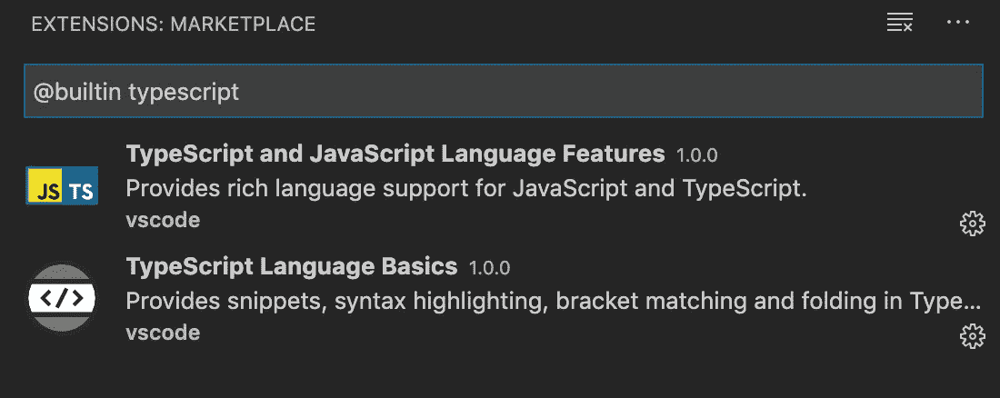
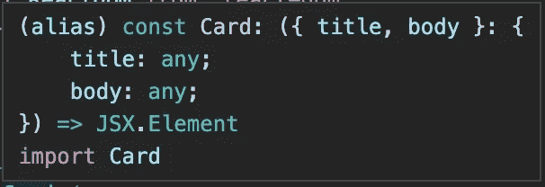
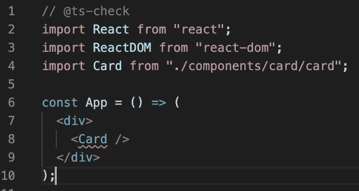
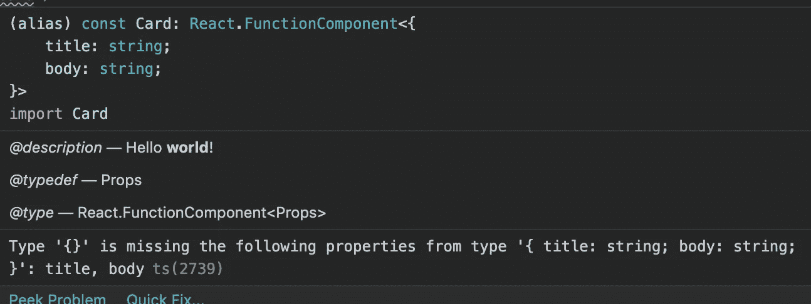
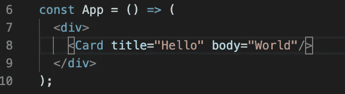
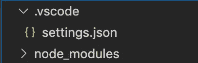

# 在没有 TypeScript 的 VS 代码中进行类型检查

> 原文：<https://betterprogramming.pub/type-checking-in-vscode-without-typescript-eba92161cd08>

## 但你会问，怎么做呢


布莱克·维斯兹在 [Unsplash](https://unsplash.com/s/photos/check?utm_source=unsplash&utm_medium=referral&utm_content=creditCopyText) 上的照片

# 前言

当开始一个新的团队项目时，提到 TypeScript 可能会令人生畏，尤其是对于那些不熟悉类型化语言概念的人。

如果我说我没有得到它，那我是在撒谎。这是一种影响整个文本编辑器的开发依赖——它用红色强调看似随机的函数调用和变量；用含糊的警告、接口、联合和枚举填充 VS 代码提示？我的天啊。

对一个几乎没有或根本没有 TypeScript 经验的团队来说，这是一个很大的承诺，但幸运的是，我们有办法在不安装任何开发依赖的情况下包含 TypeScript 提供的一些价值——或者迫使整个团队致力于一个可怕的 JavaScript 超集。

# *但是如何？*

TypeScript 语言特性实际上是内置在 VS 代码中的。不相信我？看看这个:



内置的类型脚本语言功能

VS Code+[JSDoc](https://jsdoc.app/)+TypeScript 的结合允许我们通过 JSDoc 注释来表达类型，并在普通的 JavaScript 文件中使用 TypeScript 来执行类型检查。这在 [VS Code 的官方文档](https://code.visualstudio.com/docs/nodejs/working-with-javascript#_type-checking-javascript)中有所涉及。

# 入门指南

本教程需要的内容:

*   VS 代码
*   React(可选，因为这些原则可以应用于任何 JS。)

太棒了。现在，让我们创建我们的第一个文档—一个卡片组件(Card.jsx)！

让我们将卡导入 App.jsx:

当您将鼠标悬停在`<Card/>`上时，VS 代码应该会自动生成一个包含推断函数签名的提示，如下所示:



有两件事需要注意:

1.  编辑没有提供任何表明`<Card/>`需要道具的反馈。
2.  道具的属性类型为`any`。

# 类型推理

有多种方法可以增强类型推断。

ES6 默认参数(不要与`Component.defaultProps`混淆):

默认参数将*必需属性*应用于您的函数签名。

这意味着当类型检查被激活时,`<Card/>`组件将会以红色下划线来表示需要道具，提示将会告诉你到底需要什么。

析构默认值:

析构默认值被解释为*可选参数*。这可以通过启用类型检查来验证——您会注意到`<Card/>`没有下划线。

最后，JSDoc 注释:

JSDoc 注释的优点是类型定义非常明确。

它是 TypeScript 通过 VS 代码进入您的 JavaScript 应用程序的后门——这意味着用类型进行注释并记录您的签名与在 TypeScript 中编写类型和接口并记录签名几乎是相同的。

[*哪里写的*和](https://www.typescriptlang.org/docs/handbook/type-checking-javascript-files.html)*有一点不同。*

# *类型检查*

*提示和注释是很棒的，但是为了进一步防止我们的应用程序变得愚蠢，让我们把它提高一个档次，启用可怕的红色下划线。*

## *每个文档的类型检查*

*在`App.jsx`中，将以下内容添加到文档顶部:*

```
*// @ts-check*
```

*这使 TypeScript 能够在发现问题时提供直观的反馈，如下所示:*

**

*在我的例子中，`<Card/>`正在使用 JSDoc 注释。让我们来看看提示:*

**

*让我们修复这个错误:*

**

## *类型检查工作区*

*`// @ts-check`可能会很繁琐。如果我们希望类型检查在整个工作区持续进行，而不需要在每个文档的顶部添加`// @ts-check`，会怎么样呢？*

*创建以下目录+文件:*

```
*.vscode -> settings.json*
```

**

*在`settings.json`内，添加以下内容:*

```
*{
    "javascript.implicitProjectConfig.checkJs": true
}*
```

*类型检查现在应该发生在整个项目中。*

# *其他建议*

*当使用 JSDoc 时，可以在文档的顶部定义公共的 typedefs 并重用，如下所示:*

*感谢阅读。我希望这对你有所帮助！*