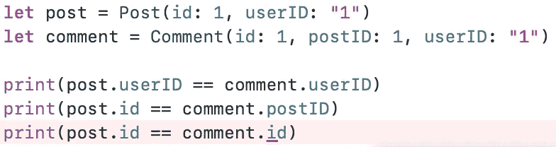
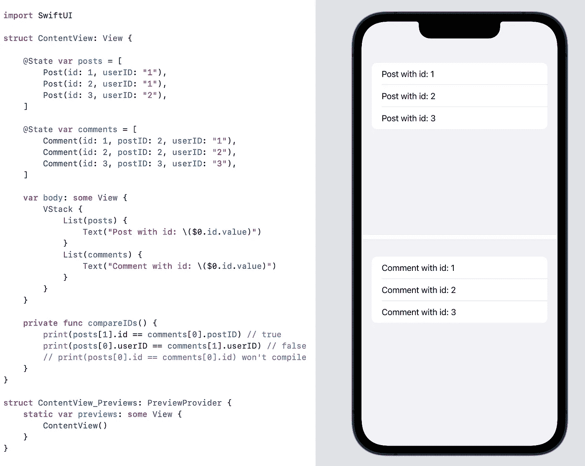

# 探索 Swift 中的类型安全标识符

> 原文：<https://betterprogramming.pub/type-safe-identifiers-in-swift-d8eb96da647d>

## 使用可识别的协议


> 请注意，这个实现使用了仅在 iOS 13+上可用的`**Identifiable**`协议，因此您可能会尝试使用一个“剥离”版本，而没有针对旧系统的特定一致性。

## 问题是

简单来说， *an* *identifier* 是一个字符序列，对于某一类型的模型是唯一的。

例如，如果您的应用程序中有一个用户模型，并且它有一个 ID 属性，那么可以保证它的值在一组用户模型中不会出现超过一次。

让我们假设我们正在开发一个社交网络应用程序，用户可以在那里写帖子和发表评论。他们的假设模型是:

想象一下，出于某种原因，一方面用户拥有`String`标识符，另一方面帖子和评论使用整数 id。同样，用户没有问题，他们的 id 是唯一的。

然而，当涉及到其他模型时，就有一些陷阱。不仅一些帖子的 ID 可以等于一些评论的 ID，我们实际上还可以偶然比较它们。最大的问题是编译器无法帮助我们。

理想的结果是只能比较兼容的 id:



让我们尝试实现这种行为！

## 幻影类型

*Generics* 在 Swift 中确实非常强大。它们的众多应用之一是能够将它们用作幻影类型。简单地说，当一个类型被声明但没有被任何成员使用时，它就被称为*幻影*。

编译器只需要区分某些容器类型。这种 ID 容器的最简单实现是:

有点麻烦，你不觉得吗？这些 id 的声明和初始化过于冗长。

我们甚至不得不为每个模型引入一个伪枚举来使用一个标识符。让我们试着封装实现！

## 改进的解决方案

首先，应该使用 ID 类型的嵌套类型别名，这样我们就不必知道模型范围之外的 ID 类型。

我只想写一些类似`let post: Post.ID`的东西，而不用担心在幕后使用了什么。

第二，也许有办法摆脱伪枚举？也许:)

第三，让我们简化标识符的初始化。由于有了`ExpressibleBy...`协议组，这是可行的。

额外收获:我们可以让我们的模型兼容 SwiftUI 迭代机制，比如`ForEach`、`List`等。，开箱即用，只需加入`Identifiable`协议。

鉴于上述几点，下面是更新后的实现:

现在，让我们用 Swift 基本类型的文字表达能力来增强这个解决方案:

因此，我们可以像下面这样声明我们的模型:

最终，我们的模型可以这样使用:



# **结论**

整洁！这个实现可以用`Decodable`和您可能发现自己需要的任何东西来改进，但是这超出了本文的范围。

感谢阅读！

```
**Want to Connect?**Follow me on [Twitter](https://twitter.com/YBuslovsky), [LinkedIn](https://www.linkedin.com/in/yury-buslovsky-70540519b/), [GitHub](https://github.com/yurybuslovsky) and/or [Reddit](https://www.reddit.com/user/yury_buslovsky)!
```

[](https://www.linkedin.com/in/yury-buslovsky-70540519b/) [## 尤里·布斯洛夫斯基——iOS 开发者——阿尔法银行| LinkedIn

### 我开始是一名 React 原生开发人员，经过 6 个月的经验，我对 iOS 原生产生了兴趣…

www.linkedin.com](https://www.linkedin.com/in/yury-buslovsky-70540519b/) [](https://github.com/yurybuslovsky) [## 尤里布斯洛夫斯基-概述

### 此时您不能执行该操作。您已使用另一个标签页或窗口登录。您已在另一个选项卡中注销，或者…

github.com](https://github.com/yurybuslovsky)