# 瑜伽类型

> 原文：<https://betterprogramming.pub/type-yoga-typing-flexible-functions-with-typescripts-advanced-features-b5a282878b74>

## 使用 TypeScript 的高级功能键入灵活的函数

几个月前，我决定在我的库中添加 TypeScript 绑定。如果您不熟悉， *shades* 提供了一种快速和声明性地描述对象路径的方法，可以用来提取它的值，甚至不变地“修改”它(通过创建一个值已更改的新对象)。如果你想更多地了解这些坏男孩(我认为你应该了解)，你可以看看我在 Reactathon 的演讲。

但是我们如何输入如此灵活的函数呢？例如，`[get](https://github.com/jamesmcnamara/shades#get)` 可以将代表路径的可变数量的不同输入输入到一个对象中，并且仍然推断出该路径末端的输出类型:

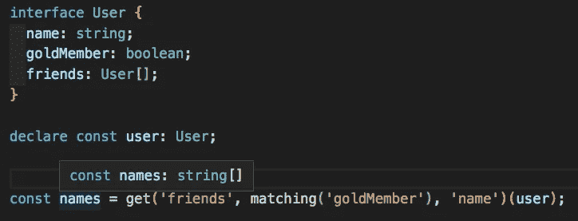

魔法

上图中，`get` 正在创建一个函数，该函数获取一个`User`对象，提取其`friends` 属性，过滤出仅具有`goldMember` 状态为`true`的用户，并从该列表中传递并选择出每个黄金会员的姓名。那最终的结果是什么？一个`string[]`。

更重要的是，`get`在传入 a `User` 之前创建了完成所有**的函数。这意味着它不知道它将对一个`User`进行类型检查。事实上，任何具有`friends`属性的对象，即具有`goldMember` 和`name` 属性的对象列表，都将使用新的 getter 函数，并生成该新对象上的`name`内容列表。**

那么我们如何给如此普通的东西赋予一个有意义的类型呢？嗯，如果我们看看这种新型吸气剂，它有点吓人。

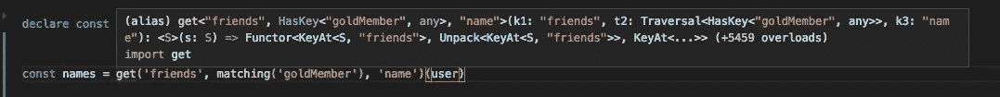

Wowzers

请继续关注我几分钟，我们将构建这个函数类型的完整版本，包括所有的附加功能。如果你从未用过*墨镜，也不用担心。我们将从头开始构建一切，我们将慢慢进入这个池，这样我们就不会失去任何人。您所需要的只是熟悉 TypeScript 及其一些特性。*

# 婴儿学步

我们将从创建一个简化版本的`get`开始。这个`get`只接受代表键的字符串，并产生一个新函数，该函数可以接受某个对象并从该对象中提取路径。

在我们开始输入之前，我们将创建一个名为`HasKey`的助手类型，这样就不会太混乱了。

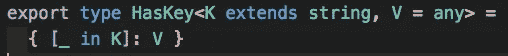

`HasKey` 是[映射类型](http://www.typescriptlang.org/docs/handbook/advanced-types.html#mapped-types)。它表示一个给定的字符串`K`映射到某个值的对象。注意，它带有第二个可选参数`V`，让我们在`K`指定类型，但它默认为`any`。

因此，如果我们想要定义一个类型`HasName` ，它有一个`name`属性映射到一个`string` **，**我们可以这样做:

`HasKey`是一个很一般的类型，一开始看起来不是特别有用。诀窍是我们可以在函数中使用它作为约束来保证我们的输入有我们需要的键。有了这些，我们就可以编写我们的第一个`get` 函数了。

## V1:线一直往下

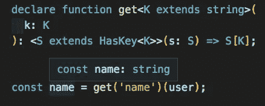

上面的函数接受一个字符串`K`并产生一个新函数，该函数接受任何对象，只要该对象将`K`作为键。这就是`HasKey`的神奇之处；我们可以用它作为一个`extends`子句的一部分，来强制我们得到的任何东西都有我们想要的密钥。那么结果类型就是`S`上`K`键的类型。

我们还可以将这些堆叠在一起，得到嵌套的访问器:

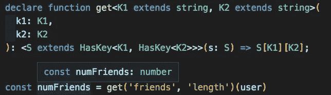

嵌套玩偶

注意我们现在如何使用可选的第二个参数`HasKey`？我们指定我们的输入`S`必须是一个带有某个键`K1`的对象，它本身是一个带有某个键`K2`的对象。我们可以不断重复这个过程，以保证任何数量的关键点和任何深度路径。

# s[现在怎么办？]

返回类型中的那个`S[K]`可能不熟悉。它被称为索引类型。这是 TypeScript 的一个内置特性，它允许我们在事先不知道某个对象的键的情况下一般地引用该键的类型。虽然它在我们上面的例子中工作得很好，但坏消息是当我们开始将更多抽象路径如[遍历](https://github.com/jamesmcnamara/shades#traversals)和[虚拟透镜](https://github.com/jamesmcnamara/shades#virtual-lenses)混合到我们的 getters 中时，它将无法处理。

好消息是，TypeScript 为我们提供了滚动我们自己的索引类型所需的工具，这些索引类型将与我们需要的任何值组合一起工作。银弹是[条件类型](http://www.typescriptlang.org/docs/handbook/advanced-types.html#conditional-types)。

条件类型就像类型的 if 语句。事实上，他们正是如此。它们让你问一个关于类型的问题，并根据答案返回不同的类型。我们可以用它来创建我们自己的索引类型`KeyAt`。

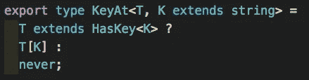

`KeyAt`接受一个对象和一个字符串，如果该对象将该字符串作为键，则返回该键的类型。如果没有，它只是返回`never`，一个(顾名思义)永远不可能存在的内置类型。当密钥丢失时，`KeyAt`仍然可以做**某事，** 这一事实将允许我们在这样的情况下使用它:我们知道一个对象将有正确的密钥，但是 TS 在没有一点帮助的情况下无法证明它。这将是编写更复杂的`get`函数的关键。

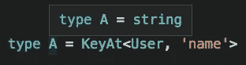

KeyAt 的作用类似于类型的函数

## V2:打他们

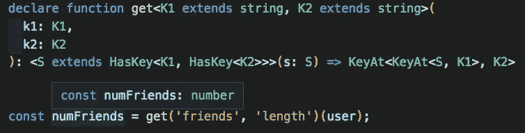

这个版本几乎相同，除了它使用了我们在新的`KeyAt`中使用的`HasKey`的嵌套技巧。注意嵌套发生在相反的方向:我们询问什么对象是`KeyAt<S, K1>`，从结果中，我们将提取`K2`。

我们现在已经创建了一个函数，它接受一个或两个字符串，并产生一个访问器函数，该函数可以接受任何具有给定键的对象，并从中提取正确的类型。我们已经创造了一些相当灵活和真实的世界，我们应该给自己拍一下背。

现在我们到了真正要开始用煤气做饭的时候了。

# **遍历**

[Traversals](https://github.com/jamesmcnamara/shades#traversals) 表示一种方法，用于过滤我们沿途遇到的对象集合，并继续从集合中的单个对象中提取值，将结果汇总到输出的集合中。例如，在我们的 intro 中，`matching`是一个遍历，它将`friends`列表过滤为仅具有黄金会员身份的用户，然后我们能够将他们所有的名字提取到一个列表中。这种行为在*阴影*中是最引人注目的，所以我们肯定想看看如何键入它。

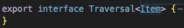

什么是**遍历**？嗯这只是一个**遍历**

`Traversal`描述一个遍历对象的形状。奇怪的是，我们实际上并不需要它来容纳任何东西。它只是作为一个标记，给`get`一个信号，表明路径中的这个位置将是`Item`的集合。正因为如此，我们将能够使用同一个对象来处理任何集合类型(比如一个**数组**、一个**对象**、ES2015 **映射** s 和**集合** s，甚至是不可变的. js 集合)。对于我们的例子，我们将只使用数组来保持简单(目前)。

## V3:遍历和字符串进入酒吧

让我们从一个激励人心的例子开始。我们将把用户的`friends`过滤到那些拥有五个以上朋友的人，然后将他们的名字提取到一个列表中。我们将使用函数`matching`进行过滤，该函数从`A`到`boolean`接受一个过滤函数，并产生一个`Traversal<A>`:

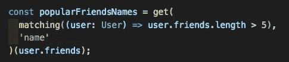

在我们开始之前，让我们考虑一下这个问题。我们首先要遍历我们的集合，这意味着我们以某种方式过滤数组。但是过滤根本不会改变输出类型，所以到目前为止，一帆风顺。但是接下来我们要提取出名字，所以我们会得到一个字符串列表。这方面的天真尝试会遇到问题:

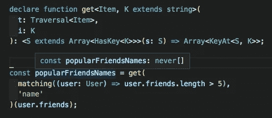

我们从返回类型中的`KeyAt`得到一个`never`类型。这是因为`S`并不代表`User`对象。这是一个`User[]`。我们能从中提取的唯一密钥是类似于`length`、`map`等的东西。我们可以用一些技巧来解决这个问题:

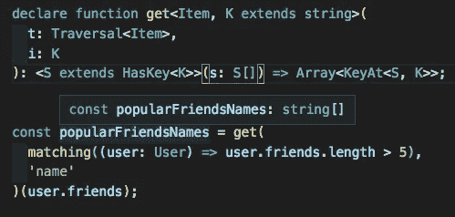

如果没有类型签名，沃尔多在哪里

你看出区别了吗？我们改变了我们的类型约束`S`来约束集合的*元素*，然后我们说我们的输入将是一个`S`的数组。

当我们知道一个容器将要拥有的结构(在本例中是一个数组)，并且我们想要约束或引用元素类型时，这种方法非常好用。然而，它有一个很大的缺点，更重要的是，我已经在最后一句话中说过了。它要求我们知道容器的结构。我们希望能够编写通用函数，能够同时处理许多不同类型的容器，比如映射、集合、数组和对象。为此，我们需要拿出大枪。

# 拆包和收集

还记得我们之前讨论过的那些条件类型吗？我们可以使用它们来创建一个非常强大的实用程序类型，称为`Unpack`:

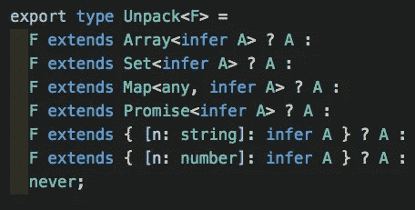

你首先想到的可能是`infer`关键词。这是为我们工作的秘方。当我们问一个条件类型的问题时，例如“这是给定的`F`一个`A`的数组吗？”我们可能不知道确切的类型`A`。让我们给我们不知道但 TypeScript 知道的内部类型起个名字。因此`Unpack` 所做的是允许我们询问一个给定的对象是否是任意数量的集合类型(数组、集合、映射、承诺等)中的一个。)，并找出集合中的类型。

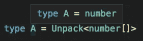

这是我们的`get`函数接受多种类型的容器作为输入的第一步。接下来，让我们创建一个**容器**类型，它将包含我们可能想要遍历的所有集合。

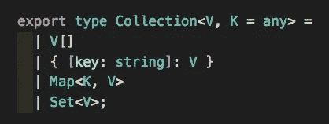

所以现在，如果我们回到我们的原始 V3，用集合替换我们所有的数组，并放入一个精心放置的`Unpack`，我们几乎就有了可以工作的东西。

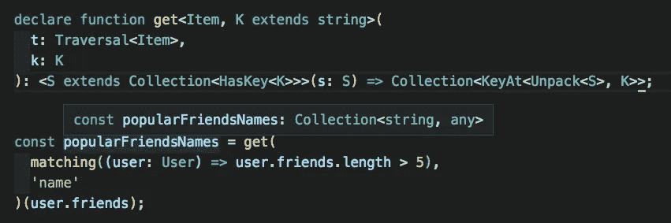

你能看出我们结果的问题吗？

TS 只知道我们的输出是一个`Collection<string, any>`，但是我们知道它实际上应该是一个`string[]`。这个错误是因为，这正是我们告诉它的。

# 高等类型

先来个简短的题外话，说说为什么上面是个问题。想象一下，你正在编写一个版本的`Array::map`，它适用于各种不同的类型，比如`A[] => B[]`和`Map<K, A> => Map<K, B>`。你会怎么做？(嘶！如果你想要这个，它的[可用](https://github.com/jamesmcnamara/shades#map)在*阴影*。传统的面向对象方法是创建一个接口`Mappable`，然后我们为所有的容器类实现`Mappable`。但是有一个大问题:这将产生与上面相同的问题。

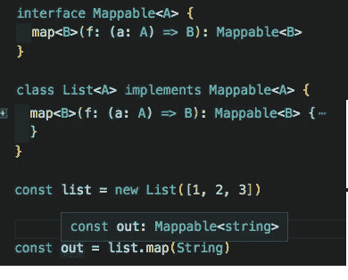

接口`Mappable`不知道它将要实现的容器类的类型，所以它只是说函数`map`将返回一个`Mappable<B>`。当我们在我们的`List` 容器类上实现它时，我们将类型签名与我们的接口相匹配，我们的`List::map`也返回一个`Mappable<B>`。但是这意味着我们丢失了类型信息！`List::map`可以返回任何其他实现`Mappable`的类。

更重要的是，这意味着 TS 不知道`out`是一个列表，所以我们不能在我们的输出上调用任何列表方法，或者将它传递给一个期望列表的函数。如果我们想在列表、映射、集合等数据容器上有公共接口，这是一个真正的麻烦。(注意，精通 TS 的用户可能会注意到，这个确切的用例实际上是可以修复的，但是一般来说，TS 不能处理像`map`这样的功能，我们将把重点放在那些更一般的问题上。)我们真正想要的是这样的东西:

对容器进行抽象

这种能够说`F`是某种通用容器并且我们的函数返回`F<A>`的想法被称为*更高级的多态性*，并且是 Scala 和 Haskell 等语言的关键部分。唉，TS 不支持([还没](https://github.com/microsoft/TypeScript/issues/1213))。

所以我们要假装。

# 函子

最常见的高级类型是 Functor，它就是上面的`Mappable<F, A>`:它接受某个类型`F<A>`，一个`(a: A) => B`函数，并返回一个`F<B>`，不管那个`F`是什么。它实际上只是代表了一种你可以调用`map`的类型。如上所述，我们实际上不能在 TS 中实现这一点，但我们可以选择我们可能想要映射的所有类型，并编写一个处理其中任何一种类型的 Functor 版本。怎么会？我们的老朋友，有条件的类型:

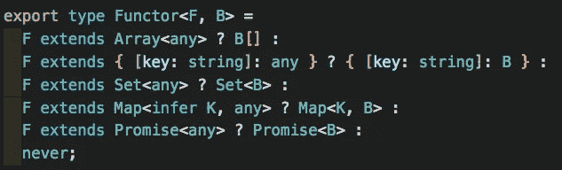

穷人的函子

我们使用我们的类型`F`并依次询问它是否是这些容器中的任何一个:数组、对象、集合等等。如果我们得到一个命中结果，我们就可以拼出正确的`F<B>`返回类型。

# **最终草案**

好吧，这是一个漫长的过程，你一直很有耐心。让我们重温一下 V3，用我们的仿函数增强它:

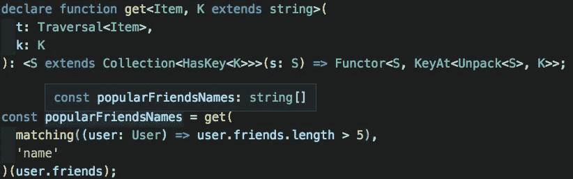

有用！

让我们来看看到底发生了什么变化。我们没有返回一个集合，而是使用我们的仿函数类来精确地计算出我们想要返回的集合。仿函数需要两个参数:

1.  我们正在转换的整个集合对象:`S`。
2.  集合的新成员类型。这和以前是一样的；我们想要提取位于`S`的成员项上的键`K`的类型。我们使用我们的伙伴`Unpack`来提取集合`S`中的任何内容，然后使用`KeyAt`来获得正确的密钥。

现在让我们后退一步；我们已经逐步做到了这一点，所以它可能看起来还不是很酷。我们有一个函数`get`，它可以获取一些通用的遍历对象和一个随机字符串，并将它们解释为到一些未知对象的抽象路径。我们得到一个函数，它将接受任何匹配抽象路径的对象，解释该路径对这个对象的意义，并为这个用例构造一个精确而有用的返回类型。

它甚至会捕捉细微的错误！例如，如果我们输入`namez`而不是`name`会怎么样？TS 将捕获它，并彻底分析出了什么问题:

你不能冒险

TS 做了大量的工作，创建了一个足够灵活的类型系统来处理我们 JavaScript 程序员使用的所有奇怪的技巧。我们只需要舒服地驾驭它那令人敬畏的力量。