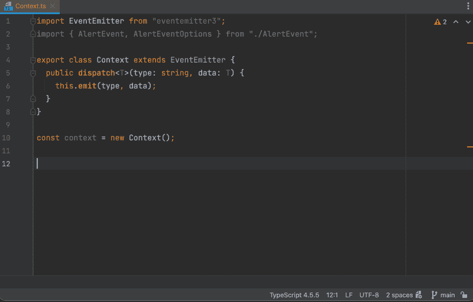
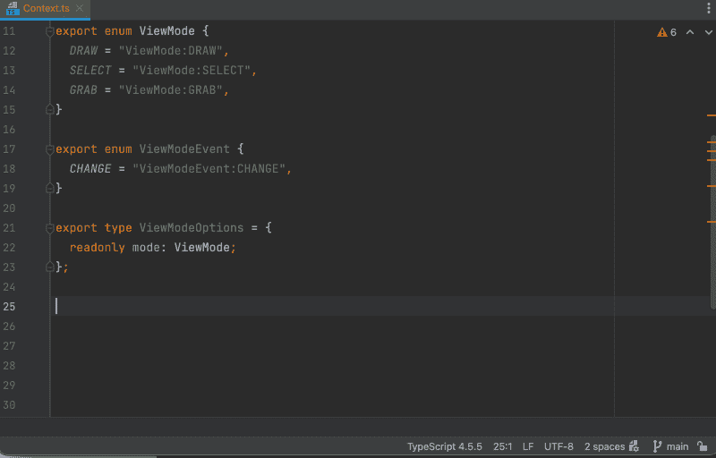

# 在 TypeScript 中探索类型化事件

> 原文：<https://betterprogramming.pub/typed-events-in-typescript-2ad75657640e>

## 使用泛型类型清晰地调度和处理事件


山姆·曼斯在 [Unsplash](https://unsplash.com?utm_source=medium&utm_medium=referral) 上拍摄的照片

在我的应用程序中有解耦的逻辑，使我能够根据容器或上下文对象将控制器和视图组合在一起。

由于这些控制器不知道彼此的存在，因此针对上下文对象分派事件。

在较大的应用程序中，记住每个事件处理程序需要什么属性变得很麻烦——我不想不断地检查事件处理程序来回忆要调度哪些属性。

这种分派事件的模式给了我这样的信息:

```
public dispatch<T>(type: string, data: T): void {
}
```

这使我能够指定数据的动作类型和有效载荷。

例如，让我们使用 [EventEmitter3](https://github.com/primus/eventemitter3) 作为上下文对象上的事件机制。我们的上下文对象将扩展这个发射器并提供一个`dispatch()`实现:

```
import EventEmitter from "eventemitter3";

class Context extends EventEmitter {
  public dispatch<T>(type: string, data: T) {
    this.emit(type, data);
  }
}
```

让我们尝试调度一些事件。

# 预警事件示例

让我们从简单的东西开始——一个警报系统，它在不同的日志级别报告一个字符串消息。

首先，我们需要可以调度的事件类型。这将是枚举中定义的标准信息、错误、警告和成功类型:

```
enum AlertEvent {
  *ERROR* = "AlertEvent:ERROR",
  *INFO* = "AlertEvent:INFO",
  *SUCCESS* = "AlertEvent:SUCCESS",
  *WARNING* = "AlertEvent:WARNING",
}
```

对于每个数据，有效载荷将只是一个字符串消息

```
type AlertEventOptions = {
  readonly message: string;
};
```

为了分派事件，将`AlertEventOptions`作为通用函数类型来传递，以定义我们将要传递的数据的有效载荷。然后，使用`AlertEvent`枚举来定义事件的类型。

```
context.dispatch<**AlertEventOptions**>(**AlertEvent.*INFO***, {
  message: "This is some info",
});

context.dispatch<**AlertEventOptions**>(**AlertEvent.*ERROR***, {
  message: "This is an error",
});
```

为了处理事件，再次使用`AlertEventOptions`作为事件类型:

```
const onAlertInfo = (event: AlertEventOptions): void => {
  console.log(event.message);
};

context.on(AlertEvent.*INFO*, onAlertInfo);
```

这使得 IDE 能够智能地理解数据的有效载荷:



# 查看模式事件示例

假设这个应用程序是一个图形编辑应用程序，用户可以在不同的工具之间进行切换，例如:

*   拉制工具
*   用于缩放/平移的抓取工具
*   选择工具

让我们将这些定义为一个`ViewMode`枚举:

```
enum ViewMode {
  *DRAW* = "ViewMode:DRAW",
  *SELECT* = "ViewMode:SELECT",
  *GRAB* = "ViewMode:GRAB",
}
```

当用户改变视图模式时，我们将调度一个`change`事件:

```
enum ViewModeEvent {
  *CHANGE* = "ViewModeEvent:CHANGE",
}
```

最后，我们的数据有效载荷将由新模式组成:

```
type ViewModeOptions = {
  readonly mode: ViewMode;
};
```

要调度，用`ViewModeEvent.CHANGE`传递`ViewModeOptions`，并将`ViewMode`包含在数据有效载荷中:

```
context.dispatch<ViewModeOptions>(ViewModeEvent.*CHANGE*, {
  mode: ViewMode.*SELECT*,
});
```

为了处理事件，监听`ViewModeEvents`为:

```
const onViewModeChange = (event: ViewModeOptions): void => {
  switch (event.mode) {
    case ViewMode.*SELECT*:
      // ...
      break;
    case ViewMode.*DRAW*:
      break;
    case ViewMode.*GRAB*:
      break;
  }
};

context.on(ViewModeEvent.*CHANGE*, onViewModeChange);
```

IDE 再一次熟练地解析了类型:



# 分音

如果您的数据有效负载包含几个属性，但并不打算将它们全部包含在内，那么可以将它实现为一个部分:

```
export type LinkOptions = {
  readonly href: string;
  readonly target: string;
};const onNavigate = (event: Partial<LinkOptions>): void => {
  // ...
};
```

然而，这可能反映了一个过于复杂的事件——为了清晰起见，请考虑将其分解。

# 摘要

与编程中的任何事情一样，有替代方法，尤其是在实现依赖注入和控制模式反转时。

类型别名提供了委托，其中谓词函数可以处理动作——我将在下一篇文章中探讨这一点。