# 解释了类型迁移

> 原文：<https://betterprogramming.pub/typeorm-migrations-explained-fdb4f27cb1b3>

## 安全地对生产数据库模式进行更改


[Barth Bailey](https://unsplash.com/@7bbbailey?utm_source=medium&utm_medium=referral) 在 [Unsplash](https://unsplash.com/?utm_source=medium&utm_medium=referral) 上的原图。由[song tham Tungkitkancharoen](http://www.songthamtung.com)修改。

TypeORM 中的*迁移*是一个带有 SQL 查询的单个文件，用于更新数据库模式。作为数据库管理员、后端工程师或技术主管，了解这一点很重要，因为这是在生产中对数据库进行更改的最安全的方式之一。在本文中，我们将回顾如何使用 TypeORM 在 MySQL 中执行迁移的最佳实践。

本指南建立在[上一篇文章](https://medium.com/better-programming/get-started-with-typeorm-mysql-and-express-js-653270a6a078)的基础上，该文章展示了如何快速开始使用 TypeORM、MySQL 和 ExpressJS。如果您没有现成的 TypeORM 项目，我强烈建议您按照本文中的步骤创建一个，这样您就可以按照本指南进行操作了。#边做边学

阅读本文时，请记住:

*   对象关系映射(ORM)是 API 和数据库之间的桥梁


ORM 是 API 和数据库之间的桥梁

*   更改实体—也称为数据模型(在数据库中存储对象状态的 TypeORM 类)—将在同步或迁移期间更新模式。

**注意:**虽然我引用了 MySQL，但是您也可以使用其他数据库。

## 先决条件

*   连接到数据库的现有 TypeORM 项目

## 概述

1.  同时发生
2.  迁移
3.  关闭

# 同时发生

在讨论 TypeORM 中的迁移时，我们需要先谈谈`synchronize`。让我们从`ormconfig.json`开始——用`typeorm init`初始化一个新的 TypeORM 项目时生成的配置文件。

`ormconfig.json`

注意那个`synchronize: true`。这是默认设置，但具体是什么呢？它与迁移有什么关系？根据[type ORM readme . MD](https://github.com/typeorm/typeorm):

> `Synchronize`确保每次运行应用程序时，您的实体都将与数据库同步

这意味着，每当您对实体进行更改时，它会自动使用链接到您应用程序的数据库更新这些模式更改。

在本节的其余部分，我们将讨论三种同步场景:

1.  向实体添加新列
2.  通过创建新实体来创建新表
3.  通过修改实体来删除列和/或表

让我们来看看实际情况。

## 1.向实体添加新列

导航到`User.ts`，您应该会看到以下代码:

src/实体/用户. ts

让我们通过复制并粘贴下面的代码，向`User`实体添加一个新列`birthplace`。

`@Column()`

`birthplace: string;`

保存。重启本地服务器，您应该看到`birthplace`列被添加到了`User`表中。

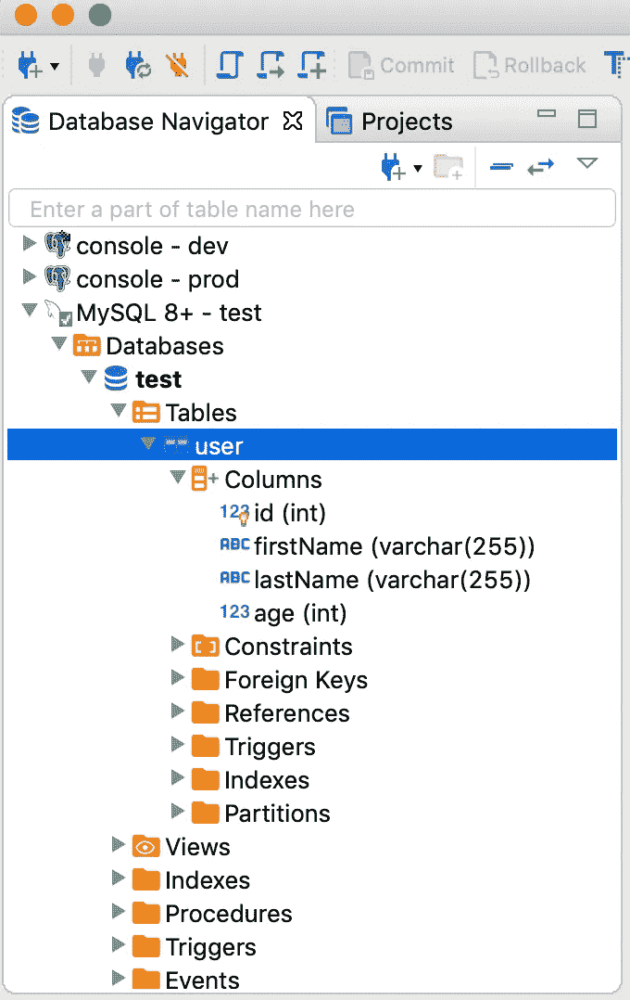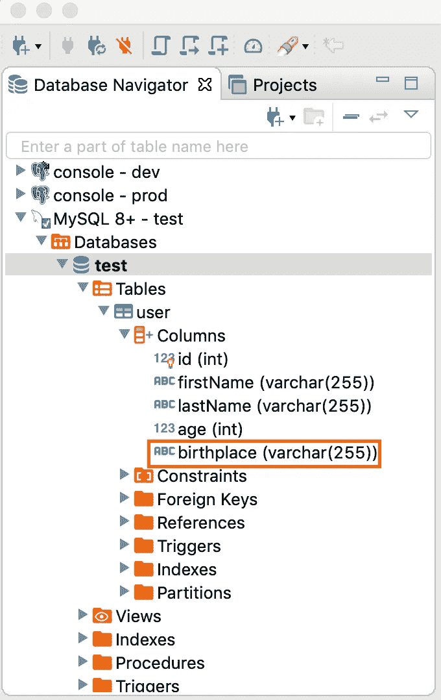

之前和之后。注意增加了出生地一栏。

就是这样。看看在 TypeORM 中使用`synchronize`向数据库添加新列有多容易？

您甚至可以使用这种方法创建一个新表。

## 2.通过创建新实体来创建新表

要创建一个新的`Entity`，在与`User.ts`相同的文件夹中创建一个名为`Company.ts`的新文件，并粘贴以下代码片段:

src/实体/公司. ts

保存。重启本地服务器，您应该会看到添加到数据库中的`Company`表，其中包含`id`和`name`列。

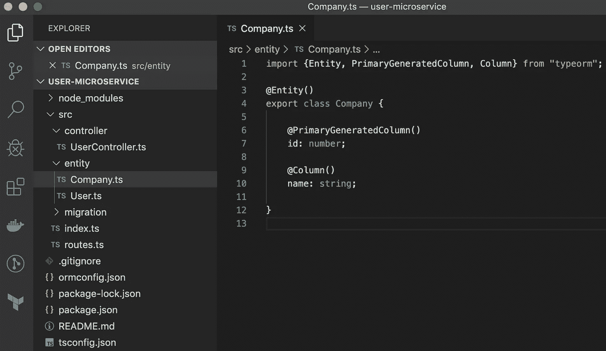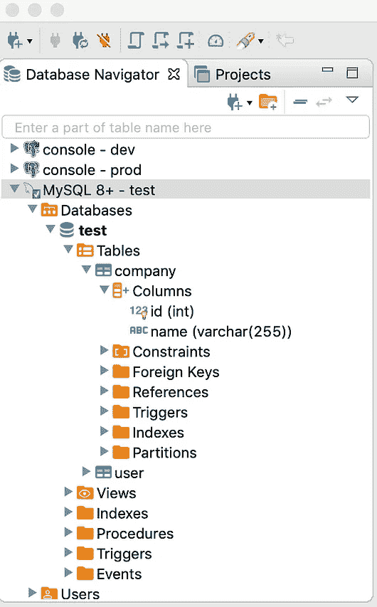

通过创建新实体来创建新表

## 3.通过修改实体来删除列和/或表

如果您想要删除任何表或列，同样的逻辑也适用—只需在代码中进行更改，保存并重新启动服务器。

好的，那么如果`synchronize`自动将我们的代码与数据库同步，为什么迁移是必要的呢？

迁移是必要的，因为一旦在数据库中获得数据，在生产环境中使用`synchronize:true`进行模式同步通常是不安全的。

换句话说，用`synchronization`自动更新生产模式是危险的。如果东西坏了会怎么样？如果数据丢失会发生什么？如果您想要*版本控制*任何数据库模式变更，会发生什么？

这就是 TypeORM 迁移的用武之地。

# 迁移

不要跳过这一步。要开始迁移，您应该做的第一件事是在`ormconfig.json`中设置`synchronize: false`。这将阻止模式同步。

在本节的其余部分，我们将讨论迁移中的三个场景:

1.  生成迁移
2.  运行迁移
3.  还原迁移

让我们开始吧。

## 1.生成迁移

要生成迁移文件，我们需要对实体进行更改。打开`Company.ts`，添加一个新列:

`@Column()`

`city: string;`

保存。现在尝试重新启动服务器。由于 synchronize 为 false，数据库不应更新。

下一步是使用 CLI 命令`typeorm migration:generate`。这会生成一个新的迁移文件，需要执行 SQL 来更新模式。运行它将显示帮助菜单，因为我们没有指定`name`参数。

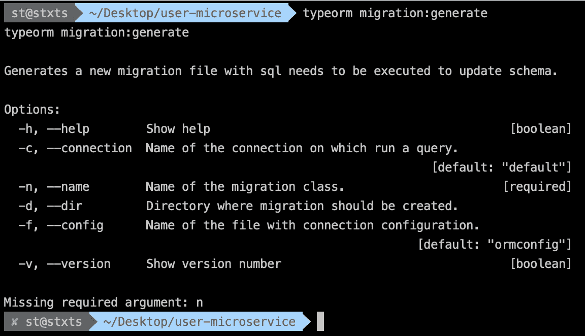

类型迁移:生成

`name`参数是迁移类的名称，应该是描述性的，比如 Git commit。在我们的例子中，让我们使用`AddCityColumnToCompany`。但是，问题是如果我们运行下面的命令，我们可能会得到下面的错误:

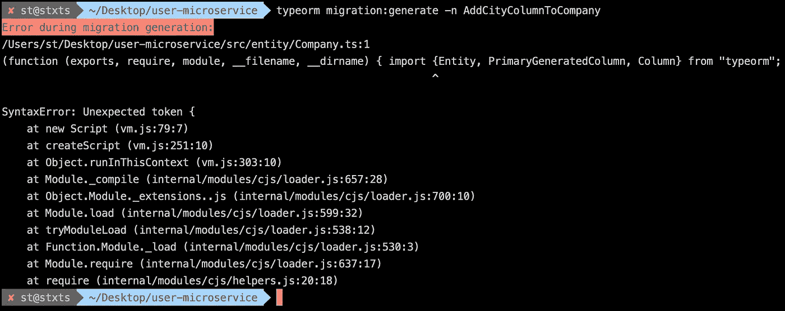

意外的标记{错误！

这是一个[已知问题](https://github.com/typeorm/typeorm/issues/371#issuecomment-359161565)，与我们的节点环境试图加载`.ts`而不是`.js`有关。如果您收到此错误，快速解决方法是运行以下命令:

`./node_modules/.bin/ts-node ./node_modules/.bin/typeorm migration:generate -n AddCityColumnToCompany`

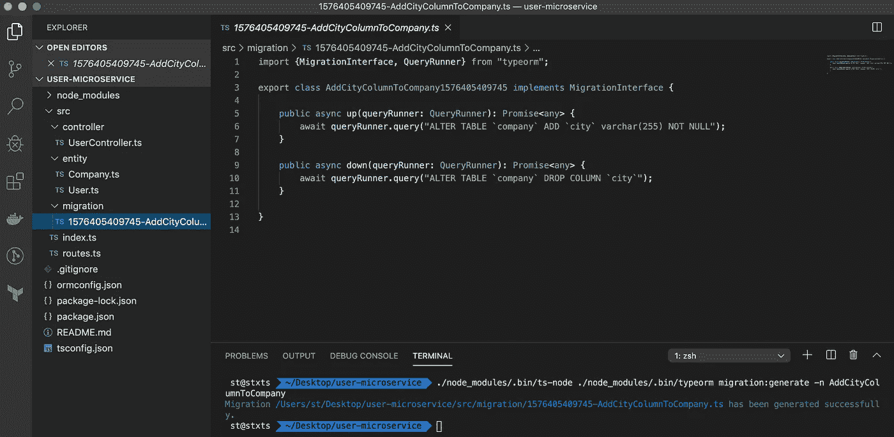

`typeorm`迁移:生成

如果成功，您将在迁移文件夹中看到一个名为`{TIMESTAMP}-AddCityColumnToCompany.ts`的自动生成的新文件，包含以下内容:

注意两个方法:(1) `up` (2) `down`。这些是 SQL 命令。

1.  `up`**—包含执行迁移所需的代码。**
2.  **`down` —包含恢复`up`已更改内容的代码。**

**太好了！现在我们已经生成了一个迁移文件，让我们运行它。**

## **2.运行迁移**

**要运行迁移，请使用以下命令:**

```
./node_modules/.bin/ts-node ./node_modules/.bin/typeorm migration:run
```

**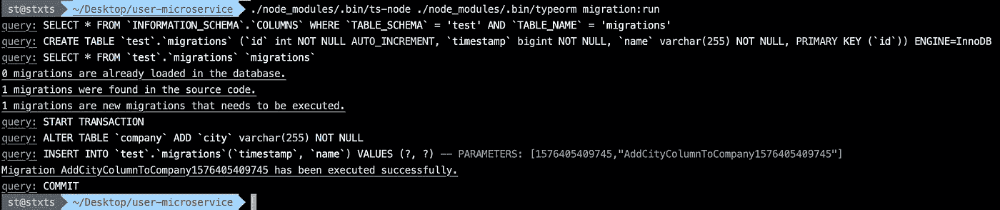**

**类型迁移:运行**

**成功的迁移将运行`up` 方法中的代码。让我们一行一行地看看正在执行哪些语句。**

**1.`SELECT * FROM `INFORMATION_SCHEMA`.`COLUMNS` WHERE `TABLE_SCHEMA` = ‘test’ AND `TABLE_NAME` = ‘migrations’`:这是检查你的数据库中是否有一个迁移表。**

**2.`CREATE TABLE `test`.`migrations` (`id` int NOT NULL AUTO_INCREMENT, `timestamp` bigint NOT NULL, `name` varchar(255) NOT NULL, PRIMARY KEY (`id`)) SONGTHAM ENGINE=InnoDB`:如果没有表格，就创建一个。**

**3.`SELECT * FROM `test`.`migrations` `migrations``:查找迁移表并交叉检查是否有与迁移文件名匹配的迁移。如果存在，跳过。否则，继续。**

> **0 个迁移已加载到数据库中。
> 在源代码中发现 1 个迁移。
> 1 迁移是需要执行的新迁移。**

**4.`query: START TRANSACTION`
`query: ALTER TABLE `company` ADD `city` varchar(255) NOT NULL`:这是运行迁移脚本的 SQL 语句。**

**5.`INSERT INTO `test`.`migrations`(`timestamp`, `name`) VALUES (?, ?) — PARAMETERS: [1576405409745,”AddCityColumnToCompany1576405409745"]`:如果迁移运行成功，该语句将在迁移表中插入一条新记录。该日志确保如果我们再次运行迁移命令，TypeORM 将跳过它，因为它从步骤 3 知道它以前已经运行过。**

**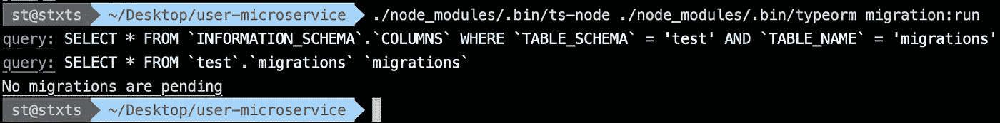**

**没有挂起的迁移**

**看一下我们的数据库，我们将看到上面的脚本所做的更改。**

**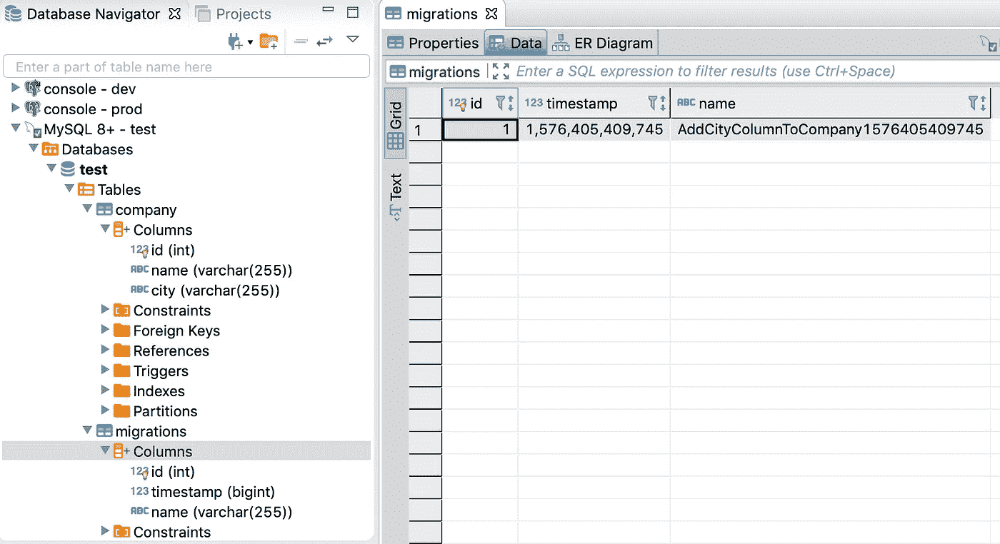**

**请注意公司表中的迁移表和城市列**

## **3.还原迁移**

**本指南的最后一步是恢复迁移。**

**恢复迁移会运行迁移文件中的`down` 方法。如果我们做了一个我们不再需要的模式改变，这是很有用的。**

**要恢复迁移，请使用以下命令:**

```
./node_modules/.bin/ts-node ./node_modules/.bin/typeorm migration:revert
```

**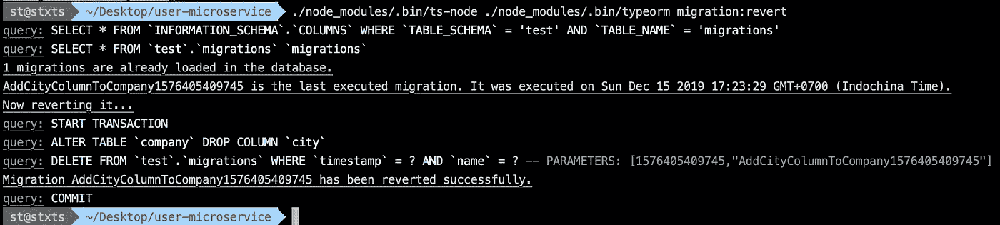**

**类型迁移:恢复**

**让我们一行一行地看看正在执行哪些语句。**

**1.`query: SELECT * FROM `INFORMATION_SCHEMA`.`COLUMNS` WHERE `TABLE_SCHEMA` = ‘test’ AND `TABLE_NAME` = ‘migrations’
query: SELECT * FROM `test`.`migrations` `migrations``:查找迁移表并交叉检查是否有与迁移文件名匹配的迁移。如果是，则执行反转。**

> **1 迁移已加载到数据库中。
> addcitycolumntocompany 1576405409745 是最后执行的迁移。本协议于 2019 年 12 月 15 日星期日 17:23:29 GMT+0700(印度支那时间)执行。
> 现在恢复它…**

**2.`query: START TRANSACTION
query: ALTER TABLE `company` DROP COLUMN `city``:这是运行迁移恢复脚本的 SQL 语句。**

**(3) `query: DELETE FROM `test`.`migrations` WHERE `timestamp` = ? AND `name` = ? — PARAMETERS: [1576405409745,”AddCityColumnToCompany1576405409745"]`:这将从迁移表中删除记录。这样，如果我们要恢复迁移，什么也不会发生，因为 TypeORM 无法在数据库中找到迁移日志。这也意味着，如果我们愿意，我们现在可以再次运行迁移。**

****

**请注意空的 migrations 表，并且已经从 company 表中删除了 city 列**

# **关闭**

**就是这样。恭喜你完成了整个教程——这并不容易。您刚刚使用 TypeORM 成功地生成、运行和恢复了迁移。**

**迁移是处理数据库模式更新的一项基本功能。最棒的是，这一切都是在代码中处理的，这意味着它可以被版本控制。您不必再手动执行 SQL 语句。最重要的是，您可以将其与 CI/CD 管道集成，因为运行 TypeORM 迁移需要使用 CLI。**

**感谢阅读！**

# **资源**

*   **[www.typeorm.io](http://www.typeorm.io/)**
*   **[https://github . com/type ORM/type ORM/blob/master/docs/migrations . MD](https://github.com/typeorm/typeorm/blob/master/docs/migrations.md)**
*   **[https://github . com/type ORM/type ORM/issues/371 # issue comment-359161565](https://github.com/typeorm/typeorm/issues/371#issuecomment-359161565)**