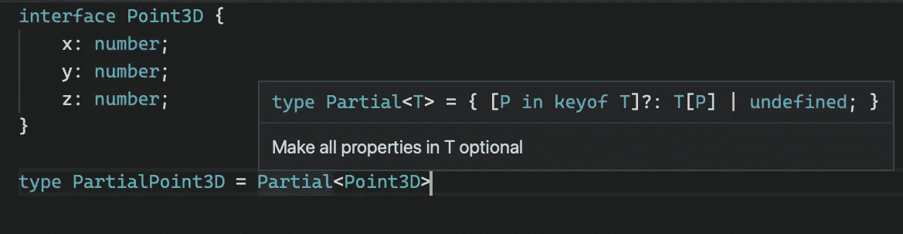

# TypeScript:映射类型的简明介绍

> 原文：<https://betterprogramming.pub/typescript-a-gentle-introduction-to-mapped-types-f65e45fa2598>

## 学习构建自己的一套 TypeScript 工具


马库斯·斯皮斯克在 [Unsplash](https://unsplash.com?utm_source=medium&utm_medium=referral) 上拍摄的照片。

映射类型是 TypeScript 语言中迄今为止最好的特性。它们允许您基于现有类型和您定义的一些规则创建新的类型。这确实会产生可读性和声明性更强的代码库。

保持代码干燥是您应该遵循的原则之一，映射类型可以帮助您做到这一点。你会发现有大量的样板文件减少。您必须编写更少的代码，因为您可以重用更多的代码。

首先，映射类型是一个有点可怕的特性。尤其是有知识差距的情况下。因此，在直接进入之前，我们将重温一些关键特性，它们是映射类型的基础。

希望通过缩小知识差距，它将看起来不那么势不可挡。当学习新功能时，我认为循序渐进是成功的关键。

# 构建类型的 5 个关键 TypeScript 功能

## ***1。操作员*的按键**

`keyof`是非常重要的工具。它允许您以联合格式获取所有类型属性。让我们检查一下文档:

> "`keyof`操作符接受一个对象类型，并产生其键的字符串或数字联合."— [打字稿文件](https://www.typescriptlang.org/docs/handbook/2/keyof-types.html)

让我们来看一个例子:

我们可以看到，我们已经将所有的`Person`键提取为`PersonKeys`类型。

## 2.访问 TypeScript 类型/接口变量

众所周知，您可以使用一种非常熟悉的 JavaScript 语法来访问类型属性:方括号。这在以后会非常重要。

一旦你知道了语法，使用起来就会变得非常简单和直观。

但是，有没有一种方法可以迭代类型/接口属性？是的，这是来自 JavaScript 世界的非常熟悉的语法:

```
[P in keyof T]: T[P]
```

您可以结合之前看到的`keyof`来首先提取所有的属性，然后使用`in`来遍历每个属性。

## 3.条件打字

什么是条件类型？它只是一个表达式，用于根据表示为类型关系的条件从两个可能的类型中选择一个。

```
T extends U ? X : Y
```

让我们看一个虚拟的例子:

在上面的例子中，`ConditionalType`将等于`boolean`，因为条件`string extends boolean`为假。

## 4.never 和 infer 关键字

使用`infer`关键字就像告诉 Typescript，“我想把你推断在这个位置的任何东西赋值给一个新的类型变量。”

另一方面，`never`类型表示从不出现的值的类型。

让我们看一个例子:

在上面的例子中，随着`array`扩展`infer U[]`，变量`X`将等于一个`Number`。如果目标不是一个数组，它将等于`never`。

## 5.无商标消费品

让我们的方法/API 可重用的最好方法是什么？仿制药！这是大多数类型化语言中的一个特性。它让我们以更通用的方式表达类型。这将增强我们的类和类型。

先说一个基本的例子。让我们创建一个向数组添加任何已定义类型的方法:

如果我们想为一个`int`类型创建相同的实用程序呢？要不要重做同样的方法？通过简单地使用泛型，我们可以重用代码，而不是添加更多的样板文件:

注意，我们通过强制扩展`boolean`或`string`来限制`T`的类型。

# TypeScript 实用程序如何在幕后工作

既然我们已经获得了重要的 Typescript 知识，我们就可以开始学习映射类型了。不过，在创建我们自己的实用程序之前，让我们看看已经内置了什么。

TypeScript 附带了许多作为实用工具的映射类型。我们来看一些最常见的:`Omit`、`Partial`、`Readonly`、`Readonly`、`Exclude`、`Extract`、`NonNullable`、`ReturnType`。您可以在任何时候通过将鼠标悬停在有能力的编辑器或 TypeScript 运动场中的它们上来检查它们。

我们现在将检查它们是如何构建的，以获得更多关于如何在未来构建我们自己的系统的见解和想法。

## **1。部分映射类型**

这是一个映射类型，它通过使用一个`undefined`联合将您的类型属性转换为可选的，并使您的类型可为空。



查看 Typescript 映射类型实现的示例

它是如何工作的？

*   它使用一个泛型来传递目标接口`T`。
*   它使用`keyof T`获得`T`的所有密钥。
*   它通过使用`[P in ...`访问并循环所有拉出的键。
*   它通过添加`?`符号使按键可选。
*   它通过使用联合`T[P] | undefined`使键类型可为空。

既然我们已经介绍了所有的基础知识，看起来就更容易理解了。现在很容易弄清楚任何映射类型的幕后发生了什么。

## **2。排除映射类型**

这是一种映射类型，允许您有选择地从类型中移除属性。定义如下:

它是如何工作的？

*   它从`T`中排除了那些通过使用条件类型化并在被排除的属性上返回`never`可分配给`U`的类型。这怎么可能呢？条件类型的分配性使得它。

> 被检查类型为裸类型参数的条件类型被称为*分布式条件类型*。分布式条件类型在实例化期间自动分布在联合类型上— [类型脚本文档](https://www.typescriptlang.org/docs/handbook/advanced-types.html)

我们可以观察到上面我们是如何通过使用`Exclude`将`crocodile`从联管节中移除的。

我们现在准备开始构建我们自己的映射类型。

# 构建您自己的 TypeScript 映射类型

我们现在准备构建我们自己的 TypeScript 映射类型。假设我们想要创建一个映射类型，它只使我们选择的`keys`成为可选的——不像`Partial`，它使所有的键都是可选的和可空的。

`Partial`映射类型本身可以作为我们的起点。我们能做的是:

*   将整个类型转换为`Partial`。
*   从新类型中只选择我们希望成为可选的属性。
*   用排除的属性联接原始类型。

让我们来看看代码:

注意，我们使用`K extends keyof T`来确保我们只传递属于类型/接口的属性。否则，TypeScript 将在编译时引发错误。

映射类型的一个优点是它们的可组合性:您可以组合它们来创建新的映射类型。这有多酷，多有用？

还有其他方法可以实现这种行为。您可以决定不使用任何映射类型实用程序，全部手动完成。这感觉有点像重新发明轮子，但可以为了好玩而做。让我们在不使用任何其他映射类型的情况下重新创建`Optional`映射类型实用程序:

上面的代码只是结合了两种类型:

*   第一种类型通过使用`?`修改器使`T`的所有`K`键可选。
*   通过使用`Excluse<keyof T,K>`，第二种类型是获取剩余的密钥。

第二个例子不实用，可读性差。这只是为了证明你可以用映射类型完成任何事情。

# 包扎

这就是你对映射类型所能做的一切吗？当然不是。这只是一个介绍，让你开始和好奇。您可以做各种新奇的事情，有了最新的 TypeScript 版本，您现在可以递归地使用它们。另一个很棒的新特性是能够重命名属性。查看我下面关于 4.1 版本的相关文章，了解更多信息。

映射类型是一个很棒的工具，但是它们需要一些关于 TypeScript 特性的知识。如果这是你首先想到的，它可能是一个压倒性的特征。然而，随着时间和耐心，它们将成为你日常发展中不可或缺的工具。

您将能够为您的特定需求构建一些特定的工具。你可以在以后使用它们，像乐高积木一样组合它们。

确保在全局`tsd.d.ts`中定义这些映射类型，这样它们就可以在整个代码库中使用，而不需要任何导入/导出。

# 有关系的

[](/typescript-4-1s-advanced-mapped-types-eba9a2ba7a9) [## TypeScript 4.1 的高级映射类型

### 看看递归条件类型、模板文字类型等等

better 编程. pub](/typescript-4-1s-advanced-mapped-types-eba9a2ba7a9) [](/top-5-typescript-features-you-should-master-2358db9ab3d5) [## 您应该掌握的五大打字稿功能

### 使用这些必须知道的特性来提高您的打字稿知识

better 编程. pub](/top-5-typescript-features-you-should-master-2358db9ab3d5) [](/master-typescripts-type-guards-1fd5436bc6f2) [## Master TypeScript 的类型保护

### 在 TypeScript 的 type guards 中从初学者到专业人员

better 编程. pub](/master-typescripts-type-guards-1fd5436bc6f2)