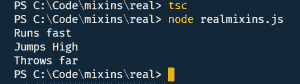

# 打字稿和混音

> 原文：<https://betterprogramming.pub/typescript-and-mix-ins-96f97678da35>

## 在分离关注点时使用组合


由[迈克·彼得鲁奇](https://unsplash.com/@mikepetrucci?utm_source=medium&utm_medium=referral)在 [Unsplash](https://unsplash.com?utm_source=medium&utm_medium=referral) 上拍摄的照片

# 介绍

我之前听过 *mixin* 这个词，我承认我没听懂。然后我读了这本伟大的书中对 mixins 的精彩解释，史蒂夫·芬顿的《Pro Typescript》。

严格地说，mixins 不是面向对象编程的官方支柱。然而，它们是将对象组合在一起的一种方式，可以帮助您“更喜欢组合而不是继承”它们有点像多重继承，因为它们允许您将不同实现的功能组合在一起。

这里有一个有趣的事实:显然 mixin 这个名字来自马萨诸塞州萨默维尔的一家冰淇淋店。这个叫史蒂夫·费雷尔的家伙过去常常在冰淇淋中“混入”像石南棒、其他糖果棒以及谁知道还有什么东西。你可以在维基百科中查找。这在今天是司空见惯的事(想想冷石奶精)，但我猜有人先这样做了。反正名字就是这么来的。

原来在 TypeScript 中我们可以考虑两种 mixins。首先，我们将看看“简单的”混音，然后我们将看看“真正的”混音。

好吧，那我们开始吧。

# “简单”混音

首先，我们将声明三个类，定义运动员可以做的三件事:

运动员可以做的三件事

这里没有什么特别的:它们只是向控制台输出运动员可以做的事情——跑、跳和扔。

现在，我们将声明 mixin。它使用`implements`关键字将三个独立的类“实现”成一个类。

组成一个十项全能运动员

这看起来没什么意义。函数都是`void`，这个类什么都不做。所以这里我们要用一点小魔法，以下面的函数的形式:

函数来创建 mixin

正如我所说，这个函数有点复杂。它基本上接受传递给它的类的方法，并将这些方法重新分配给你传递给它的 mixin 类。所以我们打这个电话:

使用 applyMixins 函数

它将这三个类的方法重新映射到`Decathlete`类。不是很漂亮，但你知道了。您必须确保方法名称完全相同。然后你可以打电话:

还有……对我没用。我从编译器(和 linter)那里得到:

```
**mixins.ts(29,3): error TS2564: Property 'runsFast' has no initializer and is not definitely assigned in the constructor. mixins.ts(30,3): error TS2564: Property 'jumpsHigh' has no initializer and is not definitely assigned in the constructor. mixins.ts(31,3): error TS2564: Property 'throwsFar' has no initializer and is not definitely assigned in the constructor.**
```

真扫兴。

所以，我当然要打开谷歌，我发现编译器在这里“保护”你。`Decathlete`类的方法实际上并没有被设置为任何实值(这就是这里的要点)。编译器不会，当`strict`开启时(你确实开启了`strict`，对吗？)，[允许你把](https://github.com/Microsoft/TypeScript/wiki/What's-new-in-TypeScript#null--and-undefined-aware-types) `[null](https://github.com/Microsoft/TypeScript/wiki/What's-new-in-TypeScript#null--and-undefined-aware-types)` [或者](https://github.com/Microsoft/TypeScript/wiki/What's-new-in-TypeScript#null--and-undefined-aware-types) `[undefined](https://github.com/Microsoft/TypeScript/wiki/What's-new-in-TypeScript#null--and-undefined-aware-types)` [赋给你的变量](https://github.com/Microsoft/TypeScript/wiki/What's-new-in-TypeScript#null--and-undefined-aware-types)。

在这里我们可以做两件事。首先，我们可以在编译器设置中关闭`--strictNullCheck`。这样做将使代码编译和运行。但是当然，我们不想那样做，不是吗？

相反，我们可以使用[非空断言操作符，](https://github.com/Microsoft/TypeScript/wiki/What's-new-in-TypeScript#non-null-assertion-operator)也称为感叹号。我们把它放在 mixin 类的方法名之后，然后编译器就高兴了:

注意每个方法名后面的感叹号。

感叹号基本上是[“告诉编译器暂时放松它可能会要求的‘非空’约束。它对编译器说:‘作为开发人员，我比你更清楚，这个变量现在不能为空’”](https://stackoverflow.com/a/43891263/2044)。

这就是混合蛋白。它们很酷，因为你可以把不同的功能组合成一个单一的实体。您可以创建一个十项全能运动员，他可以从多个类别中做许多事情，而这些类别都做一件事情。它们有点像实现多个接口，只是实现是在每个单独的类中完成的，而不是在复合类中。

## “真正的”混音

我在上面讨论了什么是 mixins:简而言之，它们是一种分离然后组合功能的方式。Mixins 是分离关注点的好方法，同时将事情集合在一起以完成一组相关的事情。

为了“真正”做到这一点，我们将首先声明一个泛型类型，该类型在其构造函数中可以接受任意数量的参数:

具有多个参数的泛型构造函数

现在我们有了这种类型，我们可以用奔跑、跳跃和投掷功能来扩展它:

用构造函数分解动作

这三个函数返回定义特定功能类型的类——运行、跳跃和投掷。

一旦定义了它们，您就可以创建类型并通过将功能菊花链在一起来调用功能:

把东西混合在一起就成了十项全能运动员

运行这段代码，您会得到以下结果:



执行十项全能课程的结果

这种“真正的”方法比“简单的”方法稍微复杂一点，但是它的优点是不依赖于单独的“神奇”函数。

最后，这两种方法都是分离功能的好机制，同时允许功能的组合。