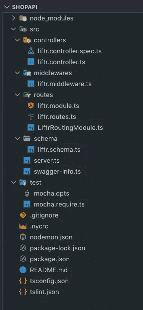
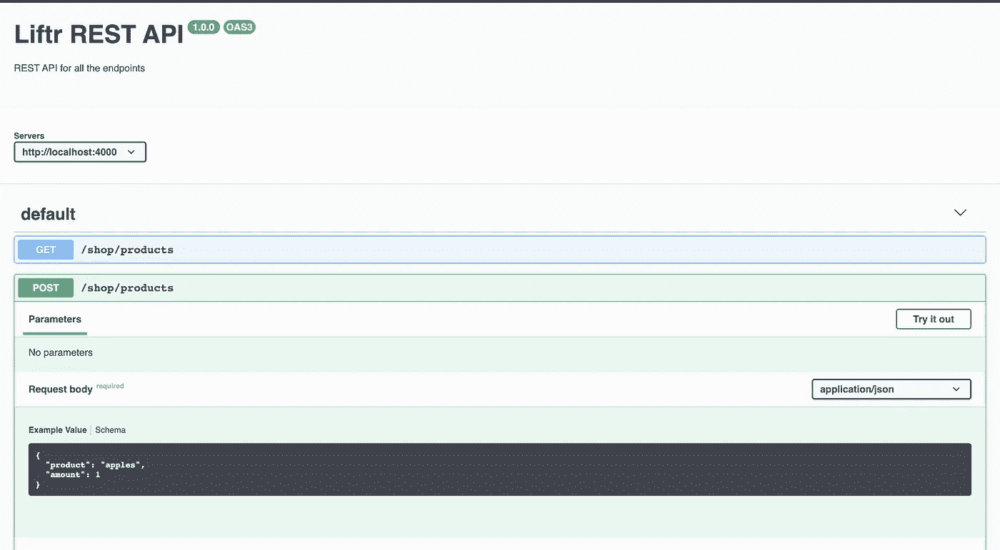

# 使用 TypeScript 和 Node.js 创建 REST APIs 的简单指南

> 原文：<https://betterprogramming.pub/typescript-and-node-js-a-simple-guide-to-creating-rest-apis-7bfac9f58b34>

## 使用 Liftr 通过 TypeScript 快速创建 Express APIs


[亚历山大·奈特](https://unsplash.com/@agkdesign?utm_source=unsplash&utm_medium=referral&utm_content=creditCopyText)在 [Unsplash](https://unsplash.com/s/photos/laptop?utm_source=unsplash&utm_medium=referral&utm_content=creditCopyText) 上拍照

TypeScript 已经成为开发人员最流行的编程语言之一。将 TypeScript 与 [Node.js](https://nodejs.org/) 一起使用可以增强您构建 REST APIs 的方式，并带来一些现成的好处:

*   还有*可选*静态打字。
*   TypeScript [IntelliSense](https://marketplace.visualstudio.com/items?itemName=sourcegraph.javascript-typescript) 为您的 IDE 提供了很好的编码提示和工具。
*   JavaScript 变得更加可读和可调试。

当试图用 Node.js 和 TypeScript 创建 REST API 时，弄清楚如何设置您的环境会变得非常困难。借助 [Express](https://expressjs.com/) 的强大功能，我将通过创建一个简单的商店 API 来展示 TypeScript 的好处。

对于本教程，我们也将使用一个框架，所有人都可以使用这个框架，称为 [Liftr](https://github.com/farisT/liftr) 。Liftr 是用 TypeScript 创建 Express APIs 的一种无压力的方式。让我们更深入地了解 Liftr 及其优势。

[](https://github.com/farisT/liftr-cli) [## farisT/liftr-cli

### liftr-cli 是一个与 liftr 框架一起工作的快速项目启动 cli，它将为…

github.com](https://github.com/farisT/liftr-cli) 

*   Liftr 建立了一个你可以遵循的基本 API 结构。留在这个结构中有好处，但是你可以随时定制它，使它成为你自己的。
*   Liftr 可以为您生成路线，并为您添加一个链接到该路线的控制器。
*   Liftr 路线可以添加 *joi* 模式，以便在开发时提供额外的说明和文档。
*   Liftr 可以生成基本的中间件。
*   Liftr 会帮你把它们绑在一起！(确保所有线路连接正确。)
*   Liftr 内置了测试用的 [Mocha](https://mochajs.org/) 和代码覆盖率用的 [Nyc](https://github.com/istanbuljs/nyc#readme) 。
*   Liftr 框架有许多支持包，可以帮助构建更具可持续性的 API，比如 [liftr-tscov](https://github.com/jeroenouw/liftr-tscov) 包可以帮助检查你的类型覆盖率。

举个例子，我们一起来设置一个商店 API。首先，确保将 liftr-cli 安装为全局 cli。

```
npm i -g @liftr/cli
```

这将允许我们在我们的机器上使用 Liftr。完成后，`cd`进入一个文件夹或`mkdir`一个您想要在其中设置 API 的父文件夹，然后运行:

```
liftr -s ShopApi
```

Liftr 现在将为我们创建必要的文件，开始构建和扩展我们自己的用 TypeScript 构建的 Node.js API。一旦这个命令完成，你可以运行`cd ShopApi`，你将进入你的项目文件夹。

您的项目布局应该如下所示:



您可以使用 Liftr 从项目中运行许多命令，这些命令将帮助您快速构建 API 结构。

现在，在我们的商店 API 中，除了作为设置的一部分创建的路线或模块之外，我们没有其他路线或模块，所以让我们创建一个模块来容纳我们的商店。

```
liftr --module shop
```

这将创建一个`shop.module.ts`和一个`shop.routes.ts`。

该模块将作为 [Swagger](https://swagger.io/) 中提供给它的所有路线的布局和文档。除此之外，还可以通过中间件和 joi 模式来全面了解您的路线需要什么。

商店有产品，因此应该创建一个可以提供产品的`/products`端点。使用 Liftr，可以在模块中快速创建一条我们希望它所在的路径。

通过运行以下命令，该路线将自动添加到该模块和该模块的 coherent `.routes.ts`中。

```
liftr --route products --target shop
```

如果我们看一下代码，我们应该在`shop.module.ts`中有一个有效的 GET 路径`/products`。让我们向端点的控制器添加一些产品，以了解真正的商店 API 是什么样子的。

在这里，我创建了一个简单的接口，这样就可以定义更复杂的类型。这样，我们的目标是确定一个产品必须有一个 string 类型的名称和一个 number 类型的数量。

Liftr 的另一个很棒的特性是，在幕后，我们可以提供一些信息来为我们的端点自动创建文档。

一般来说，在使用 Swagger 时，我们必须创建包含所有信息的大型 Swagger 文档。使用 Liftr，一旦创建并注册了路线，它将自动显示在 Swagger 中！

让我们用一些文档创建另一个端点。因为我们已经通过 CLI 完成了这项工作，所以让我们手动添加它，看看连接是在哪里进行的。

商店应该能够将产品添加到其库存中，因此，应该有一个添加产品的端点。由于我们试图遵守 REST 标准，我们将创建另一个`/products`路由，这将是一个 POST 端点。

这是端点的样子:

如你所见，在`addProductsRoute`中我增加了一个`addProducts`控制器。因为我们没有通过 CLI 创建路由，所以我们必须使用 liftr-cli 创建一个名为`addProducts`的基本控制器，使用以下命令:

```
liftr --controller addProducts --flat
```

使用`--flat`标志，我们可以指定希望 CLI 创建一个控制器文件，而不是在`controllers` 文件夹中创建子文件夹。

现在，我们还可以创建一个 joi 模式，将请求体添加到 POST route 文档中，并验证我们的路由。

对于我们的 POST 路线，我们希望能够将产品添加到我们的商店，因此为了这样做，我们需要发送产品和该产品的数量。

我们现在可以将这个模式添加到`shop.module.ts`以及我们的`addProducts.controller.ts`中，以确保我们的路由在我们的文档中注册了这个模式，并检查路由中是否有正确的请求体。

这里，你可以看到另一个使用方法`req.validate`的 Liftr 特性。我们传入我们的主体以及刚刚创建的 joi 模式来检查传入的数据。

我们现在可以启动开发服务器来测试我们的端点:

```
npm start
```

看哪！我们自己的商店 API，使用两个产品端点运行。

如果我们转到[http://localhost:4000/docs](http://localhost:4000/docs)，我们可以看到我们有端点的文档(名称和类型)。

然而，有了 POST 端点，我们还在文档中添加了必要的 POST 主体，我们甚至可以测试端点！



Liftr 还提供了一种方法来检查项目中的类型以及您遗漏了哪些类型，这可以让您更深入地了解代码。

如果您运行`npm run test:types`，您将获得可用和未覆盖类型的详细摘要。

```
_____   ____     ____    ___   __     __
 |_   _| / ___|   / ___|  / _ \  \ \   / /
   | |   \___ \  | |     | | | |  \ \ / / 
   | |    ___) | | |___  | |_| |   \ V /  
   |_|   |____/   \____|  \___/     \_/   

The TypeScript CLI to calculate type coverage------------- uncovered types ---------------
/Users/ftangastani/develop/liftr/src/controllers/liftr.controller.spec.ts: 8:9 - req
/Users/ftangastani/develop/liftr/src/controllers/liftr.controller.spec.ts: 19:25 - req----------------- coverage ------------------
148 - max reachable type coverage
146 - types covered
2 - types uncovered
```

这是一篇关于如何用 TypeScript 和 Node.js 设置 REST API 的简短指南。

有了像 [Liftr](https://github.com/farisT/liftr-cli) 这样的框架，模块化和动态创建新路线变得非常容易。随着项目规模的扩大，我们还可以添加文档来明确每条路线的要求。

谢谢你走到这一步。如果有人能为 Liftr 框架和它的任何一个包做出贡献，那将会非常酷。投稿不需要任何技能，只需更新一个文档或修复一个小错误。任何东西都是高度赞赏的！

[](https://github.com/farisT/liftr) [## farisT/liftr

### 这个项目是用 liftr-cli 启动的。liftr-cli 是一个快速的项目启动 cli，可与 Liftr……

github.com](https://github.com/farisT/liftr)