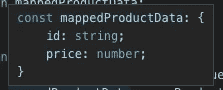

# TypeScript:泛型函数参数类型

> 原文：<https://betterprogramming.pub/typescript-generic-objects-1eecc13dca93>

## 如何修改 TS 中的对象属性，同时保持参数的通用性和函数的可重用性


我在这里捆绑了一些 lovley 示例代码

在 TypeScript/JavaScript 中修改对象属性是我们作为程序员首先要学习的东西。我们可以直接修改属性(`foo.bar = ‘test’`)或者创建一个浅拷贝(`const shallowFoo = {…foo, bar: ‘test’}`)。

快速思考一下就会发现，大多数情况下，像这样修改对象背后都有某种业务逻辑。毕竟，我们希望更新对象属性是有原因的。

通过将这种逻辑转移到一个助手函数中，我们可以轻松地测试和重用代码以保持干燥(*不要重复自己—* 源自安迪·亨特和迪夫·托马斯的《实用程序员》中的一句口头禅)。但是一个新的挑战出现了:我们如何保持这些助手函数的通用性，同时给它们一个单一的、清晰的目的？

# 问题是

[参见示例代码](https://github.com/vleandersson/example-typescript-generics)中的示例 A1。

为了更好地描述这个问题，本文将使用一个虚构的例子，在这个例子中，我们将修改传入对象的 id。

这个例子将为来自 API 的所有 id 添加一个前缀，以便将它们与我们的应用程序正在使用的框架生成的 id 区分开来。在这个例子中，我们将使用的接口描述包含两个属性的产品:`id`和`price`。

```
interface ProductData {
  id: string;
  price: number;
}
```

让我们检索数据并将前缀`product-id:` 添加到`id`属性中:

```
const productData: ProductData = {id: '123', price: 10};const mappedProductData = {
  ...productData,
  id: `product-id: ${productData.id}`
};
```

``product-id: ${productData.id}``是字符串文字。点击此处了解更多信息。

这成功地将`ProductData`映射到它的首选格式。乍一看，这看起来相当不错。但是这个功能是不可重用的，并且鼓励复制过去的行为，打破了枯燥的咒语。这可以通过将业务逻辑分解成一个单独的功能来解决，使代码更具可重用性。

# **基本可重用功能**

[参见示例代码](https://github.com/vleandersson/example-typescript-generics)中的示例 A2。

通过将逻辑分解成一个独立的函数，使代码变得易于重用，我们程序员可以向产品所有者保证,`id`属性总是以同样的方式变化。

```
function mapProductData(productData: ProductData) {
  return {
    ...productData,
    id: `product-id: ${productData.id}`
  };
}
```

然后我们可以调用这个函数:

```
const mappedProductData = mapProductData({id: '123', price: 10});
```

这创建了一个可重用的函数，它只有一个明确的目的——给`id`属性添加一个前缀。但是这个解决方案有几个问题。首先，对象类型`ProductData`丢失，函数返回带有未命名接口的对象:



其次，函数被强制总是使用`ProductData`形状作为参数类型。否则，TypeScript 可能会给你一个林挺错误。或者更糟:我们与我们的界面失去了同步。(参见示例代码中的[示例 A3](https://github.com/vleandersson/example-typescript-generics) 。)

# 解决方案

[参见示例代码](https://github.com/vleandersson/example-typescript-generics)中的示例 A4。

为了继续，我们必须重新考虑函数参数的方法。到目前为止，我们使用了一个固定类型的参数:一个同时需要`id`和`price` 属性的对象。

但是所执行的映射只需要知道`id` 属性。通过在 TypeScript 中描述这种所需的最小形状，可以为函数创建更精确的契约。这可以描述为:

```
interface MinimumProductData {
  id: string;
}
```

为了使映射函数更加通用，该函数必须接受任何至少满足`MinimumProductData`的对象。我们可以通过使用 TypeScript 的泛型类型来做到这一点。

这就是事情变得有点棘手的地方。让我们先快速复习一下关于泛型的知识。在函数减速中，泛型在函数名后定义为:`<T>`。

```
function foo<T>() {
  ...logic goes here
}
```

*T* 现在可以在函数本身、其参数和/或返回其类型内使用。为了自动将 *T* 分配给一个类型，我们将我们的参数定义为类型 *T* 。然后，TypeScript 将自动从函数参数中获取类型，并将其分配给 *T* 。

```
function foo<T>(input: T) {
  ...logic goes here
}
```

所以无论调用 foo 时参数的类型是什么， *T* 都会假设。字符串类型的输入将强制 *T* 成为字符串类型。类型对象和 *T* 的输入将是类型对象。诸如此类…

```
foo('bar'); // And T will be of type string.
```

回到我们的例子:我们不想接收映射函数`mapProductData`的字符串。我们甚至不想要一个通用对象。我们想要一个至少具有`MinimumProductData`形状的对象(属性为`id`)。

这就是我们要利用 TypeScripts 的关键字`extends`的地方。`extends`将确保我们的泛型类型至少是给定的形状。对于`mapAnyProductData`，我们希望泛型类型至少包含`MinimumProductData`。让我们命名为通用的`TProduct`。这给了我们`<TProduct extends MinimumProductData>`，函数可以接受任何输入对象，只要我们能在其上找到属性`id`。

```
function mapAnyProductData<TProduct extends MinimumProductData>(anyProductData: TProduct) {
  return {
    ...anyProductData,
    id: `product-id: ${anyProductData.id}`
  };
}
```

而且用法和以前完全一样:

```
const mappedProduct = mapAnyProductData({id: '123', price: 10});
```

请注意，返回类型为空。键入返回可能很有诱惑力，但懒惰似乎是这里的最佳选择。TypeScript 将为您完成这项工作并键入返回。这删除了不必要的代码，使它稍微容易阅读，特别是当我们进入更复杂的扩展时。

这样，我们可以在整个应用程序中重用这个逻辑，不仅仅是针对特定的对象类型，而是针对包含属性`id`的所有对象。所以…

```
const mappedProduct = mapAnyProductData({
  id: '123', 
  cost: 10, 
  type: 'horse', 
  currency: '£',
});
```

…同样有效。问题解决了！

# 扩展不可变对象

[参见示例代码](https://github.com/vleandersson/example-typescript-generics)中的示例 B1。

那么，如果我们有一个不可变的对象，我们想添加 extend，该怎么办呢？我们可以使用同样的方法。

```
interface **MinimumProductData** {
  price: number;
}function **mapProductData**<TProduct extends MinimumProductData>(productData: TProduct) {
  return {
    ...productData,
    **priceWithVat**: productData.price * 1.2
  };
}const mappedProductData = **mapProductData**({price: **10,** type: 'car'});
**console**.log(mappedProductData.priceWithVat); // 12
```

这里唯一的区别是返回的形状将被定义为:

```
**MinimumProductData** {
  price: number;
  type: string;
} & {
  priceWithVat: number;
}
```

该函数现在可以接受任何类型的对象，只要它包含`price`属性，并且它将返回扩展名为`priceWithVat`的相同类型。这成功地展示了一种扩展对象的方式，完整地包含了业务逻辑，并且消除了重复的需要。当在 TypeScript 中构建可伸缩的产品时，这是一个很好的发展方向。

请注意，在检查 TypeScript 时，它会用&符号(`&`)将原始类型和扩展类型分开。这简单地回到了`mapProductData`获得了一个未命名的返回类型这一事实。但是如果我们要经历输入函数的麻烦，我们需要知道传入对象的完整大小，因此，函数不再是泛型的。

我们只需坚持这样一个事实，即这是在我们的应用程序中查看扩展类型的一种新方式。在我看来，这是一个小的折衷，以实现可重用的、修改对象的单一用途的功能。

# 摘要

因此，本文介绍了如何使用类型脚本的泛型类型来修改定义的对象。

我们已经介绍过，`extends`关键字可以在 TypeScript 中描述函数参数的最小形状。

我们已经表明，将业务逻辑分解成可重用的、单一用途的功能有助于创建更具可伸缩性的应用程序。