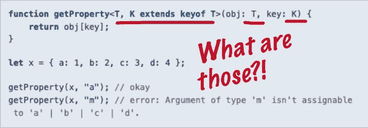
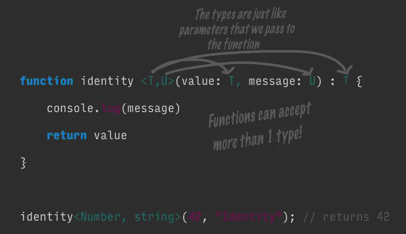
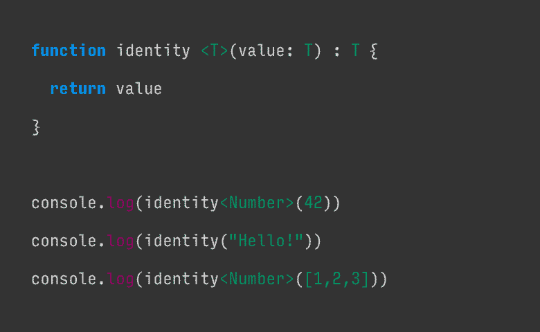

# 如何最终理解 TypeScript 中的泛型

> 原文：<https://betterprogramming.pub/typescript-generics-90be93d8c292>

## 让我们揭开奇怪的<t>语法的神秘面纱，让它成为我们的朋友而不是敌人</t>



[类型脚本泛型文档的注释图像](https://www.typescriptlang.org/docs/handbook/generics.html)

除非你是强类型语言(如 [Java](https://en.wikipedia.org/wiki/Generics_in_Java) )的老手，否则我肯定你也有同样的“WTF？”当你第一次在 TypeScript 中看到泛型类型时。该语法与我们在 JavaScript 中见过的其他语法大相径庭，很难立即直观地看出它在做什么。

我在这里告诉你，仿制药并没有看起来那么可怕。如果你能用 JavaScript 编写一个带参数的函数，那么你很快就能像专家一样编写和使用 TypeScript 泛型。我们开始吧！

# 什么是 TypeScript 中的泛型？

TypeScript 文档将泛型解释为“能够创建一个可以在多种类型上工作的组件，而不是一种类型。”

太好了！这给了我们一个基本的想法。我们将使用泛型来创建某种可重用的组件，它可以用于各种类型。但是它是怎么做的呢？我喜欢这样想:

**泛型对于类型来说就像值对于函数参数来说一样——它们是一种告诉我们的组件(函数、类或接口)当我们调用它时我们想要使用什么** `**type**` **的方式，就像我们如何告诉一个函数当我们调用它时使用什么值作为参数一样。**

理解这句话的最好方法是编写一个通用的标识函数。identity 函数是一个简单地返回传递给它的任何参数的函数。用普通的 JavaScript 来说，应该是:

现在，让我们修改它，使之适用于 TypeScript 中的一个数字:

很高兴我们现在有了一个类型，但是功能不是很灵活。identity 函数应该适用于任何传入的值，而不仅仅是数字。这就是泛型的用武之地。泛型允许我们编写一个可以接受任何类型的函数，并基于该类型转换我们的函数。

还有那个不熟悉的`<T>`语法！但这没什么可怕的。就像我们传入一个参数一样，我们传入的是我们想要用于特定函数调用的类型。


填充泛型类型就像我们在调用函数时填充函数参数一样。

参考上图，当我们调用`identity<Number>(1)`时，`Number`类型是一个参数，就像`1`一样。它在值`T`出现的任何地方填充它。它也可以接受多种类型，就像我们可以有多个参数一样。



一个函数可以有多个泛型，就像它可以有多个参数一样。

注意我们是如何调用这个函数的。语法现在应该开始对你有意义了！**`**T**`**或者** `**U**` **没有什么特别的，它们只是我们选择的变量名而已。当我们调用函数并且它使用这些类型时，我们用类型值填充它们。****

**另一种看待泛型的方式是，它们根据传递给函数的数据类型来转换函数。下面的动画展示了 identity 函数如何随不同的数据类型而变化。**

****

**一个泛型将变形为传递给它的任何“类型”。**

**如您所见，该函数接受传递给它的任何类型，允许我们为不同类型创建可重用的组件，就像文档承诺的那样。**

****一定要注意动画中的第二条控制台日志语句**。我们不提供类型。在这种情况下，TypeScript 将尝试根据数据推断类型。**小心——类型推断只对简单数据有效。如果你传入更复杂的东西比如对象或者多类型数组，它会推断出类型是** `**any**` **，这就分解了我们的类型安全检查。****

# **类和接口的泛型和函数的工作方式完全一样**

**我们现在知道泛型只是将类型传递给组件的一种方式。我们刚刚看到了函数是如何工作的，好消息是:接口和类的工作方式完全一样！在他们的例子中，我们把类型放在接口名或类名的后面。**

**看看下面的代码块对你是否有意义。我希望它会！**

**如果它没有立即对您有意义，尝试沿着函数调用链向上追踪`type`值。它是这样工作的:**

1.  **我们实例化了一个新的`IdentityClass`实例，传入了`Number`和`1`。**
2.  **在 identity 类中，`T`变为`Number`。**
3.  **`IdentityClass`实现`GenericInterface<T>`并且我们知道`T`是`Number`，所以就好像我们在实现`GenericInterface<Number>`**
4.  **在`GenericInterface`中，`U`变成了`Number`。我特意在这里使用了不同的变量名，以表明类型值沿着链向上传播，变量名无关紧要。**

# **实际用例:超越原始类型**

**上面提供的所有例子都使用了基本类型，比如`Number`和`string`。这些都是很好的例子，但是实际上，你不太可能对基本类型使用泛型。当我们拥有形成继承树的自定义类型或类时，泛型的真正威力就显现出来了。**

**考虑汽车的经典继承例子。我们有一个基类`Car`，它被用作`Truck`和`Vespa`的基础。然后我们编写一个实用函数`washCar`，它接受`Car`的一个通用实例，然后返回它。**

**通过告诉我们的洗车函数`T`必须扩展`Car`，我们知道我们能够在函数中调用哪些函数和属性。使用泛型还使我们能够返回传入的特定类型，而不仅仅是一个非特定的`Car`。**

**此代码的输出是:**

```
Received a Vespa in the car wash.
Cleaning all 2 tires.
Beeping horn - beep beep!
Returning your car nowReceived a Truck in the car wash.
Cleaning all 18 tires.
Beeping horn - beep beep!
Returning your car now
```

# **包扎**

**我希望这篇文章能让你更清楚泛型！请记住，您所做的只是向函数传递一个`type`值，仅此而已。:)**

**如果你想了解更多关于泛型的知识，请查看下面的链接。**

****延伸阅读:****

*   **[类型脚本泛型文档](https://www.typescriptlang.org/docs/handbook/generics.html)**
*   **[TypeScript Generics 解释了](https://medium.com/@rossbulat/typescript-generics-explained-15c6493b510f)——比我的快速入门书更深入地了解了泛型。**