# TypeScript —具有超级能力的 JavaScript

> 原文：<https://betterprogramming.pub/typescript-javascript-with-super-powers-a333b0fcabc9>

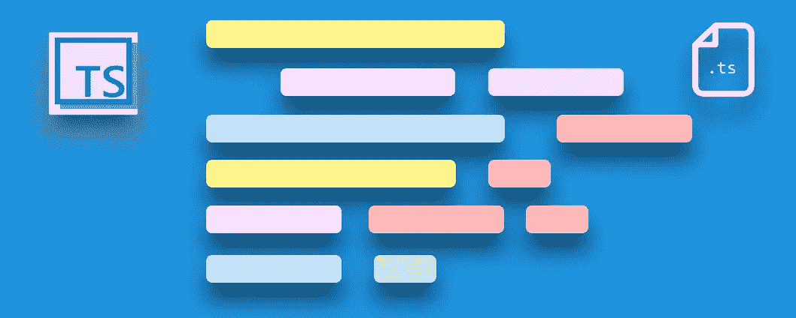

Javascript 很酷。但你知道更酷的是什么吗？— [打字稿](https://www.typescriptlang.org/)。

[成为媒介会员直接支持我的工作](https://trevorlasn.medium.com/membership)。你也可以在媒体上看到所有的故事。提前感谢！

# 你能看出这个代码有什么问题吗？

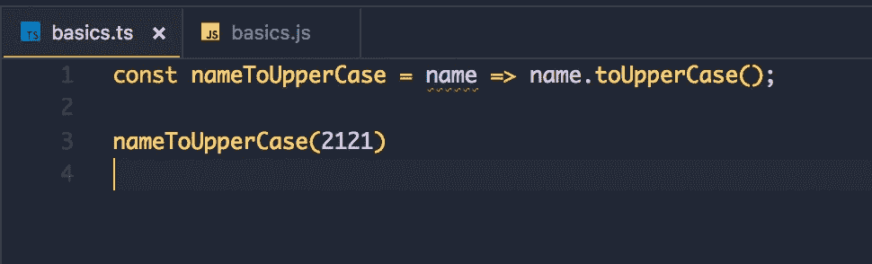

以打字打的文件

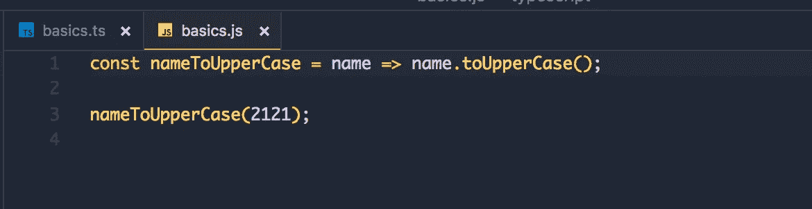

ES6

**打字稿可以！你看到那个红色的小下划线了吗？这是 TypeScript 给我们的暗示，有些事情已经非常糟糕了。**

你可能已经知道这个了— `toUpperCase()`是一种字符串方法。我们传递一个整数作为参数，因此我们不能对整数调用`toUpperCase()`。

让我们通过声明我们只能将类型字符串作为参数传递给我们的`nameToUpperCase()`方法来解决这个问题。

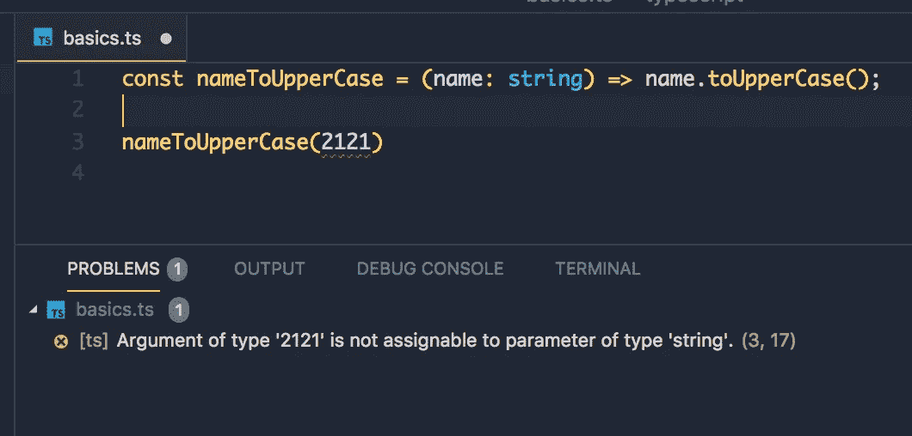

太好了！现在，我们可以信任 TypeScript 来记住它，而不必记住`nameToUpperCase()`只接受一个字符串。想象一下，如果不是数万个方法，也要记住数千个方法和所有的参数类型。不可能！

尽管如此，我们还是看到了红色。为什么？因为我们仍然在传递一个整数。现在让我们传递一个字符串。

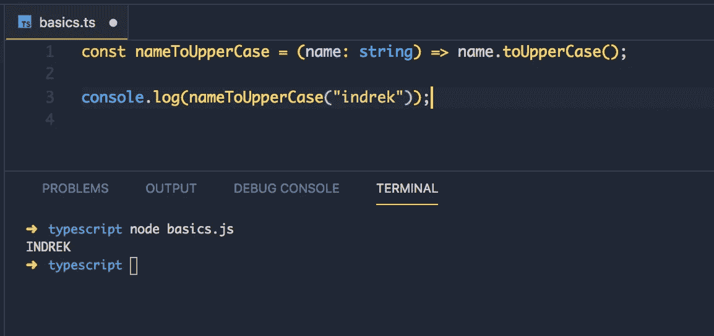

注意，TypeScript 被编译成 JavaScript(它只是 JavaScript 的超集，很像 C++到 C)

这就是为什么类型脚本和类型检查很棒的主要原因。

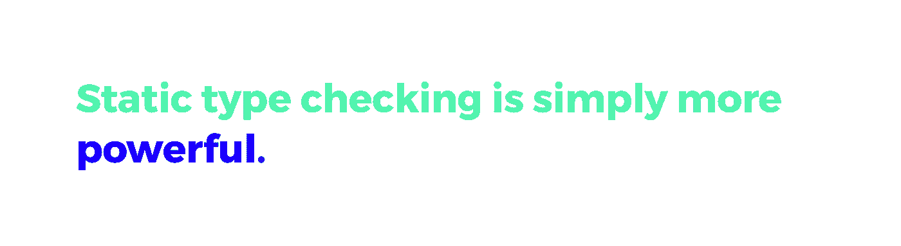

TypeScript 在上个月有 **10，327，953** 次下载。

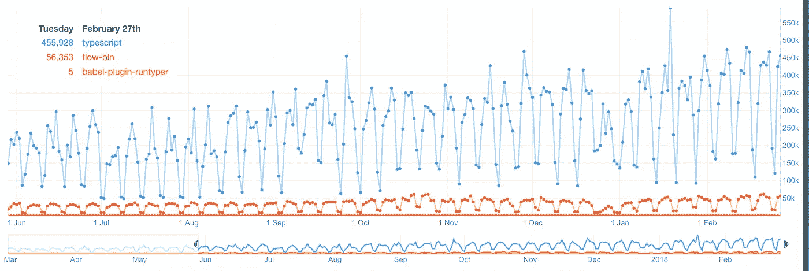

Typescript 下载与流下载的比较

让我们探索一下打字稿的世界。我们稍后将深入探讨，但是首先，让我们了解 TypeScript 到底是什么以及它为什么存在。

TypeScript 首次出现在 2012 年 10 月 1 日。它是由微软开发的；由[安德斯·海尔斯伯格](https://en.wikipedia.org/wiki/Anders_Hejlsberg)([c#](https://en.wikipedia.org/wiki/C_Sharp_(programming_language))首席架构师)及其团队带领。

[TypeScript](https://www.typescriptlang.org/) 在 GitHub 上完全[开源，任何人都可以阅读源代码并投稿。](https://github.com/Microsoft/TypeScript)

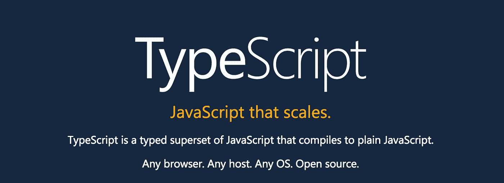

TypeScript —可伸缩的 JavaScript。

# 如何开始

事实上很简单——我们需要的只是一个 npm 包。打开您的终端并键入以下内容:

```
npm i typescript --save
```

我们应该以 TypeScript 配置结束。

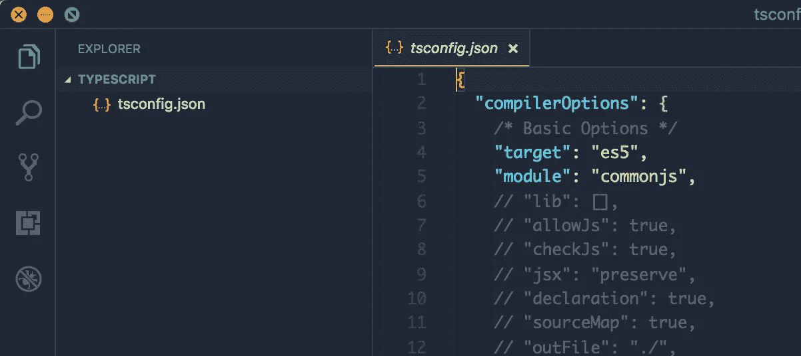

我们需要做的就是创建一个`.ts`文件，并告诉 TypeScript 编译器注意变化。

这是我们最终应该得到的结果:


太好了，现在你可以跟着我们的例子学了。

我们将代码写在`.ts`文件中；`.js`是供浏览器读取的编译版本。在这种情况下，我们没有浏览器，我们使用的是 [Node.js](https://nodejs.org/) (因此`.js`是供 Node 读取的)。


# JavaScript 类型

Javascript 有七种数据类型，其中六种是原语，其余的被定义为对象。

## **Javascript 原语如下:**

*   `String`
*   `Number`
*   `Undefined`
*   `Null`
*   `Symbol`
*   `Boolean`

## 其余的都称为 [*物体*](https://developer.mozilla.org/en-US/docs/Web/JavaScript/Reference/Global_Objects/Object)

*   函数是第一类对象。
*   数组是特殊的对象。
*   原型是对象。

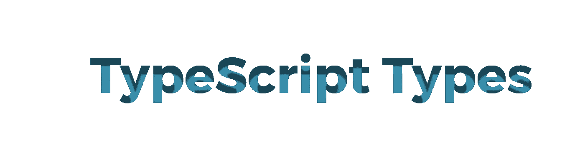

# 类型脚本类型

TypeScript 与 JavaScript 共享相同的基本类型，但是它有几个额外的类型。

额外的类型是可选的，如果你不熟悉它们，你不必使用它们。我发现这就是打字稿的美妙之处；它不使用太多的力量，也没有限制。

# TypeScript 附加类型

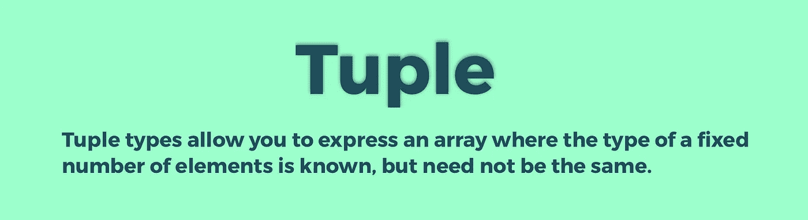

## 元组

将元组想象成有组织的数组。您按照正确的顺序预定义了类型。

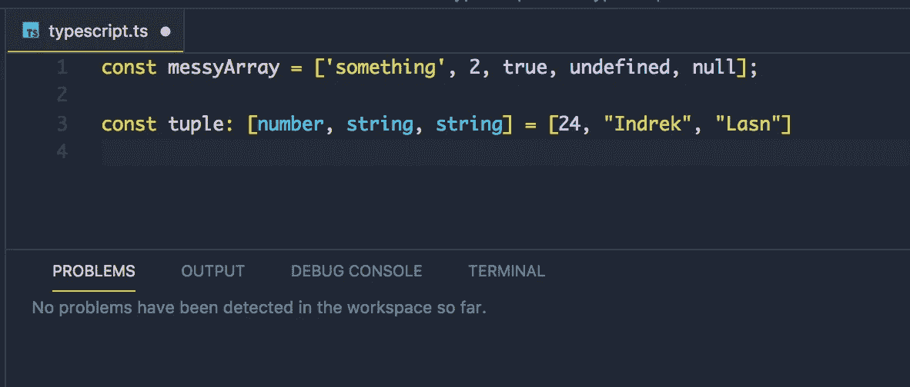

无组织数组 vs 元组(有组织数组)。

如果我们不遵守我们为元组发布的排序索引规则，TypeScript 会给我们一个提示，我们没有遵守规则。

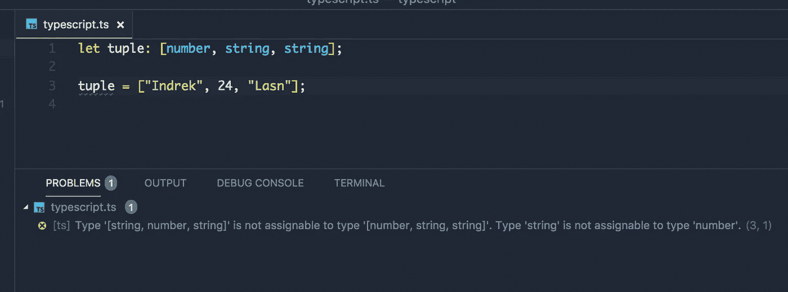

Tuple 期望第一个值是一个`number`，但在本例中不是这样。这是一个字符串`"Indrek"`，因此它给我们一个错误。


## 空的

在 TypeScript 中，您必须在函数中定义返回类型。有些函数没有`return`语句:

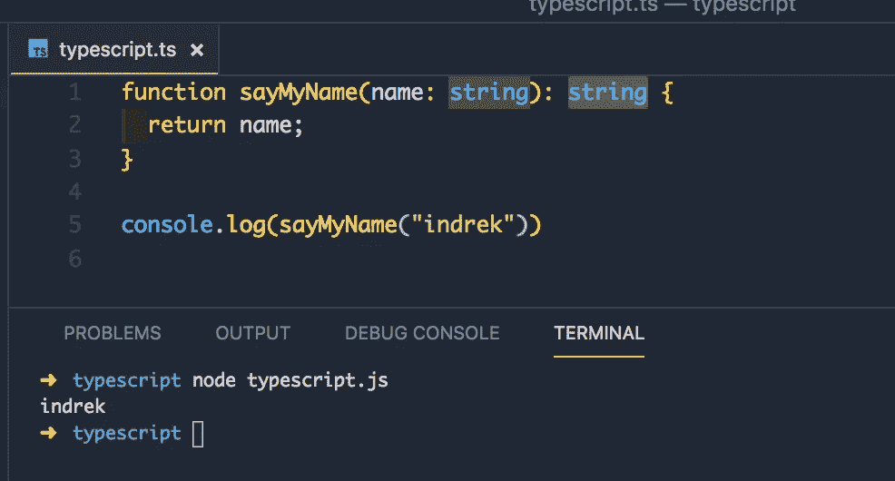

注意我们是如何声明参数类型*和返回类型*的——两者都是字符串。

现在，如果我们不返回任何东西会发生什么？一个真实的例子是函数体中的`console.log`语句。

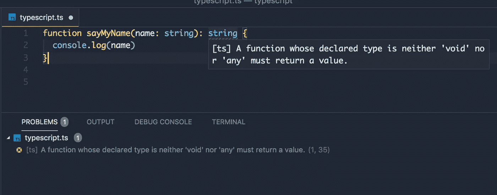

我们可以看到 TypeScript 编译器告诉我们，“嘿，你没有返回任何东西但是你*明确地* 说我们*有*返回一个字符串。我只是想让你知道，我们没有遵守规则。”

那么如果我们不想归还任何东西呢？假设我们的函数中有一个回调。在这种情况下，我们使用`Void`返回类型。

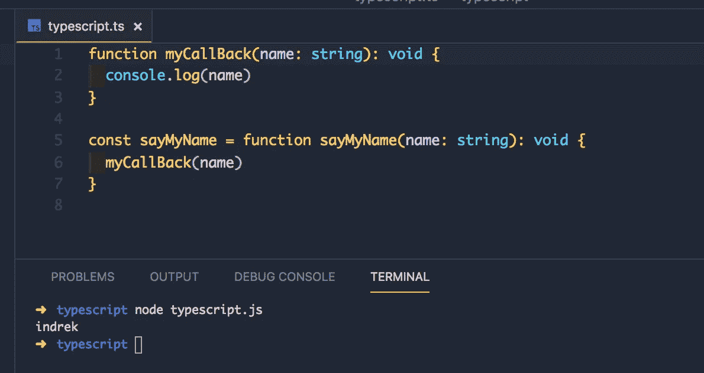

但是如果我们确实返回了一个值，无论是隐式的还是显式的，我们都不能使用返回类型`Void`。

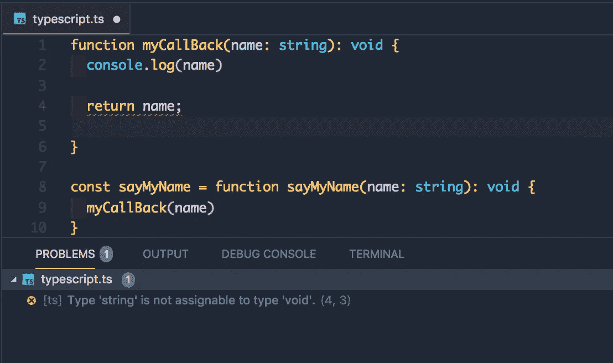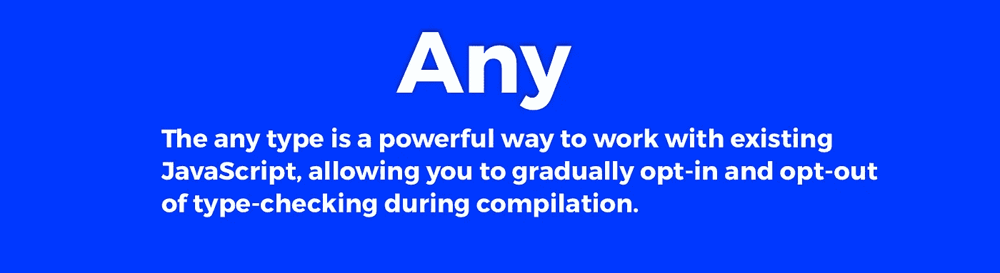

## 任何的

`any`型很简单。我们不知道我们在处理什么类型，所以它可能是`any`。

例如:

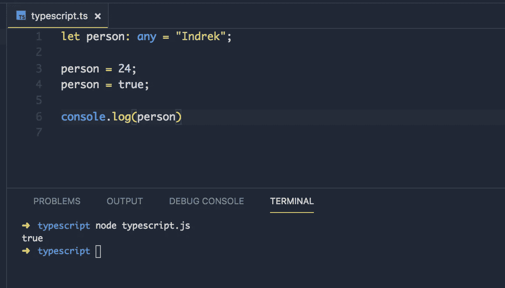

注意我们是如何多次重新分配这个人的类型的。首先，它是一个字符串，后面是一个数字，最后是一个布尔值。我们只是不能确定类型。

一个真实的例子是当你使用一个第三方库时，你不知道它的类型。

我们来取一个数组。您从 API 中提取一些数据，并将其存储在数组中。该数组由随机数据组成。它不会只由字符串和数字组成，也不会像元组那样有组织的结构。`Any`类型可以帮助我们在这里。

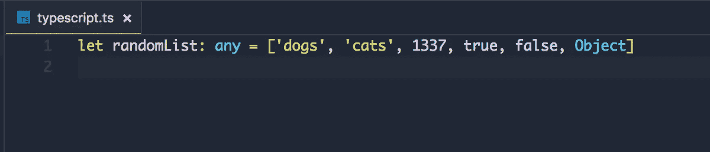

如果您知道数组只包含一种类型，您可以向编译器显式声明，如下所示:

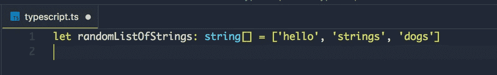

这篇文章越来越长，所以我们将在下一章继续。我们还必须介绍几个最终的基本类型`enum`、`never`、`null`、`undefined`，以及一个特例`type assertions`。

如果你有兴趣了解更多，这里有一些基本类型的文档。如果你感到自信并想深入研究打字稿，从这本书开始吧。Kindle 版的书[这里](https://amzn.to/2lsMnOb)。

注意:我用的是 Visual Studio 代码，Ayu Mirage 主题用的是 Pro 字体的源代码。

[**第二部分可以在这里找到。**](https://medium.com/cleversonder/typescript-javascript-with-superpowers-part-ii-69a6bd2c6842)

[](https://medium.com/cleversonder/typescript-javascript-with-superpowers-part-ii-69a6bd2c6842) [## TypeScript —具有超级能力的 JavaScript 第二部分

### 枚举(enumerations)允许您将值与更友好的名称组合在一起。想象你有一个名单。

medium.com](https://medium.com/cleversonder/typescript-javascript-with-superpowers-part-ii-69a6bd2c6842) 

感谢阅读！