# TypeScript —具有超级能力的 JavaScript 第二部分

> 原文：<https://betterprogramming.pub/typescript-javascript-with-superpowers-part-ii-69a6bd2c6842>

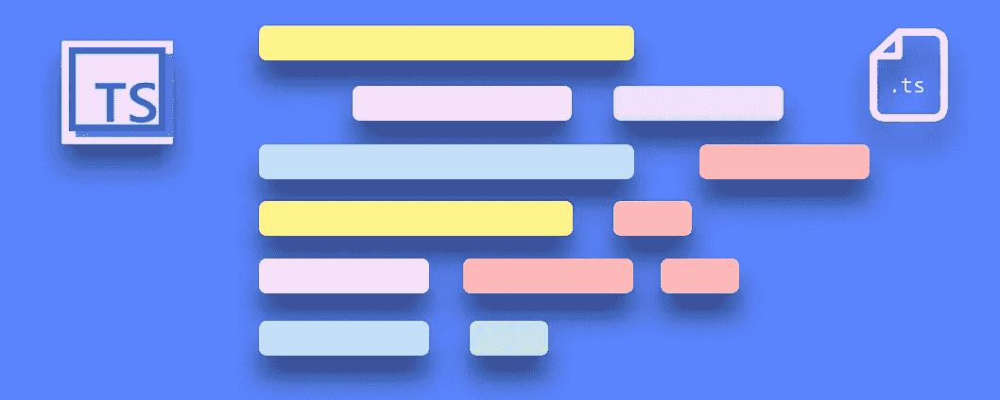

枚举(**enum**operations)允许您将值与更友好的名称组合在一起。

想象你有一个名单。下面是如何构建`enum`:

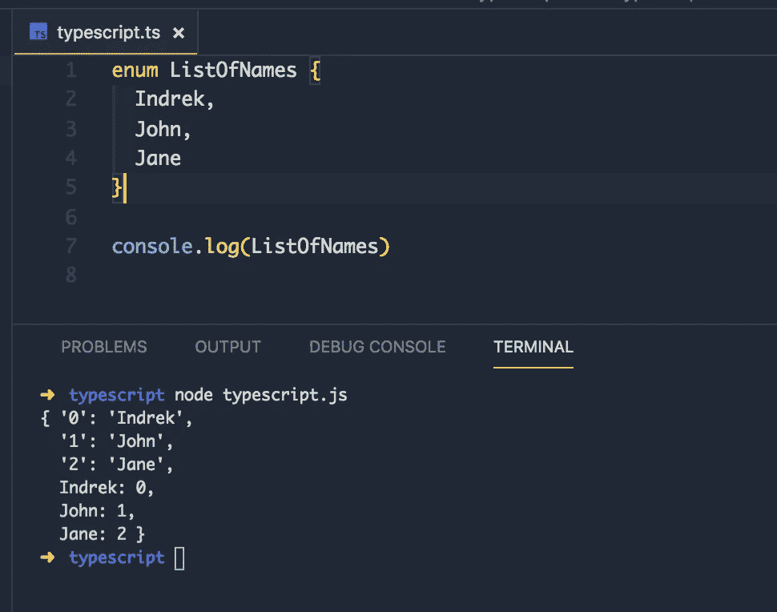

您可以像这样从`enum`中获取值:

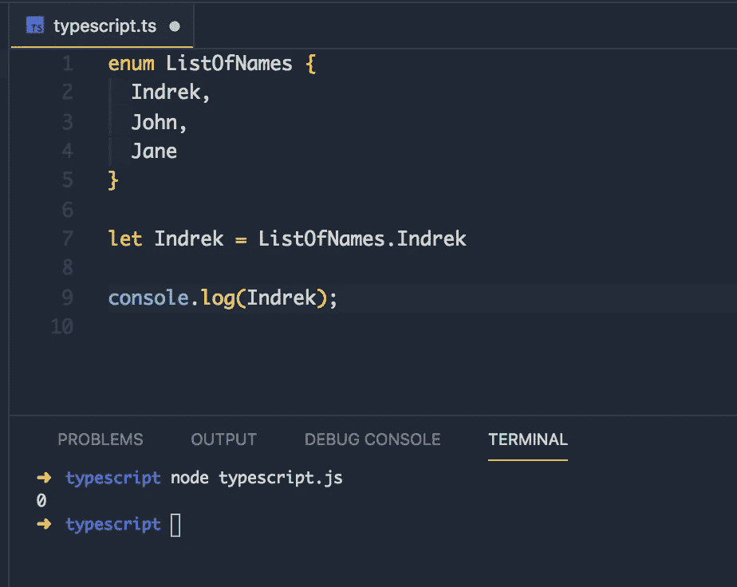

但是等等…它返回代表值的索引的整数。像数组一样，枚举从`0`开始索引它们的成员。

我们如何得到值`"Indrek"`而不是`0`？

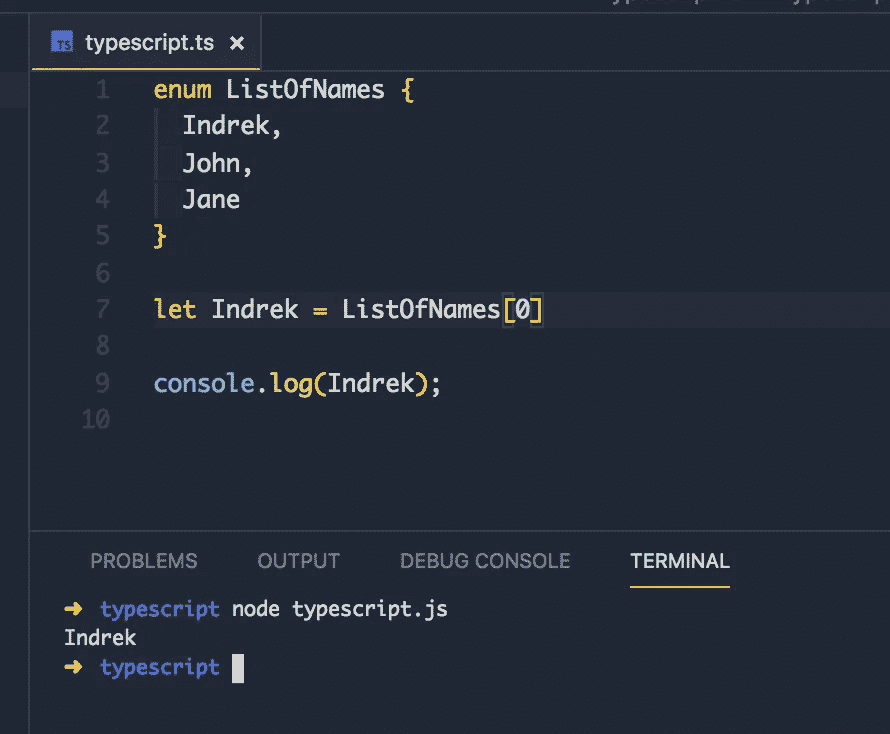

请注意这些值是如何显示为字符串的。

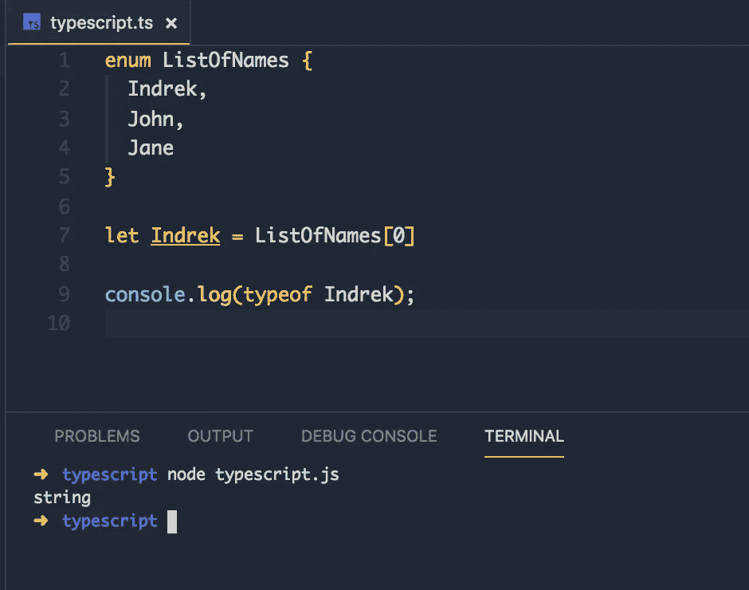

另一个很好的例子是使用枚举来存储应用程序状态。

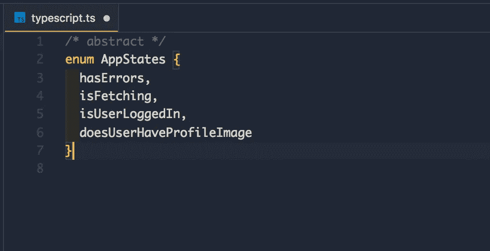

如果你有兴趣了解更多关于枚举的知识——我在`enum`中找到了一个[伟大的答案](https://stackoverflow.com/a/28818850/5073961)。

假设我们从一个 API 获取了一些数据。我们总是期望数据被获取—但是如果我们不能获取它呢？

返回`never`类型的最佳时间(特殊情况):

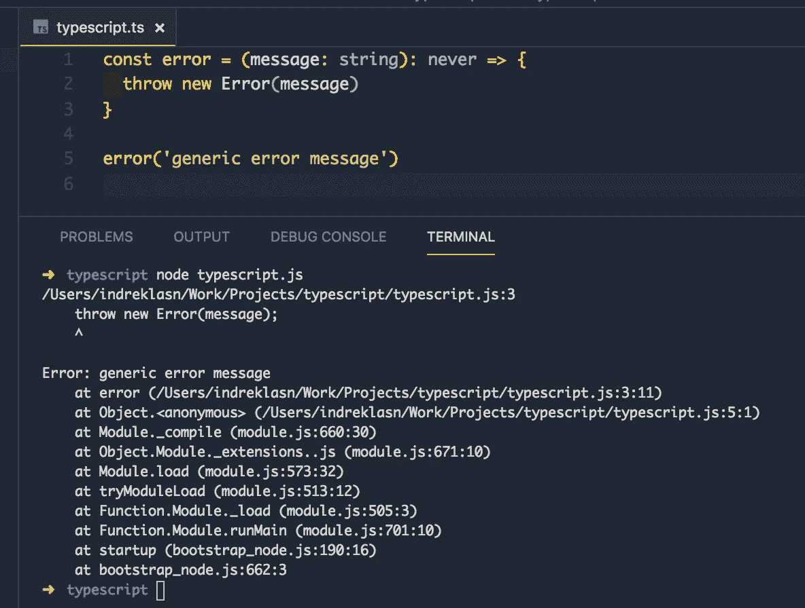

注意我们传递的错误消息

我们可以在另一个函数内部调用`error`函数(回调):

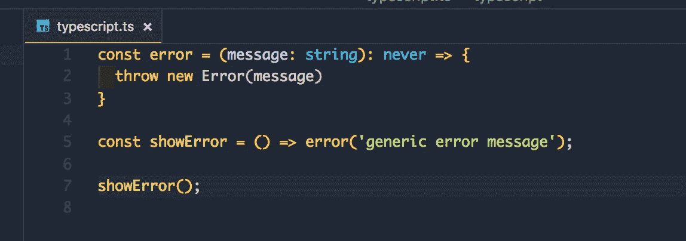

注意，我们没有使用`void`而是使用了`never`，因为推断的返回类型是`never`。

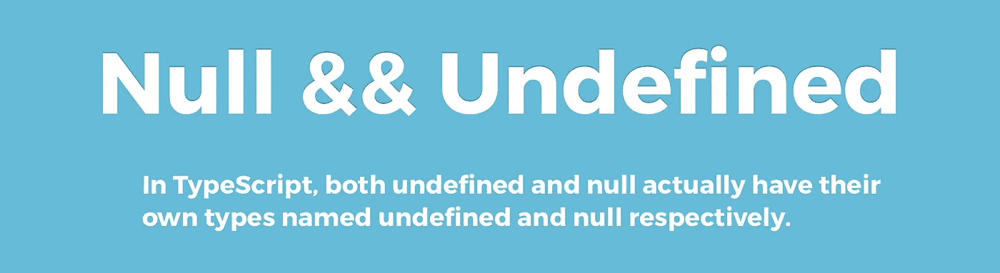

*   **null** —没有任何值
*   **未定义** —变量已经声明，但尚未赋值

它们本身不是很有用:

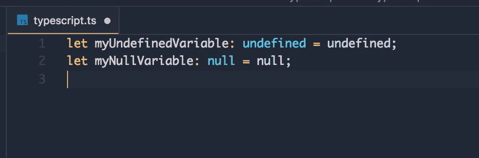

默认情况下，`null`和`undefined`是所有其他类型的子类型。这意味着您可以将`null`和`undefined` 分配给类似于`number`的东西。

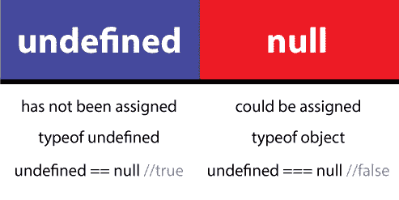

[来源](https://stackoverflow.com/a/44388246/5073961)

Axel Rauschmayer 博士写了一篇关于`null`和`defined`的很棒的文章。

如果您知道某个实体的类型可能比其当前类型更具体，通常会发生类型断言。

类型断言没有运行时影响，纯粹由编译器使用。TypeScript 假定您(程序员)已经执行了您需要的任何特殊检查。

这里有一个快速演示:

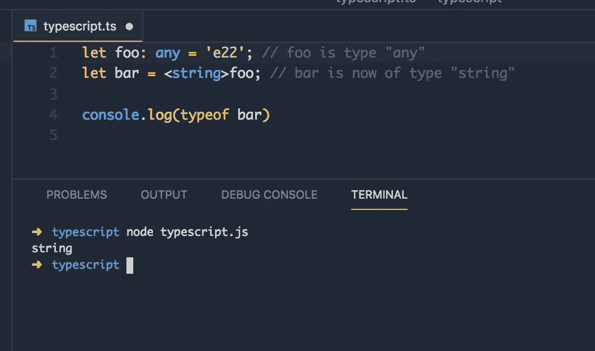

括号`<>`语法与 [JSX](https://reactjs.org/docs/jsx-in-depth.html) 冲突，所以我们使用`as`语法代替。

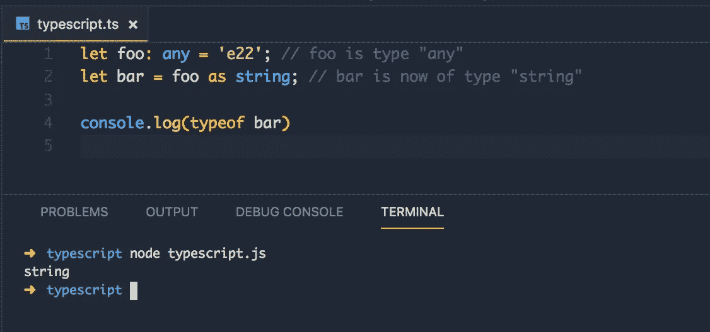

这里有更多关于[类型断言](https://basarat.gitbooks.io/typescript/docs/types/type-assertion.html)的内容。

**万一你想深入学习 TypeScript，这里有一本** [**书我推荐**](https://amzn.to/2lfpdeg) 。

如果你对你的 JavaScript 游戏感到不舒服，不用担心！这里有一本关于掌握 JavaScript 的[书](https://amzn.to/2lJS62r)！

# 值得考虑的好东西

*   [接口](https://basarat.gitbooks.io/typescript/docs/types/interfaces.html) s
*   [明确类型化](https://github.com/DefinitelyTyped/DefinitelyTyped)
*   [工会](https://basarat.gitbooks.io/typescript/docs/types/discriminated-unions.html)
*   [班级](https://www.typescriptlang.org/docs/handbook/classes.html)
*   [牛逼的打字稿](https://github.com/dzharii/awesome-typescript)

现在——用 Typescript 构建一些很棒的东西！这里有一个有趣的应用程序列表。

如果你准备好深入研究 TypeScript，我建议你从阅读“ [*编程 TypeScript:让你的 JavaScript 应用程序伸缩*](https://amzn.to/315nW8Z) ”这本书开始。

# 感谢阅读，保持敬畏！❤