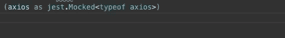
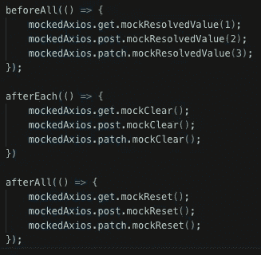
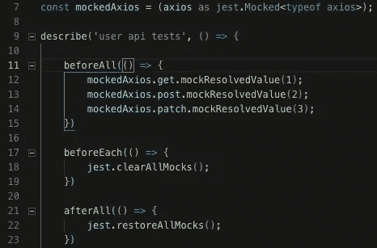
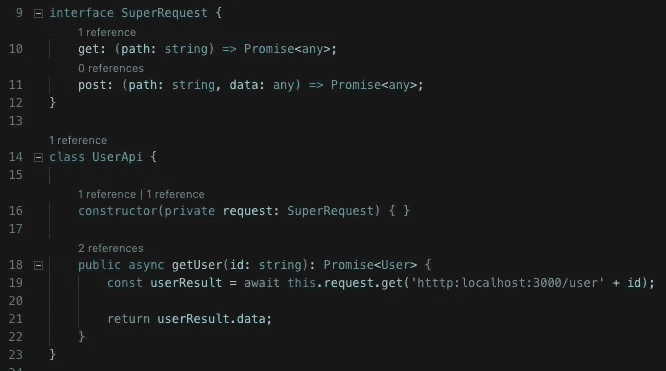
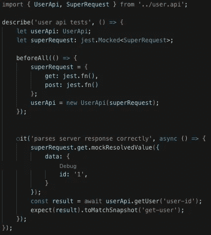
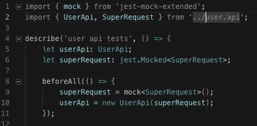
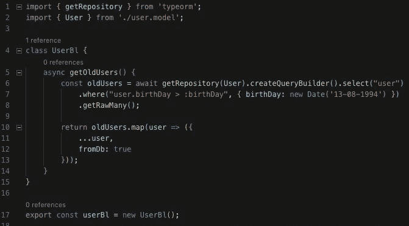
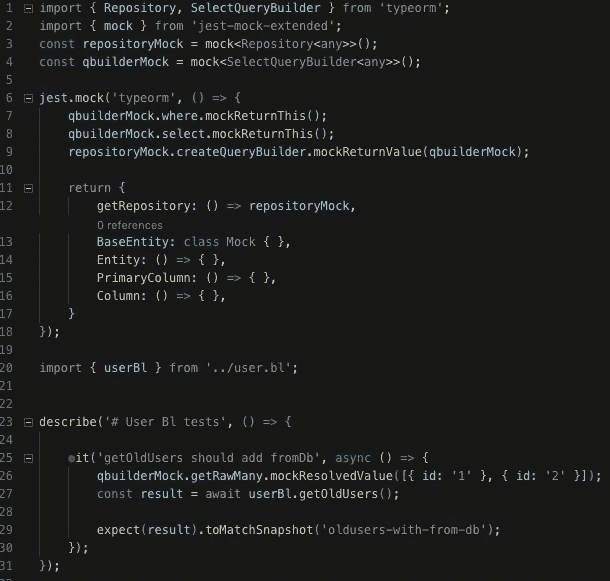
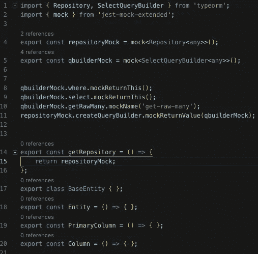
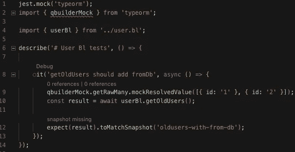

# TypeScript 和 Jest:测试挑战

> 原文：<https://betterprogramming.pub/typescript-jest-testing-challenges-c010eaa8f3f2>

## 我找到了用打字稿和笑话进行测试的圣杯


[钟](https://unsplash.com/@zlg?utm_source=unsplash&utm_medium=referral&utm_content=creditCopyText)在 [Unsplash](https://unsplash.com/s/photos/test?utm_source=unsplash&utm_medium=referral&utm_content=creditCopyText) 上拍照

这篇文章将分享我对用 [Jest](https://jestjs.io/) 和 TypeScript 测试挑战的想法和见解。

我不会深入讨论如何用 Jest 设置您的 TypeScript 项目，因为有许多指南，老实说，这相当简单。以下是一些例子:

*   [git books 上的笑话](https://basarat.gitbooks.io/typescript/docs/testing/jest.html)
*   [自动模拟](https://dev.to/muhajirdev/unit-testing-with-typescript-and-jest-2gln#automatic-mock)。”

    好，酷，所以现在当代码调用`axios.get`时，它不会触发任何代码，但我想要更多，我想决定`get`将返回什么，以便测试多个场景。

    

    这正是这条线的作用。

    我把 axios 当作一个被嘲笑的笑话对象，并从中获得智慧。
    基本上，我告诉它返回一个解析值为`-> data: stubUser`的承诺。

# 清除和重置模拟

如果您在测试之间使用相同的模拟函数，并且您想要检查调用量，您必须重置模拟函数。

这会变得非常冗长:



我从 [Sinon](https://sinonjs.org/) 来到 Jest，在那里你有一个沙箱，你可以添加每个 stub/mock，并在沙箱上调用 reset，这将重置它的所有 stub。

显然，Jest 有一个与 Sinon 相似的解决方案:



Jest 中的清除、复位(如果启用了 clearMocks jest 配置，则可以移除清除、复位)

您甚至可以将`clearMocks: true`添加到 Jest 配置中，它将在每次测试之前清除模拟！

# 嘲笑类型

使用依赖注入时，通常会有一个类似这样的类:



现在，像以前一样，我想测试`UserApi`，但是我不想实际发送请求到服务器，所以你想做的是通过`SuperRequest`的 a 类模拟实现。

测试可能看起来像这样:



这可能会变得冗长，每次你需要模拟一个接口时，你必须声明一个用`jest.fn()`模拟函数实现它的对象。

输入 [jest-mock-extended](https://www.npmjs.com/package/jest-mock-extended) 。

使用 jest-mock-extended，代码看起来像这样:



干净多了！

# 模拟复杂的 NPM/本地模块

因此，到目前为止，我向您展示了我认为是在 TypeScript 项目中进行嘲弄的构件。

有些场景中，要模拟的模块很复杂，简单的`jest.mock(‘module_name’)`无法完成这项工作。

最好的学习方法是从例子中学习。我将使用 [TypeORM](https://www.npmjs.com/package/typeorm) (一种与 TypeScript 配合良好的 ORM)作为复杂模块的例子。

让我们看看这段代码:



当然，这段代码在逻辑上是没有意义的(为什么我要给一个结果加上`fromDb`),但是为了我们的例子，它可以做到。

那里有很多事情在进行，我们有一个`getRepository`返回一个`createQueryBuild`函数，该函数有构建器设计模式中的方法。

最后我们要控制`getRawMany`返回什么，为什么？

我们的逻辑将`fromDb`属性添加到结果中，因此我们希望控制逻辑的输入，它是从`getRawMany`接收的。

测试是什么样的？



哦，哇，这太复杂了。因此..里面发生了什么事？

*   第 3–4 行:为 TypeORM 接口准备模拟。
*   第 6–18 行:我们正在使用 [Jest 的模块工厂](https://jestjs.io/docs/en/es6-class-mocks#calling-jestmockdocsenjest-objectjestmockmodulename-factory-options-with-the-module-factory-parameter)，它允许我们返回一个手动模拟(而不是 Jest 的自动模拟)。
*   第 7–8 行:告诉`queryBuilder`当`select`和`where`被调用返回自身时，这就是你模仿构建器设计模式的方式。
*   第 9 行:告诉存储库 mock 在调用`createQueryBuilder`函数时返回`queryBuilder` mock。
*   第 11–17 行:声明调用以下代码时将返回的对象:

```
import typeorm from 'typeorm'
```

*   第 12 行:告诉`getRepository`返回我们的库模拟。
*   第 13–16 行:与`User`实体声明相关的嘲讽。
*   第 26 行:告诉查询构建器 mock 在`getRawMany` - >我们的目标中返回什么！

等等！我知道你在想什么，我真的需要在每个使用复杂模块的测试中编写所有的代码吗？

# 让它变漂亮

我们能做的就是把 TypeORM 的嘲讽声明单独放到自己的文件里！Jest 有一个内置的系统。

我们将在`__mocks__/typeorm.ts`中创建一个文件。



现在我们的测试文件将如下所示:



当然，`qbuilderMock`不存在于`typeorm`的类型中，但是我们的模拟版本`typeorm`包含了它，所以测试将会运行。

# 结论

我希望这篇文章增加了您处理测试的工具库。