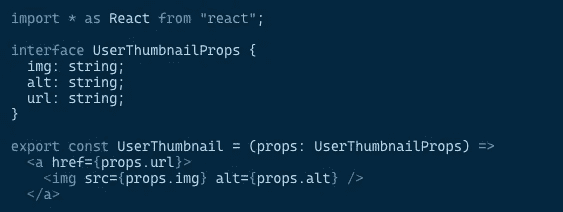

# TypeScript 4.1 中的模板文字类型是什么？

> 原文：<https://betterprogramming.pub/typescript-new-release-19f1238c6a68>

## [网络开发](https://rakiabensassi.medium.com/list/software-engineering-7a179a23ebfd)

## **递归条件类型，React 的 JSX 工厂，以及新 TypeScript 版本中的更多特性**


科尔顿·迪安·马歇尔在 [Unsplash](https://unsplash.com?utm_source=medium&utm_medium=referral) 上的照片。

我已经使用 TypeScript 很多年了，发现它非常容易理解——特别是作为一个有 Java 背景的人。但是在阅读了关于 TypeScript 4.1(该语言的最新重大更新)的新闻后，我惊讶于我所不知道的东西。

我不认为我的无知是个例外。在利用新闻作为更深入了解类型系统实际工作方式的机会后，我想与您分享新版本中令人兴奋的功能和变化，其中包含对关键字的解释和大量非神秘化的示例。

如果你确信你已经牢固掌握了所有的语言基础，并且渴望学习高级功能，那么让我们开始吧。

# 新的语言功能

## 模板文字类型

在 ES6 中引入的模板文字允许您在处理字符串时使用反斜线而不是单引号或双引号:

```
const message = `text`;
```

正如 [Flavio Copes](https://flaviocopes.com/javascript-template-literals/) 所指出的，它们提供了许多用引号构建的普通字符串所没有的特性:

*   它们提供了很好的语法来定义多行字符串。
*   它们提供了一种在字符串中插入变量和表达式的简单方法。
*   它们允许你用模板标签创建 DSL(领域特定语言)。

模板文字类型与 JavaScript 中的[模板文字字符串](https://developer.mozilla.org/en-US/docs/Web/JavaScript/Reference/Template_literals)具有相同的语法，除了它用在类型位置:

TypeScript 4.1 模板文本字符串类型

当与具体的文字类型一起使用时，通过连接内容会产生一个新的字符串文字类型。

## 映射类型中的键重新映射

映射类型可以基于任意键创建新的对象类型。字符串可以在映射类型中用作属性名:

TypeScript 映射类型

如果您希望能够创建新的键或过滤掉键，TypeScript 4.1 允许您用一个新的`as`子句重新映射映射类型中的键:

打字稿[重映射键](https://www.typescriptlang.org/docs/handbook/release-notes/typescript-4-1.html#key-remapping-in-mapped-types)

新的`as`子句允许您利用模板文字类型等特性，轻松地基于旧的属性名称创建新的属性名称。可以通过生成`never`来过滤键，这样在某些情况下就不必使用额外的`Omit`辅助类型:

TypeScript 通过 as 子句利用模板文字类型( [source](https://www.typescriptlang.org/docs/handbook/release-notes/typescript-4-1.html#key-remapping-in-mapped-types) )

# JSX 工厂

JSX 代表 JavaScript XML。它允许你用 JavaScript 编写 HTML 元素并把它们放在 DOM 中，而不需要任何`createElement()`和/或`appendChild()`方法。这里有一个例子:

反应 JSX 工厂功能

TypeScript 4.1 通过`jsx`编译器选项的两个新选项支持 React 17 的`jsx`和`jsxs`工厂函数:

*   `react-jsx`
*   `react-jsxdev`

> 这些选项分别用于生产编译和开发编译。通常，一方的选择可以延伸到另一方。”— [打字稿发行说明](https://www.typescriptlang.org/docs/handbook/release-notes/typescript-4-1.html)

以下是 TypeScript 文档中关于生产和开发配置的两个示例:

tsconfig.json: [生产构建的 TypeScript 配置示例](https://www.typescriptlang.org/docs/handbook/release-notes/typescript-4-1.html)

tsconfig.dev.json: [开发构建的 TypeScript 配置示例](https://www.typescriptlang.org/docs/handbook/release-notes/typescript-4-1.html)



TypeScript 4.1 支持 React ( [图片来源](https://www.typescriptlang.org/))等 JSX 环境中丰富的类型检查

# 递归条件类型

当前版本的另一个新特性是递归条件类型。通过允许条件类型在其分支内引用自身，它们提供了更灵活的条件类型处理。这个特性使得编写递归类型别名变得更加容易。下面是一个使用`Awaited`解开深层嵌套承诺的例子:

打字稿`Awaited`

但是，应该注意的是，TypeScript 需要更多的时间来对递归类型进行类型检查。微软警告说，应该负责任地谨慎使用它们。

## 检查索引访问

TypeScript 中的索引签名允许你访问任意命名的属性，如下面的`Options`接口所示。在这里，我们看到没有名字`path`或名字`permissions`的被访问属性应该具有类型`string | number`:

类型脚本检查索引访问(示例[源](https://gist.github.com/rakia/4a844b0b8931ef2f813e7ec36bd55704)

一个新的标志，`--noUncheckedIndexedAccess`，提供了一个节点，其中每个属性访问(如`opts.path`)或索引访问(如`opts["blabla"]`)都被认为是潜在未定义的。这意味着，如果您需要访问一个类似于上一个示例中的`opts.path`的属性，您必须检查它是否存在，或者使用一个非空断言操作符(后缀`!`字符):

打字稿`--noUncheckedIndexedAccess`(示例[来源](https://gist.github.com/rakia/4a844b0b8931ef2f813e7ec36bd55704))

`--noUncheckedIndexedAccess`标志对于捕捉大量错误是有用的，但是对于大量代码来说可能是嘈杂的。这就是为什么它不会被`--strict`标志自动使能。

## 没有`baseUrl`的路径

在 TypeScript 4.1 之前，为了能够在`tsconfig.json`文件中使用`paths`，您必须声明`baseUrl`参数。在新版本中，可以指定不带`baseUrl`的`paths`选项。这解决了自动导入中路径不佳的问题。

tsconfig.json 中的 TypeScript 路径和 baseUrl

## `checkJs`现在暗指`allowJs`

如果您有一个 JavaScript 项目，您使用`checkJs`选项来报告。js 文件，您还应该声明`allowJs`来允许编译 JavaScript 文件。在 TypeScript 4.1 中，情况不再如此。`checkJs`现在默认暗示`allowJs`:

在 tsconfig.json 中键入 checkjs 和 allowjs

## JSDoc `@see` 标签的编辑器支持

当在编辑器中使用 TypeScript 时，现在对 JSDoc 标签`[@see](http://twitter.com/see)`有了更好的支持。这应该会提高 TypeScript 4.1 的可用性:

TypeScript @see(示例[来源](https://gist.github.com/rakia/4a844b0b8931ef2f813e7ec36bd55704))

# 重大变化

## `lib.d.ts`变化

`[lib.d.ts](https://basarat.gitbook.io/typescript/type-system/lib.d.ts#:~:text=This%20file%20contains%20the%20ambient,context%20of%20a%20TypeScript%20project.)`是每次安装 TypeScript 时提供的文件。它包含 JavaScript 运行时和 DOM 中各种常见 JavaScript 结构的环境声明，使您可以轻松地开始编写类型检查的 JavaScript 代码。

该文件自动包含在 TypeScript 项目的编译上下文中。您可以通过指定`--noLib`编译器命令行标志或`tsconfig.json`中的`"noLib": true`来排除它。

在 TypeScript 4.1 中，由于 DOM 类型是如何自动生成的，`lib.d.ts`可能有一组更改的 API。例如`Reflect.enumerate`已被删除，因为它已从 ES2016 中删除。

## `abstract`成员不能被标记`async`

另一个突破性的变化是，标记为`abstract`的成员不能再标记为`async`。所以要修复你的代码，你必须删除关键字`async`:

TypeScript 抽象类

## `any` / `unknown`在虚假位置繁殖

在 TypeScript 4.1 之前，对于类似于`foo && somethingElse`的表达式，`foo`的类型是`any`或`unknown`。整个表达式的类型是`somethingElse`的类型，在下面的例子中是`{ someProp: string }`:

```
declare let foo: unknown;
declare let somethingElse: { someProp: string };let x = foo && somethingElse;
```

在 TypeScript 4.1 中，`any`和`unknown`向外传播，而不是右侧的类型。通常，解决这种变化的适当方法是从`foo && someExpression`切换到`!!foo && someExpression`。

*注意:双惊叹号(* `*!!*` *)是将变量转换为布尔值(真或假)的一种简便方法。*

## 在 p `romise`中`resolve`的参数不再是可选的

`resolve`参数在`Promise`中不再可选:

promise 中的打字稿解析

上一个示例可能会引发如下错误:

TypeScript 解析错误

作为一个解决方案，在 promises 中必须给`resolve`至少一个值，否则在确实需要不带参数调用`resolve()`的情况下，您必须用显式的`void`泛型类型参数来声明`Promise`:

带有 void 泛型参数的 TypeScript promise

## 条件差价创建可选属性

在 JavaScript 中，对象扩展`{ ...files }`不会对 falsy 值进行操作。这意味着如果是`null`或`undefined`，将跳过`files`。

在以下使用条件展开的示例中，如果定义了`file`，则`file.owner`的属性将被展开。否则，没有属性会传播到返回的对象中:

在 TypeScript 4.1 之前，`getOwner`返回了基于每个跨页的联合类型:

```
{ x: number } | { x: number, name: string, age: number, location: string }
```

*   如果定义了`file`，则所有来自`Person`(`owner`的类型)的属性。
*   否则，它们都不会在结果中定义。

然而，事实证明这最终是极其昂贵的，并且通常不是有益的——在单个对象中有数百个分布，并且每个分布潜在地增加了数百或数千个属性。为了提高性能，在 TypeScript 4.1 中，返回的类型有时使用全可选属性:

```
{
    x:         number;
    name?:     string;
    age?:      number;
    location?: string;
}
```

## 不匹配的参数不再相关

彼此不对应的参数先前在 TypeScript 中通过将它们与类型`any`相关联而彼此相关。

在下面的重载示例中(为同一个函数提供多个函数类型)，`pickCard`函数将根据用户传入的内容返回两个不同的东西。如果用户传入一个代表卡片组的对象，该函数将选取卡片。如果用户选择卡片，他们将得到他们选择的卡片:

JavaScript 重载(示例[源](https://www.typescriptlang.org/docs/handbook/functions.html)

在 TypeScript 4.1 中，某些可赋值性情况会失败，某些重载解析情况会失败。作为一种变通方法，您最好使用类型断言来避免错误。

# 最后的想法

TypeScript 通过在运行代码之前捕捉错误并提供修复来节省时间。通过更深入地理解它，您可以了解如何改进您的 TypeScript 应用程序结构并解决复杂的情况。希望本文能帮助您探索类型系统，并让您的编程之旅更加精彩。

可以通过 [NuGet](https://www.nuget.org/packages/Microsoft.TypeScript.MSBuild) 或 NPM 访问 TypeScript 4.1

```
npm install typescript
```

🧠💡我为一群聪明、好奇的人写关于工程、技术和领导力的文章。 [**加入我的免费电子邮件简讯独家访问**](https://rakiabensassi.substack.com/) 或注册媒体[这里](https://rakiabensassi.medium.com/membership)。

*你可以在 Udemy 上查看我的* ***视频课程****:*[*如何识别、诊断、修复 Web Apps 中的内存泄漏*](https://www.udemy.com/course/identify-and-fix-javascript-memory-leaks/) *。*