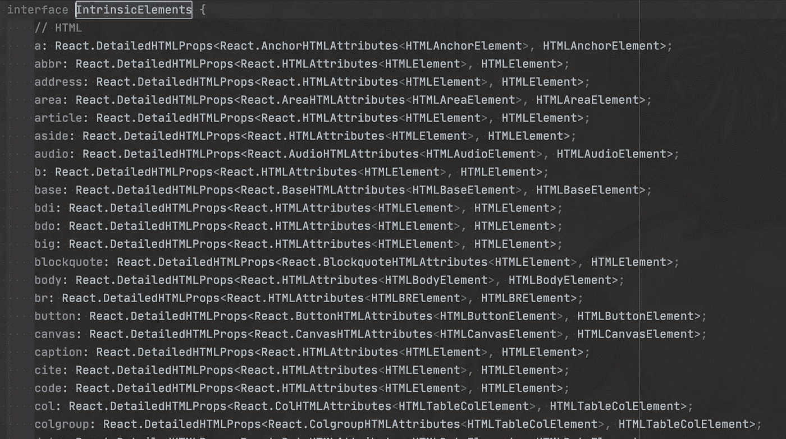

# TypeScript 和 React 中的元素与 ReactElement 和 html 元素与节点混淆

> 原文：<https://betterprogramming.pub/typescript-reactjs-the-element-vs-reactelement-vs-htmlelement-vs-node-confusion-6cda21315ddd>

## 它可能在过去发生在你身上，不太明白你应该使用哪一个


照片由[阿米特·拉哈夫](https://unsplash.com/@amit_lahav?utm_source=medium&utm_medium=referral)在 [Unsplash](https://unsplash.com?utm_source=medium&utm_medium=referral) 上拍摄

TypeScript 的一个重要特性是在键入变量时可以达到的特异性水平。您可以将数组定义为字符串、数字或它们的组合的集合，但是您也可以将元素定义为`HTMLInputElement` 或`HTMLSelectElement`。然而，在开始时，指定变量类型粒度的容易程度会导致很多混乱。

我见过程序员更不一致的一个领域是在输入 HTML 元素时，尤其是在使用 React 时。公平地说，当您考虑您拥有的大量可能性时，尤其是当您开始使用 TypeScript 时，这有点令人不安。

所以，让我们试着去揭开何时使用它们的神秘面纱。

# 定义

首先，让我们来定义这些术语:

## 节点类型

节点类型由[本库定义](https://github.com/microsoft/TypeScript/blob/master/lib/lib.dom.d.ts)中的 TypeScript 定义。这个接口是大多数 DOM 元素的基本祖先。Select Options、div 或 HTML 表单等元素继承自节点**。**

从源代码文档中:

> 节点是一个接口，许多 **DOM** API 对象类型从该接口继承。它允许那些**类型被类似地对待**；比如继承同一套方法，或者用同样的方式测试。”

在 Node 中的其他实现中，您将看到`nodeName`(一个只读字符串)、`childNodes`(一个 ChildNode 类型元素的只读列表)，以及许多其他用于操作节点的常用属性和方法。

## 元素类型

元素类型继承了节点类型。这是在 TypeScript 的标准 DOM 类型集中定义的(你可以[在这里](https://github.com/microsoft/TypeScript/blob/master/lib/lib.dom.d.ts)查看)。根据源代码中的文档:

> "元素是最通用的**基类**，文档**中的所有对象都从它继承。"**

这两个亮点是我自己的，我认为它们说明了这种类型是关于什么的:最终将出现在文档对象模型中的对象的基类。

接下来，元素类型源代码的文档说明如下:

> “它只有各种元素共有的方法和属性。更多特定的类继承自元素。

这是最通用的类型，仅次于节点类型。其他类型将从它继承。在这里，您会发现有用的方法，比如`getElementsByClassName`方法(它返回元素的集合)，或者属性，比如`className`(字符串)。

## html 元素类型

这个接口实际上定义并继承了任何以 HTML 标签结束的元素。这不包括 React 的自定义标签。因此，例如，如果您有一个`<MainHeader />` React 组件，它将不会从`HTMLElement`继承。根据 TypeScriptLang.org 的说法，`HTMLElement`是“打字稿中 DOM 操作的中坚力量”。

直接来自 TypeScript 源代码:

> “任何 HTML 元素。有些元素直接实现这个接口，有些则通过继承它的接口实现。

`HTMLElement`将直接从元素类型中继承。

在`HTMLElement`类型中，你会看到常见的有用方法，如`addEventListener`或`removeEventListener`(显然与`Events`)、`offsetHeight`属性，以及其他。

HTML 元素将从这个接口继承，并用它们自己的专用实现进行扩展。例如，`HTMLInputElemen` t 将从`HTMLElement`扩展而来，并创建自己的一些属性和方法，如`value`、`name`和`placeholder`。但是，`HTMLSelectElement`实现了`HTMLInputElement`中不存在的属性，比如`selectedIndex`，或者`multiple`。

顺便说一下，这些类型也可以覆盖继承的任何属性或方法，当然遵循一组已建立的规则，例如超属性或方法不是静态的，保留签名或原始方法等。

## 遥控类型

这个在`@types/react`套餐中有定义，可以在[这里](https://github.com/DefinitelyTyped/DefinitelyTyped/blob/master/types/react/index.d.ts)查看。`ReactElement`也是一个接口。需要注意的一点是，这不是一个实际的 DOM 元素，也不是从 TypeScript 之前讨论的类型继承的。React 的功能部件返回一个`ReactElement`或`null`。

一个`ReactElement`类型可以被认为是其他类型的原始定义，如`JSX.Element`或`JSX.IntrinsicElements`。

除了其他类型之外，一个`ReactNode`类型可以是一个`ReactElement`、一个`string`、一个`number`，甚至是`null`。顺便说一下，React 的类组件呈现方法返回类型是`ReactNode`。

另一方面，一个`JSX.Element`也可以是一个`ReactElement`；然而，这个明确地将其`type`和`props`都定义为`any`，所以这个更加通用和松散。

它的接口定义如下:

```
interface **ReactElement***<*P = any, T extends string | JSXElementConstructor*<*any*>* = string | JSXElementConstructor*<*any*>> {* **type**: T;
    **props**: P;
    **key**: Key | null;
*}*
```

# 让我们看看一些代码

考虑以下代码段:

HTML 元素一直继承自**节点**、**元素**和**HTML 元素**。

有几件事将在这里变得显而易见。首先，当您调用`document.createElement`时，得到的是 TypeScript 对您要创建的内容的最佳猜测。所以如果你打电话给`document.createElement(‘div’)`，你会得到一个`HTMLDivElement`。如果你试图创建一个未知的标签，你会得到一个`HTMLUnknownElement`。

该`HTMLDivElement`将直接继承自`HTMLElement`，而`HTMLElement`又直接继承自 Element 类型等。最后，元素从 Node 继承签名。

这个祖先层次结构将为我们提供传递给实例的方法和属性的全部范围，并且是多态性的基本特征之一。

并非所有可以通过 DOM 放入页面的元素在 TypeScript 中都有其特定的元素类型。请考虑以下事项:

在这种情况下，`<header></header>`元素将具有普通的`HTMLElement`类型。至少在这个时间点上，没有`HTMLHeaderElement`。这个 header 实例将接收从 Node 和 Element 继承的每个成员，同时还接收来自`HTMLElement`的所有内容，这是它自己的类型。

请注意，除非通过 TypeScript 以编程方式声明，否则一些用于查询 DOM 的标准文档方法将返回通用 HTMLElement，即使它们在 TypeScript **中定义了特定的类型。**这可能发生在运行时，例如，`getElementById`无法知道它将找到哪种元素。在这些情况下，根据您实际知道您将得到的内容进行铸造是很好的，例如:

```
// casting the return value from getElementById
const div:HTMLDivElement = document.getElementById('div_id') **as HTMLDivElement**;
```

像这样的类型转换元素对于具有独占属性的元素或者像本文前面提到的`HTMLSelectElement`这样的方法尤为重要。

# 让我们检查 React 组件类型

对于 React 功能组件，您需要返回`ReactElement`，如下所示:

前一个例子的第 13 行声明这个约会组件将返回一个`ReactElement`。

有趣的是，React 类型的工作方式与`HTMLElements`在 TypeScript 上的工作方式非常相似。在金字塔的顶端，你会发现扩展了我们之前例子的接口:`React.FC`。它专门为功能组件工作，并且是所有 React 功能组件的基础。

`React.FC`有兄弟，`React.Component`型。根据源代码，这是“普通 JS 类的基本组件”

所以这一个你将用于类组件，像这样:

React 类组件将从React.Component 扩展而来。

注意，React 类组件的`render`函数将返回一个`React.ReactNode`类型。

在`React.Component`和`React.FC`接口之后，你会发现许多其他的接口，但是其中三个是我特别感兴趣的。第一个是`ReactElement`。如上所述，这是`React.FC`将返回的类型，但更有趣的是，`ReactElement`直接继承到`JSX.Element`接口，而`JSX.Element`接口又继承到`JSX.IntrinsicElements`。最后一个非常有趣，因为它定义了将从 JSX 代码转换过来的 HTML(类似于 TypeScript 对`HTMLElements`、`HTMLInputElement`等的处理)。

这是 JSX 源代码的截图。 **IntrinsicElements** 接口源代码:



JSX。IntrinsicElements 定义了要从 JSX 传输的 HTML 元素。

# 结论

通常，在 TypeScript 中创建 React 组件时，不应该过多地摆弄返回类型。然而，有一些有效的用例，比如当你的 linter 被设置为指定一个返回类型，而不是被设置为让 transpiler 推断类型。参见`tsconfig.ts`中的`— noImplicitAny`和`strict: true`设置。

根据经验，当 linter 报错时，您应该在代码中指定类型，这通常意味着 TypeScript 的引擎无法推断您试图使用的变量类型。

理想情况下，你应该明白你在用什么。如果有的话，你欠你自己去学习和欣赏你正在实现的东西，以及你正在使用的工具是否是完成任务的正确工具。

> “在我们理解它之前，我们什么也看不见。”—约翰·康斯太勃尔，十九世纪英国画家

感谢阅读！

# 进一步阅读

*   [打印正式文件](https://www.typescriptlang.org/docs/)