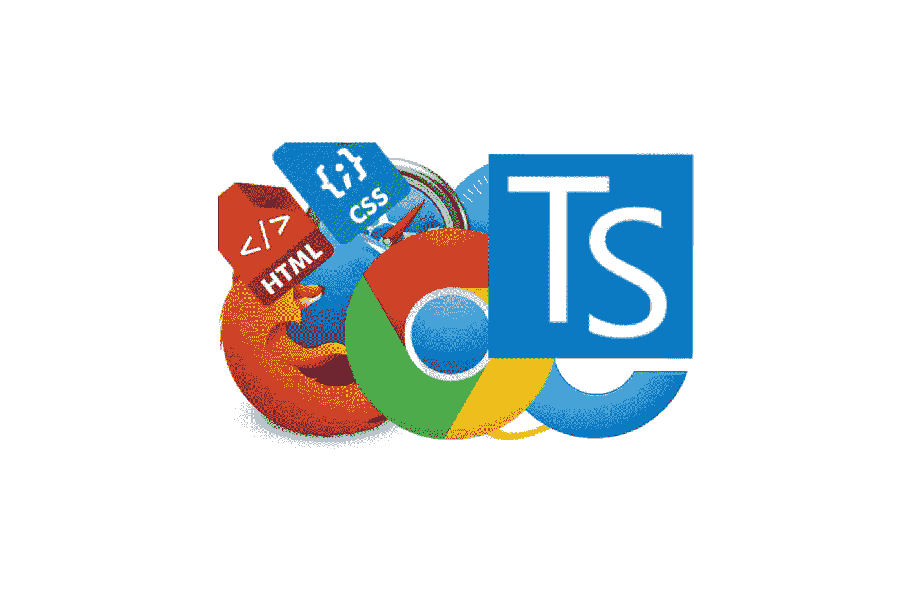
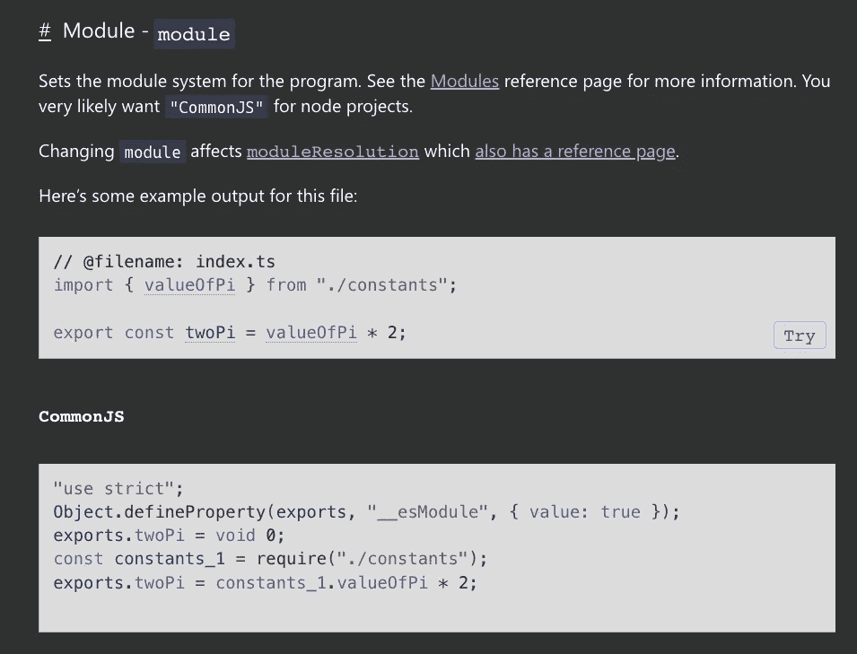
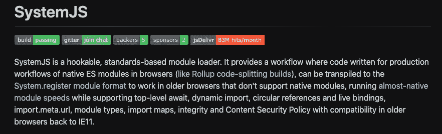
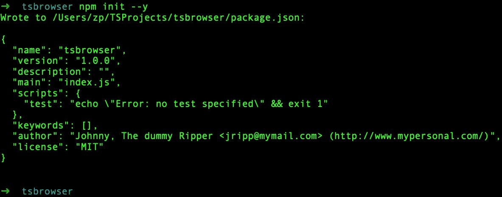
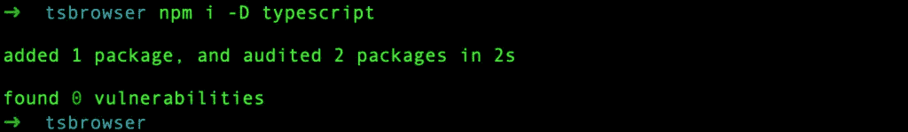
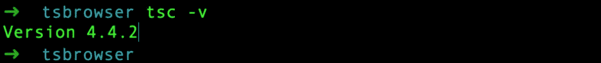
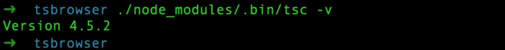
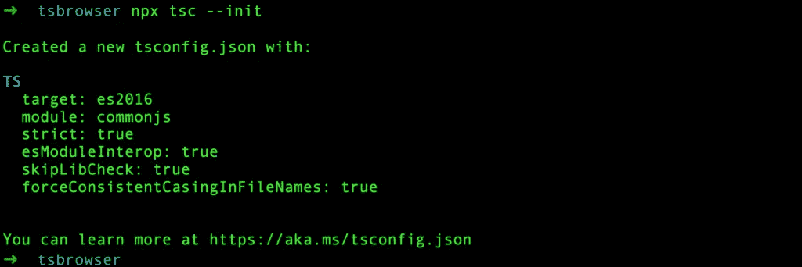
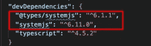
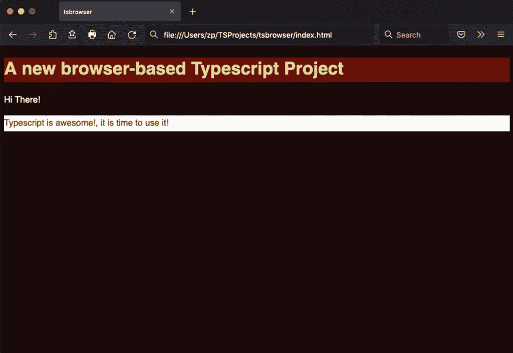

# TypeScript:使用 System.js 启动基于浏览器的项目

> 原文：<https://betterprogramming.pub/typescript-start-a-browser-based-project-use-the-system-js-b4ddfe63a1b4>

## 构建您自己的基于浏览器的 web 应用程序。不需要服务器



作者图片

# 摘要

来自其他背景，想快速开始玩 TypeScript？您很可能会在尝试创建一个简单的基于浏览器的项目时遇到一些麻烦——对于纯 JavaScript 世界来说，这看起来就像是小菜一碟:只是一个样式表和一个 JavaScript 文件，在一个 HTML 文件中链接起来。

然而，尝试用 TypeScript 做一些类似的事情需要更多的努力，特别是如果您对如何处理一些非常基本的概念还不够熟悉的话。

模块管理系统是非常基本的概念之一，您应该能够在项目的配置设置中做出适当的选择。

目标是在 TypeScript 项目中开始使用 TypeScript 文件(=模块)，使用(新的)标准方式——而不用担心`JavaScript`向后兼容性问题。这篇文章的目的是增加一些理解。

这篇文章还为那些有一些编程知识(例如 JavaScript)和喜欢从 TypeScript (OOP、严格类型等)的功能中受益的人提供了一个最基本的标准解决方案。).

因此，如果有人想开始玩 TypeScript，并且他正在寻找一种快速的方法来实现一个简单的 TypeScript 项目，它只在浏览器中运行，那么这篇文章对这个过程有一点启发。

# JavaScript 模块中的简介

JavaScript 世界中的模块是应用程序开发过程的重要组成部分。

对于 TypeScript 也是如此。如果你有 OOP 背景(比如 Java)，你可能会发现 Java 中的类和 JavaScript/TypeScript 中的模块有相似之处(甚至 Java 中的类应该只存在于一个文件中)。例如，它们都有自己的作用域，并包含函数和属性。

然而，在 ECMAScript (JavaScript) arena 中，当我们想要从另一个文件中访问一个对象(例如一个类)时，我们必须使用`exports`和`imports`通过`module`系统。当我们想要共享代码(变量、类、接口、对象等)时也是如此。)从一个文件到另一个文件。

由于 TypeScript 是 JavaScript 的超集，它还必须处理导出和导入。这是可以的。

然而，当谈到 JavaScript 和浏览器的向后兼容性时，挑战就来了。这是因为旧版本的 JavaScript 不使用“导出”和“导入”,而是分别使用“模块”和“要求”。

因此，当我们开发 TypeScript 应用程序时，而且当我们希望它们在旧的浏览器中使用时，我们必须通知`tsc`编译器。

为此，我们必须在 [tsconfig.json](https://www.typescriptlang.org/docs/handbook/tsconfig-json.html) 文件中使用适当的设置。一般来说，`tsconfig.json`文件是项目的 key typescript 设置的主要配置文件。(这里可以阅读更多[)。](https://www.typescriptlang.org/tsconfig)

# tsconfig.json 中的模块设置

为 tsconfig.json 中的 module option (key)设置适当的值，指导`tsc`编译器如何处理我们项目的不同模块。

ECMAScript 2015 引入了模块概念。模块在自己的作用域内执行，而不是在全局作用域内执行；这意味着变量、函数、类等。在模块中声明的在模块外部不可见，除非它们被显式导出。

如果另一个模块想要使用从另一个模块导出的函数、变量、类等等，那么它必须导入它。任何包含顶级导入或导出的文件都被视为一个模块。

在内部，在运行时，Node.js 使用模块加载机制，该机制负责在执行模块之前定位和执行模块的所有依赖项。
common js 模块规范是 Node.js 中使用模块的默认设置。

```
"module": "commonjs",                                /* Specify what module code is generated. */
```



`module`选项的其他设置有无、ES6 或 ES2015、ES2020、UMD、AMD、系统和 ESNext。

一般来说，`“module”: “commonjs”`设置是可以的，它针对任何在浏览器之外运行的 Node.js 项目，例如，在服务器上。服务器端实际上是 Node.js 运行时系统的主要环境。

你可以在这里找到关于如何在你的 Mac [上“默认(基于服务器的)方式”安装 TypeScript 的非常基础的介绍。因此，请记住，这些设置不适合运行在客户端(即在浏览器中)的相对简单的项目。](https://www.devxperiences.com/pzwp1/2021/04/08/installing-typescript-via-node-and-start-using-it-via-vs-code-macos/)

我不打算就此谈更多细节。你可以在这里和这里查看官方文档[。当然，你可以谷歌一下，找到数十、数百篇关于上述主题的帖子和文章。](https://www.typescriptlang.org/tsconfig#module)

由于`tsc`编译器传输一个`.ts`文件，并在一个`.js`文件中发出它，可以预期这个过程应该非常简单。

当我们开始添加更多时，这个过程变得越来越复杂。ts 或者。js 文件，而且当我们将它们作为模块使用，并开始在它们之间导出和导入对象时。除了使用增加数量的(排放)之外。js 文件需要许多`<script>`标签的副本，还有其他副作用(例如，加载延迟、命名冲突、 [CORS](https://en.wikipedia.org/wiki/Cross-origin_resource_sharing) 问题等)。).

应对这些挑战的工具开始被使用，并被广泛采用。包装器、打包器、迷你器是迄今为止被认为是 Node.js 项目开发的重要组成部分的工具。[浏览](https://browserify.org/)，[包裹](https://parceljs.org/)，[汇总](https://rollupjs.org/guide/en/)，[保险丝盒](https://fuse-box.org/)，[早午餐](https://brunch.io/)， [Webpack](https://webpack.js.org/) ， [ESBuild](https://esbuild.github.io/) 等。是这些工具的一些著名代表。

正如我们所说的，我们的目的是让我们的开始项目尽可能简单，我们不打算使用上面提到的捆绑器。你可以在网上搜索，你会找到很多关于他们的详细信息。在这篇文章中没有更多关于这些工具的内容。

这里我们将使用`[System.js](https://github.com/systemjs/systemjs)`作为我们的节点模块管理机制。

正如你在 GitHub [这里看到的](https://github.com/systemjs/systemjs)“*system js 是一个可挂钩的、基于标准的模块加载器。它提供了一个工作流，其中为浏览器中的本机 es 模块的生产工作流编写的代码*。



它将(新)标准(ES2015/ES6)通过导入导出格式(以及其他流行的格式，如 CommonJS、UMD、AMD)处理模块的方式转换为更老的`[System.register](https://github.com/systemjs/systemjs/blob/main/docs/system-register.md)`模块格式(ES5)。

注意，`System.js`是一个运行时加载器，这实际上意味着它“动态”加载转换成`System.register`格式的模块。它可以被认为是一种模块格式，旨在支持旧版本 ES5 中 ES6 模块的精确语义。

实际上，我们可以通知浏览器我们使用了`System.register`格式。我们通过使用最少的 JavaScript 代码开销通过`<script>`标签来实现，这些标签应该在我们加载项目传输文件之前加载。我们将在以后的实践中看到它。

除此之外，我们不得不说`System.js`也可以被认为是一个`bundler`并且它应该被认为是这样的，因为它可以将我们文件的所有导入-导出对象“捆绑”在一起，我们将在后面看到。

`System.js` 可能是一个更好的解决方案，不仅因为允许我们使用发出的 TypeScript。js 文件(正如我们所知的‘普通’文件。js 文件)，但是当我们建立一个新的 TypeScript 项目(在`tsconfig.json`文件中)时，它也是“提供的”选项(值)之一。


所以。我们把它当成自己的选择，继续吧。对于我们的简单项目，应该遵循的主要步骤是:

*注意:假设您已经在系统中安装了 Node.js / npm，并且对 npm 有所了解。如果你还没有安装，你可以使用这篇文章在你的 Mac 上安装它。*

## A.创建您的工作项目目录

让我们将项目文件夹命名为“ts-browser”:

```
mkdir tsbrowser
cd tsbrowser
```

## B.为您的项目创建一个工作文件夹文件结构(脚手架)

因为我们的目的也是能够使用不同的文件/模块(看一个实用而简单的导出-导入的例子)，一个好的方法是创建和使用项目的一个适当的文件夹/子文件夹结构(支架)。开始时，只需创建经典的 index.html 和 style.css 文件。

*NB:*[*VS Code*](https://code.visualstudio.com/)*是一款优秀、流行、免费的 IDE，可以与之合作。在这里我们使用它。*

出于演示目的，在`index.htm`文件中添加以下几行:

请注意，带有`id=”app”`的 div 元素将是我们的 TypeScript 源代码的链接点，稍后会看到这一点。

这里是`style.css`文件(选择任何设置，如颜色等。):

您可以在浏览器中测试它们:


之后，创建一个新的子文件夹，命名为`src`。跳进去，创建一个`index.ts`文件。这可以认为是我们 app 的出发点。然后创建一个子文件夹，命名为`app`，并在其中创建另一个子文件夹`modules`。

之后，在`modules`子文件夹中创建一个新的 TypeScript 文件，将其命名为`myfunctions.ts`。我们稍后会更新它们。

项目脚手架应该是这样的:

```
.
|-- index.html
|-- src
|   |-- app
|   |   `-- modules
|   |       `-- myfunctions.ts
|   `-- index.ts
`-- style.css
```

## C.启动 Node.js 项目(应用程序)

使用互动方式，让您回答一些关于项目主要选项(名称等)的问题:

```
npm init
```

或者保留默认值:

```
npm init — y
```



这创建了一个非常基本(也是非常初始)的 package.json 文件。

## D.安装 TypeScript

即使您已经在系统中全局地安装了它，您也可能认为将它作为开发依赖项安装是一个好方法，这也允许您安装和使用更好的或最新版本的 TypeScript。

下面，我们安装最新(默认)版本。



检查全局安装的不同版本的 TypeScript:



对于我们项目中安装的 TypeScript(本地安装):



## E.启动项目的类型脚本配置

您可以使用`npx tsc –init`命令创建一个非常基本的带有默认设置的 tsconfig.json 文件，如下所示:



这将创建项目`tsconfig.json`文件。

## F.调整 tsconfig.json 设置以反映我们的项目

下面是允许我们的项目在浏览器中正确有效运行的最低基本设置。

正如我们已经说过这是一个基于浏览器的项目，使用系统(而不是默认的`commonjs`)。

```
**“module”:** “System”**,**
```

在库部分添加 es2016 和 DOM，因为我们希望能够使用和操作浏览器的 DOM 对象

```
**“lib”:** **[**“es2016”**,**”DOM”**],**
```

将我们之前创建的`src`子文件夹定义为保存所有源 TypeScript 文件的文件夹。

```
**“rootDir”:** “src”**,**
```

定义 transpiled 的输出文件夹。js 文件。该文件夹将在第一次编译后创建。我们将这个文件夹命名为`build`。

```
**“outDir”:** “build”**,**
```

下面是一个重要的设置，它清楚地表明了`System.js`如何捆绑在一个文件中，即整个项目代码。我们将这个文件命名为`bundle.js`:

```
**“outFile”:** “./build/bundle.js”**,**
```

为输出/发射启用源映射也很好。用于调试目的的 js 文件。

```
“sourceMap”: true,
```

## G.添加类型脚本代码

我们将使用下面的片段作为我们如何使用模块导出-导入机制的简单演示。在`src/app/modules/myfunction.ts`文件中添加以下代码:

上面的源代码只是演示了我们如何导出一个函数(`capitalizeFirst`函数)并使它对其他源文件可用。它只是导出一个将句子的第一个字符大写的函数。

在`index.ts`文件中添加以下代码:

上面的代码使用了`capitalizeFirst`函数(导入它)，该函数之前在`./app/modules/myfunctions.ts`文件中导出。

然后用`id=”app”`创建 div 元素的一个对象，它是。html 文件，正如我们已经提到的。

之后，它操纵它(添加一个新的 div 元素并输出文本)，最后将其输出回浏览器文档(在`index.html`文件中)。

当它运行时，我们期望看到文本`“TypeScript is awesome!`，是时候使用它了！白色背景上的红色线条。

现在我们准备编译。

## G.编制

只为我们的项目运行`tsc`编译器(“本地”):


注意，我们使用`[npx](https://docs.npmjs.com/cli/v7/commands/npx)`命令来运行本地安装的`tsc`编译器(`tsc`包)。(使用`npx`的效果与我们使用完整路径
`./node_modules/.bin/tsc`运行`tsc`命令的效果相同)

检查生成的输出(构建)文件夹。

应该是下面这样的:

```
.
|-- build
**|**   |-- bundle.js
**|**   `-- bundle.js.map
|-- index.html
|-- node_modules
|-- package-lock.json
|-- package.json
|-- src
**|**   |-- app
**|**   **|**   `-- modules
**|**   **|**       `-- myfunctions.ts
**|**   `-- index.ts
|-- style.css
`-- tsconfig.json
```

现在检查构建文件夹中生成的`bundle.js`。应该是这样的:

如你所见，它将我们项目的所有源代码捆绑在一个文件中。请注意这里使用的匿名函数语法:`System.register(…) {}`。

这实际上就是`System.js`如何传输我们的模块共享(导出/导入)。

## 一.更新 index.html 档案

现在是时候将我们发出的代码应用到我们的 HTML 文档了。通常，一个模块(类似于纯 JavaScript 代码文件)可以应用于 HTML 文档，将它封装在`<script>`标签中，并用`type=”module”`属性声明它。示例:

```
**<**script **type**=”**module**” src=”myfunction.js”**><**/script**>**
```

将我们的`bundle.js`文件应用到我们的`index.htm`文档离上面的语法不远了。

然而，我们必须设法通知浏览器如何处理`System.register(…) {}`。而这正是 System.js 给我们提供的。

“产品”(在大多数简单的情况下)只包含 2。`System.js`提供的 js 文件。

第一个是系统加载器，第二个是命名寄存器模块(这实际上使得`System.register` sysntax“可以理解”)。

两者都有“轻量级”版本，非常适合我们的简单项目。这是文件`s.js`和`named-register.min.js`。

我不打算谈论更多的技术细节，但是如果你愿意，你可以看看官方文档[这里](https://github.com/systemjs/systemjs)和[这里](https://github.com/systemjs/systemjs/blob/main/docs/system-register.md)。

所有可用的选项都包含在`system.js`包中，可以使用我们的节点包管理器将其安装到我们的项目中，例如:

```
npm i -D systemjs @types/systemjs
```

安装后，您可以检查您的 package.json 是否已经更新:



并且`systemjs`包已经被本地安装在您的项目`node_packages`子文件夹中。然后我们可以像这样将它们应用到我们的`index.html` 文档中:

```
**<script** src=”node_modules/systemjs/dist/s.js”**></script>
<script** src=”node_modules/systemjs/dist/extras/named-register.min.js”**></script>**
```

然而，一种常用的替代方法是在运行时直接从一个免费的节点包 [CDN](https://en.wikipedia.org/wiki/Content_delivery_network) 服务中获取它们，比如 [UNPKG](https://unpkg.com/) 或 [JSPM](https://jspm.org/) 。因此，您可以避免在本地安装`systemjs`包。直接从 CDN 上抓取。这里我使用了 UNPKG 服务。

现在是时候在我们的 index.html 文件中添加一些必要的脚本标签了。在主体结束标记`</body>`前添加以下行:

```
. . .
**<script** src="https://unpkg.com/systemjs@6.11.0/dist/s.js"**></script>
<script** src="https://unpkg.com/systemjs@6.11.0/dist/extras/named-register.min.js"**></script>
<script** src="bundle.js"**></script>
<script** type="module"**>** System.import('index');
**</script>** . . .
```

当然，最后一步是在我们的浏览器中加载`index.html`。这是它现在的样子；这也是人们所期望的样子；



现在你的基于浏览器的应用已经准备好了。不需要服务器。您可以“带走”它，将它部署到任何地方。你只需要这些文件:`index.html`、`style.css`和`build/bundle.js`。

# 包裹

你可以去 GitHub [的我的 repo 获取这个项目，这里](https://github.com/zzpzaf/tsbrowser)——你会找到所有的源代码以及配置设置(`tsconfig.json`等等。).

就是这样！如果你发现问题或者缺少什么，请告诉我。尽情享受，敬请关注。感谢阅读！