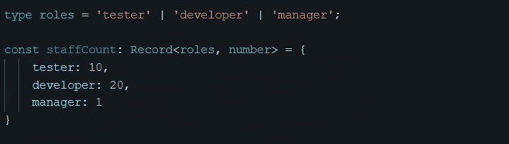
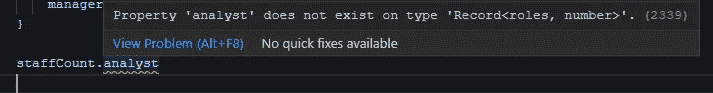
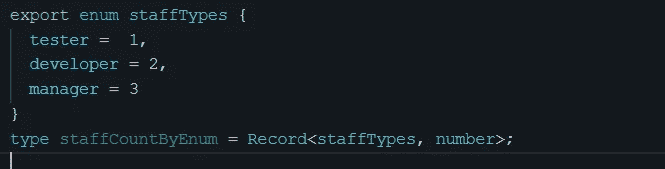
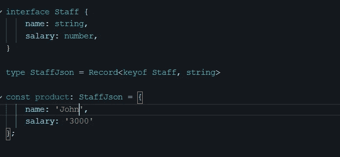

# 解释了 TypeScript 的记录类型

> 原文：<https://betterprogramming.pub/typescripts-record-type-explained-691372b1a449>

## 您想知道的关于记录实用程序类型的所有信息


杰里米·毕晓普在 [Unsplash](https://unsplash.com/) 上拍摄的照片。

`Record`是 TypeScript 实用程序类型之一，从版本 2.1 开始就可以使用。

不得不承认，第一次看官方定义的时候有点迷茫:

> "`**Record<Keys,Type>**`
> 
> 构造一个对象类型，其属性键为`Keys`，属性值为`Type`。该实用工具可用于将一种类型的属性映射到另一种类型。”— [打字稿的文档](https://www.typescriptlang.org/docs/handbook/utility-types.html)

从表面上看，`Record`类型创建了一个对象类型，它具有类型`Keys`的属性和类型`Type`的相应值。但是类似的特性可以通过使用索引签名来实现，那么我们为什么要使用`Record`类型呢？是什么让它与众不同或者有用？

# 记录类型与索引签名

在 TypeScript 中，我们把用方括号访问对象属性的方式称为*索引签名*。它广泛用于具有未知字符串键和特定值类型的对象类型。这里有一个例子:

```
type studentScore= { [name: string]: number };
```

上面的索引签名示例也可以用`Record`类型来表示:

```
type studentScore = Record<string, number>;
```

对于这个用例，从类型断言的角度来看，这两个类型声明是等效的。但是从语法的角度来看，`index signature`更好。在索引签名方法中，`name`键更清楚地表达了意图，另一个优点是它显示在 VisualCode IntelliSense 中。

那我们为什么要用`Record`型呢？

## 记录类型为什么有用？

`Record`类型的好处是**简洁**。当我们想要限制一个对象的属性时，它特别有用。例如，我们可以使用字符串文字的联合来指定`Record` 类型允许的键，如下所示:



在这个例子中，我们定义了一个带有联合类型约束的类型。如果我们试图访问一个不在`roles`联合类型中的属性，VS 代码编译器会不高兴。当我们维护复杂类型时，编译时检查非常有用，因为编译器会防止这类错误发生。



另一个有用的特性是键也可以是枚举。在下面的例子中，我们使用`staffTypes`枚举作为`Record`类型的受限键，因此可读性更好。请注意，只有在 TypeScript 2.9 之后才支持枚举。因此，在 2.9 版本之前，密钥的类型被限制为`string` 类型。



# 将记录类型与 keyof 运算符相结合

`keyof` 运算符是一个类型运算符，可以将对象键提取为一个 union 类型。通过使用`keyof` 从现有类型中获取所有属性，并将其与一个字符串值相结合，我们可以像下面这样做:



当您希望保留现有类型的属性，但将值类型转换为其他类型时，这很方便。

# 高级用法示例

一个`Record`类型可以与其他实用程序类型一起用于更高级的用例。这里有一个例子:

通过`Record`、`Partial`和`Intersection`类型的协同工作，这段代码创建了一个强类型的`benefits`对象，在键和值类型之间建立了一个关联。强类型对象使得在编译时捕获错误成为可能。它还使 IDE 能够在键入时标记错误，并为 IntelliSense 提供自动完成功能。

# 摘要

`Record`是一个方便简洁的实用类型，可以让你的代码更加健壮。在处理动态数据结构时，这尤其有用。类型的目标与其他精彩的类型脚本特性相同:[更好的类型安全性](https://levelup.gitconnected.com/achieve-type-safety-with-typescript-magic-fef5ff939c98)。

如果你喜欢这篇文章，你可能也喜欢阅读[另一篇关于推断关键词](https://sunnysun-5694.medium.com/typescript-infer-keyword-explained-76f4a7208cb0)的文章。

*如果您还不是 Medium、* [***的付费会员，您可以通过访问此链接***](https://sunnysun-5694.medium.com/membership) *进行注册。你可以无限制地阅读媒体上的所有报道。我会收你一部分会员费作为介绍费。*