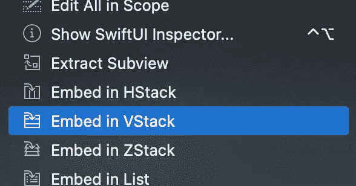
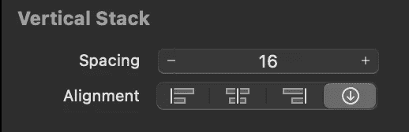

# SwiftUI 中的打字机效果

> 原文：<https://betterprogramming.pub/typewriter-effect-in-swiftui-ba81db10b570>

## 给文本添加延迟并产生动画


马库斯·温克勒在 [Unsplash](https://unsplash.com?utm_source=medium&utm_medium=referral) 上拍摄的照片

# 先决条件

*   安装了 Xcode 13+的 Mac
*   Swift 编程的经验不是必须的，但可以让你的生活更轻松

# 创建新项目

打开 Xcode 并创建一个新的应用程序项目。如果你是 Xcode 和应用程序开发的新手，你可以遵循我在其他文章中的详细步骤，比如“[在 SwiftUI](https://ix76y.medium.com/creating-a-image-card-in-swift-ui-beginner-tutorial-2881b4420ea3) 中创建图像卡”。本文还包含了一小段关于 Xcode 接口的内容，以帮助您入门。

# 创建用户界面

这个例子的 UI 将非常简单地向您展示这个概念。我们将有一个文本，在开始时将是空的，直到我们单击它下面的按钮，这将触发类型写入器效果并写入“Hello，World！”。


带有文本和按钮的用户界面

当您创建一个新视图或直接在`ContentView`中工作时，您应该已经在视图的主体中有一个文本:

```
var body: some View {
  Text("Hello, World!")
}
```

按下⌘并点击文本，这将打开行动菜单，我们可以选择嵌入垂直堆栈内的文本。



在 VStack 中嵌入文本的操作菜单

接下来，打开视图库(单击右上角的小+图标)并拖动`VStack`中文本下方的按钮。你的身体现在应该看起来像这样:

```
var body: some View {
  VStack {
    Text("Hello, World!")
    Button("Button") {
      Action
    }
  }
}
```

让我们将按钮的文本从“Button”改为“Type ”,并在两个元素之间增加一点间距。您可以通过点击`VStack`来改变它的间距，然后在属性检查器中改变间距。对于这个，我选择值 16。



对于按钮的动作，我们将编写一个处理打字机效果的小函数。现在我们称之为`typeWriter()`。这是我们的 UI 代码最终的样子:

```
var body: some View {
  VStack(spacing: 16.0) {
    Text("Hello, World!")
    Button("Type") {
      typeWriter()
    }
  }
}
```

Xcode 现在会抱怨函数`typeWriter()`没有定义。所以让我们写我们的打字机逻辑吧！

# 打字机

首先，我们需要保存代码的函数的主要构造。一旦我们在 body view 的右括号后面加上这个，Xcode 应该已经停止抱怨`typeWriter()`没有被定义。

```
func typeWriter() {
    // some code here
}
```

在写任何代码之前，我们应该考虑我们想要实现的实际逻辑。一般来说，我们需要一个函数:

1.  在 x 位置写一个字母
2.  等待 y 时间
3.  从 x + 1 开始

为此，我们需要两个变量。一个用来保存最终文本，另一个用来写每个字母:

```
// This will be empty at the start and we will add each letter to it
@State var text: String = ""
// This is the final text that we want to show
let finalText: String = "Hello, World!"
```

我们将`text`声明为可变字符串，因为它会改变。另外，我们在开头加一个`@State`。这意味着如果文本发生变化，它将自动更新所有连接到该变量的 UI 元素。`finalText`被声明为`let`，因为我们不会改变它，它也是一个字符串。

要将文本变量绑定到我们的文本视图，我们可以将它传递给视图:

```
@State var text: String = ""
let finalText: String = "Hello, World!"

var body: some View {
  VStack(spacing: 16.0) {
    Text(text)
    Button("Type") {
      typeWriter()
    }

  }
}
```

现在回到我们实际上的`TypeWriter()`功能。我们知道我们需要一个循环，从我们的`finalText`开始遍历每个字符。一般来说，编写重复函数有两种方式:递归和迭代。

## 递归与迭代函数

迭代函数使用类似 while 或 for 循环的循环。另一方面，递归函数调用自己，不使用任何循环。递归函数通常需要较少的代码，但可能更难理解。在这种情况下，我们将以递归方式编写代码，但是两个函数都可以使用。

我们希望在特定的位置打印字符，所以让我们将该位置作为参数传递给我们的函数，并检查该位置是否小于我们的`finalText`长度:

```
// passing the position as an argument with a default value of 0 for the first value
func typeWriter(at position: Int = 0) {
  if position < finalText.count {
    // write the letter at position "position" to "text"
  }
}
```

接下来，我们想获取那个位置的字母，并将其附加到我们的*文本*变量中。

```
func typeWriter(at position: Int = 0) {
  if position < finalText.count {
    // get the character from finalText and append it to text
    text.append(finalText[position])
    // call this function again with the character at the next position
    typeWriter(at: position + 1)
  }
}
```

## Unicode 编码

唯一缺少的似乎是时间延迟，但是 Xcode 可能会抱怨上面的代码片段。问题是`finalText[position]`。原因在于 Swift 的原生字符串类型是由 Unicode 标量值构建的。简而言之，我们在这里得到的错误是由一个或多个不同的 Unicode 值产生同一个人类可读的字符这一事实引起的。如果您想了解更多相关信息，请查看 Swift 官方文档。

幸运的是，我们可以非常容易地解决这个问题，只需告诉 Swift 我们希望如何解释带扩展名的字符串订阅，这是我们在特定位置获取字符的捷径:

```
extension String {
    subscript(offset: Int) -> Character {
        self[index(startIndex, offsetBy: offset)]
    }
}
```

## 时间延误

现在，我们的代码不再抛出任何错误，让我们最后在延迟部分工作，这将产生实际的打字机效果。

Swift 为我们提供了一种非常简单、简洁的方式，可以在不阻塞 UI 的情况下延时运行代码。这一点很重要，因为我们不希望在输入文本时用户界面冻结。

```
func typeWriter(at position: Int = 0) {
  if position < finalText.count {
    // Run the code inside the DispatchQueue after 0.2s
    DispatchQueue.main.asyncAfter(deadline: .now() + 0.2) {
      text.append(finalText[position])
      typeWriter(at: position + 1)
    }
  }
}
```

如果你想让它更快或更慢，只需将 0.2 更改为更小或更大的值。是时候试试我们的代码了:


打字者效应。

## 最后润色

代码运行良好，但是您可能会注意到，如果您再次按下按钮，它将再次追加相同的文本，类似于“Hello，World！你好，世界！”。我们可以很容易地进行调整，但是添加一个简单的 if 语句来检查位置是否为零，在这种情况下，文本将再次设置为空字符串。

# 最终代码

这样，我们最终的代码应该是这样的。

```
struct TypeWriterView: View {
    @State var text: String = ""
    let finalText: String = "Hello, World!"

    var body: some View {
        VStack(spacing: 16.0) {
            Text(text)
            Button("Type") {
                typeWriter()
            }
        }
    }

    func typeWriter(at position: Int = 0) {
        if position == 0 {
            text = ""
        }
        if position < finalText.count {
            DispatchQueue.main.asyncAfter(deadline: .now() + 0.2) {
                text.append(finalText[position])
                typeWriter(at: position + 1)
            }
        }
    }
}

struct TypeWriterView_Previews: PreviewProvider {
    static var previews: some View {
        TypeWriterView()
    }
}

extension String {
    subscript(offset: Int) -> Character {
        self[index(startIndex, offsetBy: offset)]
    }
}
```

我希望这个教程是有帮助的！如果你有任何问题，让我知道。感谢阅读。