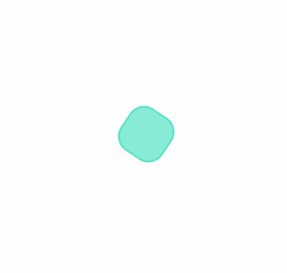
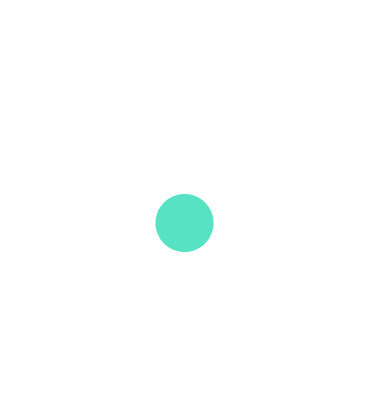
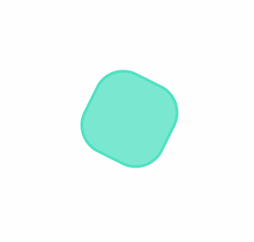
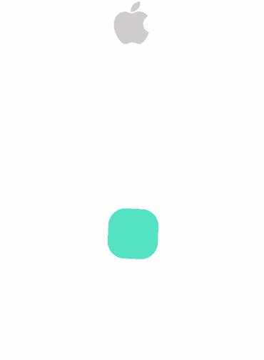
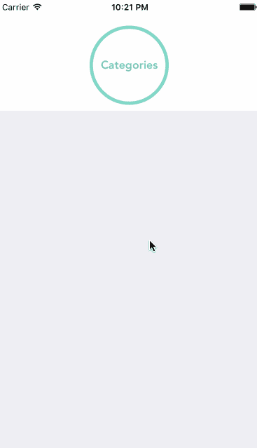

# Swift 的用户界面动画

> 原文：<https://betterprogramming.pub/ui-animations-with-swift-2ebb5e6d2292>

## 以及如何在操场上制作它们的原型


由[克里斯托弗·高尔](https://unsplash.com/@cgower?utm_source=unsplash&utm_medium=referral&utm_content=creditCopyText)在 [Unsplash](https://unsplash.com/@cgower?utm_source=unsplash&utm_medium=referral&utm_content=creditCopyText) 上拍摄的照片

最近在面试 iOS 的角色。在大多数情况下，我被要求开发一个小的 iOS 应用程序，我必须在一周内返回，这样他们就可以审查它，并*希望*给我反馈。我喜欢这个过程，因为你可以真正展示你的技能，他们可以真正了解你的编码风格和解决问题的能力(取决于他们要求你构建什么)。

我从事的最后一个项目是为一个开发了一个可靠的、高度动画化的 UI 的应用程序。正因为如此，iOS 带回家的要求之一是包含动画。对我来说，这是一个深入研究动画的好机会，我花了一些时间在我们的操场上玩耍。

游乐场真的很酷！这是一个允许用户与 Swift 代码交互的编码环境，不需要用户创建项目。这使得它成为学习 swift 和测试一些代码或原型视图的真正强大的工具。

# **在操场上展示你的观点**

为了让你的视图在操场上可见，你需要导入模块`PlaygroundSupport`。

```
import UIKit
import PlaygroundSupport
```

然后，让你的*助理编辑*可见。您可以在窗口右上角的 Xcode 视图模式中选择助理编辑器。或者，按下`CMD + ALT + Return`。之后，确保你的助理编辑显示的是时间线*而不是其他文件。*

# 基本动画

让我们从 UIView 中的一个基本方法开始，叫做 **animate:**

```
UIView.animate(withDuration: 0.5, animations: {
    // Do animation
})
```


通过调用这个方法，你可以移动物体，改变颜色和大小。

在这里，我们将图像从屏幕的顶部移动到中央。我们还将圆形的背景颜色从蓝色改为白色。

在代码中，这将类似于以下内容:

超级直白！当然，我们需要首先创建所有的视图，并正确设置它们的属性。例如，我们需要一个容器视图。请记住，我们是在操场上，所以我们不是真的做自动布局或考虑屏幕尺寸。任何估计的宽度和高度都可以。

***集装箱视图:***

***苹果图片:***

***圆圈:***

***动画:***

这基本上是将 *appleImage* 从其当前位置移动到其容器视图的中心。它还在两秒钟内将圆圈当前的背景颜色从蓝色变为白色。

# 转换动画

变换是创建动画的一些最常用的方法。使用变换，可以缩放、旋转或移动对象和视图。

我们可以在 **animate** 方法中调用这些转换，得到一些很酷的动画。



1.旋转，2。音阶，3。旋转+缩放

# 春季动画

对于所有的值更改和转换，您可以通过添加一些属性来应用 spring 行为。

**延迟**:动画开始前等待的时间。

**usingspringwithminding**:弹跳动画的弹性。价值越高，反弹越少。`0`会看起来像一个球，`1` 会是平滑的线性的。

**initialSpringVelocity** :启动时的力度。该值越高，动画开始时的推力就越大。

**选项**:附加设置，如曲线或允许动画过程中的交互。您可以删除它以缩短代码。

# 手势和 UIKit 动态

当手势被添加到现有的交互之上时，它们是强大的。例如，我们可以有一个响应所有触摸事件的`UITapGestureRecognizer`。所以当用户点击圆圈时，我们执行一些其他的动画。您可以创建一个从手势的目标引用的类，这样您就可以在操场上测试它。我会是这样的:

因此，在`action`中，你可以像我一样添加更多的动画。或者，您可以执行任何其他操作，比如呈现另一个视图或控制器。



这是我用过的操场，有所有的例子:[https://github.com/Xiomara7/animations](https://github.com/Xiomara7/animations)

这就是 iOS 带回家的结果。它获取 App Store 上的前 20 个应用程序，并在集合视图中显示它们。

 [## GitHub — Xiomara7/animations:使用 swift 的动画游乐场

### 使用 swift 制作动画的游乐场

使用 swiftgithub.com 动画的游乐场](https://github.com/Xiomara7/animations) 

*免责声明* : *此处展示的动画主要用于说明目的。在兴奋之前，你可能需要阅读更多关于何时何地适合制作动画的信息。从这里开始:*