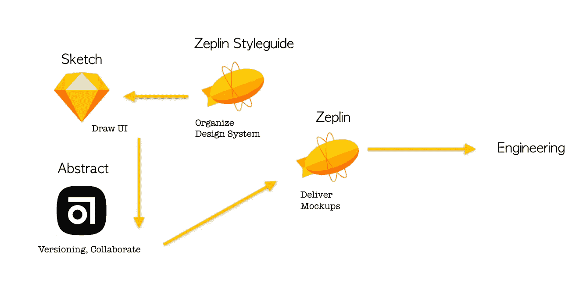
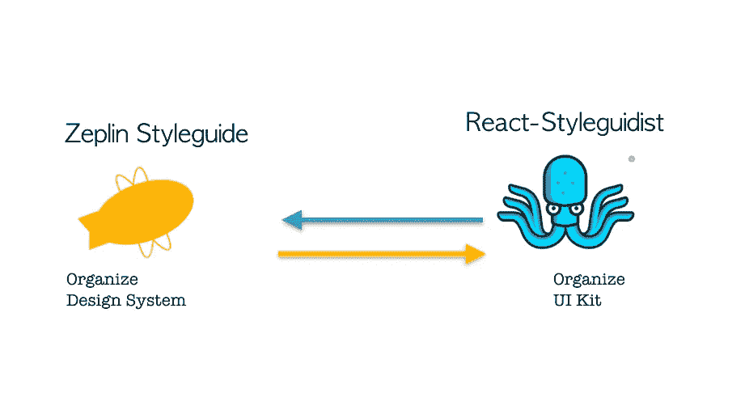
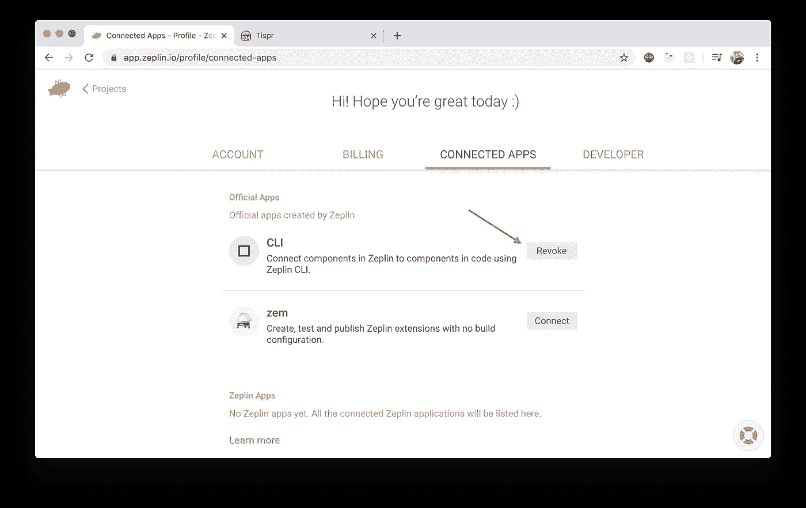
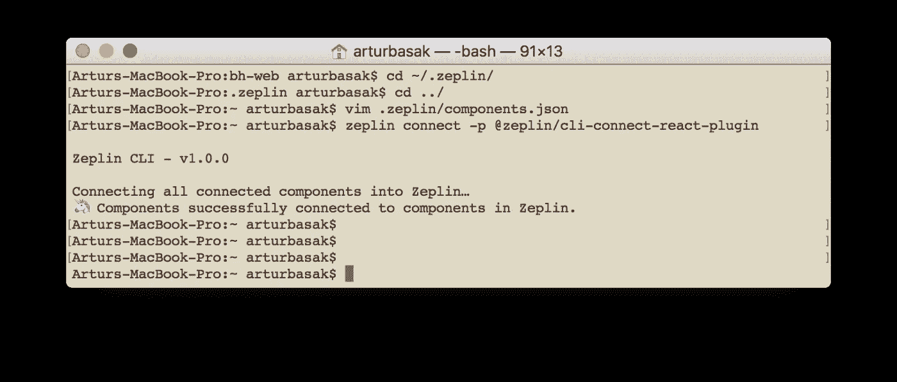
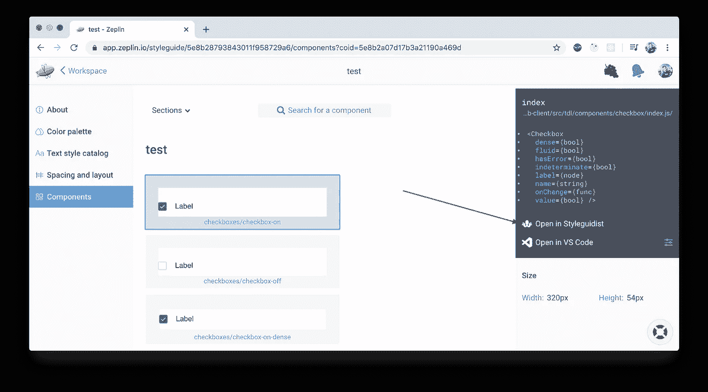
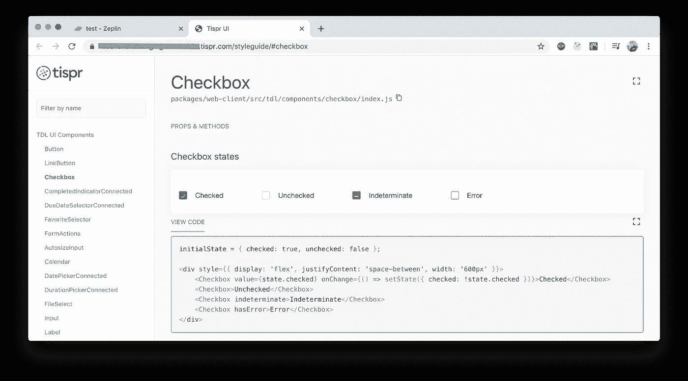

# UI 套件+设计系统=设计操作系统

> 原文：<https://betterprogramming.pub/ui-kit-design-system-designops-e4a60e5dd277>

## 将 React Styleguidist 连接到 Zeplin 样式指南


作者照片

在[上一篇文章](https://medium.com/better-programming/5-tips-to-help-improve-your-ui-development-environment-6ceda3827618)中，我写了一个隔离的用户界面开发环境(UI dev env)。通常，环境部署在您自己的组件库(UI kit)之上，将这样的库与应用程序代码完全隔离开来是一个很好的实践。

在这种情况下，库将是可移植的，并且在其基础上，将有可能构建其他项目。因此，我们可以在 npm 中发布它，它将成为诸如 [Material-UI](https://material-ui.com/) 、[语义 UI](https://semantic-ui.com/) 、 [Bootstrap](https://getbootstrap.com/) 等工具的替代品。


UI 工程流程

与此同时，在附近但并行的某个地方，有一个设计系统，它包含所有与 UI 工具包相同的可重用 UI 模式。

基于设计系统，工程师开发、实现和测试可视化组件库。设计系统是图形设计师和 UX 专家团队的产品和成果。

事实上，当开发一种视觉语言(也称为设计系统)时，设计师和工程师面临着同样的问题——版本控制、共同编辑、存储和交付模型、更新。他们有自己的一套工具来做这些事情。



UI 绘图流程

将设计模型和组件的生产周期与工程结果联系起来类似于 DevOps 实践，其中软件产品的持续集成、交付、监控和开发过程是有机联系的。

这种现象可以被称为设计操作。



将 UI 套件连接到设计系统

我将展示这样一个与 [React Styleguidist](https://react-styleguidist.js.org/) 集成的例子，借助于它，我在上一篇文章中描述了 UI 工具包，以及[ze plin](https://zeplin.io)——一个工具，设计人员通过它交付布局，描述他们的模式库(ze plin style guide——组件)、调色板、排版(文本样式目录)和缩进系统(间距)。

得益于 Zeplin CLI 和社区正在开发的许多插件，这两个工具的集成成为可能。Styleguidist 不是唯一可以和 Zeplin 关联的工具，对应的插件支持同样的故事书。

集成的第一步是为 Zeplin CLI 生成一个访问令牌。这可以在 Zeplin 个人资料的*已连接应用*选项卡上完成。



在我们设置了环境变量之后，我们将需要从 npm 安装几个包——zep Lin CLI 模块和用于连接 React 组件的插件。

```
$ export ZEPLIN_ACCESS_TOKEN="<your-access-token>"$ npm install --save-dev @zeplin/cli$ npm install -g @zeplin/cli-connect-react-plugin
```

之后，我们需要创建一个配置文件，在其中注册 UI kit 和 Zeplin styleguide 组件之间的连接。

您可以在 Zeplin web 版本的 URL 中找到项目和 styleguide 的标识符。您还需要在某个地方部署 React Styleguidist，它的 URL 必须在配置中指定。然后只需将组件名称从 UI kit 映射到 Zeplin styleguide 路径。

现在，您可以尝试将 UI 工具包连接到 Zeplin。

```
$ zeplin connect -p @zeplin/cli-connect-react-plugin
```



在成功连接后，在 Zeplin 中，每个连接组件的描述将包含一个 JSX 代码和组件接口的示例，以及一个到 UI dev env 中组件的直接链接。



对于设计师来说，这意味着他们可以更早地孤立地使用某个组件，并更早地给出反馈，而不是等到它完全集成到网页中。

对于工程师来说，优势是显而易见的。通过研究新的模型，他们立即获得了一个链接，指向他们可以在开发过程中使用的 UI 工具包中的哪些组件，以及哪些组件需要进一步开发或从头开始创建。



这种绑定可以自动化并添加到 CI/CD 流程中。配置文件将在提交之前自动创建，并将考虑 UI 工具包的所有描述的组件。

Zeplin 中组件的路径可以直接写在 [Markdown](https://daringfireball.net/projects/markdown/syntax) 中:

之后，在管道中的一个单独步骤中，将调用`zeplin connect`命令。

# 结论

当然，DesignOps 不是关于集成两个特定的工具，它是一个更广泛的术语，我相信它是在 Airbnb 中首次引入的[。我刚刚展示了如何在两个特定工具的集成的例子中改进两个团队的交互。](https://airbnb.design/designops-airbnb)

InVision 提供了一个类似的包，它叫做 [Live Components](https://support.invisionapp.com/hc/en-us/articles/360028214732) 。Framer X 允许您[导入 UI 工具包](https://www.framer.com/support/using-framer-x/importing-a-react-component/)并基于它构建交互式布局(尽管该功能非常原始)。

总的来说，这是朝着正确方向的运动，这样的机会会越来越多…