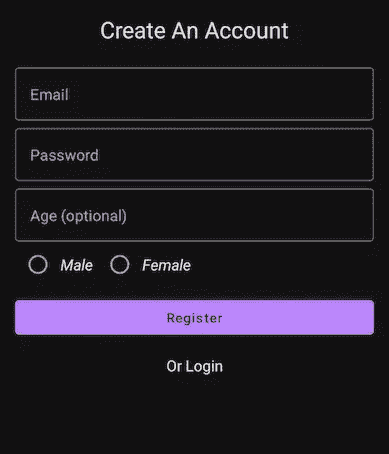
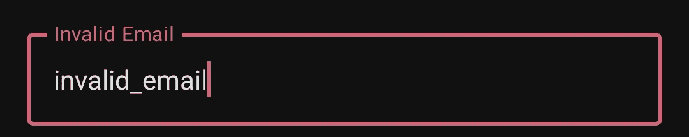
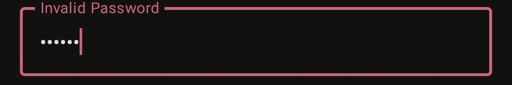
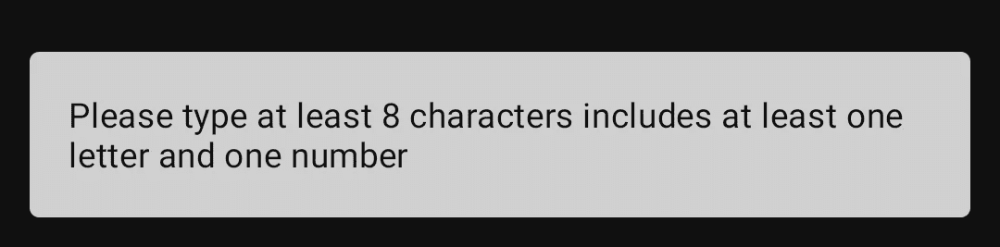
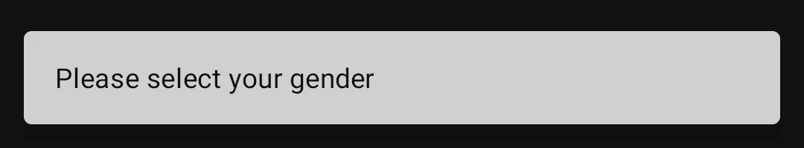
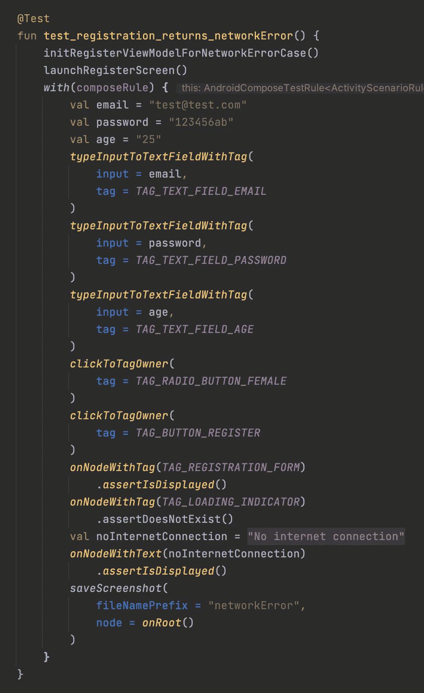
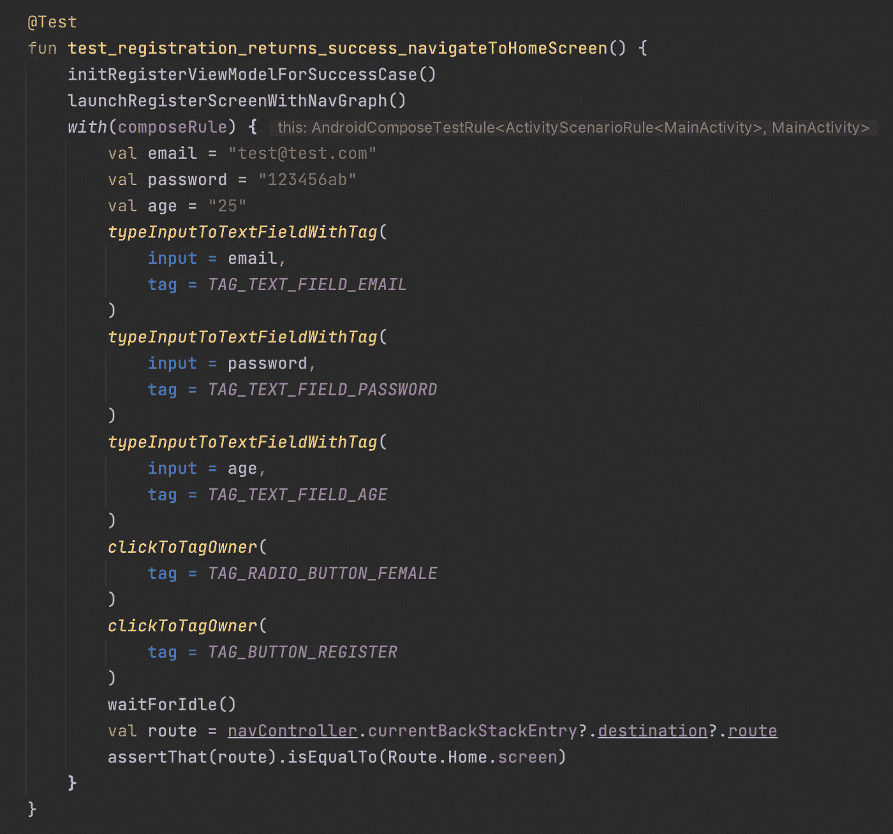
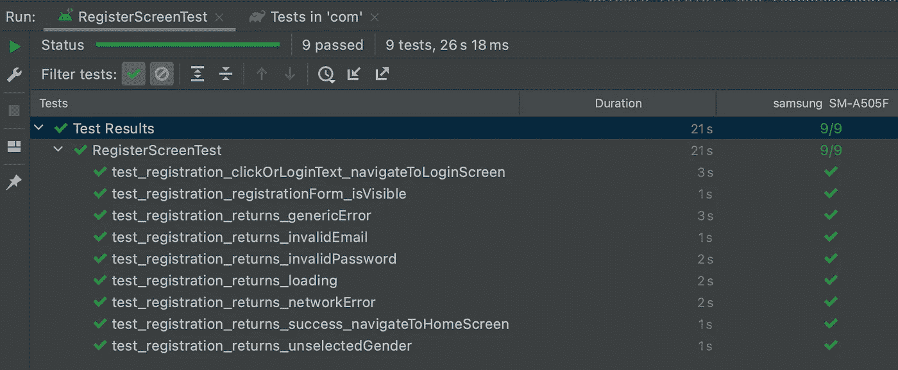

# Jetpack Compose 中的 UI 测试

> 原文：<https://betterprogramming.pub/ui-testing-in-jetpack-compose-788d726db94e>

## 构建强大的 Android 应用


照片由[阿扎马特 E](https://unsplash.com/@esen_aza?utm_source=medium&utm_medium=referral) 在 [Unsplash](https://unsplash.com?utm_source=medium&utm_medium=referral) 上拍摄

在这篇文章中，我想分享我用 Jetpack Compose 进行 UI 测试的经验。

我们将为一个简单的注册屏幕编写测试用例。



注册屏幕

首先，我已经写下了所有的测试用例:

*   测试注册表的可见性
*   测试无效的电子邮件用户界面:



*   测试无效密码用户界面:



无效密码 snackbar

*   测试未选择的性别用户界面:



未选择的性别零食条

*   测试导航至登录屏幕
*   测试导航至主屏幕

对于 API 调用，有 4 种情况:加载、出错、成功和没有连接。

因此，有:

*   测试加载(显示加载指示器)、错误(显示 snackbar)、成功(导航到主屏幕)和无连接(显示 snackbar)用户界面

在开始时，我们应该添加我们的测试规则。第一个是强制性的，因为我们将使用组合测试:

```
@get:Rule(order = 1) 
val composeRule = createAndroidComposeRule<MainActivity>()
```

如果你在你的项目中使用了 Hilt DI，你也应该加上`HiltAndroidRule`，因为`MainActivity`的作用域是`AndroidEntryPoint`。

```
@get:Rule(order = 0) 
val hiltRule = HiltAndroidRule(this)
```

然后，我创建了一个`[UITestHelper](https://gist.github.com/theozgurr/3a0dcf9054836055a535ffe797784d41#file-uitesthelper-kt)`文件，用于在文本字段中输入和执行带有视图标签的点击动作，因为我将在许多屏幕上多次使用它们，所以用扩展函数调用它们是有意义的。

```
*composeRule.onNodeWithTag*(tag).*performTextInput*(input)
*composeRule.onNodeWithTag*(tag).*performClick*()
```

`.assertIsDisplayed()` 功能将为我们提供视图是否显示在屏幕上。

对于不再可见的视图，我使用了`.assertDoesNotExist()`功能。因为这将与 UI 同步，并再次获取所有节点，以确保它拥有最新的数据。

为了测试“snackbar”的可见性，我使用了`onNodeWithText()`(finders 函数之一)来查找我作为参数传递的文本，之后，我检查它是否显示在屏幕上。



api 返回网络错误

另外，当我想保存测试结果的截图时，我创建了一个`saveScreenshot`扩展函数。Compose 很容易提供:

```
*node.captureToImage().asAndroidBitmap()*
```

你可以在这个要点中找到`saveScreenshot()`代码[。我们来谈谈编写导航测试。](https://gist.github.com/theozgurr/ad29e6e264893324e6c1f4403a0ca48e#file-savescreenshot-kt)

当我想测试导航时，我可以在我的测试导航图中设置其他可组合的屏幕:


启动带有导航图的注册屏幕

这让我可以重现应用程序导航行为的真实场景。



api 返回成功

```
val route = navController.currentBackStackEntry?.destination?.route
assertThat(route).isEqualTo(Route.Home.screen)
```

这些代码行表明用户已经成功导航到主屏幕。

这里需要注意一点，`.waitForIdle()` 功能是要闲置屏幕的。这意味着，在用户或测试交互之后，我们可以拥有导航的能力。如果不闲置屏幕，测试将返回当前页面路径并失败。

此外，您可以按字母顺序排列您的测试用例，将这行代码添加到您的测试类之上:

```
@FixMethodOrder(MethodSorters.*NAME_ASCENDING*)
```



有序测试结果

`RegisterScreenTest`类的所有测试用例及源代码都可以在[我的要点](https://gist.github.com/theozgurr/4b422009bcd5e4d6a73bbb53ee381af7#file-registerscreentest-kt)中找到。此外，你可以查看 Android 官方文档中关于 [UI 测试](https://developer.android.com/jetpack/compose/testing)的内容，并下载他们的[测试备忘单](https://developer.android.com/jetpack/compose/testing-cheatsheet)。

目前就这些。快乐编码。:)