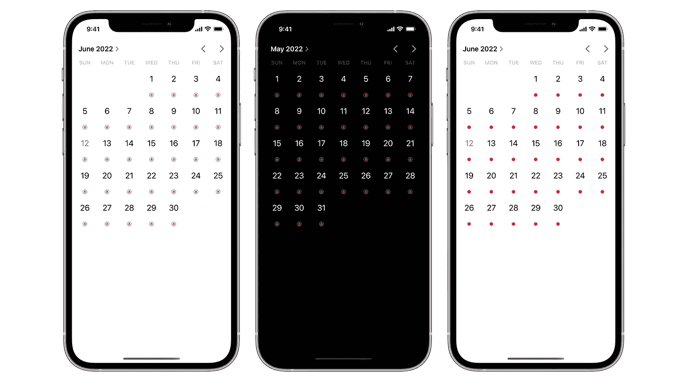
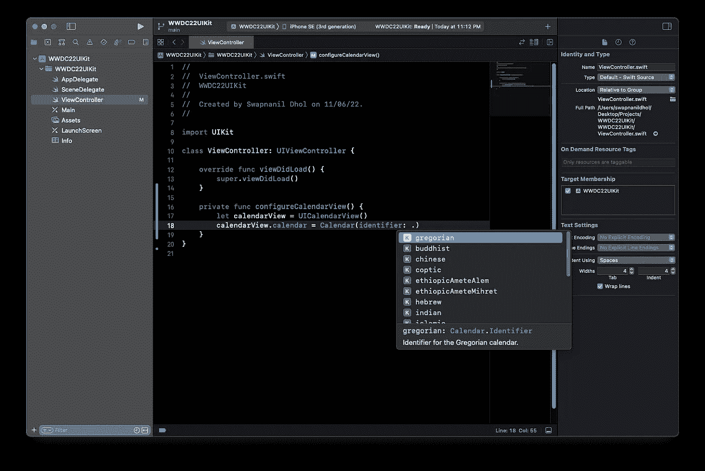

# 如何在 iOS 16 中使用 UICalendarView

> 原文：<https://betterprogramming.pub/uicalendarview-tutorial-593731e52b72>

## UICalendarView 教程



UICalendarView

在 WWDC 22 上，苹果宣布了新的 UIKit 控件。在本教程中，我们将深入研究最有用和最通用的组件之一- `UICalendarView`。

# 什么是 UICalendarView

`UIDatePicker`的内嵌日期选择器组件现在可以作为一个单独的组件使用了。

日历视图用于向用户显示特定的日期以及这些特定日期的附加信息和装饰。

例如，在日历应用程序中，有事件的日期会在日期下方标上一个粉红色的圆点。日历视图也可以用于选择一个或多个日期，或者根本不选择日期。

通过`UICalendarView`，你可以预设日期，禁止某些日期被选中，等等。

# 它与 UIDatePicker 有何不同？

`UIDatePicker`允许用户选择一个时间点。此选择是单一的，不能用于选择一个范围或多个日期。

如果您希望从用户那里获得关于特定时间点的输入，比如必须注册事务的日期，那么仍然必须使用日期选择器。

日历视图仅用于显示和选择日期。如果您想处理日期和时间选择，请使用`UIDatePicker`。

# 考虑

*   `UICalendarView`和`UIDatePicker`的一个重要区别是`UICalendarView`用`NSDateComponents`表示日期，而`UIDatePicker`用`NSDate`表示特定的时间点。
*   由于`UICalendarView`的日期由`NSDateComponents`表示，我们有责任明确我们想要使用的当前日历。我们不能假设，比如默认会设置公历。`UICalendarView`如果没有明确传递日历，将根据用户当前设置的日历，用系统默认日历配置自身。



在这里，我们可以看到可用日历的列表。我们必须明确我们想用哪个日历来输入。

# 入门指南

为了创建一个日历视图，我们创建一个`UICalendarView`的实例并设置它的日历。然后，我们可以使用自动布局约束将其添加到视图中。

```
let calendarView = UICalendarView()
calendarView.calendar = Calendar(identifier: .gregorian)
calendarView.translatesAutoresizingMaskIntoConstraints = false
view.addSubview(calendarView)
NSLayoutConstraint.activate([
    calendarView.leadingAnchor.constraint(equalTo: view.leadingAnchor),
    calendarView.trailingAnchor.constraint(equalTo: view.trailingAnchor),
    calendarView.centerXAnchor.constraint(equalTo: view.centerXAnchor)
])
```

# 设置日期范围

`UICalendarView`有设置可见日期范围的方法。

该范围集也可以被动画化以显示响应于用户输入或运行时条件变化的变化。

若要设置可见的日期组件，请使用此方法

```
func setVisibleDateComponents(
    _ dateComponents: DateComponents,
    animated: Bool
)
*// calendarView.setVisibileDateComponents(..., animated: true)*
```

> 如果提供的日期部分与`UICalendarView`不在同一个日历中，输入的日期部分将被转换为使用`UICalendarView.calendar`。这可能会导致日期不匹配，并且如果两个日历系统的日期不同，可能会导致日期无效。

# 处理日期选择

我们可以在日历视图上设置一个选择行为属性来定义它将接受哪种类型的输入。我们可以用单选和多选来配置它。在本例中，我们设置了一个多日期选择。

```
let multiDateSelection = UICalendarSelectionMultiDate(delegate: self)
```

还有另一种选择方法叫做`UICalendarSelectionSingleDate`,仅用于选择单个日期。

`UICalendarSelectionMultiDate`的委托人必须符合`UICalendarSelectionMultiDateDelegate`。该委托有 2 个必需方法和 2 个可选方法。

# 必需的方法

*   第一个方法是`didSelectDate`，它的函数签名如下所示。

```
func multiDateSelection(_ selection: UICalendarSelectionMultiDate, didSelectDate dateComponents: DateComponents)
```

用户在日历视图中选择日期后，将调用此方法。

*   另一个必需的方法是`didDeselectDate`，它的函数签名如下所示。

```
func multiDateSelection(_ selection: UICalendarSelectionMultiDate, didDeselectDate dateComponents: DateComponents)
```

当用户从日历视图中的一个选定日期中移除选择后，调用此方法。

## 可选方法

*   第一个可选的方法是`canSelectDate`。

```
optional func multiDateSelection(_ selection: UICalendarSelectionMultiDate, canSelectDate dateComponents: DateComponents) -> Bool
```

该调用确定日期是否可选。日历视图中将禁用不可选择的日期。

*   第二个可选的委托方法是`canDeselectDate`。

```
optional func multiDateSelection(_ selection: UICalendarSelectionMultiDate, canDeselectDate dateComponents: DateComponents) -> Bool
```

此调用确定是否可以取消选择日期。

# 定制

`UICalendarView`让我们为日期提供装饰，类似于您在系统日历应用程序中看到的内容。这个组件有一个默认设置为 true 的`wantsDateDecorations`。

但是，您必须实现委托方法来提供这些装饰。这就是我们将在这一小节中探讨的内容。将`calendarView`的代理设置为`self`并将您的视图控制器设置为`UICalendarViewDelegate`。

```
calendarView.delegate = selfextension ViewController: UICalendarViewDelegate {}
```

这种一致性要求我们实现一个必需的方法。

```
func calendarView(_ calendarView: UICalendarView, decorationFor dateComponents: DateComponents) -> UICalendarView.Decoration?
```

# UICalendarView。装饰

装饰有三种不同的类型。常规、图像和自定义视图。

## 规则的

默认`init()`创建一个带有圆形图像的默认装饰，如系统日历应用中所示。

## 带图像

这个初始化器接受一个`UIImage`、一个`UIColor`和一个`UICalendarViewDecorationSize`，并用指定的图像、颜色和大小创建一个新的基于图像的装饰。

*   如果没有图像被显式传递，则`image`默认为`circlebadge.fil`。
*   如果没有显式传递颜色，则`color`默认为`UIColor.systemFillColor`。
*   如果没有显式传递大小，`size`默认为`UICalendarViewDecorationSizeMedium`。

## 使用自定义视图

苹果文档很好地解释了这一点。

> 使用提供的视图提供程序创建新的自定义视图装饰。当首次加载装饰视图时，将调用该提供程序一次。装饰将被剪切到其父级的边界，并且不能进行交互。

这个初始化器接受一个`UIView`并将它设置为日历的日期装饰，服从前面提到的限制。

`UICalendarView.DecorationSize`是表示装饰项目的可用尺寸的枚举。

```
UICalendarViewDecorationSizeSmall = 0,
UICalendarViewDecorationSizeMedium = 1,
UICalendarViewDecorationSizeLarge = 2,
```

要设置装饰视图，只需在委托方法中提供所需的装饰。比如说。来自 2022 年 WWDC 的`What’s New in UIKit`会议:

```
*// Configuring Decorations*
func calendarView(
    _ calendarView: UICalendarView,
    decorationFor dateComponents: DateComponents
) -> UICalendarView.Decoration? {
    switch myDatabase.eventType(on: dateComponents) {
    case .none:
        return nil
    case .busy:
        return .default()
    case .travel:
        return .image(airplaneImage, color: .systemOrange)
    case .party:
        return .customView {
            MyPartyEmojiLabel()
        }
    }
}
```

您可以通过调用`reloadDecorations(forDateComponents:animated:)`方法在运行时重新加载装饰。

它接受一个数组`DateComponents`,表示装饰必须重新加载的日期。您甚至可以选择将这些变化制作成动画。

# 结论

与`UIDatePicker`提供的单个时间点相比，新的`UICalendarView`是选择单个和多个日期的强大组件。这两个组件有它们自己的用例，不应该被视为任何一个的替代品。

当您想要选择一个时间点时，使用`UIDatePicker`。当您想要选择一个日期或一系列日期时，请使用新的日历视图。日历视图接受`DateComponents`，而日期选择器接受`NSDate`。

感谢您的阅读！

```
**Want to Connect?**[I](https://www.buymeacoffee.com/swapnanildhol)f you liked this article, consider [buying me a coffee to reward my efforts](https://www.buymeacoffee.com/swapnanildhol). You can also choose to [sponsor me on Github](https://github.com/sponsors/SwapnanilDhol). With Github sponsors, you can request various services such as pair programming, code reviews, consultancy, and more!
```