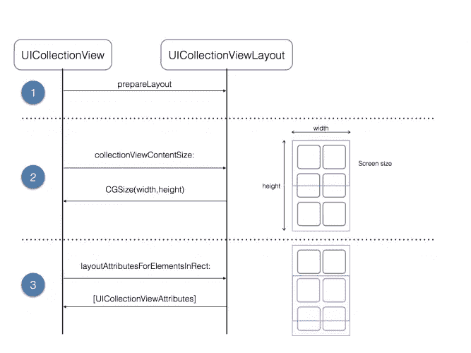
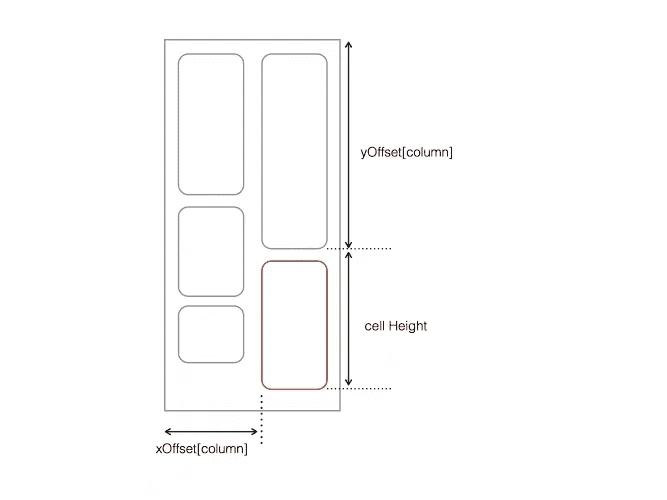

# 基于文本或图像自动调整单元格大小的 UICollectionView

> 原文：<https://betterprogramming.pub/uicollectionview-with-autosizing-cell-based-on-items-text-image-814cc0e93302>

## 源代码和调整单元格高度的说明

照片由 [Przemyslaw Marczynski](https://unsplash.com/@pemmax?utm_source=unsplash&utm_medium=referral&utm_content=creditCopyText) 在 [Unsplash](https://unsplash.com/search/photos/ios?utm_source=unsplash&utm_medium=referral&utm_content=creditCopyText) 上拍摄

*注意:该方法已经在 iOS 以上版本上使用基础 SDK* 进行了测试

您可能已经使用了默认的流布局 UIKit 提供的一个布局类，它由一个基本的网格布局和一些定制组成——但是您也可以实现您自己的定制布局，以您喜欢的任何方式排列视图。这就是集合视图如此灵活和强大的原因。

或者，您可能使用了自动布局，并在单元格的宽度上添加了约束，或者从单元格中的最后一个元素到底部锚定单元格。

## 介绍

在这篇文章中，我将讨论使用*自定义视图布局* **来调整单元格的大小。我在想如何让单元格尽可能地多用途，以便它们完全依赖于我们放在那里的数据，例如图片或文本。由于图片的一切都要简单得多，我们可以从属性中识别它的高度，例如`UIImageView.size.height`，但是文本要复杂得多，因为它取决于字体的类型、一行中单元格的数量、边距和填充。因为我们“硬编码”*单元的高度，我决定在构建它们时缓存我的`customLayout`单元属性。我们开始吧！***

# *创建自定义集合视图布局*

*创建令人惊叹的集合视图的第一步是为您的项目创建一个自定义布局类。*

*在我们创建了一个实现了`UICollectionViewLayout`的类之后，在这里是`AdaptiveCollectionLayout`，在 xCode 中将它添加到`collectionView`中。如果您构建并运行您的应用程序，您将看到一个空的收藏视图。信不信由你，这是一个好兆头。这意味着集合视图正在使用您的自定义布局类。单元格还没有显示出来，因为`AdaptiveCollectionLayout`类还没有实现布局过程中涉及的任何方法。*

# *核心布局流程*

*花点时间思考一下集合视图布局过程，这是集合视图和布局对象之间的协作。当集合视图需要布局信息时，它会要求您的布局对象通过以特定顺序调用某些方法来提供这些信息:*

**

*布局子类必须实现以下方法:*

*   *`collectionViewContentSize`:该方法返回集合视图内容的宽度和高度。您必须覆盖它，然后返回整个集合视图内容的高度和宽度，而不仅仅是可见内容。集合视图在内部使用此信息来配置其滚动视图的内容大小。*
*   *`prepare()`:每当一个布局操作将要发生时，这个方法被调用。这是您准备和执行确定集合视图的大小和项目位置所需的任何计算的机会。*
*   *`layoutAttributesForElements(in:)`:在这个方法中，您需要返回给定矩形内所有项目的布局属性。您将属性作为一个数组`UICollectionViewLayoutAttributes`返回给集合视图。*
*   *`layoutAttributesForItem(at:)`:该方法为集合视图提供按需布局信息。您需要覆盖它，并在请求的`indexPath`返回项目的布局属性。*

*好的，那么你知道你需要实现什么——但是你如何着手计算这些属性呢？*

# *计算布局属性*

*对于这种布局，您需要动态计算每个项目的高度，因为您事先不知道照片的高度或文本的长度。我们将声明一个协议，在`AdaptiveCollectionLayout`需要时提供这些信息。*

*这段代码声明了`AdaptiveCollectionLayoutDelegate`协议，它有一个请求单元格高度的方法。您将很快在`YourViewController`中实现这个协议。*

*在实现布局方法之前，还有一件事要做；您需要声明一些有助于布局过程的属性。*

> *在我们开始之前。让我们创建一个配置 swift 文件来定义属性，其中一个基础结构*

*这段代码定义了一些属性，您稍后将需要这些属性来提供布局信息。*

*我们计算集合视图项目的属性，现在它将由框架组成。要理解这是如何工作的，请看下图:*

**

*我们将根据每一项的列(由`xOffset`跟踪)和同一列中前一项的位置(由`yOffset`跟踪)来计算每一项的帧。*

*为了计算水平位置，我们将使用项目所属列的起始 X 坐标，然后添加单元格填充。垂直位置是该列中前一项的起始位置加上前一项的高度。项目的总高度是图像高度和内容填充的总和。*

*您将在`prepare()`中这样做，在这里我们为布局中的每个项目计算一个`UICollectionViewLayoutAttributes`实例。*

**注意:检查代码中的注释。**

*在您可以看到您的布局运行之前，您需要实现布局委托。例如`MyCollectionAdapter`在计算属性框架的高度时，依靠这个来提供文本注释高度。*

> *注意:不要忘记为你的布局添加代理*

*是时候看看事情是如何发展的了！构建并运行您的应用程序。您会看到单元格根据文本的长度正确定位和调整大小:*

**