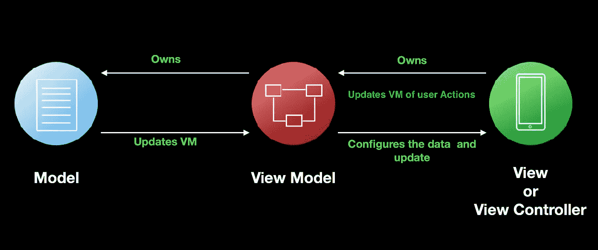
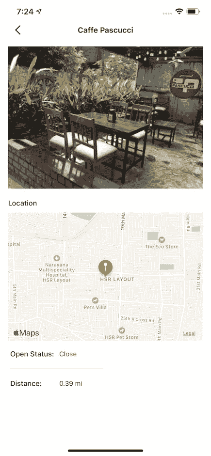
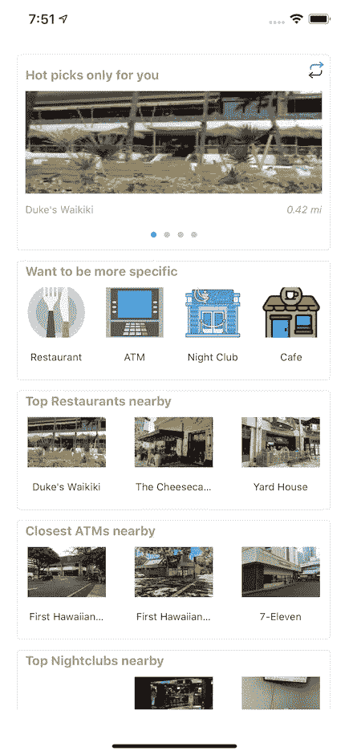

# 如何将 UIKit 与 MVVM 和联合收割机配合使用

> 原文：<https://betterprogramming.pub/uikit-mvvm-combine-912c80c02262>

## 将苹果的联合收割机集成到您的视图模型中

苹果自己的反应式框架[组合](https://developer.apple.com/documentation/combine)出现已经有一段时间了。做了相当一段时间的 RxSwift 用户，比起 Swift U，我对 Combine 更感兴趣，所以决定先学学。

我开始迁移我的一个 [UIKit + Swift + MVVM](https://github.com/GABHISEKBUNTY/MVVMDiscussion/tree/master/MVVM-2/Nearby) 项目来合并和学习 MVVM。这个项目创建了一个名为 Nearby 的应用程序，显示你周围的一些地方(餐馆、自动取款机、咖啡馆等)。在本文中，我将与您分享我的迁移经验、难点以及相关资源。

对于我们讨论的范围，让我们以附近的几页为例。可以下载[附近的代码库](https://github.com/GABHISEKBUNTY/CombineExperiments)开始参考博客。

模型-视图-视图模型

# 配置视图模型

放置细节

该视图显示一个地点的名称、位置、图像、开放状态以及离您的位置的距离。这些细节将由该视图的`ViewModel`提供。让我们直奔主题:

PlaceDetailViewModel

## **这是怎么回事？**

您的`ViewModel`接收到一个`NearbyPlace`对象，它保存了这个特定地点的所有相关信息。然后`ViewModel`配置输出。输出是要在视图上显示的数据。到目前为止，一切都很顺利。

您可能已经注意到，所有输出属性都用`[@Published](https://developer.apple.com/documentation/combine/published)`关键字进行了注释。Combine 中的这个[属性包装器](https://www.swiftbysundell.com/articles/property-wrappers-in-swift/)包含一个存储值，它的投影值为用户提供了一个 [Combine publisher](https://heckj.github.io/swiftui-notes/#coreconcepts-publisher-subscriber) ，每当属性发生变化时，它就接收属性的更新值。在 Swift world 中，您必须调用在视图中实现的更新回调或委托，但是在 Combine 中您可以免费获得它！

# 配置视图

PlaceDetailController

一旦加载了视图，我们就设置了我们的`ViewModel`配置输出属性到我们的 UI 组件的绑定。

为什么我们称之为绑定？因为在这里，您不仅将 UI 组件分配给它们各自的值，还订阅了该属性中的任何未来更改:

`[assign(to:on:)](https://developer.apple.com/documentation/combine/currentvaluesubject/3235789-assign)`

为了清楚起见，我们将绑定分离为可以使用 combine 的`[assign(to:on:)](https://developer.apple.com/documentation/combine/currentvaluesubject/3235789-assign)` API 直接分配的绑定，它将发布者的输出分配给对象的属性。如果你回顾我们上一节的讨论，我们已经用`@Published`注释了我们在`ViewModel`中的属性。在绑定中，我们使用了属性的投影值，使用`$propertyname`将底层发布者分配给 UI 组件的可分配属性。每个赋值的结果都是一个`[AnyCancellable](https://developer.apple.com/documentation/combine/anycancellable)`类型。

例如，为了将`$title`赋给`titleLabel`的`text`属性，我们写`viewModel.$title.assign(to: \.text!, on: titleLabel)`。

所有的`AnyCancellable`结果都存储在一个`subscriptions`集合中，确保您的订阅仍然在内存中，以接收任何即将到来的事件。

# **自定义分配**

对于属性的自定义处理，我们可以使用 Combine 在我们的`Publishers`上提供的不同操作符，比如`[sink(receiveValue:)](https://developer.apple.com/documentation/combine/publishers/collect/3362673-sink)`和`[handleEvents](https://developer.apple.com/documentation/combine/passthroughsubject/3204610-handleevents)`，来接收值并直接对它们进行操作。在上面的代码片段中，我们使用`compactMap`将来自`$location`发布者的`CLLocation`值流映射到一个由`MKCoordinateRegion`和`MKPointAnnotation`后跟`[sink](https://developer.apple.com/documentation/combine/publishers/collect/3362673-sink)`组成的元组，以在地图上呈现细节。

# 将 UI 事件传递给视图模型

有时候，我们需要将某些 UI 事件传递给`ViewModel`进行进一步的处理——可能是 API 调用、数据库查询或其他事情。

附近的家

上面的屏幕显示了附近的主页。某些 UI 事件发生在这个视图上——用户点击来刷新提要、点击类别、点击任何地方等等。这些事件触发了`ViewModel`中的某些动作，比如触发 API 或 UI 本身，比如导航。为了我们的讨论，让我们以一个通信为例，用户点击来刷新屏幕上的数据:

HomeViewController

HomeViewModel

一个`PassthroughSubject`可以用来发送事件给你主题的订阅者。把这个想象成你的供水管，你从这里获取日常用水。

在我们的例子中，视图使用`loadDataSubject`向`ViewModel`发送事件，以从服务器加载应用程序数据。每当用户按下刷新按钮或者视图第一次加载时，我们要求`ViewModel`加载数据。如果仔细观察在`ViewModel`中实现的`attachViewEventListener(loadData: AnyPublisher<Void, Never>)`，我们实际上并没有将`loadDataSubject`传递给`ViewModel`来接收事件。相反，我们键入擦除主题到一个`AnyPublisher`并发送它。一个`AnyPublisher`只能用来接收事件，不能用来发送事件。通过使用这种[类型的擦除](https://heckj.github.io/swiftui-notes/#reference-erasetoanypublisher)，我们避免了来自`ViewModel`的`loadDataSubject`被滥用的任何机会。

类似的方法也适用于`ViewModel`和 `View`之间的通信。为了在成功的 API 获取时重新加载我们的列表，我们使用了`reloadPlaceList: AnyPublisher<Result<Void, NearbyAPIError>, Never>`

# UIKit 的痛苦和组合兼容性

## 缺少绑定

虽然我们有使用键路径将发布者绑定到任何属性的`[assign(to:on:)](https://developer.apple.com/documentation/combine/currentvaluesubject/3235789-assign)`，但是它和它的 Rx 对应物`bind(to:)`一样，有一些主要的绑定功能。特别是对于`UIControl`，没有直接的方法将控制事件发送到`AnyPublisher`属性。在我们的例子中，我们使用了`PublishSubject`和类型擦除来发送一个按钮点击事件。社区很快为`UIKit`组件开发了缺少绑定功能的包装器。

为了实现一个 UIControl 绑定功能，比如 assign，[我们必须编写我们自己的定制发布器](https://forums.swift.org/t/a-uicontrol-event-publisher-example/26215/19)，这对任何人来说都是一个很大的开销。

不要灰心。我们仍然可以使用 combine 来异步驱动我们的许多业务逻辑，并利用 Combine 和反应式编程的强大功能。

# 属性包装和协议

不能在协议定义中声明属性包装。您可能已经注意到，我们在视图中直接使用了我们的`ViewModel` s，使用了它们的具体类型。这降低了视图可重用性的范围。如果我们要抽象出`ViewModel`并通过协议公开我们的输出和输入，我们不能在协议定义中直接使用`@Published`。[原因和解决方法在这个博客](https://swiftsenpai.com/swift/define-protocol-with-published-property-wrapper/?utm_campaign=AppCoda%20Weekly&utm_medium=email&utm_source=Revue%20newsletter)中有解释。请随意查看。

# 已完成项目

 [## GABHISEKBUNTY/组合实验

### 回购持有我在 Swift 的所有联合实验。通过以下方式为 GABHISEKBUNTY/combine experiments 开发做出贡献…

github.com](https://github.com/GABHISEKBUNTY/CombineExperiments) 

# 参考

*   [https://heckj.github.io/swiftui-notes/](https://heckj.github.io/swiftui-notes/)
*   [https://forums . swift . org/t/a-ui control-event-publisher-example/26215/19](https://forums.swift.org/t/a-uicontrol-event-publisher-example/26215/19)
*   [https://theswiftdev . com/the-ultimate-combine-framework-tutorial-in-swift/](https://theswiftdev.com/the-ultimate-combine-framework-tutorial-in-swift/)
*   [https://www.caseyliss.com/2019/6/17/combine-wheres-the-beef](https://www.caseyliss.com/2019/6/17/combine-wheres-the-beef)