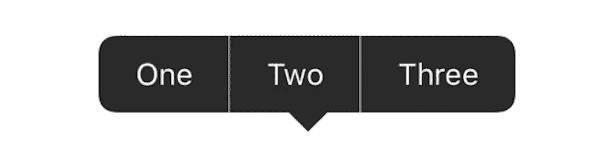
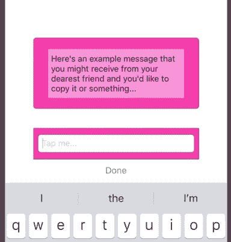

# 使用 UIMenuController 并操作响应器链

> 原文：<https://betterprogramming.pub/uimenucontroller-and-manipulating-the-responder-chain-c06fad73c64b>

## 使用 Swift 通过 UIMenuController 处理事件的详细指南



本文重点介绍 UIMenuController 功能，以及它如何与 UIResponder 链交互来处理事件。它假设您至少对这两者都有所了解，但是如果没有，请在继续之前阅读一下。你也可以在最后找到一个这样的例子。

*   [UIMenuController API](https://developer.apple.com/documentation/uikit/uimenucontroller)
*   [与记者合作](https://developer.apple.com/documentation/uikit/touches_presses_and_gestures/using_responders_and_the_responder_chain_to_handle_events)

好了，现在让我们进入主要部分。当显示 UIMenuController 时，它需要有一个 firstResponder 对象。通常，您只需将上面显示菜单的视图设置为第一响应者就可以了，但是如果您想在一个视图上面显示这个菜单，而另一个视图作为第一响应者呢？例如，当 UITextView/UITextField 处于活动状态时，用户正在键入某些内容，而无需关闭键盘。嗯，正好有一种方法可以处理这种情况，但是您必须对响应者链进行一些操作才能实现。值得庆幸的是，苹果已经让这个目标相对容易实现。

我们要做的是获取两个独立的 UIResponder 链，一个代表菜单呈现的视图，我们称之为“气泡视图”，另一个代表用户输入的文本视图，然后合并它们。这将是在信息功能的背景下，类似于 Instagram 的聊天。我们的目标是让用户在能够长按消息气泡来执行操作的同时输入消息。

这是我们目标的一个例子:



首先，我们需要设置并附加一个长按手势，定制 UIMenuController singleton，并在 presenting 视图中覆盖`canPerformAction`以使其能够显示菜单。我假设从现在开始已经准备好了，但如果你想了解更多细节，这篇文章的底部有参考资料。

我们已经准备好菜单并开始运行，但是您可能会注意到一个问题。每当菜单弹出时，它会隐藏键盘。


为了解决这个问题，我们将稍微调整一下响应链。本质上，我们需要输入文本字段作为第一响应者，但是对于视图，我们是在决定菜单在哪里显示以及显示什么动作。这是通过用我们点击的视图替换文本字段的“下一个响应者”对象来实现的。

首先，我们子类化 UITextField 和 override `nextResponder`并提供我们自己的覆盖。这个覆盖将是从上面的“气泡视图”。

```
weak var nextResponderOverride: UIResponder?override var next: UIResponder? {
  if nextResponderOverride != nil {
    return nextResponderOverride
  } else {
    return super.next
  }
}
```

除此之外，我们还需要覆盖 UITextField 上的`canPerformAction`方法，这样我们就可以允许被覆盖的`nextResponder`做出决定。这将是我们如何允许文本字段“假装”它可以稍后执行 UIMenuController 的操作。

```
override func canPerformAction(_ action: Selector, withSender sender: Any?) -> Bool {
  if nextResponderOverride != nil {
    return false
  } else {
    return super.canPerformAction(action, withSender: sender)
  }
}
```

这里发生的事情的要点是，如果我们已经设置了`nextResponderOverride`，也就是说，我们希望“气泡视图”来处理这个问题，那么无论如何我们都会返回 false。这导致 UIMenuController 检查文本视图的`next`响应器，我们已经将其覆盖为我们的“气泡视图”，这样我们就完成了响应器链的交换。

现在剩下唯一要做的事情就是设置我们的“气泡视图”来处理期望的动作。我们通过以下方式做到这一点:

```
// Ensure our bubble view can be the first responder
override var canBecomeFirstResponder: Bool {
  return true
}// Set it to be able to perform desired actions
override func canPerformAction(_ action: Selector, withSender sender: Any?) -> Bool {
  // Extend this to check for all actions
  if action == #selector(oneMethod) { 
    return true
  } else {
    return false
  }
}
```

现在，当你打开键盘并触发你的菜单显示时，它会显示出来，而不需要接管和隐藏键盘！🎉

请在下面留下您在实施时遇到的任何问题或困难的评论。

很快还会有一篇后续文章，将涵盖一些在构建这种用户交互时可能出现的边缘情况错误，例如长按文本字段时操作被复制。你可以在下面的例子和 Instagram 的聊天功能中看到这种情况。

这里有一个这方面的例子:[https://github.com/alexpersian/MenuItemTester](https://github.com/alexpersian/MenuItemTester)

堆栈溢出参考答案:[https://stackoverflow.com/a/23849955/3434244](https://stackoverflow.com/a/23849955/3434244)