# UIStackView:分布与对齐

> 原文：<https://betterprogramming.pub/uistackview-distribution-vs-alignment-146b9612e24c>

## UIStackView 通过减少约束的数量来简化视图布局


安妮·斯普拉特在 [Unsplash](https://unsplash.com/?utm_source=unsplash&utm_medium=referral&utm_content=creditCopyText) 上拍摄的照片

# 介绍

`UIStackView`是 iOS 9 中引入的最重要、最强大的`UIKit`组件之一。它如此强大和优雅，以至于它真的加速了我们许多人放弃对 iOS 8 的支持。

对于经常使用自动布局的人来说，你会知道创建`NSLayoutConstraint`并不是特别有趣和容易。由于 2D 屏幕上的每个视图都有四个自由度，这意味着，一般来说，我们必须为每个视图创建至少四个约束。

那么，回到堆栈视图的介绍，它是一个很大的创新吗？

不完全是，因为 Android 的对等物`[LinearLayout](https://developer.android.com/reference/android/widget/LinearLayout)`是在宇宙之初引入的(也称为 API 级)。不确定为什么苹果花了八年时间才推出这个组件。

但不管怎样，我们都很高兴它终于面世了。

尽管`UIStackView`通过减少我们必须实现的约束数量，大大简化了视图布局，但它仍然会变得相当复杂和令人困惑。

堆栈视图有四个主要属性[和](https://developer.apple.com/documentation/uikit/uistackview):

*   `[axis](https://developer.apple.com/documentation/uikit/uistackview/1616223-axis)`
*   `[distribution](https://developer.apple.com/documentation/uikit/uistackview/1616233-distribution)`
*   `[alignment](https://developer.apple.com/documentation/uikit/uistackview/alignment)`
*   `[spacing](https://developer.apple.com/documentation/uikit/uistackview/1616225-spacing)`

第一个和最后一个相对简单。我们使用`axis`来定义堆栈视图的方向，可以是`vertical`或`horizontal`。(如果一叠被翻到了一边，就不应该再叫叠了，还是应该🤔？)对于最后一个，`spacing`，顾名思义，它指定了栈视图内部视图之间的间距。剩下的两个怎么样:`distribution`和`alignment`？

尽管`UIStackView`已经变得如此流行，在如此多的应用程序中如此常用，但许多人可能并不完全理解它，也可能没有正确使用它。

这就是我们今天要关注的。我们将比较各种`distribution`和`alignment`设置，看看它们之间有何不同。

# 准备

在开始之前，我们需要创建几个虚拟视图放入堆栈视图。我们开始吧:

```
let redDummy = DummyBoxView(width: 40, height: 40, color: .red)
let greenDummy = DummyBoxView(width: 30, height: 80, color: .green)
let blueDummy = DummyBoxView(width: 80, height: 30, color: .blue)
```

`DummyBoxView`的实现非常简单。有一个虚线边框，在中间，有一个标签表明相对宽度和高度。

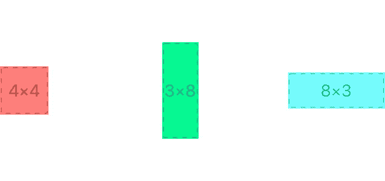

如前所述，堆栈视图有两个`axes`(方向:`horizontal`或`vertical`。但是为了简单起见，我们现在只关注水平堆栈视图。

对于垂直堆栈视图，我们只需将头部转动 90 度，对吗？

# 分配

`distribution`的可能配置有:

*   `fill`
*   `fillEqually`
*   `fillProportionally`
*   `equalSpacing`
*   `equalCentering`

让我们看看它们的样子:

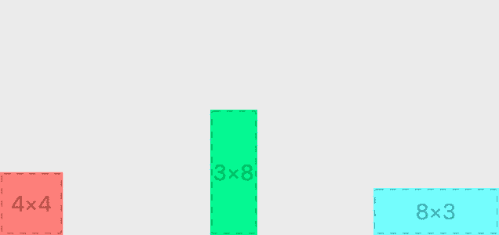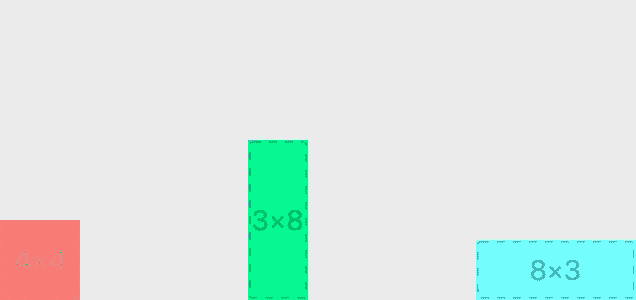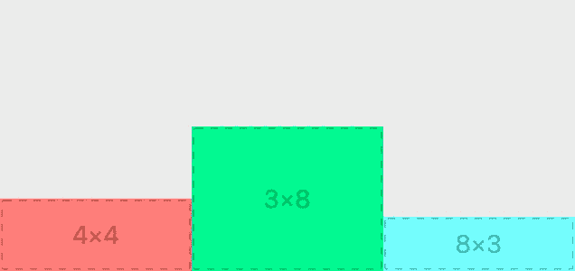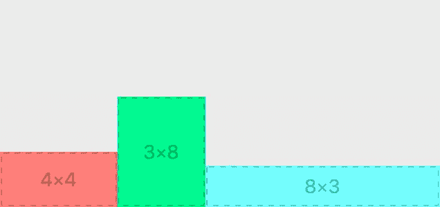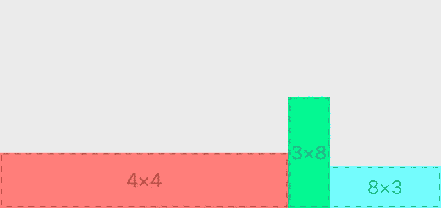

上面两张图是`equalCentering`(左)和`equalSpacing`(右)。它们的差异不是很明显，尤其是当子视图的大小相似时。

对于`equalCentering`，子视图的放置使得视图之间的中心间距相同。对于`equalSpacing`，视图之间的间距是相同的。

下面三个图分别是`fillEqually`(左)、`fillProportionally`(中)、`fill`(右)。

注意，对于这三个设置，子视图都以某种方式调整大小以填充堆栈视图。`fillEqually`和`fillProportionally`根据名字应该是相当清楚的。`fillEqually`意味着所有的子视图都将被调整大小，使其宽度相同(对于水平堆栈视图)。`fillProportionally`另一方面，将根据子视图的大小按比例调整其大小。

但是，刚刚的`fill`会怎么样呢？为什么我们的红盒子宽了这么多？

使用`fill`，堆栈视图将选择一个子视图来调整大小。

在这种情况下，堆栈视图将选择拥抱优先级最低的子视图。因为我们从来没有明确地设置它，所有的子视图都有相同的默认拥抱优先级。当这种情况发生时，堆栈视图将选择第一个进行拉伸。在这种情况下，红色的会被拉伸，而绿色和蓝色会保持它们的大小。

关于这三个`fill*`设置，最后一件重要的事情是，堆栈视图使用子视图的固有内容大小进行计算。**不是**的车架尺寸！**不是**约束尺寸！

你是否好奇为什么它们都排列在堆栈视图的底部？让我们继续下一部分。

# 对齐

`alignment`的可能配置有:

*   `fill`
*   `top`
*   `firstBaseline`
*   `center`
*   `bottom`
*   `lastBaseline`

实际上还有两个，即`leading`和`trailing`，我们现在将忽略它们，因为它们仅适用于垂直堆栈视图。

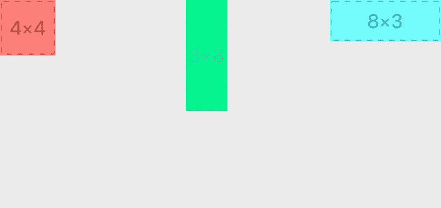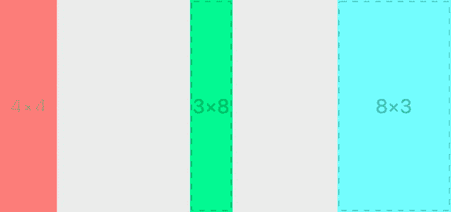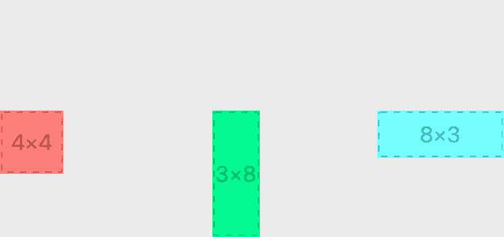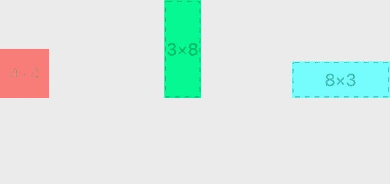

前三个非常清楚:它们是`bottom`(左上)、`center`(中上)和`top`(右上)。正如您可能猜到的，在前面的部分中，所有的图表实际上都使用了`bottom`对齐。

下一个是`fill`(左下)，stack 视图调整其所有视图的大小，以便它们填充垂直于 stack 视图轴的可用空间。

最后两个是最令人困惑的:`firstBaseline`(中下)和`lastBaseline`(右下)。我不确定光靠名字能得到多少。

让我们来看看官方的定义:

*   `firstBaseline` : 堆栈视图根据其第一条基线排列视图的布局。
*   `lastBaseline`:一种布局，其中堆栈视图根据其最后的基线对齐其排列的视图。

定义类似于我问你什么是“火柴盒”，你告诉我是“火柴盒”。让我们再看一组带有更多子视图的例子。

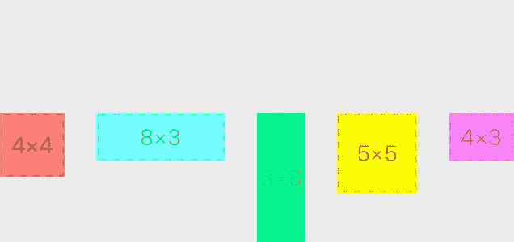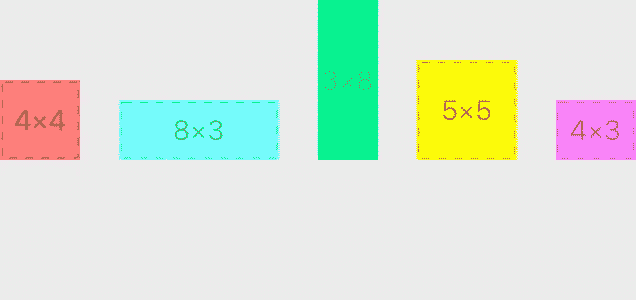

*   `firstBaseline`(左)类似于`top`，所有子视图都是顶部对齐的。但是，它们被放置在堆栈视图的底部。
*   `lastBaseline`(右)类似于`bottom`，所有子视图都是底部对齐的。但是，它们被放置在堆栈视图的顶部。

我很难想象这会有什么用处。但是显然，它对于对齐多行文本视图是有意义的。这里就不赘述了。但是如果你有兴趣的话，stackoverflow 上的这个[回答](https://stackoverflow.com/a/33934323/1035008)解释的很好。

# 垂直堆栈视图怎么样？

实际上，一切都还是老样子。唯一的一点就是`top`和`bottom`要换成`leading`和`trailing`。实际上，它们在枚举中是相同的整数。

# **结尾**

好了，这就是堆栈视图的全部内容。最后，你能猜出这个堆栈视图的设置是什么吗？

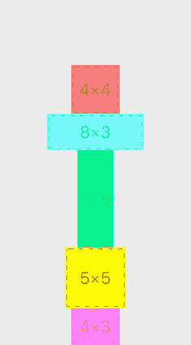

*   提示 1:不是底部对齐。
*   有一个看不见的视角。

一如既往的感谢阅读！在 [GitHub](https://github.com/yzhong52/StackViewDemo) 上可以找到演示代码和完整的示例集。