# 终极指南:自动化媒体到 Twitter

> 原文：<https://betterprogramming.pub/ultimate-guide-automating-medium-to-twitter-360f01c6e5ac>

## 如何在 Medium 上发布新文章时自动发布到 Twitter

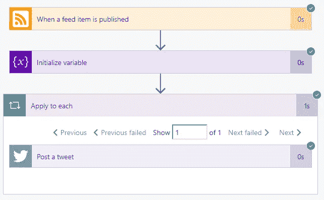

顶级作家总是给出类似这样的建议:

> 一半的时间你应该在写作；另一半是营销。

没有人会神奇地找到你的内容。你需要去有人的地方。

但是为什么营销要占用你一半的时间呢？把它从你的盘子里拿走，这样你就可以专注于更有创造性的过程。我知道你在想什么…

“发布一条推文需要两分钟。为什么要实现自动化？”

当你发布一个故事时，自动发布一条推文是一种门户药物。一旦你掌握了窍门，你就能做很多事情！以下是我最喜欢的几个列表:

1.  发布到 Twitter、LinkedIn、脸书、Tumblr、Instagram、Pinterest、Reddit 等网站。
2.  在微软待办事项、Todoist、OneNote、Asana、Basecamp 等中自动创建任务。
3.  将您的社交媒体增长自动绘制成 Excel 电子表格。
4.  通过添加 Bitly 跟踪您的后期点击率。
5.  从社交媒体中自动收集你所在领域的顶级影响者。

这个清单还在继续。简而言之，您可以获得更多数据，缩短上市时间，并提高工作效率。

通过使用 Microsoft Flow，我们可以自动将来自媒体(或任何 RSS 源)的帖子在多个社交媒体平台上共享，从而让您有更多时间进行写作。为什么选择微软 Flow？

Microsoft Flow 是市场上最强大的(免费的)无代码自动化工具集。借助复杂的工作流程，您可以开发强大的应用来简化您的社交媒体流程。但是这种力量是有代价的。

这种能力有一个主要缺点:它很复杂。开始使用微软的 Flow 并不像 [IFTTT](#174c) 或 [Zapier](#174c) 那么简单。为了真正利用 Flow 的全部潜力，我们需要挖掘一些核心编程概念。但是不要担心，我们将为您介绍自动化该过程所需的一切。

# 如何获得微软流量

微软有免费选项；你可以去[https://flow.microsoft.com](https://flow.microsoft.com/)报名开始。现在就去报名吧。

对于每个使用微软 Office 365 的人来说，你大概已经有了 Flow 它直接集成到 Office 365 中。前往[https://flow.microsoft.com](https://flow.microsoft.com/)，使用您的 Office 365 凭据登录。

# 浏览 Microsoft 流程

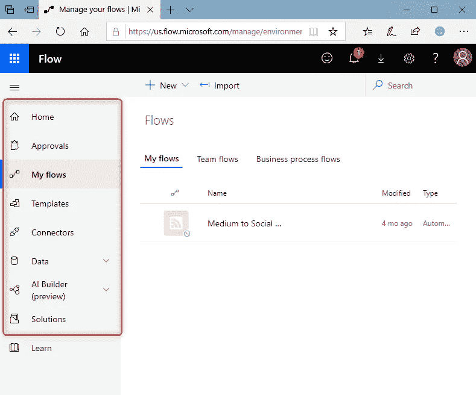

Microsoft 流程导航

微软最近更新了 Flow 的界面。他们将大部分导航放在了左侧，以便更容易地导航应用程序。

*   **主页**:探索各种模板并了解 Microsoft Flow 的主要特性。您可以快速了解什么是可能的，以及 Microsoft Flow 如何帮助您的业务和生活。
*   **批准**:管理跨多个服务的文档或流程的批准，包括 SharePoint、Dynamics CRM、Salesforce、OneDrive for Business、Zendesk 或 WordPress。
*   **我的流**:创建一个被事件触发后自动执行一个或多个任务的流。例如，创建一个在 Medium 上发布文章后发布到 LinkedIn 的流。
*   **模板**:微软和其他第三方创建了常用的流程。您可以在几分钟内选择一个模板并创建一个工作流。
*   **连接器**:您已连接并授予 Microsoft Flow 访问权限的应用。例如:Twitter 账户的连接器。

# 在 Twitter 上发布一篇中型文章

首先，我们将创建一个简单的工作流，当有一个中等作者的新帖子时，它将自动向 Twitter 发布消息。在我们深入了解分步指南之前，让我们先来鸟瞰一下整个过程。

首先要注意:网站是为你我设计的。计算机不容易理解它们。你可能不知道的是，每次一篇文章在 Medium 上发表，文档也会使用一个全球标准来共享，这个标准是计算机可以阅读的: **RSS** 。简而言之，RSS 使用了一个对计算机更友好的文章版本。别担心。我们要做的很简单。

1.  我们将创建一个工作流，该工作流将在您每次发布文章时自动运行。
2.  然后，我们将从文章中提取一些信息来撰写推文。
3.  最后，我们将消息发布到 Twitter 上。

让我们投入进来，让它发生。

## 创建新流程

我们需要做的第一件事是创建我们的工作流。工作流在一个漂亮的小容器中包含了我们需要的所有逻辑。

1.  登录[https://flow.microsoft.com](https://flow.microsoft.com/)。
2.  点击左侧导航栏中的**我的流程**。
3.  点击命令栏中的**新建**。
4.  点击下拉菜单中的**自动-从空白**。
5.  将流名称设置为**中等到社交媒体**
6.  在*选择你的流的触发器中输入 **RSS** 。*
7.  当一个 feed 项目发布后点击**。**
8.  **点击**创建**。**

**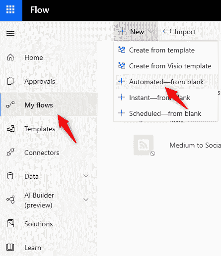****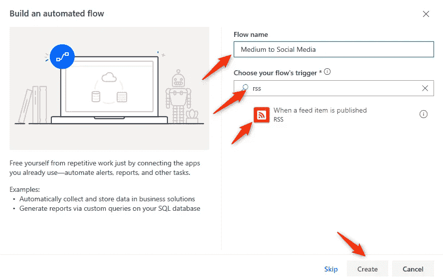**

**简而言之，我们刚刚创建了一个每次发布新文章时都会运行的工作流。完成后，Microsoft 会自动将您带到工作流管理页面。坚持到底。你基本上已经成功了一半。**

## **告诉心流看什么**

**此时，您的工作流知道在新文章发布时开始，但不知道要查看什么 RSS 提要。所以我们需要告诉你的工作流程你的 RSS 源在哪里。别担心，很简单。**

**每个媒体用户都有自己的 RSS 提要，其 URL 类似于**

```
https://medium.com/feed/@gruberjl
```

**要获取您的 RSS 源 URL，请用您的中用户名替换“gruberjl”。**

**在标记为**的文本框中输入您的网址。RSS 源网址**。**

**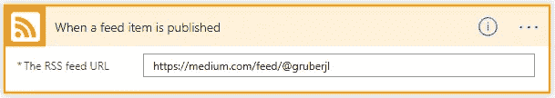**

**嘣。您的工作流程现在知道去哪里找您了。**

## **向工作流添加操作**

**此时，我们已经配置了一个流，它将在您每次向 Medium 发布新文章时运行。但是只有一个触发器的流实际上没有任何作用。**

**我们需要添加一个动作。本质上，当你在 Medium 上写一篇新文章时，我们是在告诉 Microsoft Flow 该做什么。**

1.  **点击**新建一步**。**
2.  **在**搜索连接器和动作**文本框中，输入**推特**。**
3.  **点击**发帖**。**

**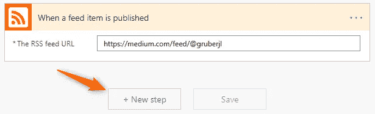****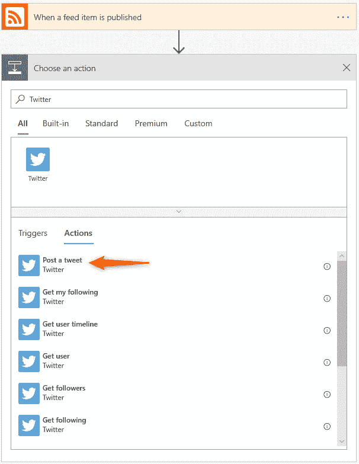**

## **将您的推特账户连接到您的工作流程**

**添加推特动作后，你会看到一个很大的**登录**按钮。此时，您的工作流知道您想在发表文章后在推特上发布消息，但不知道在哪个账户下发布。**

1.  **点击**登录**。一个新的浏览器窗口将打开。**
2.  **输入您的推特登录信息，点击**授权应用**。**

**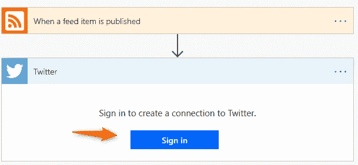****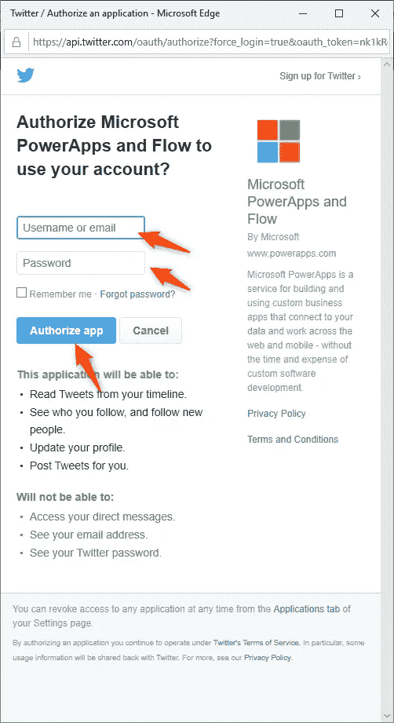**

**登录完成后，新窗口将关闭，您的工作流程将知道您使用的是哪个推特账户。**

## **配置推特行动**

**现在我们的流量需要知道推特应该说什么。**

**此时，您可能想知道我们如何在每次发布文章时自动获取 URL 和其他信息。幸运的是，我们创建的初始触发器“当一个提要项被发布时”做了两件事。**

**首先，它启动流程。**

**第二，它收集关于文章的信息，并将信息传递给流。我们将使用您的流已经知道的信息，而不是在内容 URL 字段中手动输入 URL。**

1.  **点击**推文**文本框。**
2.  **点击**进纸标题**，然后按**进入**。**
3.  **点击**进给链接项**，然后按**进入**。**

**您会注意到，Microsoft Flow 会自动将“应用于每个”添加到您的工作流中。这很正常。简而言之，Microsoft Flow 会自动为您设置工作流程！**

**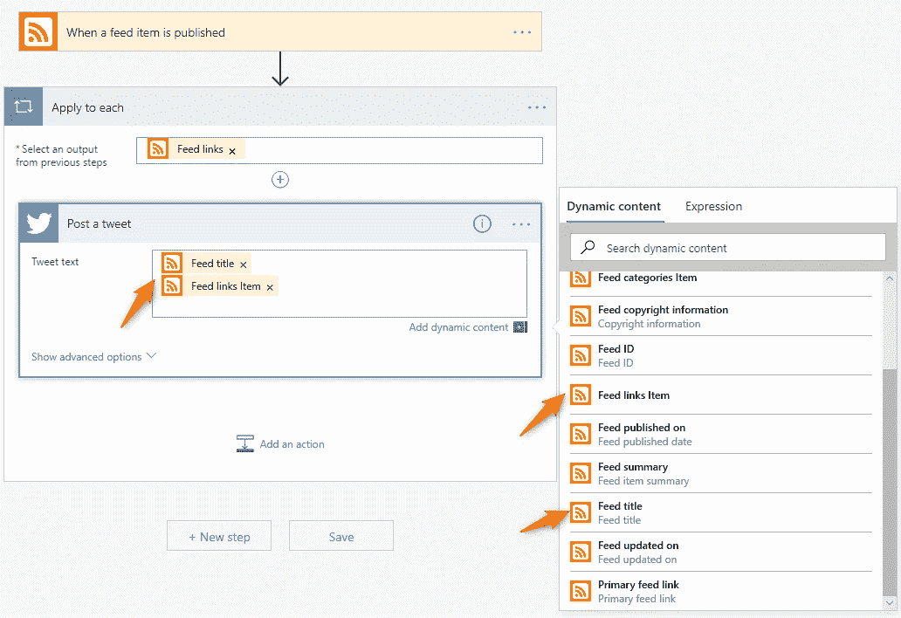**

**现在我们要添加标签，这是最难的部分。不用担心；你拿到了。**

## **向您的帖子添加标签**

**这些标签将从 Medium 导入到我们的 Flow 中，但它们是以字符串列表的形式出现的。我们需要将列表转换成标签。**

**为了形象化这一点，我们需要采用如下所示的中标签:**

*   **办公室 365**
*   **电子邮件**
*   **安全**

**并将其转换为“# Office365 #电子邮件#Security”。**

**为此，我们需要在**下直接添加一个动作，当一个提要项被发布时**触发。这是一个不与外界互动的特殊动作。我们将创建一个变量，在我们的例子中，它是我们以后可以在工作流中使用的标签文本。**

**在两个现有步骤之间添加动作**

1.  ****将鼠标**悬停在向下箭头上**
2.  **点击**加号+****
3.  **点击**添加一个动作**。**

**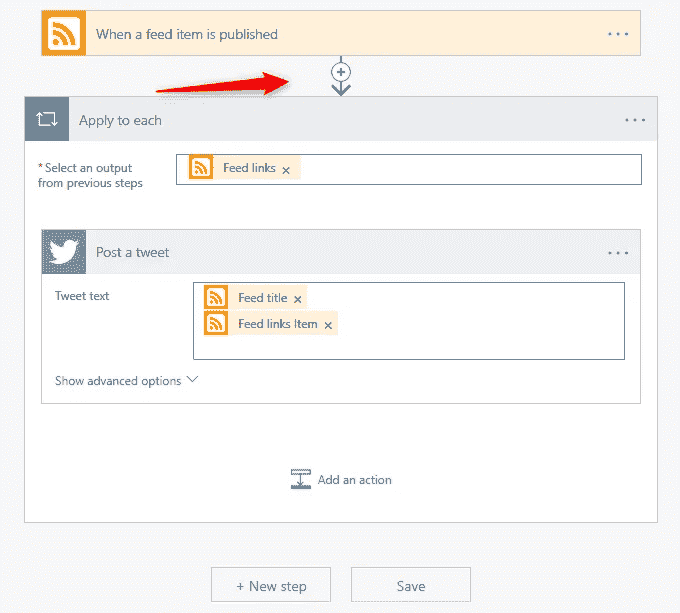****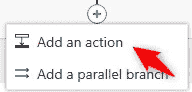**

**就像以前一样，您的工作流需要被告知您正在添加什么。**

1.  **在搜索连接器和动作文本框中输入**初始化变量**。**
2.  **点击**初始化变量。****

**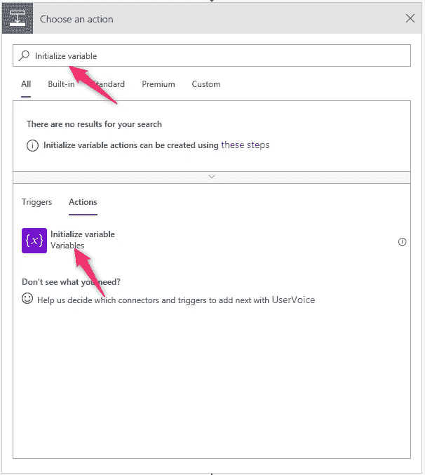**

1.  **在名称字段中输入 **Hashtags** 。**
2.  **在类型字段中选择**字符串**。**
3.  **用鼠标左键点击**值**文本框，使其获得焦点。**
4.  **点击**表达式**。**
5.  **将以下文本复制粘贴到 **Fx** 框中，点击 **OK** 。**

```
replace(replace(join(triggerBody()?['categories'], '~#'), ' ', ''), '~', ' ')
```

**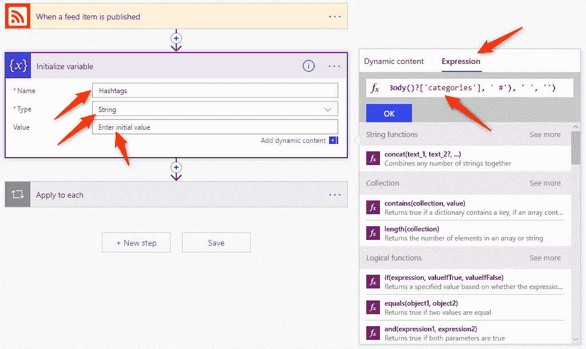**

**现在我们有了自己的标签。我们有一个类似“Office 365 #Email #Security”的字符串我们遗漏了第一个标签，我们需要告诉工作流将标签添加到我们的 tweet 中。**

1.  **点击**应用到每个**打开动作。**
2.  **在您的 **tweet text** 文本框中点击*空行*。**
3.  **类型 **#** 。**
4.  **点击**标签。****

**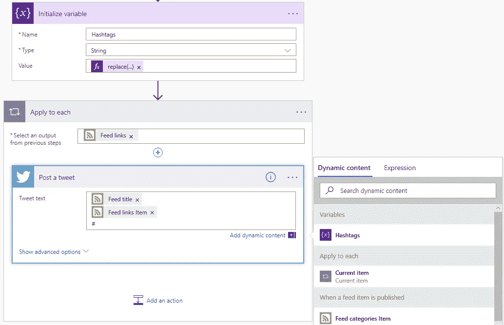**

**嘭！你完了。我们现在需要做的就是保存和测试。**

## **保存并测试**

1.  **点击右上角的**保存**，以免丢失您的工作。**

**在 Medium 上写一篇文章，一定要给它一个标题、特色图片和标签。**

**该流程将在 15 分钟内运行并发布到 Twitter！**

****

**在你验证它的工作，删除推文和媒体文章！**

**恭喜你，你是一名无代码程序员！看看你能不能自己把 LinkedIn 或者脸书加入到你的工作流程中。**

**有任何问题，请在下面的评论中发表。我很乐意帮忙。**

# **参考**

1.  **[微软流量签约](https://flow.microsoft.com/en-us/)。**
2.  **[IFTTT](https://ifttt.com/)**
3.  **[扎皮尔](https://zapier.com/)**