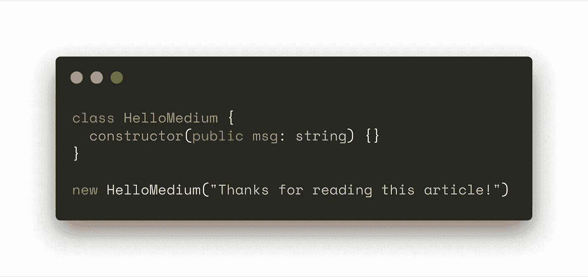

# 最终的 TypeScript 开发配置

> 原文：<https://betterprogramming.pub/ultimate-typescript-development-configuration-4ecf9f22686>

## 一个好的起点

## 如何使用 ts-node-dev、ESLint with Airbnb style guide、Prettier 和 TypeScript 进行开发配置


[TypeScript](https://www.typescriptlang.org/) 正迅速成为最常用、最受喜爱以及[最流行的](https://redmonk.com/sogrady/2019/07/18/language-rankings-6-19/?utm_source=rss&utm_medium=rss&utm_campaign=language-rankings-6-19)语言之一。

然而，为 TS 开发建立一个高效的工作空间可能是一件麻烦的事情。本指南揭示了使用 TypeScript 进行现代编程的最令人沮丧却又最重要的部分之一。

本指南中使用的所有代码都可以在 [GitLab](https://gitlab.com/colegawin/ts-ultimate) 上获得。

在本指南中，我将使用[纱线](https://yarnpkg.com/)。与 [npm](https://www.npmjs.com/) 相比，它的多功能性、速度和性能是我选择的软件包管理器。

我使用 [Visual Studio 代码](https://code.visualstudio.com/)作为我的 IDE，所以我将首先设置用于 TypeScript 开发的 VS 代码。可以跳过这一部分，继续第 2 部分。

# 第 1 部分:VS 代码设置

这些是我在 VS 代码中用于 TypeScript 开发的扩展:

让我知道，如果你认为我错过了什么，或者有任何扩展“添加”😃。

我在 VS 代码中使用的一些个人选择:

*   [Monokai Pro](https://marketplace.visualstudio.com/items?itemName=monokai.theme-monokai-pro-vscode) :“专业的主题和匹配的图标，来自 Monokai 原始配色方案的作者。”(最佳色彩主题 imo。)
*   [vs Code-Icons](https://marketplace.visualstudio.com/items?itemName=vscode-icons-team.vscode-icons):Visual Studio 代码的图标。(VS 代码 imo 的最佳图标集。)
*   [重新加载](https://marketplace.visualstudio.com/items?itemName=natqe.reload):在状态栏的右下角增加一个重新加载按钮。(当 VS 代码决定是时候变得时髦时。)

将这些行添加到您的 VS 代码`settings.json`:

这使得 [ESLint](https://eslint.org/) 自动修复和[更漂亮](https://prettier.io/)自动格式化。

# 第 2 部分:项目配置

让我们首先创建一个目录。为此，我们称之为`ts-ultimate`。

```
mkdir ts-ultimate
```

当我们在做的时候，运行`npm init`。

在该目录中，创建一个`src`文件夹。这是您的 TS/JS 文件将要存放的地方。在里面创建一个`index.ts`文件。

## 安装 TypeScript 和 ts-node-dev

接下来，我们将安装 TypeScript(当然)和 [ts-node](https://github.com/TypeStrong/ts-node) 。

```
yarn add typescript ts-node-dev —-dev
```

`ts-node-dev`为 TypeScript 启用 REPL，自动重启，这使我们能够看到我们的 TypeScript 代码实时工作，无需编译(想想 [nodemon](https://www.npmjs.com/package/nodemon) 或 [node-dev](https://www.npmjs.com/package/node-dev) ，但用于 TypeScript)。

将这些包保存到`devDependencies`,因为它们仅用于开发目的。

## ESLint、扩展和插件

我们还需要 ESLint 和一些扩展和插件

```
yarn add eslint @typescript-eslint/eslint-plugin @typescript-eslint/parser eslint-config-airbnb eslint-config-prettier eslint-plugin-prettier prettier —-dev
```

将这些添加到一个`.eslintrc.js`文件中，如下所示:

**准系统示例，请注意* *

## 配置更漂亮

这是我个人配置的比较漂亮的:

不要想入非非。请使用分号。

现在，打开你原来的`package.json`。

加一个`script`叫`lint`。我们将使用这个脚本来 lint 我们的 TS/JS 文件。

```
"lint": "eslint --fix ./src/*"
```

这告诉 ESLint CLI lint 位于`src`目录中的所有文件，并修复它能够修复的任何问题。请注意，*大多数问题你必须自己解决。*

在您的`ts-ultimate`目录中运行`yarn lint`，应该不会发现任何错误！

但是，如果您在`src`目录中没有文件，您可能会得到一个错误消息:“没有匹配该模式的文件”。这是预期的行为，因此您可以忽略此错误。

如果你使用的是 VS 代码，这将被自动集成到 ESLint 和更漂亮的插件中，所以大多数错误会在编辑时显示在你的工作区中。

# 第 3 部分:不编译的实时更新

为了完成这个并不令人畏惧的任务，我们将使用 ts-node-dev。

根据其 npm 自述文件，ts-node-dev“在任何所需文件发生更改时重新启动目标节点进程，但在重新启动之间共享 TypeScript 编译进程。”

基本上，这意味着我们将能够自动重新加载我们的类型脚本文件，而不需要等待`tsc`来编译它。

让我们创建一个使用 nodemon 的开发脚本:

```
"dev": "ts-node-dev --respawn --transpileOnly src/index.ts"
```

…和一个`dev:debug`脚本:

```
"dev:debug": "ts-node-dev --inspect=4321 --respawn --transpileOnly src/index.ts"
```

`inspect`标志通知 ts-node-dev 将一个*调试器*附加到 VS 代码将监听的端口`4321`(这个数字无关紧要)上的进程。

# 第 4 部分:Visual Studio 代码调试

使用 VS 代码，我们可以向我们的 TypeScript 代码添加断点，以便在这些点检查和调试我们的代码。

转到你的`ts-ultimate`目录，在里面创建一个名为`launch.json`的文件。

```
mkdir .vscode
cd .vscode
touch launch.json
```

将以下内容粘贴到您的`launch.json`中:

这创建了一个调试配置，它将在运行时附加到`dev:debug`脚本。

为此，首先运行`dev:debug`脚本。

```
yarn dev:debug
```

运行这个脚本后，打开 debug 选项卡，在顶部导航栏中，单击 *Node: Nodemon* 旁边的 play 按钮。

当您添加断点时，VS 代码现在应该能够调试您的脚本了。

# 结论

恭喜你走到这一步！现在，您已经拥有了一个超级强大的 TypeScript 开发环境，其中包含 ESLint 和 Airbnb 风格指南以及更漂亮的集成、实时重新加载和动态 VS 代码调试。

